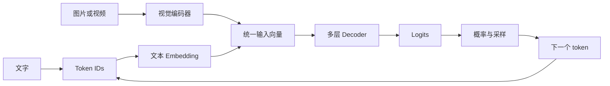

# 看懂大模型推理

这套课写给已经在维护推理系统，却还没有把模型内部计算系统串起来的工程师。你可能处理过显存不足、吞吐下降或首 token 变慢，但讨论到 QKV、RoPE、KV Cache 或 MoE 时，只知道它们的名字，无法继续往下判断。

课程从一次生成开始：文字怎样变成 token，token 怎样经过 Decoder，模型怎样读取前文，为什么回答只能逐个 token 产生。Prefill、Decode、KV Cache、Dense、MoE 和常见优化都放回这条链路中解释。

## 学习目标

这 10 课不要求你推导复杂公式，但要能做到：

- 从 Tokenizer 开始，完整解释一个新 token 是怎样产生的；
- 说明 Embedding、RMSNorm、Attention、FFN、Residual、LM Head 分别解决什么问题；
- 看懂 Qwen3.5 文本模型的一层结构和完整层排列；
- 解释 Dense 与 MoE 的共同骨架，以及 Router、Top-K、共享专家的作用；
- 解释 Prefill、Decode、KV Cache 和 Gated DeltaNet 状态之间的关系；
- 解释图片怎样经过视觉编码器变成语言模型可处理的视觉特征；
- 阅读模型 `config.json`，判断参数规模、状态规模和主要计算来自哪里；
- 判断量化、缓存、批处理和并行方案究竟改变了模型链路中的什么。

## 课程主线

前几课先讲文字生成，第 7 课再加入图片和视频。两类输入最终都会变成与语言模型 Hidden Size 对齐的向量，进入同一个 Decoder 主干。

课程一直用 Qwen3.5 作例子，但会区分模型版本的用途：

- 用 **Qwen3.5-9B-Base** 的配置讲 Dense 架构、层数和 shape；
- 讲 Chat Template、Tokenizer、多模态输入或生成行为时，使用对应的 **post-trained Qwen3.5-9B** 文档，不与 Base 的架构配置混用；
- 用 **Qwen3.5-35B-A3B** 讲 MoE 模型；
- 用两者共同的 Gated DeltaNet 与 Full Attention 混合结构讲现代模型；
- 用 Qwen3.5 的视觉输入路径讲视觉编码器与多模态序列；
- 第一轮不展开训练、CUDA 编程和框架参数清单。

## 课程目录

1. [第 0 课：张量与模型计算基础](docs/lessons/00-math-and-tensors.md)
2. [第 1 课：大模型生成下一个 Token 的过程](docs/lessons/01-text-to-next-token.md)
3. [第 2 课：Decoder Layer 的结构与计算](docs/lessons/02-inside-a-decoder-layer.md)
4. [第 3 课：Attention 的计算原理](docs/lessons/03-attention.md)
5. [第 4 课：Prefill、Decode 与 KV Cache](docs/lessons/04-prefill-decode-kv-cache.md)
6. [第 5 课：Gated DeltaNet 的状态更新机制](docs/lessons/05-gated-deltanet.md)
7. [第 6 课：Dense FFN 与 MoE 的结构差异](docs/lessons/06-dense-and-moe.md)
8. [第 7 课：多模态输入与视觉编码](docs/lessons/07-multimodal-input.md)
9. [第 8 课：模型配置与资源估算](docs/lessons/08-config-and-sizing.md)
10. [第 9 课：推理优化的分析与评估](docs/lessons/09-optimization-judgment.md)
11. [完整课程路线](docs/roadmap.md)
12. [课程术语与符号表](docs/glossary.md)
13. [课程讲解原则](docs/teaching-method.md)

## 学习顺序

第 0 课补齐后文会用到的数学动作。第 1 至第 4 课是一条连续主线，先把文字生成和自回归过程读通；第 5 至第 7 课再加入 Gated DeltaNet、MoE 和图片输入；第 8、9 课把模型原理变成配置估算和优化判断。

正文里的小数字不是另一套简化算法。它们只缩小了向量和矩阵，计算顺序与真实模型一致。每课末尾都有练习和一个综合自测，答案默认折叠。真正能脱离正文把数据流和 shape 画出来，才算读懂。

提交前可以运行 `bash scripts/check-course.sh`，检查 Markdown 结构、本地链接、SVG 渲染和可运行示例。GitHub Actions 也会执行同一组检查。

旧内容保存在 [`docs/archive`](docs/archive) 中，只用于记录学习过程，不再作为主课材料。

## 当前状态

第 0～9 课已经形成完整主线，内容仍会根据实际阅读中的疑问继续修改。旧稿保存在 [`docs/archive`](docs/archive)，主课只保留已经重新核对和整理过的版本。

## 许可

课程文字与仓库中的原创图示采用 [CC BY 4.0](LICENSE)。转载或改编时，请署名、链接许可证并标明修改。引用的第三方资料仍归原作者，详见各课资料来源。
