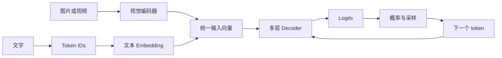

# Learn Inference

这是一套面向推理工程师和工程架构人员的模型推理理论入门课。

读者不需要良好的数学基础。课程从一个问题开始：**输入的一段文字，怎样经过模型变成下一个 token？** 先把这条链路讲明白，再讨论 Prefill、Decode、KV Cache、Dense、MoE 和优化方法。

## 学完要达到什么程度

完成核心课程后，读者应当能够：

- 从 Tokenizer 开始，完整解释一个新 token 是怎样产生的；
- 说明 Embedding、RMSNorm、Attention、FFN、Residual、LM Head 分别解决什么问题；
- 看懂 Qwen3.5 文本模型的一层结构和完整层排列；
- 解释 Dense 与 MoE 的共同骨架，以及 Router、Top-K、共享专家的作用；
- 解释 Prefill、Decode、KV Cache 和 Gated DeltaNet 状态之间的关系；
- 解释图片怎样经过视觉编码器变成语言模型可处理的视觉特征；
- 阅读模型 `config.json`，判断参数规模、状态规模和主要计算来自哪里；
- 判断量化、缓存、批处理和并行方案究竟改变了模型链路中的什么。

## 主线

课程先沿文字路径把生成主干讲清，再在第 7 课加入视觉输入分支。两类输入最终都要变成与语言模型 Hidden Size 对齐的向量，交给同一个 Decoder 主干处理。

课程以 Qwen3.5 为贯穿案例：

- 用 **Qwen3.5-9B** 讲 Dense 模型；
- 用 **Qwen3.5-35B-A3B** 讲 MoE 模型；
- 用两者共同的 Gated DeltaNet 与 Full Attention 混合结构讲现代模型；
- 用 Qwen3.5 的视觉输入路径讲视觉编码器与多模态序列；
- 第一轮不展开训练过程、CUDA 编程和框架参数清单。

## 从这里开始

1. [第 0 课：看懂推理链路所需的数学与张量](docs/lessons/00-math-and-tensors.md)
2. [第一课：从一句话到下一个 Token](docs/lessons/01-text-to-next-token.md)
3. [第二课：一个 Decoder Layer 怎样处理 Token](docs/lessons/02-inside-a-decoder-layer.md)
4. [完整课程路线](docs/roadmap.md)
5. [课程术语与符号表](docs/glossary.md)
6. [课程讲解规范：怎样让数学基础一般的读者真正看懂](docs/teaching-method.md)

正文按新版路线逐课编写。旧内容保存在 [`docs/archive`](docs/archive) 中，用于记录学习过程，不再作为主课材料。

## 当前状态

- 核心路线：已按理论依赖重新组织；
- 课程讲解规范：已完成；
- 第 0～2 课正文：已完成本轮重写，等待学习问答复核；
- 第 3～9 课正文：待逐课学习、问答和整理；
- 旧版第一课和第二课：已归档。

仓库当前首先服务于个人学习和校验。每课经过提问、修正和复核后，再整理为适合其他工程师阅读的入门笔记。
