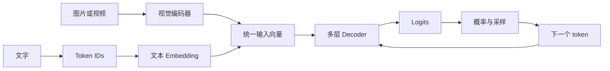

# 看懂大模型推理

这是一套写给推理系统工程师的模型原理入门课。你可能已经部署过模型，处理过延迟、吞吐和显存问题，却没有系统学过模型内部的计算。

课程从一次真实生成讲起：文字怎样变成 token，token 怎样经过 Decoder，模型怎样找到相关上下文，为什么回答只能逐个 token 生成。Prefill、Decode、KV Cache、Dense、MoE 和常见优化，也都放回这条链路中理解。

## 这套课要解决什么问题

学完这 10 课，你应该能：

- 从 Tokenizer 开始，完整解释一个新 token 是怎样产生的；
- 说明 Embedding、RMSNorm、Attention、FFN、Residual、LM Head 分别解决什么问题；
- 看懂 Qwen3.5 文本模型的一层结构和完整层排列；
- 解释 Dense 与 MoE 的共同骨架，以及 Router、Top-K、共享专家的作用；
- 解释 Prefill、Decode、KV Cache 和 Gated DeltaNet 状态之间的关系；
- 解释图片怎样经过视觉编码器变成语言模型可处理的视觉特征；
- 阅读模型 `config.json`，判断参数规模、状态规模和主要计算来自哪里；
- 判断量化、缓存、批处理和并行方案究竟改变了模型链路中的什么。

## 主线

前几课先讲文字生成，第 7 课再加入图片和视频。两类输入最终都会变成与语言模型 Hidden Size 对齐的向量，进入同一个 Decoder 主干。

课程一直用 Qwen3.5 作例子：

- 用 **Qwen3.5-9B** 讲 Dense 模型；
- 用 **Qwen3.5-35B-A3B** 讲 MoE 模型；
- 用两者共同的 Gated DeltaNet 与 Full Attention 混合结构讲现代模型；
- 用 Qwen3.5 的视觉输入路径讲视觉编码器与多模态序列；
- 第一轮不展开训练、CUDA 编程和框架参数清单。

## 从这里开始

1. [第 0 课：看懂模型里的数字和 shape](docs/lessons/00-math-and-tensors.md)
2. [第 1 课：模型怎样生成下一个 token](docs/lessons/01-text-to-next-token.md)
3. [第 2 课：一个 Decoder Layer 里发生了什么](docs/lessons/02-inside-a-decoder-layer.md)
4. [第 3 课：Attention 怎样从前文取回信息](docs/lessons/03-attention.md)
5. [第 4 课：模型读完 Prompt 后怎样逐个生成 token](docs/lessons/04-prefill-decode-kv-cache.md)
6. [第 5 课：Gated DeltaNet 怎样记住前文](docs/lessons/05-gated-deltanet.md)
7. [第 6 课：Dense 和 MoE 有什么区别](docs/lessons/06-dense-and-moe.md)
8. [第 7 课：图片怎样送进语言模型](docs/lessons/07-multimodal-input.md)
9. [第 8 课：从 config.json 看懂模型](docs/lessons/08-config-and-sizing.md)
10. [第 9 课：一种优化到底有没有用](docs/lessons/09-optimization-judgment.md)
11. [完整课程路线](docs/roadmap.md)
12. [课程术语与符号表](docs/glossary.md)
13. [课程讲解原则](docs/teaching-method.md)

旧内容保存在 [`docs/archive`](docs/archive) 中，只用于记录学习过程，不再作为主课材料。

## 当前状态

- 第 0～9 课已经完成第一轮编写，后续会根据阅读和练习反馈继续修改；
- Attention 和 RoPE 已根据第一轮反馈重写；
- 旧版第 1 课和第 2 课已经归档。

这个仓库先记录个人学习和校验过程。每课经过提问、修正和复核后，再整理成其他工程师也能读懂的入门笔记。
