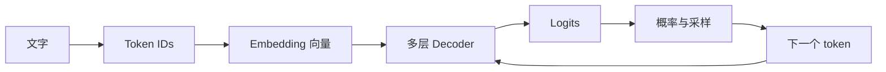

# Learn Inference

这是一套面向推理工程师和工程架构人员的语言模型推理理论入门课。

读者不需要良好的数学基础。课程从一个问题开始：**输入的一段文字，怎样经过模型变成下一个 token？** 先把这条链路讲明白，再讨论 Prefill、Decode、KV Cache、Dense、MoE 和优化方法。

## 学完要达到什么程度

完成核心课程后，读者应当能够：

- 从 Tokenizer 开始，完整解释一个新 token 是怎样产生的；
- 说明 Embedding、RMSNorm、Attention、FFN、Residual、LM Head 分别解决什么问题；
- 看懂 Qwen3.5 文本模型的一层结构和完整层排列；
- 解释 Dense 与 MoE 的共同骨架，以及 Router、Top-K、共享专家的作用；
- 解释 Prefill、Decode、KV Cache 和 Gated DeltaNet 状态之间的关系；
- 阅读模型 `config.json`，判断参数规模、状态规模和主要计算来自哪里；
- 判断量化、缓存、批处理和并行方案究竟改变了模型链路中的什么。

## 唯一主线

课程以 Qwen3.5 的文本路径为贯穿案例：

- 用 **Qwen3.5-9B** 讲 Dense 模型；
- 用 **Qwen3.5-35B-A3B** 讲 MoE 模型；
- 用两者共同的 Gated DeltaNet 与 Full Attention 混合结构讲现代模型；
- 第一轮不展开视觉编码器、训练过程和框架参数清单。

## 从这里开始

1. [第一课：从一句话到下一个 Token](docs/lessons/01-text-to-next-token.md)
2. [新版课程路线](docs/roadmap.md)
3. [课程讲解规范：怎样让数学基础一般的读者真正看懂](docs/teaching-method.md)

正文按新版路线逐课编写。旧内容保存在 [`docs/archive`](docs/archive) 中，用于记录学习过程，不再作为主课材料。

## 当前状态

- 新版核心路线：已完成审核；
- 课程讲解规范：已完成；
- 第一课正文：已完成学习问答与复核；
- 第二至八课正文：待逐课学习、问答和整理；
- 旧版第一课和第二课：已归档。

仓库当前首先服务于个人学习和校验。每课经过提问、修正和复核后，再整理为适合其他工程师阅读的入门笔记。
