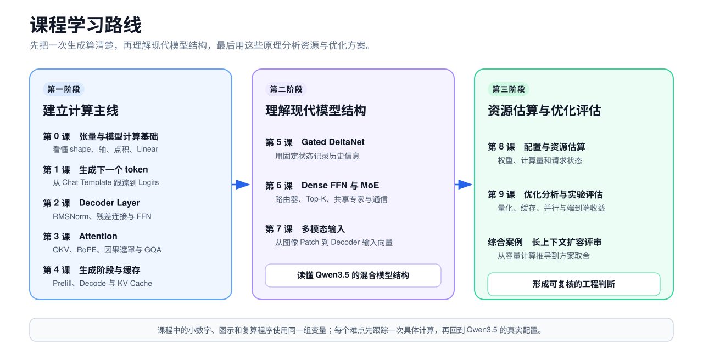

# 大模型推理原理与优化

这门课面向已经参与大模型推理系统研发、希望补齐模型原理的工程师。课程沿一次生成过程展开，解释文字怎样变成 token、token 怎样经过 Decoder、模型怎样读取前文，以及自回归生成为何逐 token 推进。配置字段和框架行为会在对应的模型计算讲清以后引入。

课程先说明 QKV、RoPE、KV Cache、MoE 在模型哪一步出现、怎样计算、会留下哪些状态，再用这些结论分析显存、吞吐和首 token 延迟。学完后，你应该能指出一项优化改变了哪些模型层、张量或请求状态，并判断它在当前工作负载下是否值得验证。

对张量和矩阵运算还不熟悉，可以从[第 0 课](docs/lessons/00-math-and-tensors.md)开始；已经能根据算子推导 shape，可以直接阅读[第 1 课](docs/lessons/01-text-to-next-token.md)。

## 学习目标

这 10 课不要求你推导复杂公式，但要能做到：

- 从 Tokenizer 开始，完整解释一个新 token 是怎样产生的；
- 说明 Embedding、RMSNorm、Attention、FFN、残差连接（Residual Connection）和 LM Head 分别解决什么问题；
- 看懂 Qwen3.5 文本模型的一层结构和完整层排列；
- 解释 Dense 与 MoE 的共同骨架，以及路由器（Router）、Top-K、共享专家的作用；
- 解释 Prefill、Decode、KV Cache 和 Gated DeltaNet 状态之间的关系；
- 解释图片怎样经过视觉编码器变成语言模型可处理的视觉特征；
- 阅读模型 `config.json`，区分保存与计算 dtype，判断参数规模、状态规模和主要计算来自哪里；
- 判断量化、缓存、批处理和 DP、TP、PP、EP 分别影响权重、Attention、请求状态、执行批次还是多卡通信。

## 课程主线

第 1 至第 6 课沿着一次文本生成展开：先看 token 怎样进入 Decoder，再拆解 Full Attention、Gated DeltaNet、Dense FFN 和 MoE，最后比较 Prefill 与 Decode 怎样执行这些模块并维护请求状态。第 7 课再加入图片和视频。

需要复习完整数据流、Decoder Layer 内部结构和两类请求状态时，可以打开带图的[大模型推理链路速查](docs/inference-map.md)。

课程一直用 Qwen3.5 作例子，但会区分模型版本的用途：

- 用 **Qwen3.5-9B-Base** 的配置讲 Dense 架构、层数和 shape；
- 讲 Chat Template、Tokenizer、多模态输入或生成行为时，使用对应的 **post-trained Qwen3.5-9B** 文档，不与 Base 的架构配置混用；
- 用 **Qwen3.5-35B-A3B** 讲 MoE 模型；
- 用两者共同的 Gated DeltaNet 与 Full Attention 混合结构讲现代模型；
- 用 Qwen3.5 的视觉输入路径讲视觉编码器与多模态序列；
- 课程只解释理解推理所需的因果语言模型目标，不展开反向传播、优化器、CUDA 编程和框架参数清单。

## 课程目录

| 课次 | 内容 | 读完后能做什么 |
| ---: | --- | --- |
| 0 | [第 0 课：张量与模型计算基础](docs/lessons/00-math-and-tensors.md) | 根据轴和运算推导 shape |
| 1 | [第 1 课：大模型生成下一个 token 的过程](docs/lessons/01-text-to-next-token.md) | 区分文本、Token ID、向量、Logit 和概率，解释因果训练目标 |
| 2 | [第 2 课：Decoder Layer 的结构与计算](docs/lessons/02-inside-a-decoder-layer.md) | 解释 RMSNorm、残差连接和 SwiGLU FFN |
| 3 | [第 3 课：Attention 的计算原理](docs/lessons/03-attention.md) | 手算一次 Attention 并解释 RoPE、GQA |
| 4 | [第 4 课：Gated DeltaNet 的状态更新机制](docs/lessons/04-gated-deltanet.md) | 解释状态矩阵、Delta Rule、门控和因果卷积 |
| 5 | [第 5 课：Dense FFN 与 MoE 的结构差异](docs/lessons/05-dense-and-moe.md) | 解释路由器、Top-K、共享专家和激活参数 |
| 6 | [第 6 课：自回归推理的执行阶段与状态复用](docs/lessons/06-inference-phases-and-state-reuse.md) | 解释 Prefill、Decode 和两类层状态的生命周期 |
| 7 | [第 7 课：多模态输入与视觉编码](docs/lessons/07-multimodal-input.md) | 从像素和 Patch 推导到 Decoder 输入 |
| 8 | [第 8 课：模型配置与资源估算](docs/lessons/08-config-and-sizing.md) | 估算权重、请求状态和主要计算量 |
| 9 | [第 9 课：推理优化的分析与评估](docs/lessons/09-optimization-judgment.md) | 判断优化改了什么、何时有效、怎样验证 |

配套资料：

- [完整课程路线](docs/roadmap.md)
- [大模型推理链路速查](docs/inference-map.md)
- [综合案例：Qwen3.5-9B 长上下文扩容评审](docs/capstone.md)
- [课程术语与符号表](docs/glossary.md)

## 学习顺序

如果还不能熟练解释 `[B,T,H]`、沿轴归约和 Linear 的 shape，先读第 0 课；已经熟悉这些内容，可以从第 1 课开始，需要时再回来查第 0 课。

第 1 至第 6 课应连续阅读。第 1、2 课建立生成链路和 Decoder Layer 骨架；第 3 至第 5 课分别展开 Full Attention、Gated DeltaNet 和 Dense FFN/MoE；第 6 课把这些模块放回 Prefill 与 Decode。第 7 课加入多模态输入，第 8、9 课再进行资源估算和优化评审。

第一次阅读只需追踪数据表示、shape 变化和请求状态，不必记住 Qwen3.5 的每个配置数字。遇到公式时，可以运行对应的复算程序。课程中的计算、查错和评审题用于检查能否把同一个原理应用到新数据。

读完第 9 课后，可以继续看[长上下文扩容评审](docs/capstone.md)。这个案例从目标上下文长度出发，算出 TP 下的每 Rank KV 容量，再比较 FP8 KV、Chunked Prefill、Prefix Cache 和增加副本分别能解决什么问题，最后给出验证实验和上线门槛。

正文用小数字缩短手算过程，向量和矩阵的维度虽然变小，计算顺序与真实模型相同。需要练习的地方会安排查错、计算或判断，参考答案默认折叠；不为统一版式给每课强行添加相同栏目。

## 可运行示例

第 1、2、3、4、5、8、9 课和综合评审提供了只依赖 Python 标准库的[复算程序](examples/README.md)。脚本与正文使用同一组数字，运行后会打印中间结果，并检查关键数值。它们适合在读完公式后自己算一遍，不要求安装 PyTorch 或下载模型权重。

提交前可以运行 `bash scripts/check-course.sh`，检查 Markdown 结构、本地链接、SVG 渲染和可运行示例。GitHub Actions 也会执行同一组检查。

早期草稿保存在[历史草稿目录](docs/archive/README.md)，只记录课程的迭代过程，不再作为主课材料。

## 反馈与纠错

发现公式、配置数字、图示或引用有误时，请提交[内容纠错](https://github.com/troycheng/learn-inference/issues/new?template=content-error.yml)，注明课程位置、问题和可核对的来源。读到某一步无法继续，也可以提交[学习问题](https://github.com/troycheng/learn-inference/issues/new?template=learning-question.yml)。这类反馈会用来判断正文是否还缺少必要解释。

修改课程前请阅读[贡献说明](CONTRIBUTING.md)和[课程编写与讲解规范](docs/teaching-method.md)。

## 许可

课程文字与仓库中的原创图示采用 [CC BY 4.0](LICENSE)。转载或改编时，请署名、链接许可证并标明修改。引用的第三方资料仍归原作者，详见各课资料来源。
