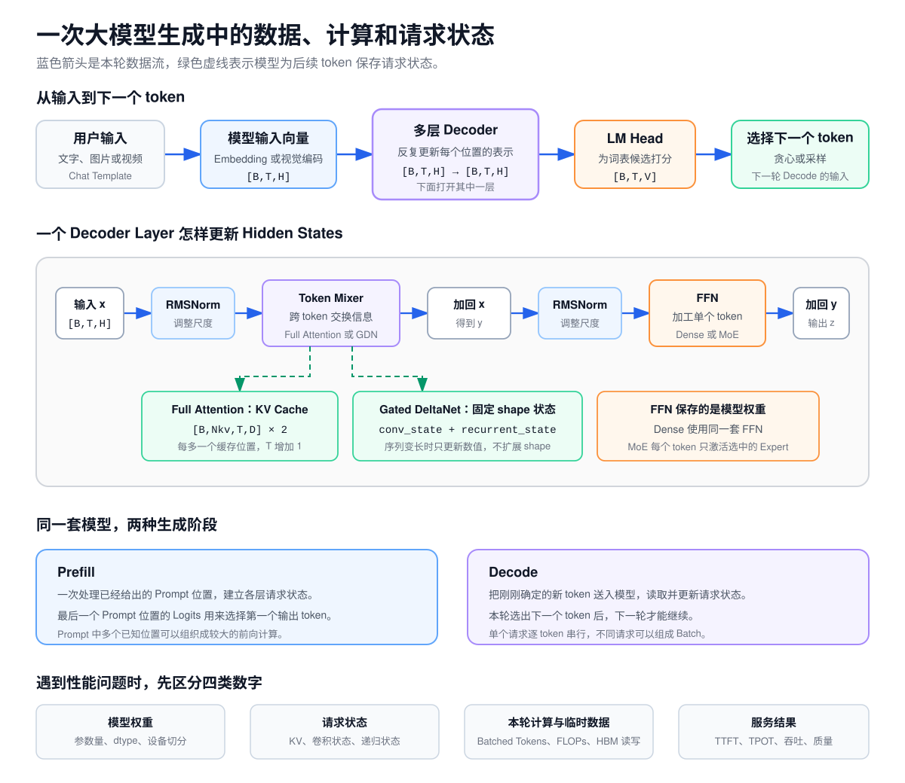

# 大模型推理链路速查

这张图把 0～9 课涉及的内容画在一次完整生成中。复习时先沿蓝色箭头跟踪本轮数据，再看 Decoder Layer 留下了哪些请求状态。



## 读图顺序

1. 用户输入先变成模型可以接收的 `[B,T,H]` 向量。文字经过 Chat Template、Tokenizer 和 Embedding；图片或视频经过视觉编码器。
2. 每个 Decoder Layer 都接收和输出 `[B,T,H]`。Token Mixer 让不同 token 位置交换信息，FFN 加工单个 token 内部的特征。
3. Full Attention 层保存随缓存长度增长的 KV Cache。Gated DeltaNet 层保存固定 shape 的卷积状态和递归状态。
4. LM Head 把最后的 Hidden States 变成词表 Logits。贪心或采样选出的 Token ID 会成为下一轮 Decode 的输入。
5. Prefill 和 Decode 执行同一套模型权重。Prefill 处理已经给出的 Prompt，Decode 每轮处理刚刚确定的新 token。

## 各阶段的检查对象

| 位置 | 输入与输出 | 会长期保留什么 | 常见工程问题 | 对应课程 |
| --- | --- | --- | --- | --- |
| Chat Template 与 Tokenizer | 文字 → Token IDs | 通常不产生模型请求状态 | 输入格式、特殊 token、Prompt 长度 | [第 1 课](lessons/01-text-to-next-token.md) |
| Embedding 与视觉编码 | Token IDs 或像素 → `[B,T,H]` | 模型权重 | 词表大小、视觉位置数、Hidden Size | [第 1 课](lessons/01-text-to-next-token.md)、[第 7 课](lessons/07-multimodal-input.md) |
| Decoder Layer | `[B,T,H]` → `[B,T,H]` | 每层的模型权重 | 层数、FFN 宽度、Dense/MoE | [第 2 课](lessons/02-inside-a-decoder-layer.md)、[第 6 课](lessons/06-dense-and-moe.md) |
| Full Attention | Q/K/V → 上下文向量 | 历史 K/V | 上下文长度、KV dtype、GQA、FlashAttention | [第 3 课](lessons/03-attention.md)、[第 4 课](lessons/04-prefill-decode-kv-cache.md) |
| Gated DeltaNet | 当前 token 与旧状态 → 新状态和输出 | 卷积状态、递归状态 | 固定状态容量、Prefix Cache 完整性 | [第 5 课](lessons/05-gated-deltanet.md) |
| LM Head 与选择策略 | Hidden State → Logits → Token ID | 生成历史由请求继续使用 | 词表投影、采样参数、停止条件 | [第 1 课](lessons/01-text-to-next-token.md) |
| Prefill 与 Decode | 已知位置 → 新 Logits 和新状态 | KV、卷积状态、递归状态 | TTFT、TPOT、Batching、调度 | [第 4 课](lessons/04-prefill-decode-kv-cache.md) |
| 资源与优化 | 配置与工作负载 → 容量和性能判断 | 取决于具体方案 | 权重、状态、FLOPs、通信、SLO | [第 8 课](lessons/08-config-and-sizing.md)、[第 9 课](lessons/09-optimization-judgment.md) |

## 四类数字需要分别统计

遇到显存或性能问题时，先把数字分开：

```text
模型权重：参数量、保存 dtype、设备切分
请求状态：KV Cache、卷积状态、递归状态
本轮执行：Batched Tokens、临时激活、FLOPs、HBM 读写、通信
服务结果：TTFT、TPOT、吞吐、`goodput`、输出质量
```

例如，INT4 权重变小属于模型权重；长上下文 KV 增长属于请求状态；FlashAttention 减少中间 HBM 读写属于本轮执行；用户最终看到的 P99 TTFT 属于服务结果。它们之间有因果关系，但不能用一个数字替代另一个数字。

拿到一个新模型时，可以参考[综合评审](capstone.md)，把结构、请求状态、资源估算和实验结论整理成一份可复核的技术结论。
