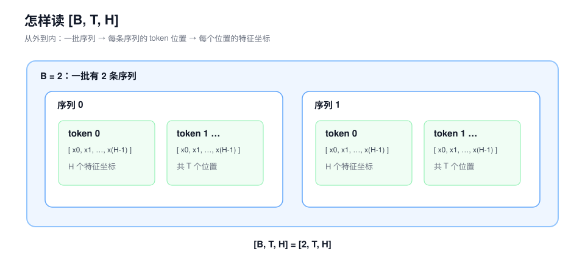
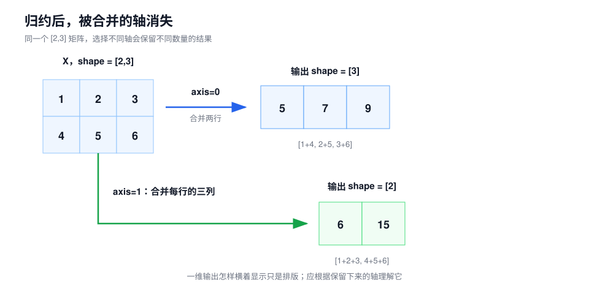
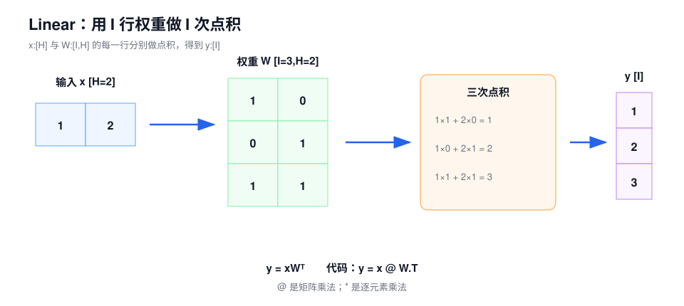

# 第 0 课：看懂模型里的数字和 shape

后面几课会反复遇到 shape、轴、点积和矩阵乘法。这里先补齐马上会用到的部分，不展开完整的线性代数：

```text
数值怎样组织成张量
→ 怎样用 shape 和索引定位数据
→ 怎样沿某一维汇总
→ 怎样做逐元素计算、点积和矩阵乘法
→ Linear 与 Embedding 分别怎样使用这些计算
```

不要求熟练推导公式。重点是看出张量的每个维度表示什么、算子对哪些数做了什么，以及输出为什么会得到这样的 shape。

## 1. 先统一几个符号

术语第一次出现时使用“中文（English）”，后续优先使用中文。代码中的正式名称保留英文，例如 `hidden_size`、`gate_proj`。

需要查中英文或符号含义时，可以随时打开[课程术语与符号表](../glossary.md)。

后文反复使用五个大写字母：

| 符号 | 中文含义 | 在模型中的例子 |
| --- | --- | --- |
| `B` | 批大小（Batch Size） | 一批同时处理 2 条序列，则 `B=2` |
| `T` | 序列长度（Sequence Length） | 每条序列有 8 个 token 位置，则 `T=8` |
| `H` | 隐藏维度（Hidden Size） | 每个 token 用 4096 个数表示，则 `H=4096` |
| `I` | 中间维度（Intermediate Size） | FFN 中间把每个 token 展开到 12288 维，则 `I=12288` |
| `V` | 词表大小（Vocabulary Size） | 词表有 248320 个候选 token，则 `V=248320` |

`B`、`T`、`H` 和 `I` 都表示一个维度的长度，不是张量本身。`[B,T,H]` 才是在描述一个三维张量的 shape。



## 2. 从一个数到多维张量

这四个名称描述的是同一类数值数据按多少个轴组织。

| 名称 | 例子 | 轴数 | shape |
| --- | --- | ---: | --- |
| 标量（Scalar） | `3.5` | 0 | 数学标量没有 shape；标量 Tensor 的 shape 是 `[]` |
| 向量（Vector） | `[2,3,5]` | 1 | `[3]` |
| 矩阵（Matrix） | `[[1,2,3],[4,5,6]]` | 2 | `[2,3]` |
| 张量（Tensor） | 一批矩阵 | 3 或更多 | 例如 `[2,8,4096]` |

在深度学习框架中，“张量”是总称：标量、向量和矩阵也可以看作 0 维、1 维和 2 维张量。

### 2.1 shape 只描述每个轴有多长

考虑：

```text
X.shape = [2, 8, 4096]
```

它表示：

```text
2 条序列
└── 每条有 8 个 token 位置
    └── 每个位置用 4096 个数表示
```

因此，这个张量一共有：

$$
2\times 8\times 4096=65536
$$

个元素。

需要区分两种写法：

```text
4096       表示一个长度或一个整数
[4096]     表示一个一维张量的 shape
```

### 2.2 怎样理解隐藏维度（Hidden Size）

隐藏维度 `H` 表示：模型在每个 token 位置上，用多少个数记录当前表示。

如果 `H=4`，一个 token 的表示可能是：

```text
[0.2, -0.7, 1.1, 0.3]
```

如果 `H=4096`，同一个位置就由 4096 个数共同描述。这 4096 个数不是 4096 个预先命名的人工标签。训练会让模型自己学会怎样组合使用这些坐标。单独看某一列，通常不能稳定地说它就是“名词特征”或“情感特征”；应把整条向量看作当前位置在模型学习出的 `H` 维表示空间中的位置。

在 `[B,T,H]` 中：

- 每一行 `X[b,t,:]` 是某一个 token 位置的完整 `H` 维向量；
- 每一列 `X[:,:,h]` 是所有位置在第 `h` 个特征坐标上的数值；
- 有意义的表示通常由很多坐标共同构成。

## 3. 用索引取出需要的数据

程序通常从 0 开始计数。对于：

```text
X.shape = [B, T, H] = [2, 8, 4096]
```

常见索引含义如下：

| 写法 | 取出的对象 | shape |
| --- | --- | --- |
| `X[1]` | 第 2 条序列的全部位置 | `[8,4096]` |
| `X[1,3]` | 第 2 条序列的第 4 个 token 向量 | `[4096]` |
| `X[1,3,10]` | 上述 token 向量中的第 11 个数 | `[]` |
| `X[:,:,10]` | 所有序列、所有位置的第 11 个特征坐标 | `[2,8]` |

`X[1,3,10]` 的结果是一个标量 Tensor，因此 shape 是 `[]`。它不是长度为 1 的向量；后者的 shape 是 `[1]`。

## 4. 轴决定一次计算合并哪些数

轴（Axis）就是 shape 中某个维度的位置。对 `[B,T,H]`：

| 轴 | 对应维度 | 沿这个轴操作时遍历什么 |
| ---: | --- | --- |
| `axis=0` | `B` | 不同序列 |
| `axis=1` | `T` | 同一序列中的不同 token 位置 |
| `axis=2` 或 `axis=-1` | `H` | 同一个 token 的不同特征坐标 |

“沿某个轴求和”更准确的理解是：**把这个轴上的元素合并掉**。被合并的轴会消失，其他轴保留。

### 4.1 用二维矩阵看清轴

令：

$$
X=
\begin{bmatrix}
1&2&3\\
4&5&6
\end{bmatrix},\qquad X.shape=[2,3]
$$

沿 `axis=0` 求和，会合并第 0 轴的两行：

$$
[1+4,\ 2+5,\ 3+6]=[5,7,9]
$$

输出 shape 是 `[3]`。

沿 `axis=1` 求和，会合并每一行中的三列：

$$
[1+2+3,\ 4+5+6]=[6,15]
$$

输出 shape 是 `[2]`。

两个结果写出来都是一维列表，不能再靠“横向还是竖向”判断。方向只存在于原矩阵中；得到一维向量后，它只有一个轴。判断结果时应看哪个轴被合并、哪些轴保留下来。



### 4.2 `keepdim` 为什么存在

如果保留被汇总的轴，但把它的长度变成 1：

| 计算 | `keepdim=false` | `keepdim=true` |
| --- | --- | --- |
| `sum(X, axis=0)` | `[3]` | `[1,3]` |
| `sum(X, axis=1)` | `[2]` | `[2,1]` |

`keepdim=true` 不会改变计算结果中的数，只保留一个长度为 1 的轴，方便后续广播。第 2 课的 RMSNorm 会使用这一点。

## 5. 归约把一组数汇总成更少的数

归约（Reduction）是一类计算，不是某一个固定公式。它会沿指定轴把多个数汇总为更少的数。

常见归约包括：

| 计算 | 作用 |
| --- | --- |
| `sum` | 求和 |
| `mean` | 求平均 |
| `max` | 找最大值 |
| `argmax` | 找最大值所在的索引 |

例如：

```text
scores = [1, 4, 3]
max(scores)    = 4
argmax(scores) = 1
```

`argmax` 返回的是最大元素的位置。因为从 0 开始计数，数值 `4` 位于索引 `1`。

第 2 课会沿 `H` 轴计算每个 token 向量的均方值；第 1 课会沿词表 `V` 轴选择最大 Logit。这些看似不同的操作，都属于沿某个轴进行归约。

## 6. 逐元素计算只处理相同位置

逐元素计算（Element-wise Operation）对相同位置的元素分别做同一种运算。

设：

```text
a = [1, 2, 3]
b = [4, 5, 6]
```

逐元素加法：

```text
a + b = [1+4, 2+5, 3+6] = [5, 7, 9]
```

逐元素乘法：

```text
a * b = [1*4, 2*5, 3*6] = [4, 10, 18]
```

输出仍有三个元素，shape 仍是 `[3]`。第 2 课中的残差连接使用逐元素加法，SwiGLU 门控使用逐元素乘法。

## 7. 广播让小 shape 参与大张量计算

广播（Broadcasting）让长度为 1 或缺少前导轴的张量，按规则重复参与更大张量的逐元素计算。它描述的是计算语义，不等于程序必须先物理复制很多份数据。

### 7.1 一个缩放量应用到整条向量

```text
x = [2, 4, 6]
s = 0.5
x * s = [1, 2, 3]
```

标量 `s` 被应用到 `x` 的每一个位置。

### 7.2 每一行加同一个向量

```text
X = [[1, 2, 3],
     [4, 5, 6]]       shape=[2,3]

b = [10, 20, 30]      shape=[3]
```

结果为：

```text
X + b = [[11, 22, 33],
         [14, 25, 36]]
```

`b` 与最后一维长度相同，因此它被用于 `X` 的每一行。Linear 中如果存在偏置 `b:[I]`，就是这样应用到 `[B,T,I]` 的每个 token 位置。

## 8. 点积把两个向量变成一个分数

点积（Dot Product）把两组对应位置的数分别相乘，再把乘积加起来，最后得到一个数。这个动作常用来综合两组特征的匹配程度。

设：

```text
x = [1, 2]
w = [3, 4]
```

计算过程是：

$$
x\cdot w=1\times3+2\times4=11
$$

输入是两个 `[2]` 向量，输出是一个标量 `11`，shape 为 `[]`。

点积与逐元素乘法不同：

```text
x * w = [3, 8]     # 逐元素乘法，输出是向量
x · w = 11         # 点积，乘完还要求和，输出是标量
```

第 1 课的 LM Head 会用一次点积为一个候选 token 打分；第 3 课的 Attention 会用点积计算 Query 与 Key 的匹配分数。

## 9. 矩阵乘法一次完成很多个点积

矩阵乘法（Matrix Multiplication）可以理解成批量执行点积。

假设输入向量：

```text
x = [1, 2]                  shape=[H]=[2]
```

有三组不同的权重，每一行负责产生一个输出：

```text
W = [[1, 0],
     [0, 1],
     [1, 1]]                shape=[I,H]=[3,2]
```

分别计算 `x` 与 `W` 每一行的点积：

```text
第 1 个输出：1*1 + 2*0 = 1
第 2 个输出：1*0 + 2*1 = 2
第 3 个输出：1*1 + 2*1 = 3
```

得到：

```text
y = [1, 2, 3]              shape=[I]=[3]
```



本课程统一写成：

$$
y=xW^T
$$

中文读法是：“输入向量 `x` 与权重矩阵 `W` 的每一行做点积。”`W^T` 表示把 `W` 的行列交换后参与矩阵乘法。代码中常写成：

```python
y = x @ W.T
```

这里的 `@` 是 Python/PyTorch 中的矩阵乘法符号。逐元素乘法仍写作 `*`。

### 9.1 为什么共同维度必须相同

每次点积都需要把 `x` 的每个数与权重行中的对应数配对。因此：

```text
x.shape = [H]
W.shape = [I,H]
y.shape = [I]
```

二者的 `H` 必须相同。`I` 表示有多少行权重，也就是要产生多少个输出数。

### 9.2 同时处理 B 条序列、每条 T 个 token

当输入为：

```text
X.shape = [B,T,H]
W.shape = [I,H]
```

同一套权重会独立应用到每个 `X[b,t,:]`：

```text
Y.shape = [B,T,I]
```

Linear 改变的是每个 token 的特征宽度，不改变 `B` 和 `T`。

## 10. Linear 用学习到的权重重组特征

线性层（Linear Layer）在矩阵乘法后可选地加上偏置：

$$
Y=XW^T+b
$$

| 符号 | 含义 | shape |
| --- | --- | --- |
| `X` | 当前请求产生的输入数据 | `[B,T,H]` |
| `W` | 训练得到的权重参数 | `[I,H]` |
| `b` | 可选的偏置参数 | `[I]` |
| `Y` | 当前请求产生的输出数据 | `[B,T,I]` |

Linear 的作用不是机械地“升维”或“降维”。它用学到的权重重新组合输入特征，生成另一组特征。输出维度可以大于、等于或小于输入维度，取决于这一层需要多少个输出特征。

如果两个 Linear 中间没有激活函数或其他非线性操作：

$$
(XW_1^T)W_2^T
$$

可以利用矩阵乘法的结合律，预先把两套权重组合成一套等价权重。这里使用的是结合律，不是交换律。第 2 课会看到，SwiGLU 在两个 Linear 之间加入激活和逐元素门控，因此不能这样简单合并。

## 11. Embedding 根据 Token ID 查表

嵌入（Embedding）参数表的 shape 是 `[V,H]`。输入 Token ID 后，它直接取出对应的那一行。

```text
Embedding 表：
ID 0 → [ 0.2,  0.1, -0.4]
ID 1 → [ 0.5,  0.7,  0.1]
ID 2 → [ 0.8, -0.2,  0.5]

输入 IDs：[0,2]
输出：    [[ 0.2, 0.1,-0.4],
           [ 0.8,-0.2, 0.5]]
```

这个动作也叫查找（Lookup）或按索引取值（Gather）。

```text
Token IDs：       [B,T]
Embedding 参数： [V,H]
Embedding 输出： [B,T,H]
```

Token ID 只决定取哪一行。ID 的数值大小没有语义强弱关系。

## 12. 分清模型参数和请求数据

推理链路中同时存在两类数据。

### 12.1 模型参数

模型参数（Parameters）由训练得到，加载模型后会被许多请求反复使用：

- Embedding 表；
- Linear 的权重和偏置；
- RMSNorm 的缩放权重；
- Attention 和 FFN 中的投影权重。

### 12.2 运行时数据

运行时数据（Runtime Data）由当前请求产生：

- Token IDs；
- Embedding 输出；
- Hidden States；
- Logits；
- KV Cache 或 recurrent state。

判断一种优化减少的是模型常驻容量还是请求状态容量，第一步就是分清它改变了哪类数据。

## 13. 这些计算会在模型哪里出现

下面把这些数学动作对应到后面课程中的模型计算。

| 后续对象 | 第 0 课中的基本动作 |
| --- | --- |
| Embedding | 根据 Token ID 查表 |
| LM Head | 一个 Hidden State 与很多权重行分别做点积 |
| RMSNorm | 平方、沿 `H` 轴求平均、平方根倒数、逐元素缩放 |
| Residual | 两个相同 shape 的张量逐元素相加 |
| SwiGLU FFN | 三个 Linear、SiLU 激活、逐元素相乘 |
| Attention | Linear、Reshape、点积、Softmax、加权求和 |

这些模块的作用会在后续课程中展开。现在只要能说清谁和谁计算、沿哪个轴，以及输出 shape 为什么变化。

## 14. 练习

先自己算一遍，再对照答案。

1. `X.shape=[2,8,4096]` 中的 `2`、`8`、`4096` 分别表示什么？
2. `X[1,3,10]` 取出的是什么？结果 shape 是什么？
3. 对 shape 为 `[B,T,H]` 的张量沿 `H` 轴求平均，`keepdim=false` 和 `true` 的输出 shape 分别是什么？
4. 对矩阵 `[[1,2,3],[4,5,6]]`，沿 `axis=0` 和 `axis=1` 求和分别得到什么？
5. `[1,2] * [3,4]` 与 `[1,2] · [3,4]` 的结果有什么区别？
6. 给定 `x=[1,2]`、`W=[[1,0],[0,1],[1,1]]`，`xW^T` 是多少？
7. 若 `X:[B,T,H]`、`W:[I,H]`，Linear 输出 shape 是什么？它是否改变 token 位置数？
8. 为什么 Token ID `1000` 不能解释为比 Token ID `10` 语义更强？
9. 两个 Linear 中间没有非线性操作时，合并它们依赖矩阵乘法的交换律还是结合律？
10. Token IDs、Hidden States、Logits、KV Cache 属于模型参数还是运行时数据？

### 参考答案

1. 一批有 2 条序列；每条有 8 个 token 位置；每个位置由 4096 个数表示。
2. 第 2 条序列、第 4 个 token 的第 11 个特征坐标，是一个标量 Tensor，shape 为 `[]`。
3. 分别为 `[B,T]` 和 `[B,T,1]`。
4. `axis=0` 得到 `[5,7,9]`；`axis=1` 得到 `[6,15]`。
5. 前者是逐元素乘法，得到 `[3,8]`；后者是点积，得到标量 `11`。
6. `[1,2,3]`。
7. `[B,T,I]`；不改变 `B` 和 `T`，因此不改变 token 位置数。
8. Token ID 是词表索引，只用于定位 token 和 Embedding 表中的行，编号大小没有语义。
9. 结合律。
10. 都是当前请求产生的运行时数据。

## 15. 学到这里，先检查这几件事

确认自己能做到下面几件事：

- 看到 `[B,T,H]` 就说出三个维度的含义；
- 区分标量 `4096`、向量 shape `[4096]` 和标量 Tensor shape `[]`；
- 根据轴判断归约后哪个维度消失；
- 区分逐元素乘法与点积；
- 根据 `X:[B,T,H]`、`W:[I,H]` 推出 Linear 输出 `[B,T,I]`；
- 区分模型参数与当前请求产生的数据。

不用背下所有公式。能用小数字把计算重新走一遍，说明已经理解了这些公式在做什么。

## 原始资料

- [PyTorch：Tensor](https://docs.pytorch.org/docs/stable/tensors.html)
- [PyTorch：Broadcasting semantics](https://docs.pytorch.org/docs/stable/notes/broadcasting.html)
- [PyTorch：`torch.matmul`](https://docs.pytorch.org/docs/stable/generated/torch.matmul.html)
- [PyTorch：`torch.nn.Linear`](https://docs.pytorch.org/docs/stable/generated/torch.nn.Linear.html)
- [PyTorch：`torch.nn.Embedding`](https://docs.pytorch.org/docs/stable/generated/torch.nn.Embedding.html)
