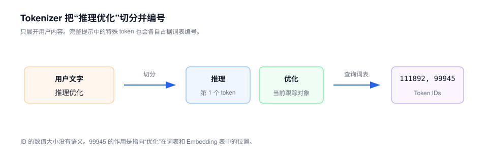
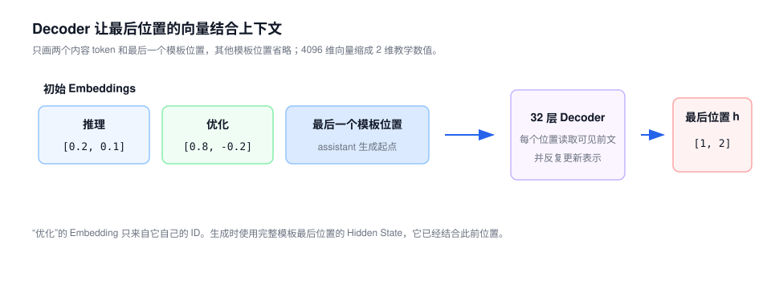
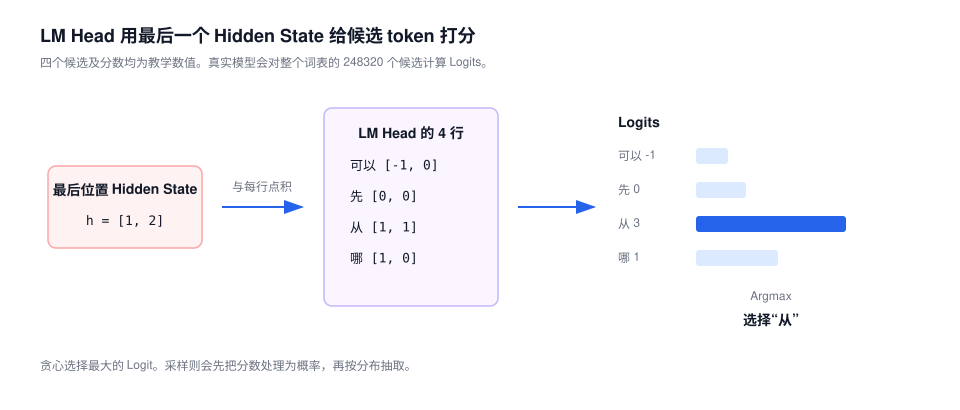
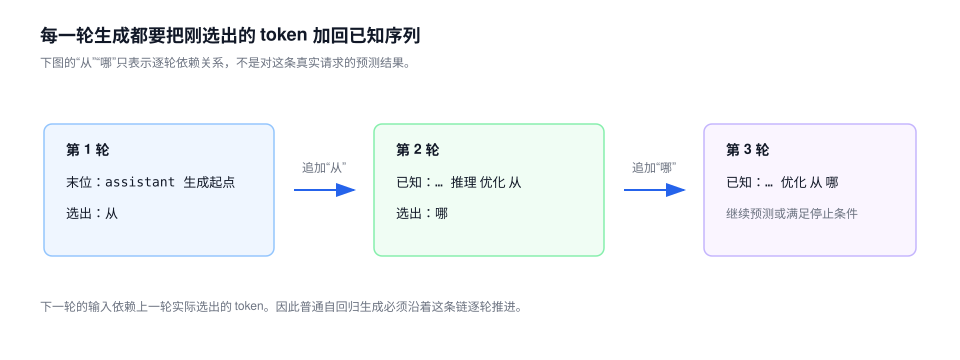

# 第 1 课：大模型生成下一个 token 的过程

聊天框里是文字，模型里计算的是数字。一条消息要先变成 Token ID，再变成向量；模型选出下一个 Token ID 后，Tokenizer 才把它还原成文字。本课沿一条完整的生成链路，说明每一步接收什么、产生什么。

本课暂不展开 Decoder 内部结构，也不讨论 GPU 性能。重点是分清文字、Token ID、嵌入（Embedding）、隐藏状态（Hidden State）、未归一化分数（Logit）和概率。

如果对 `[B,T,H]`、轴、点积或 Linear 的 shape 还不熟悉，先阅读[第 0 课：张量与模型计算基础](00-math-and-tensors.md)。

中英文名称和符号统一见[课程术语与符号表](../glossary.md)。

## 1. 文本进入模型后的数据形式

聊天接口看起来像这样：

```json
{"role": "user", "content": "推理优化"}
```

但模型内部不认识 JSON 字段，也不直接计算汉字。本课跟踪这条短对话，Chat Template、token 切分和 Token ID 均取自已核实的 Qwen3.5-9B 信息。

链路中有两个观察点。Tokenizer 和 Embedding 部分跟踪用户内容中的 `优化`，它的 Token ID 是 `99945`。这一处用来说明 Token ID 怎样查询 Embedding 表。

LM Head 部分跟踪完整 Prompt 的最后一个位置，也就是 Chat Template 补出的 assistant 生成起点。这个位置才负责预测回答的第一个 token。

为了能手算，后文把向量缩到两三维，并把词表缩成四个候选。这些数不是 Qwen3.5 的真实模型输出。

这条消息会依次经过下面这些组件：

| 组件 | 输入 | 输出 | 作用 |
| --- | --- | --- | --- |
| 对话模板（Chat Template） | 对话消息 | 格式化提示文本 | 表达角色、消息边界和生成起点 |
| 分词器（Tokenizer） | 文字 | Token IDs | 在文字与模型词表编号之间转换 |
| 嵌入（Embedding） | Token IDs | 初始向量 | 为每个 ID 取出一行可学习向量 |
| 解码器（Decoder） | 初始或中间向量 | Hidden States | 让每个位置的表示结合上下文 |
| 语言模型输出层（LM Head） | Hidden State | Logits | 为词表中的每个候选 token 打分 |
| 选择策略 | Logits | 下一个 Token ID | 贪心选择或按概率采样 |
| Tokenizer Decode | Token IDs | 文字 | 把模型生成的编号还原为可见文字 |

## 2. Chat Template 构造模型输入

同一句文字可能来自系统、用户、助手或工具。如果只把消息内容拼在一起，模型无法稳定判断是谁说了什么、哪里应该开始回答。

Chat Template 会把结构化消息转换成模型训练时使用的文本格式，并插入特殊 token。下面是 Qwen3.5 单轮文本对话的简化示意，不是完整模板：

```text
<|im_start|>user
推理优化<|im_end|>
<|im_start|>assistant
...
```

`<|im_start|>` 和 `<|im_end|>` 不是展示给用户的普通文字，而是词表中的特殊 token。实际模板还会根据系统消息、工具、思考模式和多模态内容增加其他结构。


### 2.1 Chat Template 对推理链路的影响

Chat Template 会改变实际送入模型的 token 序列，因此会影响：

- 输入 token 数量；
- 模型对角色和任务边界的理解；
- Prefix Cache 是否能够命中；
- 不同服务框架的结果是否一致。

所以，接口中的 `content` 不是模型的完整输入。分析上下文长度或比对两个推理后端时，应比较应用模板后的 Token IDs。

### 2.2 Base 模型与对话模型

Base 模型和对话模型在推理时都预测下一个 token，但后训练方式和预期输入不同。Base 模型主要学习续写文本，通常用于继续训练、研究或文本补全；对话模型又学习了角色、指令和回答格式，运行时应使用与训练相匹配的 Chat Template。

Chat Template 只负责整理输入格式，不会把 Base 模型自动变成会遵循指令的对话模型。Qwen3.5-9B-Base 为后续微调保留了对话控制 token，官方模型卡仍明确说明它不是面向直接对话的版本。本课的聊天案例使用 post-trained Qwen3.5-9B。

## 3. Tokenizer：从文本到 Token ID

Tokenizer 按照模型配套的词表和切分规则，把文本拆成可以编号的片段。模型随后处理的是这些编号，而不是原始字符串。

这些片段叫 **token**。Token 不等于“汉字”，也不等于“英文单词”。它可能是：

- 一个汉字；
- 多个汉字组成的常见片段；
- 一个完整英文单词；
- 英文单词的一部分；
- 空格和标点；
- 表示消息边界的特殊 token。

### 3.1 Qwen3.5 的实际分词结果

按 Qwen3.5-9B 当前官方 Tokenizer：

| 原文字串 | Token 切分 | Token IDs |
| --- | --- | --- |
| `我喜欢学习` | `我喜欢`、`学习` | `111721`、`96472` |
| `推理优化` | `推理`、`优化` | `111892`、`99945` |
| `Hello world` | `Hello`、`␠world` | `9419`、`1814` |

表中的 `␠` 用来显示一个不可见的前导空格，不是 token 的实际文字。

在贯穿案例里，用户可见的“推理优化”被切成 `推理` 和 `优化`，编号依次为 `111892`、`99945`。完整提示还包含 Chat Template 插入的特殊 token，本图只展开这两个已核实的用户内容 token。



这个例子说明：

```text
4 个汉字，不一定是 4 个 token
2 个英文单词，也不一定只按单词边界切分
空格可能属于后面的 token
```

切分规则由具体模型的 Tokenizer 决定。不能拿另一个模型的经验猜 Qwen3.5 的 token 数。

### 3.2 词表与切分规则

Qwen3.5 当前配置使用 `Qwen2Tokenizer`，其实现基于 Byte-level BPE。第一轮不需要推导完整算法，只需理解三个步骤：

```text
先保证文字可以由基础字节表示
→ 在 Tokenizer 训练阶段，把语料中经常相邻出现的片段逐步合并
→ 编码时，按照已经确定的词表和合并规则切分新文字
```

因此，常见片段可能合并成较长 token，少见片段则可能被拆得更细。Byte-level 的基础表示也让任意文本都能继续拆分，而不是遇到词表外文字就完全无法表示。

BPE 决定的是“怎样切分和编号”。Token 在上下文里表达什么，仍由模型参数学习。

### 3.3 token 与 Token ID

假设一个极小词表是：

| Token ID | Token |
| ---: | --- |
| 0 | `我` |
| 1 | `喜欢` |
| 2 | `学习` |
| 3 | `跑步` |

那么：

```text
"我喜欢学习"
→ ["我", "喜欢", "学习"]
→ [0, 1, 2]
```

Token 是文字片段，Token ID 是它在词表中的编号。

Token ID 的**数值大小没有语义**。ID `111892` 并不表示“推理”的语义强度是 111892，也不表示它比 ID 较小的 token 更重要。它只是一个离散索引。

更精确地说：

```text
Token ID 是词表编号
→ 模型使用这个编号索引 Embedding 的对应行
```

### 3.4 Tokenizer 的输出张量

在最简主链路中，Tokenizer 输出 `input_ids`。批量输入时，其 shape 通常是：

```text
input_ids: [B, T]
```

| 符号 | 含义 |
| --- | --- |
| `B` | batch 中的序列数 |
| `T` | 每条序列当前包含的 token 位置数 |

实际调用还可能输出 Attention Mask 等辅助信息。这里暂时只跟踪 `input_ids`。

如果 `B=2`、`T=8`：

```text
input_ids.shape = [2, 8]
```

Tokenizer 的工作到这里结束。查 Embedding 表属于模型计算。

## 4. Embedding：从 Token ID 到向量

### 4.1 Token ID 是词表索引

Token ID 只是编号。如果直接拿它计算，就会错误地暗示：

```text
ID 100 比 ID 10 大十倍，因此语义也更强
```

编号之间不存在这种数量关系。模型需要把每个离散 ID 映射成一组可学习的连续数值，这就是 Embedding。

### 4.2 Embedding 的查表过程

为了手算，下面只展示 Embedding 表中的四行，并把每个向量缩成 `H=3` 维。`推理` 和 `优化` 仍使用上面已经核实的实际 ID；表中的向量只是教学数值。

| Token ID | Token | Embedding 向量 |
| ---: | --- | --- |
| 111892 | `推理` | `[0.2, 0.1, -0.4]` |
| 99945 | `优化` | `[0.8, -0.2, 0.5]` |
| 9419 | `Hello` | `[0.5, 0.7, 0.1]` |
| 1814 | `␠world` | `[-0.1, 0.6, 0.9]` |

输入：

```text
input_ids = [111892, 99945]
```

Embedding 根据每个 ID 取出对应行：

```text
[
  [0.2,  0.1, -0.4],   # ID 111892，“推理”
  [0.8, -0.2,  0.5]    # ID 99945，“优化”
]
```

这个动作也常被描述为 `Gather`：根据索引从一张大表中取出指定的行。


### 4.3 Embedding 的输出 shape

Embedding 参数表的 shape 是：

```text
Embedding weight: [V, H]
```

输入和输出为：

```text
input_ids:        [B, T]
input_embeddings: [B, T, H]
```

如果 `B=2`、`T=8`、`H=4096`：

```text
input_ids.shape        = [2, 8]
input_embeddings.shape = [2, 8, 4096]
```

它没有增加 token 位置数，只是把每个位置的一个整数编号换成一个 `H` 维向量。

### 4.4 Embedding 与上下文语义

Embedding 是训练得到的模型参数，包含基础的词义、语法和相似关系。说“Embedding 没有语义”并不准确。

但一个 token 的输入 Embedding 在当前请求中还没有结合上下文。比如“苹果”出现在下面两句话里：

```text
我吃了一个苹果
苹果发布了新手机
```

进入 Decoder 前，“苹果”的 Token ID 相同，取到的初始 Embedding 也相同。经过模型层后，两个位置的 Hidden State 会因为上下文不同而不同。

| 对象 | 来源 | 是否结合当前上下文 | 含义 |
| --- | --- | --- | --- |
| Token ID | Tokenizer 的词表和切分规则 | 否 | 词表中的离散编号，不是模型的连续参数 |
| Embedding | 模型训练得到的参数表 | 否 | token 的初始、静态表示 |
| Hidden State | 模型在当前请求中计算 | 是 | 当前位置结合上下文后的表示 |

Embedding 和 Hidden State 可以具有相同 shape，但不是同一个概念。

## 5. Decoder 生成上下文表示

Qwen3.5-9B 的文本模型使用 `H=4096`，共有 32 层。Embedding 输出进入这些层后，模型会反复更新每个 token 的向量。



这里暂时把 32 层看成一个黑盒，只看它完成了什么：

> 它把每个 token 的初始表示，变成已经结合前文和当前位置的 Hidden State。

第 2 课会分析一个 Decoder Layer 中的 RMSNorm、Residual 和 FFN；第 3 课再完整拆解 Attention 的计算过程。

### 5.1 下一个 token 由最后一个位置预测

假设已知输入有三个 token：

```text
x1, x2, x3
```

模型产生三个位置的 Hidden State：

```text
h1, h2, h3
```

在因果语言模型中，每个位置用它已经能看到的内容预测下一个位置：

```text
h1 用来预测 x2
h2 用来预测 x3
h3 用来预测尚未出现的 x4
```

因此，生成下一个 token 时，关键输入是最后一个已知位置的 `h3`。

实现可以保留所有位置的 Hidden State，也可以只为需要的位置计算 LM Head 输出。
Qwen3.5 的 Transformers 实现提供 `logits_to_keep`，允许限制需要产生
Logits 的位置；这改变实现成本，不改变上述语义。

## 6. LM Head 生成词表 Logits

Decoder 的输出仍然是一个 `H` 维向量。我们最终要从 `V` 个词表候选中选一个 token，因此需要把：

```text
H 个上下文特征
→ V 个候选 token 的分数
```

完成这个映射的 Linear 层叫 LM Head。

### 6.1 四候选手算示例

沿用贯穿案例的最后输入位置，也就是 assistant 生成起点。图中把它在 Decoder 后的 Hidden State 缩成两维：

```text
h = [1, 2]
```

LM Head 为每个候选 token 保存一行权重：

| 候选 token | 权重行 | 点积计算 | Logit |
| --- | --- | --- | ---: |
| `可以` | `[-1, 0]` | `1×(-1) + 2×0` | -1 |
| `先` | `[0, 0]` | `1×0 + 2×0` | 0 |
| `从` | `[1, 1]` | `1×1 + 2×1` | 3 |
| `哪` | `[1, 0]` | `1×1 + 2×0` | 1 |

输出为：

```text
logits = [-1, 0, 3, 1]
```



Logit 是未归一化分数：

- 可以为负数；
- 不要求落在 0 到 1；
- 所有 Logit 的和不需要等于 1；
- 只看单个 Logit，不能知道最终概率。

### 6.2 LM Head 的通用 shape

对于一次只取最后位置的生成：

```text
last_hidden_state: [B, H]
LM Head weight:    [V, H]
logits:            [B, V]
```

如果保留多个位置：

```text
hidden_states: [B, T, H]
logits:        [B, T, V]
```

Qwen3.5-9B 当前文本配置为：

```text
H = 4096
V = 248320
```

因此单个位置的 4096 维 Hidden State 会被映射成 248320 个候选分数。

### 6.3 LM Head 与 Embedding 的映射方向

二者方向相反：

```text
Embedding：Token ID → H 维向量
LM Head： H 维 Hidden State → V 个候选分数
```

Qwen3.5-9B 的 `tie_word_embeddings` 当前配置为 `false`，输入 Embedding
与输出 LM Head 不共享同一套权重。即使某些模型选择共享权重，
Tokenizer Decode 也仍然负责 ID 到文字的转换，不能把 Embedding 当作解码器。

## 7. 从 Logits 选择下一个 token

Logits 已经给出了候选 token 的相对排序。下一步有两类常用选择方式。

### 7.1 贪心解码

仍使用：

```text
logits = [-1, 0, 3, 1]
```

最大值是第三个位置的 `3`，所以贪心选择第三个候选 token，也就是教学候选中的“从”。如果索引从 0 开始，这个位置的索引是 `2`。

```text
next_token_id = argmax(logits)
```

贪心选择不必计算 Softmax，因为 Softmax 不会改变候选之间的大小顺序。

### 7.2 Softmax 概率归一化

采样需要概率。对有限实数 Logit，Softmax 会把它们转换成：

- 每项都大于 0；
- 所有项之和等于 1；
- 较大的 Logit 对应较大的概率。

公式为：

$$
P_i=\frac{e^{z_i}}{\sum_j e^{z_j}}
$$

| 符号 | 含义 |
| --- | --- |
| $z_i$ | 第 $i$ 个候选的 Logit |
| $e^{z_i}$ | 将分数变成正数后的相对权重 |
| $P_i$ | 第 $i$ 个候选的概率 |

代入 `[-1, 0, 3, 1]`：

| 候选 | Logit | $e^{Logit}$ | Softmax 概率 |
| --- | ---: | ---: | ---: |
| `可以` | -1 | 0.368 | 1.5% |
| `先` | 0 | 1.000 | 4.1% |
| `从` | 3 | 20.086 | 83.1% |
| `哪` | 1 | 2.718 | 11.2% |

Logit 为 0 时，概率不是 0，因为：

$$
e^0=1
$$

它的最终概率还取决于所有候选共同构成的分母。

### 7.3 随机采样

如果“从”的概率为 83.1%，采样并不保证选中它。含义是：在相同分布下重复很多次，平均大约 83.1% 的次数会选中它，仍有 16.9% 的机会选中其他候选。

```text
贪心：最大候选必选
采样：按照概率随机选择
```

实际生成会先处理 Logits，再按处理后的分布采样：

- **Temperature**：缩放 Logit 差距；较低温度使分布更集中，较高温度使分布更平缓；
- **Top-K**：只保留分数最高的 K 个候选；
- **其他约束**：屏蔽非法 token、重复惩罚或任务特定约束。

Top-P 依赖概率，不能只看原始 Logit 决定保留哪些候选。它先对当前分数做 Softmax，再按概率从高到低累加，只保留累计概率达到阈值所需的最小候选集合。许多框架把 Top-P 包装成一个 Logits Processor：处理器内部计算一次概率来确定屏蔽范围，再把被屏蔽的 Logits 交给最后的归一化和采样。

常见的采样流程是：

```text
原始 Logits
→ Temperature、Top-K 和其他约束
→ 对当前分数做 Softmax，计算 Top-P 累计概率
→ 屏蔽 Top-P 集合外的候选
→ 对剩余候选重新归一化
→ 按概率抽取 Token ID
```

不同框架可能组合或调整处理器顺序。需要区分的是：贪心可以直接 `argmax`，Top-P 和最终概率采样都依赖归一化后的分布。

## 8. 自回归生成的数据依赖

假设模型要回答三个 token。普通自回归生成时，上一轮选出的 token 会成为下一轮已知序列的一部分：



第二个未来 token 的概率取决于第一个 token 实际生成了什么。如果第一个
token 尚未确定，第二步就缺少输入。因此，不能把同一个请求未来未知的
100 个 token 直接当成 100 个已知位置，使用普通方式一次并行算完。

这里要区分两件事：

- **逻辑依赖**：未来 token 必须依次确定；
- **计算复用**：KV Cache 或 recurrent state 可以避免重复计算全部历史。

缓存可以减少重复工作，但不能消除普通自回归模型对上一个生成结果的依赖。Prefill、Decode 和缓存会在第 4 课展开。

生成会在满足某种停止条件时结束，例如：

- 生成了配置指定的停止 token；
- 达到最大新 token 数；
- 命中调用方定义的停止规则。

停止 token 可能由模型和生成配置共同决定，不应假设所有模型都只有同一个 EOS ID。

## 9. 训练阶段的多位置并行

自回归生成必须逐个确定未来 token，但训练一个因果语言模型时，整段正确文本已经给出。以四个 token 为例：

```text
[我, 喜欢, 学习, <eos>]
```

模型在每个位置预测紧接着出现的 token：

| 正在计算的位置 | 该位置允许读取的内容 | 训练目标 |
| ---: | --- | --- |
| 0 | `我` | `喜欢` |
| 1 | `我, 喜欢` | `学习` |
| 2 | `我, 喜欢, 学习` | `<eos>` |

代码中常把输入和标签写成同一条序列，再在计算损失时错开一位：位置 `t` 的 Logits 与真实的 `t+1` token 比较。因果遮罩保证位置 `t` 看不到右侧答案，所以没有泄漏未来信息。

训练时，前三个位置所需的输入 token 全都已知，可以放进一次前向计算。每个位置能读取的范围不同，但不必等位置 0 先“生成”出 `喜欢`，因为正确的 `喜欢` 已经在训练样本里。这种使用真实历史 token 计算各位置预测的方式通常称为 Teacher Forcing。

推理时没有真实的未来 token。第一个输出尚未确定，第二步就缺少输入，因此仍要把模型刚选出的 token 加回序列，再计算下一步：

```text
训练：未来答案已知，多个位置的预测损失可以在一次前向中计算
推理：未来答案未知，必须先确定上一个 token，才能开始下一步
```

### 9.1 因果语言模型的训练损失

训练不只需要模型给每个候选打分，还要衡量它给正确 token 的分数是否足够高。仍用第 7 节的四个教学候选：

```text
logits = [-1, 0, 3, 1]
```

经过 Softmax 后，第三个候选“从”的概率约为 `0.831`。如果它就是这个位置的正确答案，该位置的交叉熵损失是：

$$
Loss=-\log(0.831)\approx0.185
$$

模型给正确答案的概率越接近 1，损失越接近 0。若正确答案其实是第四个候选“哪”，它的概率只有 `0.112`，损失约为：

$$
Loss=-\log(0.112)\approx2.19
$$

一段训练文本会产生多个位置的损失，训练程序通常对有效位置求平均。Padding 或不参与训练的位置可以用 `ignore_index` 排除。

从张量看，关系是：

```text
模型输出的 Logits：       [B,T,V]
错位后的 Logits：         [B,T-1,V]
错位后的正确 Token IDs： [B,T-1]
每个有效位置：            一个损失值
整批 Loss：               对有效位置汇总
```

实际代码还会把前两轴展平，让每一行对应一个位置、最后的 `V` 维对应词表候选。PyTorch 的 `CrossEntropyLoss` 接收这些原始 Logits 和正确 Token ID，在内部完成 Log Softmax 与负对数似然计算，训练代码不必先手工调用 Softmax。

因果语言模型的训练目标可以概括为：每个位置只能读取左侧和自己，再尽量提高下一个真实 token 的概率。反向传播怎样根据 Loss 更新权重，不属于本课程范围。

仓库中的[因果语言模型 Loss 复算程序](../../examples/causal_lm_loss_walkthrough.py)会算出上述两个损失，并验证概率越高时交叉熵越低。

这里说的“同时计算”只针对一层中多个已知位置的批量计算。Decoder Layer 之间仍有先后依赖；Gated DeltaNet 的状态更新也仍有数学上的递归关系，只是可以用 Chunk Kernel 改写执行方式。

## 10. Tokenizer Decode：从 Token ID 回到文本

假设模型连续生成：

```text
[111892, 99945]
```

最后由与模型配套的 Tokenizer 执行 Decode：

```text
[111892, 99945]
→ ["推理", "优化"]
→ "推理优化"
```

这里查询的是 Tokenizer 的词表和解码规则，不是 Embedding 参数表。

```text
Tokenizer encode：文字 → Token IDs
Tokenizer decode：Token IDs → 文字
Embedding：Token IDs → 初始向量
```

Embedding 向量是训练得到的一组连续数值，不能可靠地反查为文字。把向量找最近邻也不等于 Tokenizer Decode。

## 11. 生成链路中的 shape 变化

以 Qwen3.5-9B 文本路径为例：

| 阶段 | 典型 shape | 每个位置表示什么 |
| --- | --- | --- |
| Token IDs | `[B, T]` | 一个词表编号 |
| Embedding 输出 | `[B, T, 4096]` | token 的初始向量 |
| Decoder Hidden States | `[B, T, 4096]` | 结合上下文后的向量 |
| 全位置 LM Head 输出 | `[B, T, 248320]` | 每个位置对全词表的分数 |
| 仅最后位置的 Logits | `[B, 248320]` | 下一个 token 的候选分数 |
| 选择结果 | `[B]` | 每个序列的下一个 Token ID |

实际 runtime 可能保留 `[B,1,V]`，也可能压缩成 `[B,V]`；可能计算全部位置的 Logits，也可能只计算需要的位置。这些实现差异不改变张量的语义。

## 12. 按生成阶段定位工程问题

有了这条链路，已经可以避免几类常见误判：

| 现象或方案 | 先查哪里 |
| --- | --- |
| 两个框架回答风格不同 | Chat Template、Tokenizer、Sampling 配置是否一致 |
| 同一句话的 token 数与字符数不同 | Tokenizer 切分规则 |
| 输入长度或输出长度增加 | `[B,T]` 中的 `T` 增加，后续模型处理位置增多 |
| 只计算最后位置的 Logits | LM Head 的输出位置数减少，不等于 Decoder 历史消失 |
| 更换 Top-P 或 Temperature | 改变选择分布，不改变 Decoder 权重 |
| 模型重复输出 | 既可能来自模型分数，也可能来自采样和重复惩罚配置 |
| 使用错误 Tokenizer | ID 仍可能是合法整数，但指向了错误的 token 语义 |

定位问题时，先确认差异出现在哪个阶段，再核对该阶段的输入、参数和配置。这样可以避免把采样问题归因于模型权重，或把模板差异误判为推理精度问题。

## 13. 生成链路的错误诊断

某份设计文档这样描述本课使用的对话接口和训练过程：

> 服务把当前例子中的四个汉字直接交给 Tokenizer。Tokenizer 查 Embedding 表得到 Token ID，Decoder 再把 ID 变成概率。LM Head 根据概率生成 Hidden State，执行 Softmax 后用 Argmax 选出文字。下一轮把这段文字直接送回 Decoder。
>
> 训练时也必须逐 token 调用模型，因为后一个位置依赖前一个位置。训练样本已经包含完整答案，所以不再需要因果遮罩。计算损失前，代码必须先手工对 Logits 执行 Softmax。

请完成两件事：

1. 按执行顺序改写第一段，并标出 Token IDs、Embedding、Hidden States 和 Logits 的主要 shape。
2. 解释第二段为什么把“训练样本已知”和“生成结果未知”混在了一起，并改正因果遮罩与交叉熵的说法。

<details>
<summary>查看参考修改</summary>


对话消息先经过 Chat Template，加入角色、消息边界和生成起点。Tokenizer 把格式化后的文本切成 token，并输出 `input_ids:[B,T]`。Embedding 根据这些 ID 查表，得到初始向量 `[B,T,H]`。Decoder 把初始向量更新成包含上下文的 Hidden States，LM Head 再把需要预测的位置映射成词表 Logits；只保留最后位置时，shape 是 `[B,V]`。

贪心生成可以直接对 Logits 做 Argmax，选择结果是下一个 Token ID。下一轮把这个 ID 送入模型，由 Embedding 再次查表。Tokenizer Decode 负责把连续生成的 Token IDs 还原成用户看到的文字。

训练样本已经给出完整 token 序列，因此多个位置的输入可以组成一次模型前向，不需要像在线生成那样等待模型先选出前一个 token。因果遮罩仍然必须存在，否则位置 `t` 会读到右侧的真实答案。PyTorch 的 `CrossEntropyLoss` 直接接收原始 Logits，并在内部完成 Log Softmax 与负对数似然计算，训练代码不必先手工执行 Softmax。

</details>

## 参考资料

以下事实于 2026-08-08 按官方配置与实现复核：

- [Qwen3.5-9B 官方模型说明，revision c202236](https://huggingface.co/Qwen/Qwen3.5-9B/blob/c202236235762e1c871ad0ccb60c8ee5ba337b9a/README.md)
- [Qwen3.5-9B-Base 官方模型说明，revision 68c46c4](https://huggingface.co/Qwen/Qwen3.5-9B-Base/blob/68c46c4b3498877f3ef123c856ecfde50c39f404/README.md)
- [Qwen3.5-9B `config.json`，revision c202236](https://huggingface.co/Qwen/Qwen3.5-9B/blob/c202236235762e1c871ad0ccb60c8ee5ba337b9a/config.json)
- [Qwen3.5-9B `tokenizer_config.json`，revision c202236](https://huggingface.co/Qwen/Qwen3.5-9B/blob/c202236235762e1c871ad0ccb60c8ee5ba337b9a/tokenizer_config.json)
- [Transformers：Qwen2 Byte-level BPE Tokenizer 实现，revision 9436284](https://github.com/huggingface/transformers/blob/943628458a1691f8af09c47ea9fc6e314734722f/src/transformers/models/qwen2/tokenization_qwen2.py)
- [Transformers：Qwen3.5 模型实现，revision 9436284](https://github.com/huggingface/transformers/blob/943628458a1691f8af09c47ea9fc6e314734722f/src/transformers/models/qwen3_5/modeling_qwen3_5.py)
- [Transformers：生成实现，revision 9436284](https://github.com/huggingface/transformers/blob/943628458a1691f8af09c47ea9fc6e314734722f/src/transformers/generation/utils.py)
- [Transformers：Top-P Logits Processor，revision 9436284](https://github.com/huggingface/transformers/blob/943628458a1691f8af09c47ea9fc6e314734722f/src/transformers/generation/logits_process.py#L473-L539)
- [Hugging Face：Causal Language Modeling](https://huggingface.co/docs/transformers/tasks/language_modeling)
- [PyTorch：`CrossEntropyLoss`](https://docs.pytorch.org/docs/stable/generated/torch.nn.CrossEntropyLoss.html)
- [Attention Is All You Need：Decoder 遮罩与错位预测](https://arxiv.org/abs/1706.03762)
- [PyTorch：Softmax](https://docs.pytorch.org/docs/stable/generated/torch.nn.Softmax.html)

---

[上一课：张量与模型计算基础](00-math-and-tensors.md) · [返回课程路线](../roadmap.md) · [下一课：Decoder Layer 的结构与计算](02-inside-a-decoder-layer.md)
