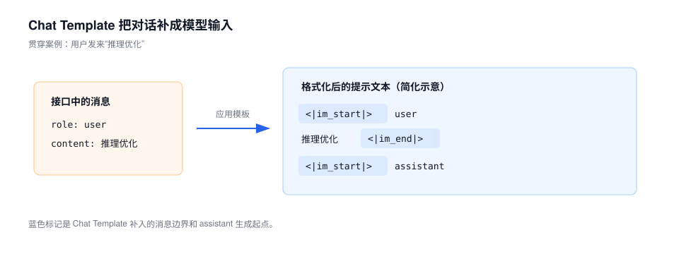
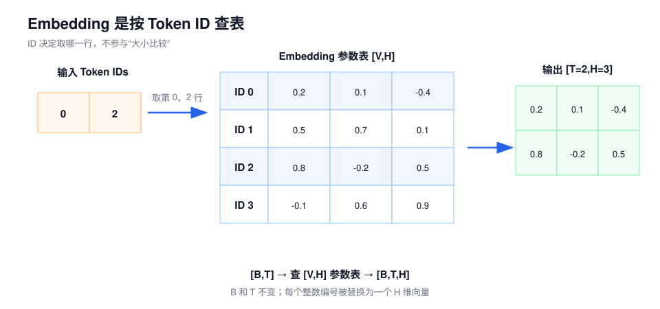
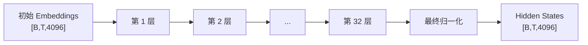
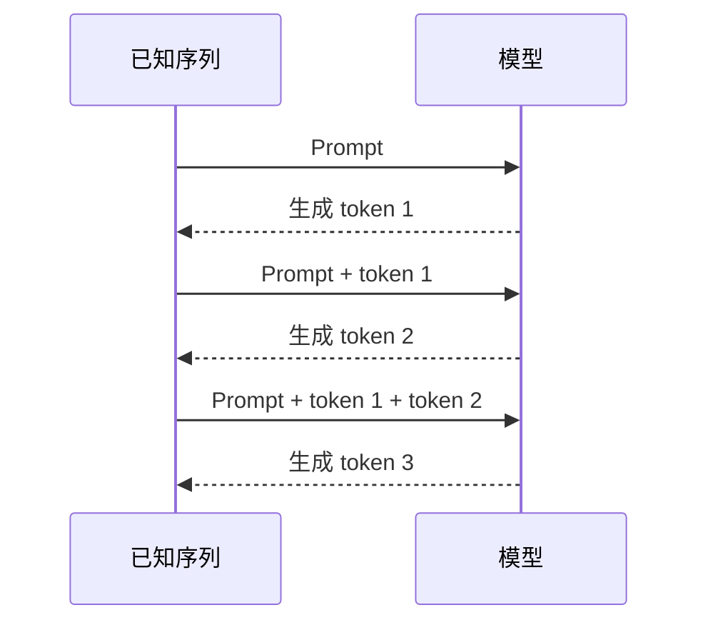

# 第一课：从一句话到下一个 Token

这一课只解决一个问题：

> 用户发来一句话后，语言模型怎样产生下一个 token？

先不打开 Decoder 内部，也不讨论 GPU、FLOPs 和服务吞吐。学完这一课，
你应该能够区分文字、Token ID、嵌入（Embedding）、隐藏状态（Hidden State）、未归一化分数（Logit）和概率，
并能从头画出一次生成的完整链路。

如果对 `[B,T,H]`、轴、点积或 Linear 的 shape 还不熟悉，先阅读[第 0 课：看懂推理链路所需的数学与张量](00-math-and-tensors.md)。

本课程统一术语见[课程术语与符号表](../glossary.md)。

## 1. 先看全局：模型并不直接接收和输出文字

聊天接口看起来像这样：

```json
{"role": "user", "content": "推理优化"}
```

但模型内部不认识 JSON 字段，也不直接计算汉字。一次文本生成实际经过以下步骤：



如果需要生成一句完整回答，模型会重复中间的生成步骤：

```text
根据已有 token 预测下一个 token
→ 把新 token 加入已有序列
→ 再预测下一个 token
→ 直到满足停止条件
```

先记住这张职责表。后面的每一节都只是把其中一个方框打开。

| 组件 | 输入 | 输出 | 核心职责 |
| --- | --- | --- | --- |
| 对话模板（Chat Template） | 对话消息 | 格式化提示文本 | 表达角色、消息边界和生成起点 |
| 分词器（Tokenizer） | 文字 | Token IDs | 在文字与模型词表编号之间转换 |
| 嵌入（Embedding） | Token IDs | 初始向量 | 为每个 ID 取出一行可学习向量 |
| 解码器（Decoder） | 初始或中间向量 | Hidden States | 让每个位置的表示结合上下文 |
| 语言模型输出层（LM Head） | Hidden State | Logits | 为词表中的每个候选 token 打分 |
| 选择策略 | Logits | 下一个 Token ID | 贪心选择或按概率采样 |
| Tokenizer Decode | Token IDs | 文字 | 把模型生成的编号还原为可见文字 |

## 2. 对话模板（Chat Template）：模型看到的不只是用户输入

### 2.1 它解决什么问题

同一句文字可能来自系统、用户、助手或工具。如果只把消息内容拼在一起，模型无法稳定判断是谁说了什么、哪里应该开始回答。

Chat Template 会把结构化消息转换成模型训练时使用的文本格式，并插入特殊 token。下面是 Qwen3.5 单轮文本对话的简化示意，不是完整模板：

```text
<|im_start|>user
推理优化<|im_end|>
<|im_start|>assistant
...
```

`<|im_start|>` 和 `<|im_end|>` 不是展示给用户的普通文字，而是词表中的特殊 token。实际模板还会根据系统消息、工具、思考模式和多模态内容增加其他结构。

### 2.2 为什么工程上必须知道它

Chat Template 会改变真正送入模型的 token 序列，因此会影响：

- 输入 token 数量；
- 模型对角色和任务边界的理解；
- Prefix Cache 是否能够命中；
- 不同服务框架的结果是否一致。

所以，接口中的 `content` 不是模型的完整输入。分析上下文长度或比对两个推理后端时，应比较应用模板后的 Token IDs。

## 3. 分词器（Tokenizer）：为什么不能直接把文字交给模型

### 3.1 它解决什么问题

模型只能处理有限维度的数字张量，而自然语言可以不断出现新句子。Tokenizer 通过一个有限词表，把任意文本切成模型能够编号的片段。

这些片段叫 **token**。Token 不等于“汉字”，也不等于“英文单词”。它可能是：

- 一个汉字；
- 多个汉字组成的常见片段；
- 一个完整英文单词；
- 英文单词的一部分；
- 空格和标点；
- 表示消息边界的特殊 token。

### 3.2 用当前 Qwen3.5 Tokenizer 看实际结果

按 Qwen3.5-9B 当前官方 Tokenizer：

| 原文字串 | Token 切分 | Token IDs |
| --- | --- | --- |
| `我喜欢学习` | `我喜欢`、`学习` | `111721`、`96472` |
| `推理优化` | `推理`、`优化` | `111892`、`99945` |
| `Hello world` | `Hello`、`␠world` | `9419`、`1814` |

表中的 `␠` 用来显示一个不可见的前导空格，不是 token 的实际文字。

这个例子说明：

```text
4 个汉字，不一定是 4 个 token
2 个英文单词，也不一定只按单词边界切分
空格可能属于后面的 token
```

切分规则由具体模型的 Tokenizer 决定。不能拿另一个模型的经验猜 Qwen3.5 的 token 数。

### 3.3 切分规则从哪里来

Qwen3.5 当前配置使用 `Qwen2Tokenizer`，其实现基于 Byte-level BPE。第一轮不需要推导完整算法，只需理解三个步骤：

```text
先保证文字可以由基础字节表示
→ 在 Tokenizer 训练阶段，把语料中经常相邻出现的片段逐步合并
→ 编码时，按照已经确定的词表和合并规则切分新文字
```

因此，常见片段可能合并成较长 token，少见片段则可能被拆得更细。Byte-level 的基础表示也让任意文本都能继续拆分，而不是遇到词表外文字就完全无法表示。

BPE 决定的是“怎样切分和编号”。Token 在上下文里表达什么，仍由模型参数学习。

### 3.4 Token 与 Token ID 的区别

假设一个极小词表是：

| Token ID | Token |
| ---: | --- |
| 0 | `我` |
| 1 | `喜欢` |
| 2 | `学习` |
| 3 | `跑步` |

那么：

```text
"我喜欢学习"
→ ["我", "喜欢", "学习"]
→ [0, 1, 2]
```

Token 是文字片段，Token ID 是它在词表中的编号。

Token ID 的**数值大小没有语义**。ID `111892` 并不表示“推理”的语义强度是 111892，也不表示它比 ID 较小的 token 更重要。它只是一个离散索引。

更精确地说：

```text
Token ID 是词表编号
→ 模型使用这个编号索引 Embedding 的对应行
```

### 3.5 Tokenizer 输出什么

在最简主链路中，Tokenizer 输出 `input_ids`。批量输入时，其 shape 通常是：

```text
input_ids: [B, T]
```

| 符号 | 含义 |
| --- | --- |
| `B` | batch 中的序列数 |
| `T` | 每条序列当前包含的 token 位置数 |

真实调用还可能输出 Attention Mask 等辅助信息。本课只跟踪 `input_ids`。

如果 `B=2`、`T=8`：

```text
input_ids.shape = [2, 8]
```

Tokenizer 到这里已经完成。接下来查 Embedding 表是模型的工作，不是 Tokenizer 的工作。

## 4. 嵌入（Embedding）：把离散编号变成可计算的向量

### 4.1 为什么不能直接拿 Token ID 做数学计算

Token ID 只是编号。如果直接拿它计算，就会错误地暗示：

```text
ID 100 比 ID 10 大十倍，因此语义也更强
```

编号之间不存在这种数量关系。模型需要把每个离散 ID 映射成一组可学习的连续数值，这就是 Embedding。

### 4.2 Embedding 本质上是查表

假设词表大小 `V=4`，每个 token 用 `H=3` 个数表示。Embedding 参数表可以写成：

| Token ID | Token | Embedding 向量 |
| ---: | --- | --- |
| 0 | `我` | `[0.2, 0.1, -0.4]` |
| 1 | `喜欢` | `[0.5, 0.7, 0.1]` |
| 2 | `学习` | `[0.8, -0.2, 0.5]` |
| 3 | `跑步` | `[-0.1, 0.6, 0.9]` |

输入：

```text
input_ids = [0, 1, 2]
```

Embedding 根据每个 ID 取出对应行：

```text
[
  [0.2,  0.1, -0.4],   # ID 0
  [0.5,  0.7,  0.1],   # ID 1
  [0.8, -0.2,  0.5]    # ID 2
]
```

这个动作也常被描述为 `Gather`：根据索引从一张大表中取出指定的行。



### 4.3 Shape 怎样变化

Embedding 参数表的 shape 是：

```text
Embedding weight: [V, H]
```

输入和输出为：

```text
input_ids:        [B, T]
input_embeddings: [B, T, H]
```

如果 `B=2`、`T=8`、`H=4096`：

```text
input_ids.shape        = [2, 8]
input_embeddings.shape = [2, 8, 4096]
```

它没有增加 token 位置数，只是把每个位置的一个整数编号换成一个 `H` 维向量。

### 4.4 Embedding 有没有语义

Embedding 是训练得到的模型参数，包含基础的词义、语法和相似关系。说“Embedding 没有语义”并不准确。

但一个 token 的输入 Embedding 在当前请求中还没有结合上下文。比如“苹果”出现在下面两句话里：

```text
我吃了一个苹果
苹果发布了新手机
```

进入 Decoder 前，“苹果”的 Token ID 相同，取到的初始 Embedding 也相同。经过模型层后，两个位置的 Hidden State 会因为上下文不同而不同。

| 对象 | 是否经过训练得到 | 是否结合当前上下文 | 含义 |
| --- | --- | --- | --- |
| Token ID | 否 | 否 | 词表中的离散编号 |
| Embedding | 是 | 否 | token 的初始、静态表示 |
| Hidden State | 运行时计算 | 是 | 当前位置结合上下文后的表示 |

Embedding 和 Hidden State 可以具有相同 shape，但不是同一个概念。

## 5. 解码器（Decoder）：把初始表示变成上下文表示

Qwen3.5-9B 的文本模型使用 `H=4096`，共有 32 层。Embedding 输出进入这些层后，模型会反复更新每个 token 的向量。



本课把 32 层暂时看成一个黑盒，只需要知道它完成了什么：

> 它把每个 token 的初始表示，变成已经结合前文和当前位置的 Hidden State。

下一课会打开一层，解释 RMSNorm、Residual 和 FFN；第三课再解释 Attention 怎样读取上下文。

### 5.1 为什么使用最后一个位置

假设已知输入有三个 token：

```text
x1, x2, x3
```

模型产生三个位置的 Hidden State：

```text
h1, h2, h3
```

在因果语言模型中，每个位置用它已经能看到的内容预测下一个位置：

```text
h1 用来预测 x2
h2 用来预测 x3
h3 用来预测尚未出现的 x4
```

因此，生成下一个 token 时，关键输入是最后一个已知位置的 `h3`。

实现可以保留所有位置的 Hidden State，也可以只为需要的位置计算 LM Head 输出。
Qwen3.5 的 Transformers 实现提供 `logits_to_keep`，允许限制需要产生
Logits 的位置；这改变实现成本，不改变上述语义。

## 6. 语言模型输出层（LM Head）：为词表中每个候选 token 打分

### 6.1 它解决什么问题

Decoder 的输出仍然是一个 `H` 维向量。我们最终要从 `V` 个词表候选中选一个 token，因此需要把：

```text
H 个上下文特征
→ V 个候选 token 的分数
```

完成这个映射的 Linear 层叫 LM Head。

### 6.2 用四个候选手算一次

沿用四个 token 的小词表。设最后位置的 Hidden State 只有两维：

```text
h = [1, 2]
```

LM Head 为每个候选 token 保存一行权重：

| 候选 token | 权重行 | 点积计算 | Logit |
| --- | --- | --- | ---: |
| `我` | `[-1, 0]` | `1×(-1) + 2×0` | -1 |
| `喜欢` | `[0, 0]` | `1×0 + 2×0` | 0 |
| `学习` | `[1, 1]` | `1×1 + 2×1` | 3 |
| `跑步` | `[1, 0]` | `1×1 + 2×0` | 1 |

输出为：

```text
logits = [-1, 0, 3, 1]
```

Logit 是未归一化分数：

- 可以为负数；
- 不要求落在 0 到 1；
- 所有 Logit 的和不需要等于 1；
- 只看单个 Logit，不能知道最终概率。

### 6.3 通用 shape

对于一次只取最后位置的生成：

```text
last_hidden_state: [B, H]
LM Head weight:    [V, H]
logits:            [B, V]
```

如果保留多个位置：

```text
hidden_states: [B, T, H]
logits:        [B, T, V]
```

Qwen3.5-9B 当前文本配置为：

```text
H = 4096
V = 248320
```

因此单个位置的 4096 维 Hidden State 会被映射成 248320 个候选分数。

### 6.4 LM Head 与 Embedding 不是同一个动作

二者方向相反：

```text
Embedding：Token ID → H 维向量
LM Head： H 维 Hidden State → V 个候选分数
```

Qwen3.5-9B 的 `tie_word_embeddings` 当前配置为 `false`，输入 Embedding
与输出 LM Head 不共享同一套权重。即使某些模型选择共享权重，
Tokenizer Decode 也仍然负责 ID 到文字的转换，不能把 Embedding 当作解码器。

## 7. 从 Logits 到下一个 Token

Logits 已经给出了候选 token 的相对排序。下一步有两类常用选择方式。

### 7.1 贪心：直接选择最大 Logit

仍使用：

```text
logits = [-1, 0, 3, 1]
```

最大值是第三个位置的 `3`，所以贪心选择第三个候选 token，也就是小词表中的“学习”。如果索引从 0 开始，这个位置的索引是 `2`。

```text
next_token_id = argmax(logits)
```

贪心选择不必计算 Softmax，因为 Softmax 不会改变候选之间的大小顺序。

### 7.2 概率归一化（Softmax）：把分数变成概率

采样需要概率。对有限实数 Logit，Softmax 会把它们转换成：

- 每项都大于 0；
- 所有项之和等于 1；
- 较大的 Logit 对应较大的概率。

公式为：

$$
P_i=\frac{e^{z_i}}{\sum_j e^{z_j}}
$$

| 符号 | 含义 |
| --- | --- |
| $z_i$ | 第 $i$ 个候选的 Logit |
| $e^{z_i}$ | 将分数变成正数后的相对权重 |
| $P_i$ | 第 $i$ 个候选的概率 |

代入 `[-1, 0, 3, 1]`：

| 候选 | Logit | $e^{Logit}$ | Softmax 概率 |
| --- | ---: | ---: | ---: |
| `我` | -1 | 0.368 | 1.5% |
| `喜欢` | 0 | 1.000 | 4.1% |
| `学习` | 3 | 20.086 | 83.1% |
| `跑步` | 1 | 2.718 | 11.2% |

Logit 为 0 时，概率不是 0，因为：

$$
e^0=1
$$

它的最终概率还取决于所有候选共同构成的分母。

### 7.3 采样：按概率随机抽取

如果“学习”的概率为 83.1%，采样并不保证选中它。含义是：在相同分布下重复很多次，平均大约 83.1% 的次数会选中它，仍有 16.9% 的机会选中其他候选。

```text
贪心：最大候选必选
采样：按照概率随机选择
```

实际生成常在 Softmax 前先处理 Logits：

- **Temperature**：缩放 Logit 差距；较低温度使分布更集中，较高温度使分布更平缓；
- **Top-K**：只保留分数最高的 K 个候选；
- **Top-P**：按概率从高到低累加，只保留累计概率达到阈值所需的最小候选集合；
- **其他约束**：屏蔽非法 token、重复惩罚或任务特定约束。

可以把常见采样流程概括为：

```text
原始 Logits
→ Temperature、Top-K、Top-P 等处理
→ Softmax
→ 按概率抽取 Token ID
```

不同框架可能组合不同处理器。最重要的边界是：贪心可以直接 `argmax`；概率采样才需要归一化后的分布。

## 8. 为什么完整回答必须逐个 token 生成

假设模型要回答三个 token。普通自回归生成的依赖关系是：



第二个未来 token 的概率取决于第一个 token 实际生成了什么。如果第一个
token 尚未确定，第二步就缺少输入。因此，不能把同一个请求未来未知的
100 个 token 直接当成 100 个已知位置，使用普通方式一次并行算完。

这里要区分两件事：

- **逻辑依赖**：未来 token 必须依次确定；
- **计算复用**：KV Cache 或 recurrent state 可以避免重复计算全部历史。

缓存可以减少重复工作，但不能消除普通自回归模型对上一个生成结果的依赖。Prefill、Decode 和缓存会在第四课展开。

生成会在满足某种停止条件时结束，例如：

- 生成了配置指定的停止 token；
- 达到最大新 token 数；
- 命中调用方定义的停止规则。

停止 token 可能由模型和生成配置共同决定，不应假设所有模型都只有同一个 EOS ID。

## 9. 分词器解码（Tokenizer Decode）：怎样还原用户看到的文字

假设模型连续生成：

```text
[111892, 99945]
```

最后由与模型配套的 Tokenizer 执行 Decode：

```text
[111892, 99945]
→ ["推理", "优化"]
→ "推理优化"
```

这里查询的是 Tokenizer 的词表和解码规则，不是 Embedding 参数表。

```text
Tokenizer encode：文字 → Token IDs
Tokenizer decode：Token IDs → 文字
Embedding：Token IDs → 初始向量
```

Embedding 向量是训练得到的一组连续数值，不能可靠地反查为文字。把向量找最近邻也不等于 Tokenizer Decode。

## 10. 把所有 shape 接起来

以 Qwen3.5-9B 文本路径为例：

| 阶段 | 典型 shape | 每个位置表示什么 |
| --- | --- | --- |
| Token IDs | `[B, T]` | 一个词表编号 |
| Embedding 输出 | `[B, T, 4096]` | token 的初始向量 |
| Decoder Hidden States | `[B, T, 4096]` | 结合上下文后的向量 |
| 全位置 LM Head 输出 | `[B, T, 248320]` | 每个位置对全词表的分数 |
| 仅最后位置的 Logits | `[B, 248320]` | 下一个 token 的候选分数 |
| 选择结果 | `[B]` | 每个序列的下一个 Token ID |

真实 Runtime 可能保留 `[B,1,V]`，也可能压缩成 `[B,V]`；可能计算全部位置的 Logits，也可能只计算需要的位置。这些实现差异不改变张量的语义。

## 11. 四个算子卡片

### 11.1 Embedding / Gather

| 项目 | 内容 |
| --- | --- |
| 作用 | 把离散 Token ID 转成可学习向量 |
| 输入 | IDs `[B,T]`，参数表 `[V,H]` |
| 动作 | 按 ID 取参数表中的对应行 |
| 输出 | `[B,T,H]` |
| 不变量 | batch 和 token 位置不变 |
| 长期数据 | Embedding 权重 |

### 11.2 Linear / LM Head

| 项目 | 内容 |
| --- | --- |
| 作用 | 把上下文特征变成全词表候选分数 |
| 输入 | Hidden State `[B,H]`，权重 `[V,H]` |
| 动作 | 每个候选权重行与 Hidden State 做点积 |
| 输出 | Logits `[B,V]` |
| 不变量 | batch 不变 |
| 长期数据 | LM Head 权重 |

### 11.3 Softmax

| 项目 | 内容 |
| --- | --- |
| 作用 | 把相对分数归一化为概率 |
| 输入 | Logits `[B,V]` |
| 动作 | 取指数，再除以同一序列所有候选的指数和 |
| 输出 | 概率 `[B,V]` |
| 不变量 | shape 和候选排序不变 |
| 长期数据 | 无可学习权重 |

### 11.4 Argmax / Top-K / Sampling

| 项目 | 内容 |
| --- | --- |
| 作用 | 从候选中确定下一个 Token ID |
| 输入 | Logits 或经过处理的概率分布 |
| 动作 | 取最大值、筛选候选或随机抽取 |
| 输出 | 每条序列选中的 Token ID |
| 不变量 | 不改变模型词表中 ID 的含义 |
| 长期数据 | 无模型权重 |

## 12. 这条主线对推理工程有什么用

第一课尚未分析性能，但已经能避免几类常见误判：

| 现象或方案 | 首先定位到哪里 |
| --- | --- |
| 两个框架回答风格不同 | Chat Template、Tokenizer、Sampling 配置是否一致 |
| 同一句话的 token 数与字符数不同 | Tokenizer 切分规则 |
| 输入长度或输出长度增加 | `[B,T]` 中的 `T` 增加，后续模型处理位置增多 |
| 只计算最后位置的 Logits | LM Head 的输出位置数减少，不等于 Decoder 历史消失 |
| 更换 Top-P 或 Temperature | 改变选择分布，不改变 Decoder 权重 |
| 模型重复输出 | 既可能来自模型分数，也可能来自采样和重复惩罚配置 |
| 使用错误 Tokenizer | ID 仍可能是合法整数，但指向了错误的 token 语义 |

以后判断优化方法时，应先指出它改变了链路中的哪个对象，而不是只记住框架参数名称。

## 13. 常见误解

### 误解一：一个汉字就是一个 token

Token 是由具体 Tokenizer 学到或定义的文本片段。多个汉字可以组成一个 token，一个英文单词也可能被拆成多个 token。

### 误解二：Token ID 的大小带有语义

ID 是词表索引。它的大小、差值和相邻关系都不能直接解释为语义关系。

### 误解三：Embedding 没有语义

Embedding 是训练出的初始表示，具有基础语义；它缺少的是当前句子的上下文信息。

### 误解四：模型直接输出概率

LM Head 直接输出的是 Logits。采样通常需要进一步处理并做 Softmax；贪心可以直接对 Logits 取 `argmax`。

### 误解五：Logit 为 0，概率就是 0

Softmax 中 $e^0=1$。概率由所有候选共同决定。

### 误解六：概率最高的 token 一定会被选中

贪心会选中最大项；随机采样不保证。83.1% 仍然不是 100%。

### 误解七：用 Embedding 表把输出 ID 还原成文字

Embedding 的方向是 ID 到向量；Tokenizer Decode 才负责 ID 到文字。

### 误解八：KV Cache 可以让未来 100 个 token 一次生成

缓存复用已经发生的历史计算，不能提前知道尚未生成的 token。

## 14. 理解检查

建议先独立回答，再阅读参考答案。

1. Qwen3.5 收到 `{"role":"user","content":"推理优化"}` 时，是否只处理这四个汉字？为什么？
2. 当前 Qwen3.5 Tokenizer 会把“推理优化”切成哪两个 token？
3. 为什么不能把 Token ID `111892` 当作“推理”的语义强度？
4. 已知 `B=2`、`T=8`、`H=4096`，`input_ids` 和 Embedding 输出的 shape 分别是什么？
5. Embedding 和 Hidden State 可以有相同 shape，为什么仍是不同概念？
6. LM Head 的方向是哪一个？A. ID 到 H 维向量；B. H 维 Hidden State 到 V 个候选分数；C. V 个概率到 Token ID。
7. 给定 `logits=[-1,0,3,1]`，贪心选择哪个位置？必须计算 Softmax 吗？
8. Logit 为 0 时，Softmax 概率一定为 0 吗？为什么？
9. 采样时，概率为 83.1% 的 token 是否一定被选中？
10. 为什么普通自回归模型不能把同一请求未来未知的 100 个 token 一次并行生成？
11. Tokenizer 输出什么？Embedding 输出什么？
12. 用自己的话复述：用户消息怎样变成下一个 token，再变成用户看到的文字？

### 参考答案

1. 不是。消息先经过 Chat Template，加入角色、消息边界和生成起点等内容，然后整体进行 Tokenize。
2. `推理`、`优化`。
3. Token ID 是词表编号，数值大小没有语义。它只用于指向对应 token，并索引 Embedding 的对应行。
4. `input_ids=[2,8]`；Embedding 输出 `[2,8,4096]`。
5. Embedding 是 token 的初始、静态表示；Hidden State 已经过模型层并结合当前上下文。
6. B。
7. 选择第三个位置的最大 Logit `3`，0-based 索引为 2；贪心不必计算 Softmax。
8. 不一定为 0；对有限 Logit 而言实际大于 0。因为 $e^0=1$，最终概率还取决于所有候选的分母。
9. 不一定。采样是随机过程，83.1% 仍有 16.9% 的概率不被选中。Temperature、Top-K 和 Top-P 还可能先改变分布。
10. 后一个未来 token 的条件分布依赖前一个 token 实际生成了什么。缓存可以复用历史计算，但不能消除这个逻辑依赖。
11. Tokenizer 将文字转换为 Token IDs；Embedding 将 Token IDs 转换为 `[H]` 维初始向量。
12. 用户消息先经 Chat Template 组织格式，再由 Tokenizer 转成 IDs；Embedding
    把 IDs 变成向量；Decoder 计算上下文 Hidden State；LM Head 得到全词表
    Logits；贪心或采样选出下一个 ID；Tokenizer Decode 把生成的 IDs 还原成
    文字。生成完整回答时重复这个过程。

## 15. 本课通过标准

不看正文，能够画出并解释下面这条链路，就可以进入下一课：

```text
对话消息
→ Chat Template
→ Tokenizer
→ Token IDs
→ Embedding
→ 初始向量
→ Decoder
→ 最后位置 Hidden State
→ LM Head
→ Logits
→ 贪心或采样
→ 下一个 Token ID
→ Tokenizer Decode
→ 可见文字
```

还要能明确回答三组容易混淆的方向：

```text
文字 ↔ Token IDs：Tokenizer
Token IDs → 初始向量：Embedding
Hidden State → 全词表分数：LM Head
```

## 原始资料

以下事实于 2026-08-05 按官方配置与实现复核：

- [Qwen3.5-9B 官方模型说明](https://huggingface.co/Qwen/Qwen3.5-9B)
- [Qwen3.5-9B `config.json`](https://huggingface.co/Qwen/Qwen3.5-9B/blob/main/config.json)
- [Qwen3.5-9B `tokenizer_config.json`](https://huggingface.co/Qwen/Qwen3.5-9B/blob/main/tokenizer_config.json)
- [Transformers：Qwen2 Byte-level BPE Tokenizer 实现](https://github.com/huggingface/transformers/blob/main/src/transformers/models/qwen2/tokenization_qwen2.py)
- [Transformers：Qwen3.5 模型实现](https://github.com/huggingface/transformers/blob/main/src/transformers/models/qwen3_5/modeling_qwen3_5.py)
- [Transformers：生成实现](https://github.com/huggingface/transformers/blob/main/src/transformers/generation/utils.py)
- [Hugging Face：Causal Language Modeling](https://huggingface.co/docs/transformers/tasks/language_modeling)
- [PyTorch：Softmax](https://docs.pytorch.org/docs/stable/generated/torch.nn.Softmax.html)
