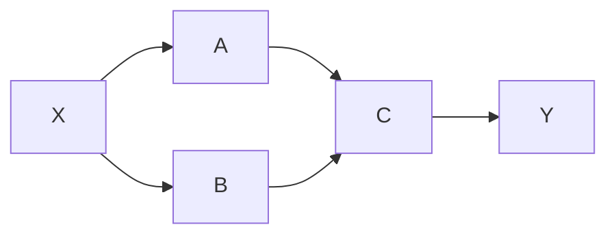
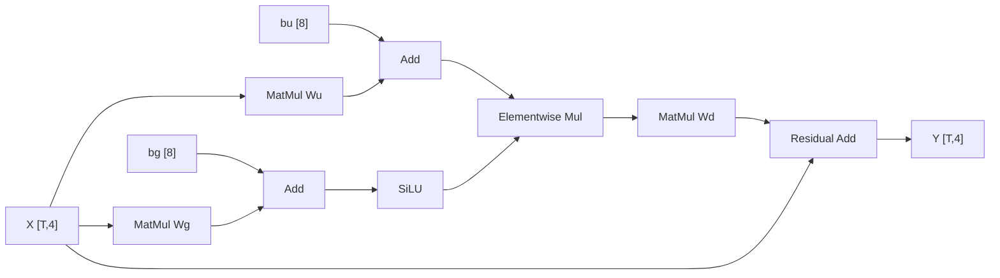
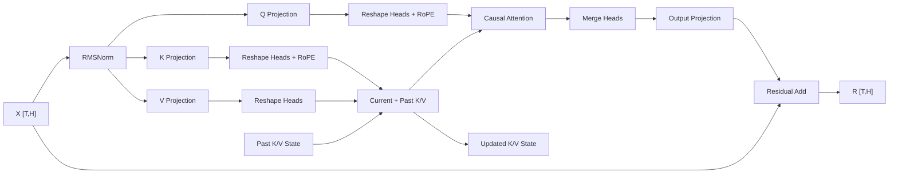
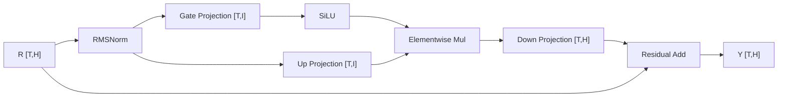

# 第二课：完整计算图与核心算子族

## 本课定位

第一课把推理抽象成“张量经过算子得到新张量”，并用一个 Linear 建立了 shape、依赖和成本直觉。这还不足以分析真实模型，因为真实请求包含分支、残差、状态、前后处理以及多个模型。

本课只回答两个问题：

1. 一个请求从输入到输出，必须经过哪些计算和数据依赖？
2. 图中的节点分别属于哪类算子，它们怎样改变张量？

本课不计算完整模型的 `FLOPs`、内存容量或 HBM 流量，也不判断某个 Kernel 快慢。这些内容从第三课开始。

## 本课目标

学完本课后，应该能够：

1. 区分请求链路、模型计算图和实际执行图；
2. 识别图输入、参数、常量、算子节点、中间值、状态和图输出；
3. 沿依赖关系传播 shape，找出分支、汇合、残差和结构关键路径；
4. 识别 Linear、Conv、Attention、Reduction、Elementwise、Layout 和索引类算子；
5. 解释为什么图节点不等于 GPU Kernel，图中的边也不等于一次内存复制；
6. 读懂一个现代 Decoder Block 和一个两阶段 OCR 请求的主干图。

---

## 1. 先区分三张不同的图

工程讨论中，“模型图”“推理链路”和“GPU Timeline”经常被混称为“计算图”。三者描述的对象不同。

### 1.1 请求链路

请求链路从客户端输入开始，到业务结果结束。它可能包含：

- 解析请求；
- Tokenizer、图像解码、Resize 和 Normalize；
- 一个或多个模型；
- CPU/GPU 数据传输；
- Sampling、CTC Decode、NMS 或轮廓提取；
- 结果拼装和网络返回。

例如，一个两阶段 OCR 请求可能是：

```text
图像字节
→ 解码与缩放
→ 文本检测模型
→ 检测框后处理
→ 裁剪 N 个文本区域
→ 文本识别模型
→ CTC/字符解码
→ 文本与坐标
```

这里的 `N` 由图片内容决定。一次请求可能没有文本，也可能产生几十个文本框。

### 1.2 模型计算图

模型计算图描述一个模型的数学函数：输入张量经过哪些算子，产生哪些中间值和输出张量。

以 ONNX 的基本语义为例：

- 节点调用一个算子；
- 节点输入引用图输入、参数、常量或其他节点的输出；
- 节点输出定义新的值；
- 节点按数据依赖构成有向无环图；
- 节点列表采用拓扑顺序，但拓扑顺序通常不唯一。

模型图一般不会自动包含 HTTP 解析、图像文件解码或业务结果拼装。它是否包含 Tokenizer、Sampling、NMS 等前后处理，取决于导出边界。

### 1.3 实际执行图

Runtime 会把模型图转换成真正执行的工作：Kernel、Memcpy、同步、CPU 调用和通信。

```text
请求链路：客户端输入 → 前处理 → 模型 → 后处理 → 业务输出
                           │
模型计算图：          张量 → 算子节点 → 张量
                           │
实际执行图：          Kernel / Memcpy / Sync / CPU Task
```

三张图之间不是一一对应：

- 多个模型节点可能融合成一个 Kernel；
- 一个复杂节点也可能拆成多个 Kernel；
- `Reshape` 可能只改元数据，也可能触发真实的数据重排；
- 图中的一条边只表示“消费者需要这个值”，不保证发生内存复制；
- 两个没有依赖的节点可以并行，不代表 Runtime 一定会让它们同时执行。

本课关注请求链路和模型计算图。第五课再展开模型图如何变成实际执行图。

---

## 2. 计算图中的七种角色

读图时，先给每个对象归类。不要一开始就盯着算子名称。

| 角色 | 含义 | 例子 |
| --- | --- | --- |
| 图输入 | 本次调用由外部提供的数据 | token IDs、图像张量、attention mask |
| 参数 | 模型长期持有、推理时读取的张量 | Linear 权重、Conv 卷积核、Norm scale |
| 常量 | 不随请求变化的小值或张量 | reshape 目标、固定 mask、轴编号 |
| 算子节点 | 对输入值执行一种数学变换 | MatMul、Add、Conv、Softmax、Gather |
| 中间值 | 一个节点产生、后续节点消费的值 | hidden state、Q/K/V、feature map |
| 状态 | 跨层、跨步骤或跨调用保留的值 | KV Cache、RNN hidden state |
| 图输出 | 模型边界向外返回的值 | logits、检测概率图、embedding |

### 2.1 参数也是节点输入

第一课写过：

$$
Y=XW+b
$$

从图的角度看，`X`、`W` 和 `b` 都是算子的输入，但来源不同：

- `X` 是请求输入或上一节点的输出；
- `W` 和 `b` 通常是参数；
- `Y` 是本节点产生的新值。

“输入张量”不等于“请求输入”。权重也是算子输入，只是不随请求变化。

### 2.2 边表示值依赖

若节点 B 使用节点 A 的输出，图中存在 `A → B`。这条边表达两个事实：

1. B 需要 A 产生的值；
2. B 必须在这个值可用后才能完成。

边本身没有规定数据放在哪里，也没有规定生产者和消费者之间必须复制一次内存。

### 2.3 状态最好显式画出来

把一个有状态过程改写成函数时，可以把旧状态作为输入、新状态作为输出：

```text
(本轮输入, 旧状态) → 模型 → (本轮输出, 新状态)
```

LLM Decode 的 KV Cache、RNN hidden state 都可以这样理解。某些 Runtime 在 API 中隐藏状态管理，但依赖仍然存在。

---

## 3. 数据依赖决定合法执行顺序

### 3.1 拓扑顺序不是唯一顺序

考虑下面的图：



`A` 和 `B` 都依赖 `X`，二者之间没有依赖。以下顺序都合法：

```text
A → B → C
B → A → C
A 与 B 并行 → C
```

`C` 必须等待 A、B 两个输入都可用。图给出了偏序关系，而不是唯一的串行程序。

### 3.2 可以并行不等于一定并行

没有依赖只表示语义上允许并行。实际是否重叠还取决于：

- Runtime 是否使用多个 stream 或并行调度；
- 两个任务是否争用同一批 GPU 资源；
- 工作量是否足以覆盖调度开销；
- 编译器是否已经把节点融合；
- 是否存在图上看不到的同步或资源约束。

因此，读模型图可以判断“不能并行的部分”，却不能仅凭模型图证明“实际已经并行”。

### 3.3 结构关键路径

从输入到输出，每条依赖链都是一条路径。必须顺序经过的节点构成结构关键路径候选。

如果图是：

```text
X → A → C → D → Y
 \→ B ────/
```

`D` 必须等 `C`，`C` 必须同时等 `A` 和 `B`。增加更多独立分支不会自动缩短 `X → C → D → Y` 这段串行依赖。

此时还不能判断真实耗时最长的路径，因为每个节点的执行时间尚未测量。第六课会用 Timeline 确认实际关键路径。

### 3.4 值的生命周期

一个中间值从“被定义”到“最后一次被使用”的区间称为它的逻辑生命周期。

```text
产生 U ───────── 最后一次读取 U
       U 必须保持有效
```

最后一个消费者完成后，Runtime 才有机会复用这块 buffer。残差连接会让早期输入保持更久，因为后面的 Add 仍需读取它。

逻辑生命周期不等于一定分配一块独立显存。Fusion、原地计算和内存规划可能改变实际 buffer，但不能破坏值依赖。

---

## 4. 用一个最小分支图练习读图

考虑一个简化的门控残差块：

$$
U=XW_u+b_u
$$

$$
G=XW_g+b_g
$$

$$
M=U\odot SiLU(G)
$$

$$
P=MW_d
$$

$$
Y=X+P
$$

令各张量 shape 为：

```text
X:   [T, 4]
Wu:  [4, 8]    bu: [8]
Wg:  [4, 8]    bg: [8]
Wd:  [8, 4]
```

图结构如下：



### 4.1 第一步：沿节点传播 shape

| 步骤 | 计算 | 输出 shape | 原因 |
| ---: | --- | --- | --- |
| 1 | `XW_u: [T,4] × [4,8]` | `[T,8]` | MatMul 消去共同维度 4 |
| 2 | `XW_u + b_u: [T,8] + [8]` | `U:[T,8]` | `b_u` 沿 `T` 维广播 |
| 3 | `XW_g: [T,4] × [4,8]` | `[T,8]` | 与步骤 1 同理 |
| 4 | `XW_g + b_g: [T,8] + [8]` | `G:[T,8]` | 与步骤 2 同理 |
| 5 | `SiLU(G)` | `[T,8]` | Elementwise 不改变 shape |
| 6 | `U ⊙ SiLU(G)` | `M:[T,8]` | 对应元素相乘 |
| 7 | `MW_d: [T,8] × [8,4]` | `P:[T,4]` | 投影回输入宽度 |
| 8 | `X + P: [T,4] + [T,4]` | `Y:[T,4]` | 残差两侧 shape 必须兼容 |

广播是数学语义：`b:[8]` 对每一行生效。它不意味着 Runtime 必须先物理复制出一个 `[T,8]` 的 bias 张量。

### 4.2 第二步：找分支与汇合

`U` 分支和 `G→SiLU` 分支都只依赖 `X` 及各自参数，语义上可以独立计算。`Mul` 是汇合点，必须等待两条分支。

残差 `Add` 是第二个汇合点：它既需要 `P`，也需要最早的输入 `X`。

### 4.3 第三步：找必须保持的值

- `X` 从图输入一直活到最后的 Residual Add；
- `U` 必须保持到 `SiLU(G)` 也可用；
- 两个门控分支的原始临时值在各自最后一次使用后可以释放或复用；
- `P` 只需保持到最后的 Add。

这一步只判断逻辑生命周期。第三课再计算这些值占多少容量。

### 4.4 第四步：区分逻辑节点和物理执行

模型图可能画出 `MatMul → Add → SiLU` 三个节点。Runtime 可能把它们融合，也可能选择多个 Kernel。两个投影也可能合并为一个更宽的 MatMul 后再 Split。

无论怎样实现，以下语义不能改变：

- 两条分支都读取 `X`；
- `Mul` 需要两条分支的结果；
- 最终 Add 需要保留输入 `X`；
- 输出 shape 是 `[T,4]`。

这就是模型语义与实现细节的分界。

### 4.5 静态维度、符号维度与数据相关维度

读 shape 时，还要区分“现在是否知道具体数值”：

| 类型 | 例子 | 含义 |
| --- | --- | --- |
| 静态维度 | `[32,4096]` | 构图时已经知道具体数值 |
| 符号维度 | `[T,4096]` | 知道同名维度之间的关系，具体值运行时确定 |
| 匿名未知维度 | `[?,4096]` | 只知道这里存在一维，关系尚未表达 |
| 数据相关维度 | `boxes:[N,4]` | `N` 由输入内容和算子结果决定 |

符号 `T` 不是任意文字。同一张图中多次出现 `T`，表示这些位置应取相同运行时值。Shape inference 可以沿许多标准算子传播这种关系，但遇到动态 Reshape、数据相关输出或复杂维度运算时，推导可能不完整。

本课只要求识别这些维度。动态 shape 如何影响优化和执行计划留到第五课。

---

## 5. 七类核心算子

真实模型包含成百上千个节点，但大部分节点可以归入少数算子族。先认出算子族，再分析具体算子。

### 5.1 Linear：GEMM 与 GEMV

典型 shape：

```text
X: [M, K]
W: [K, N]
Y: [M, N]
```

它让每个输出元素混合输入的整个 `K` 维。Transformer 的 Q/K/V Projection、MLP 和 LM Head 都大量使用 Linear。

在高层图中，它可能表示为 `MatMul + Add`，也可能是 `Gemm` 或框架自己的 Linear 节点。`M` 较大时常被称作矩阵—矩阵乘法；`M=1` 时接近矩阵—向量乘法。二者数学关系相同，实际 Kernel 行为以后再讲。

### 5.2 Convolution

常见 NCHW 输入：

```text
X: [B, Cin, H, W]
W: [Cout, Cin/groups, Kh, Kw]
Y: [B, Cout, Hout, Wout]
```

Conv 在空间局部窗口内混合通道和邻域信息。OCR 检测、识别 Backbone 和大多数 CV 模型都大量使用 Conv。

`Hout`、`Wout` 由 kernel size、stride、padding 和 dilation 决定。读图时必须把这些属性与输入 shape 一起看，不能只看节点名称。

### 5.3 Attention

以多头 Attention 的逻辑 shape 为例：

```text
Q: [B, N, Sq, D]
K: [B, N, Sk, D]
V: [B, N, Sk, D]
```

概念上的计算是：

$$
S=\frac{QK^T}{\sqrt{D}}
$$

$$
P=Softmax(S+Mask)
$$

$$
O=PV
$$

对应 shape 为：

```text
S: [B, N, Sq, Sk]
P: [B, N, Sq, Sk]
O: [B, N, Sq, D]
```

`S` 和 `P` 是理解依赖与 shape 的逻辑中间值。Fused Attention 可以避免把完整中间矩阵写入 HBM，因此“逻辑上存在”不等于“物理上完整物化”。

### 5.4 Reduction

Reduction 沿一个或多个维度把多个元素汇总成更少的元素：

```text
ReduceSum([B,T,H], axis=H) → [B,T]
ReduceMax([B,T,H], axis=T) → [B,H]
ArgMax([B,T,V], axis=V)    → [B,T]
```

Softmax、LayerNorm 和 RMSNorm 不是单一的加法，但都包含 Reduction 依赖：某个元素的最终结果需要同一归约组中的统计量。

Reduction 会形成汇合点。归约组内的结果没有完成前，后续依赖统计量的计算不能得到最终值。

### 5.5 Elementwise

Elementwise 对每个元素独立执行相同规则：

- Add、Mul、Div；
- ReLU、SiLU、Sigmoid；
- Mask、Scale、Clamp；
- 残差相加。

若输入 shape 相同或可广播，输出通常保持广播后的 shape。Elementwise 节点常出现在复杂算子之间，也常成为 Fusion 的候选。

### 5.6 Shape 与 Layout 变换

这类节点改变 shape、轴顺序、分段方式或边界：

- Reshape、Flatten、Squeeze、Unsqueeze；
- Transpose、Permute；
- Concat、Split；
- Slice、Pad。

读图时要进一步区分：

| 类型 | 代表节点 | 逻辑变化 |
| --- | --- | --- |
| 元数据变换 | Reshape、Squeeze、Unsqueeze | 元素顺序不变，shape 或 rank 改变 |
| 轴变换 | Transpose、Permute | 维度次序改变 |
| 组合与切分 | Concat、Split、Slice | 多个值合并，或一个值被分段选择 |
| 边界扩展 | Pad | 新增边界元素 |

元数据变换有机会只改 shape/stride；轴变换和组合切分是否物化新 buffer，则取决于 Runtime 表示和下游 layout 要求。

所以，“没有 FLOPs”不等于“运行时没有成本”；但本课只记录它改变了什么 shape 和 layout。

### 5.7 Gather、Scatter 与数据相关选择

这类节点通过索引选择或写入元素：

- `Gather`：按索引读取，例如 token ID 查 Embedding；
- `Scatter`：按索引把值写回目标位置；
- `TopK`：产生值和索引；
- `NonZero`：输出满足条件的位置；
- Routing：根据数据把 token 送往不同分支。

它们与普通 Elementwise 的重要区别是：访问位置或输出规模可能由数据决定。OCR 检测框数量、MoE 路由和 Sampling 候选都带有这种特征。

### 5.8 前后处理也是计算

Tokenizer、JPEG Decode、Resize、NMS、轮廓提取、CTC Decode 和 Sampling 可能不在模型图中，但仍在请求关键路径上。

判断一个节点是否属于“模型”，取决于导出和部署边界；判断它是否影响端到端推理，则只取决于请求是否必须等待它。

---

## 6. 案例一：逐步拆解一个现代 Decoder Block

下面用一个常见的 Pre-Norm Decoder-only Block 建立图结构。它接近 Llama 类模型，但不同模型会替换 Norm、Attention、激活或位置编码。本课关心共同依赖，不把该结构当作所有 LLM 的唯一形式。

令：

```text
X: [T, H]
T: 本轮参与计算的有效 token 数
H: hidden dimension
N: attention head 数
D: 单个 head 的维度，H = N × D
I: MLP intermediate dimension
```

### 6.1 Attention 子层



逐步看依赖：

1. `RMSNorm(X)` 输出仍为 `[T,H]`；
2. Q、K、V Projection 读取同一份 Norm 输出，形成三个分支；
3. Q/K/V 被解释成 head 维度；MHA 情况下通常为 `[T,N,D]`；
4. RoPE 改变 Q、K 的值，不改变 shape；
5. 当前 K/V 与过去 K/V 组成可供本轮读取的状态，并产生更新后的 K/V 状态；
6. Attention 同时依赖 Q、完整 K/V 和 causal 约束；
7. 各 head 输出合并回 `[T,H]`；
8. Output Projection 保持 `[T,H]`；
9. Residual Add 还要读取最初的 `X`，得到 `R:[T,H]`。

若模型使用 GQA，Q head 数和 KV head 数不同，但依赖结构不变：Q、K、V 仍在 Attention 汇合，输出仍回到 hidden width。

### 6.2 MLP 子层



这与第 4 节的最小图相同：两条投影分支在 Elementwise Mul 汇合，再投影回 `H`，最后与 `R` 做残差相加。

### 6.3 一个 Block 中能得出的结论

仅凭模型图，可以确定：

- Q/K/V 分支共享同一输入；
- Attention 必须等待 Q、K、V 和历史状态；
- Output Projection 之后才能完成第一个残差；
- MLP 必须等待 Attention 子层的残差结果；
- 两次残差让 `X` 和 `R` 分别保持到较晚位置；
- Block 输出与输入保持 `[T,H]`，因此多个 Block 可以首尾堆叠。

仅凭模型图，不能确定：

- Q/K/V 是否实际并行或合并为一个 Kernel；
- Attention 是否物化完整 score matrix；
- 哪个节点最慢；
- 该 Block 受算力还是带宽限制。

### 6.4 跨生成步骤的状态边

单个 Block 只是一次 forward 的一部分。普通 Decode 还存在跨步骤依赖：

```text
第 t 步旧 KV + 当前 token
→ 所有 Decoder Blocks
→ logits
→ sampling 得到 token(t+1)
→ 第 t+1 步输入
```

第 `t+1` 步依赖第 `t` 步采样结果，因此未来 token 不能直接作为已知输入。KV Cache 则把过去每层的 K/V 从旧状态传到新状态。

若把多个生成步骤展开，它们仍可画成无环依赖图；若保留循环形式，Runtime 或 IR 会用 Loop、控制流或外部调度反复调用单步图。

---

## 7. 案例二：逐步拆解一个两阶段 OCR 请求

OCR 能清楚展示“请求链路大于模型图”。下面使用代表性的检测加识别流程；实际服务可能使用其他检测器、Transformer 识别器或端到端模型。

### 7.1 完整请求链路

```mermaid
flowchart LR
    BYTES["图像字节"] --> DECODE["Decode / Resize / Normalize"]
    DECODE --> DET["文本检测模型"]
    DET --> MAP["概率图 / 几何输出"]
    MAP --> BOX["Threshold / Contour / Box"]
    BOX --> CROP["Crop / Perspective Transform"]
    CROP --> BATCH["N 个文本区域组成识别 Batch"]
    BATCH --> REC["文本识别模型"]
    REC --> LOGITS["逐位置字符 Logits"]
    LOGITS --> CTC["ArgMax / CTC Decode"]
    CTC --> RESULT["文本 + 坐标"]
```



DB 类检测器用卷积 Backbone 和多尺度特征产生概率图，再通过二值化与 box formulation 得到文本区域。CRNN 类识别器把图像特征转换成序列特征，再产生逐位置标签分布并转录成字符串。

### 7.2 前处理

原始数据通常是压缩图像字节和原始尺寸：

```text
JPEG/PNG bytes
→ decoded image [H0, W0, 3]
→ resized image [H, W, 3]
→ normalized tensor [1, 3, H, W]
```

这里可能包含 CPU 解码、颜色通道变换、HWC→NCHW Transpose 和主机到设备传输。只有最后的 `[1,3,H,W]` 才是常见检测模型输入。

### 7.3 文本检测模型

代表性的分割式检测图可以简化为：

```text
[1,3,H,W]
→ Conv Backbone
→ 多尺度 Feature Maps
→ Upsample + Concat/Add
→ Prediction Head
→ probability map [1,1,H',W']
```

这里出现：

- Conv：提取局部与多通道特征；
- Upsample：改变空间分辨率；
- Concat/Add：合并多尺度分支；
- Sigmoid：把输出映射为概率；
- 多个分支的汇合。

模型输出概率图，不一定直接输出最终文本框。

### 7.4 数据相关后处理

后处理从概率图中生成文本区域：

```text
probability map
→ threshold/binarize
→ connected components or contours
→ polygon/box fitting
→ filtering
→ N boxes
```

`N` 取决于图像内容。这个数据相关的 fan-out 带来两个后续变化：

1. 裁剪次数动态变化；
2. 识别模型的 batch 大小动态变化。

因此，把检测与识别强行看成一个固定 shape 的模型图，会漏掉请求中最重要的动态边界之一。

### 7.5 裁剪与识别 Batch

每个检测框经过裁剪、旋转或透视变换，形成文本行图像：

```text
box i → crop i → [3, Hr, Wri]
```

不同文本行宽度可能不同。服务可以按宽度分桶、padding，或使用动态 shape，再组成：

```text
recognition input: [N, 3, Hr, Wr]
```

这里的 `N` 来自检测结果，`Wr` 来自裁剪后的宽度处理策略。

### 7.6 文本识别模型

以 CRNN 类结构为例：

```text
[N,3,Hr,Wr]
→ Conv feature map [N,C,Hf,Wf]
→ Map-to-Sequence / Reshape / Transpose
→ sequence [N,L,D]
→ sequence model
→ logits [N,L,V]
```

其中：

- `L` 是序列位置数，通常与特征图宽度相关；
- `D` 是每个位置的特征维度；
- `V` 是字符表大小加 blank 等特殊标签。

旧式 CRNN 使用双向 RNN 建模序列；现代实现也可能使用 Transformer、卷积或其他序列模块。无论具体模块是什么，图都包含“二维图像特征 → 一维序列 → 逐位置分类”的 shape 变化。

### 7.7 转录与结果拼装

识别模型输出 `[N,L,V]` 的 logits 或概率。常见贪心 CTC Decode 会：

1. 沿 `V` 维做 ArgMax，得到 `[N,L]` 的 label IDs；
2. 合并相邻重复标签；
3. 删除 blank；
4. 把 ID 映射成字符；
5. 将字符串与原检测框重新对应。

这些步骤可能运行在 CPU，也可能部分进入模型图。它们仍然属于请求依赖：结果拼装必须等待识别和解码完成。

### 7.8 OCR 案例教会了什么

从这条链路可以直接看出：

- 一个请求可能调用两个模型；
- 两个模型之间存在数据相关的动态 batch；
- 模型前后有大量非神经网络节点；
- NCHW feature map 会转换成 NLD sequence；
- 最终业务输出不是模型 logits，而是经过解码和坐标映射的结构化结果。

因此，分析“推理链路”时必须先声明边界：是在看单个 TensorRT engine，还是在看 OCR 请求从图像字节到文本结果的全过程。

---

## 8. 读真实计算图的固定步骤

拿到 ONNX、FX Graph、TensorRT network 或框架日志后，按下面顺序读。

### 步骤 1：声明边界

先写清楚：

```text
输入是什么？
输出是什么？
前后处理是否包含在图中？
一次调用对应一个请求、一个模型，还是一个生成 iteration？
```

边界不同，同名的“模型延迟”会表示完全不同的时间范围。

### 步骤 2：列出输入、参数、状态和输出

建议先填一张表：

| 名称 | 角色 | Shape | Dtype | 来源/去向 |
| --- | --- | --- | --- | --- |
| `input_ids` | 图输入 | `[B,S]` | INT32 | Tokenizer |
| `Wq` | 参数 | `[H,H]` | FP16 | Q Projection |
| `past_k` | 旧状态 | `[B,N,L,D]` | FP16 | 上一 Decode step |
| `logits` | 图输出 | `[B,V]`（最后一个位置） | FP16/FP32 | Sampling |

这一阶段先追求语义正确，不急着算容量。

### 步骤 3：从输出反向追依赖

从最终输出往回问：

```text
谁直接产生它？
这个节点需要哪些输入？
这些输入又由谁产生？
```

反向追踪可以快速去掉与目标输出无关的辅助分支。然后再从输入正向检查 shape。

### 步骤 4：传播 shape

对每个主要节点记录：

```text
输入 shape → 算子属性 → 输出 shape
```

遇到广播、Transpose、Reshape、Concat、Split 和动态维度时停下来核对。这些节点最容易让后续维度含义发生变化。

### 步骤 5：按算子族分组

不要记录几百个孤立名称。把节点归入：

```text
Linear / Conv / Attention / Reduction
Elementwise / Layout / Indexing / Pre-Post Processing
```

这样才能看出模型主干由什么组成。

### 步骤 6：标出分支、汇合、残差和状态

重点标记：

- 一份输入被几个分支读取；
- 哪个节点等待多条分支；
- 哪个早期值因残差而长期存活；
- 哪些输入来自上一层、上一生成步或另一模型；
- 哪些输出规模由数据决定。

### 步骤 7：保持逻辑图与执行图分离

在证据不足时，使用准确表述：

- “图上允许并行”，而不是“GPU 会并行”；
- “逻辑上存在 score matrix”，而不是“HBM 中一定写了完整矩阵”；
- “该节点是 Transpose”，而不是“这里一定发生一次完整复制”；
- “这几个节点可能被融合”，而不是“它们就是一个 Kernel”。

---

## 9. 常见误判

### 误判 1：一个模型节点对应一个 GPU Kernel

错误。Runtime 可以融合多个节点，也可以把一个节点拆成多个 Kernel。模型图描述语义，Kernel 描述实现。

### 误判 2：图中每条边都会复制一次张量

错误。边表示值依赖。生产者和消费者可以引用同一块 buffer，也可能因为 device、layout 或生命周期需要而发生复制；必须查看执行证据。

### 误判 3：没有依赖的分支一定同时执行

错误。它们只是在语义上允许并行。资源竞争、stream、调度和 Fusion 决定实际执行方式。

### 误判 4：Reshape 和 Transpose 都只是免费改 shape

错误。Reshape 有时只改元数据；Transpose 改变轴顺序，后续若要求连续布局，可能需要真实重排。只能先记录逻辑变化，再查看 Runtime 行为。

### 误判 5：参数才占显存，中间值不重要

错误。参数长期存在，中间值和状态则按生命周期存在。某些大 feature map、Attention 中间值、KV 或 workspace 可能成为容量重点。第三课会定量计算。

### 误判 6：模型输出就是业务输出

错误。OCR 模型输出概率图或 logits，LLM 模型输出 logits；文本框、字符串和 token 都需要后处理产生。

### 误判 7：看到算子名称就能判断瓶颈

错误。相同 MatMul 在不同 shape 下可能表现不同；相同 Attention 语义也可能使用不同实现。第二课只识别依赖，第三至第六课再建立并验证性能判断。

---

## 10. 理解检查

### 问题 1

在第 4 节的门控残差图中，哪两条分支在语义上可以并行？哪个节点必须等待它们？

**答案：** `X→Wu→Add` 与 `X→Wg→Add→SiLU` 两条分支之间没有数据依赖，语义上可以并行。Elementwise Mul 同时需要两条分支输出，因此必须等待二者。

### 问题 2

为什么输入 `X` 的生命周期比 `U` 或 `G` 更长？

**答案：** 最后的 Residual Add 仍需读取 `X`。`G` 在 SiLU 后不再使用，`U` 在 Elementwise Mul 后不再使用；它们的生命周期都比 `X` 短。

### 问题 3

Attention 公式中存在 `[B,N,Sq,Sk]` 的 score matrix，为什么不能据此断言 HBM 中一定保存了完整矩阵？

**答案：** 这个矩阵是逻辑中间值。Fused 或 tiled Attention 可以分块计算 Softmax 和输出，不把完整矩阵写回 HBM。需要查看实际实现或 profiler 证据。

### 问题 4

两个节点都只依赖同一个输入，能否直接说它们会在 GPU 上并行？

**答案：** 不能。只能说图上允许并行。实际是否重叠取决于 Runtime、stream、资源占用、Fusion 和调度。

### 问题 5

OCR 检测输出 17 个文本框。识别模型一次处理全部裁剪区域时，它的 batch 维大约是多少？这个维度为什么属于动态维度？

**答案：** batch 维约为 `N=17`。`N` 由当前图片的检测结果决定，不同请求会得到不同数量的文本框。

### 问题 6

为什么 Decoder Block 中 Q/K/V 可以在一次 forward 内形成并行分支，而同一请求未来的两个生成步骤不能按普通方式并行？

**答案：** Q/K/V 都读取当前已知 hidden state；未来一步的输入 token 则依赖当前步 logits 的采样结果。在采样完成前，下一步输入尚未确定。

### 问题 7

以下两个对象中，哪个通常是模型图节点，哪个常位于模型图之外？

```text
A. Linear Projection
B. JPEG Decode
```

**答案：** Linear Projection 通常是模型图节点。JPEG Decode 常位于请求前处理，但也可能由支持该操作的端到端图或专用流水线包含。准确答案取决于导出边界。

---

## 11. 本课结论

本课最重要的是建立一套稳定的读图顺序：

1. 先声明请求边界，区分请求链路、模型图和执行图；
2. 再区分图输入、参数、常量、中间值、状态和输出；
3. 数据依赖给出合法执行偏序，没有依赖只代表允许并行；
4. 沿图传播 shape，重点检查分支、汇合、残差、Layout 变化和动态维度；
5. 大量节点可以归入少数算子族；
6. 图节点不等于 Kernel，图中的边也不等于内存复制；
7. Decoder Block 展示层内分支、残差和跨生成步状态；
8. OCR 展示多模型、前后处理和数据相关动态 batch。

现在我们已经知道一个完整链路“必须算什么”。下一课才能严谨地问：这些节点分别需要多少计算、搬运和状态容量。

## 参考资料

- [ONNX Intermediate Representation](https://onnx.ai/onnx/repo-docs/IR.html)
- [ONNX Shape Inference](https://onnx.ai/onnx/repo-docs/ShapeInference.html)
- [ONNX Operators](https://onnx.ai/onnx/operators/)
- [TensorRT: How TensorRT Works](https://docs.nvidia.com/deeplearning/tensorrt/latest/architecture/how-trt-works.html)
- [TensorRT Layer Fusion](https://docs.nvidia.com/deeplearning/tensorrt/latest/performance/fusion-catalog.html)
- [Attention Is All You Need](https://arxiv.org/abs/1706.03762)
- [Llama 2](https://arxiv.org/abs/2307.09288)
- [Real-time Scene Text Detection with Differentiable Binarization](https://arxiv.org/abs/1911.08947)
- [CRNN: An End-to-End Trainable Neural Network for Image-based Sequence Recognition](https://arxiv.org/abs/1507.05717)
