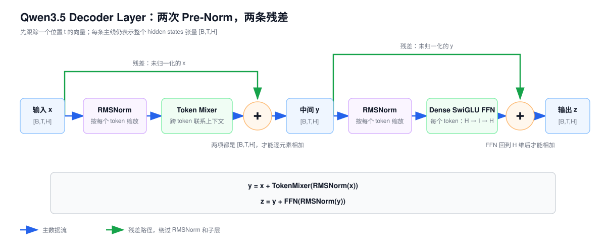
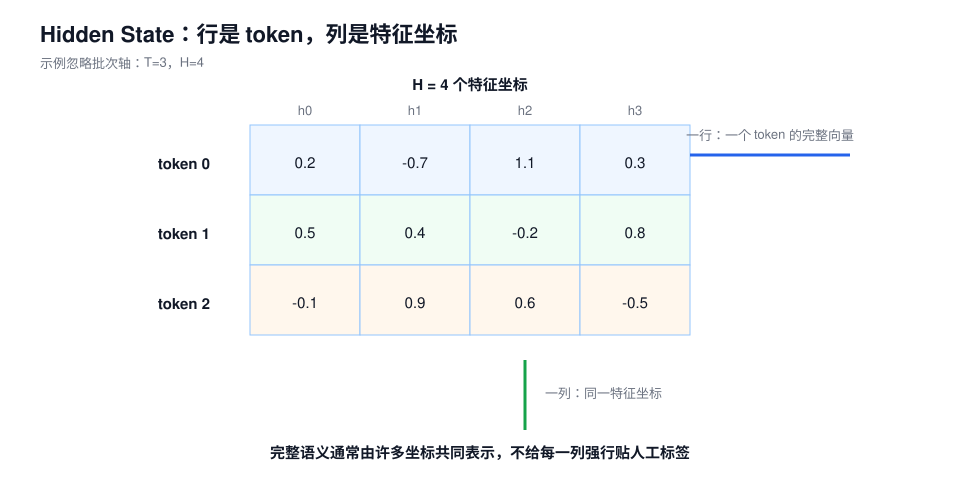
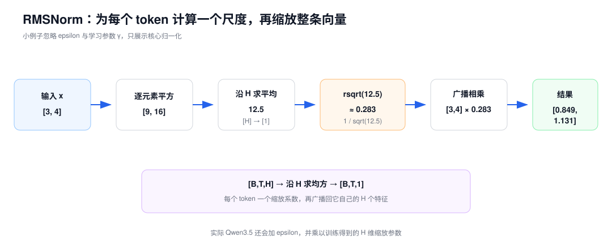
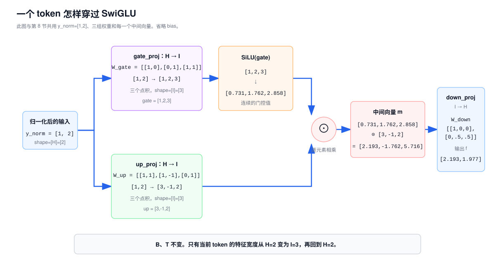
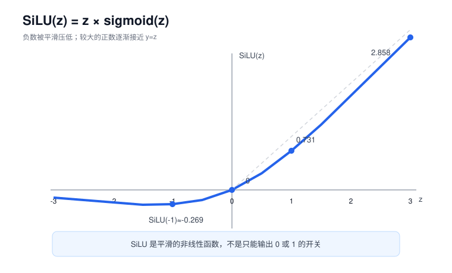

# 第 2 课：一个 Decoder Layer 里发生了什么

第 1 课把 Decoder 暂时画成了一个黑盒：

```text
Embedding 输出
→ 多层 Decoder
→ Hidden States
```

这一课只看其中一层。它接收一组 token 向量，输出同样 shape 的一组向量。中间做两件事：先让 token 之间交换信息，再分别加工每个 token。两次计算的结果都通过残差连接加回原输入。

负责 token 间信息交换的模块有 Attention 和 Gated DeltaNet。它们的内部计算留到后面，本课先把两者统称为 Token Mixer。

如果遇到中英文名称或 shape 符号不确定，可以查看[课程术语与符号表](../glossary.md)。

## 1. Decoder Layer 在完整模型中的位置

Qwen3.5-9B 的文本模型有 32 个 Decoder Layer。每层接收和输出相同宽度的隐藏状态（Hidden States）：

```text
Embedding 输出 [B,T,H]
→ Layer 1 [B,T,H]
→ Layer 2 [B,T,H]
→ ...
→ Layer 32 [B,T,H]
→ 最终 RMSNorm
→ LM Head
```

Qwen3.5-9B 的 `H=4096`。这表示每个 token 位置始终用 4096 个数表示。层与层之间 shape 可以保持不变，但数值会持续更新。

一个 Decoder Layer 的公共骨架是：



先只跟踪图中高亮的一个位置 `t`。它的向量先叫 `x[b,t,:]`。Token Mixer 给出更新量，和未归一化的 `x[b,t,:]` 相加后得到 `y[b,t,:]`。FFN 再给出另一份更新量，和未归一化的 `y[b,t,:]` 相加后得到 `z[b,t,:]`。图中的每条主线仍代表整个张量 `[B,T,H]`，只是先把注意力放在其中一行。

$$
y=x+\mathrm{TokenMixer}(\mathrm{RMSNorm}(x))
$$

$$
z=y+\mathrm{FFN}(\mathrm{RMSNorm}(y))
$$

暂时放下模块名，这个结构可以拆成两次相同的动作：

```text
保存原输入 → 归一化 → 做一次变换 → 加回原输入
```

第一次变换是 Token Mixer，第二次变换是 FFN。

## 2. Hidden State 的行和列

设一个极小例子只有 3 个 token，每个 token 用 4 个数表示：

$$
X=
\begin{bmatrix}
0.2&-0.7&1.1&0.3\\
0.5&0.4&-0.2&0.8\\
-0.1&0.9&0.6&-0.5
\end{bmatrix}
$$

忽略批次轴后，`X.shape=[T,H]=[3,4]`。

| 方向 | 这里表示什么 |
| --- | --- |
| 每一行 | 一个 token 位置的完整向量 |
| 每一列 | 所有 token 在同一个特征坐标上的数值 |

“特征坐标”不是一个应该直接背下来的词。可以这样理解：模型为每个 token 学习了一个 `H` 维表示空间，需要 `H` 个数才能描述这个 token 当前处在这个空间的什么位置。矩阵中的列就是这些坐标。

这些坐标通常没有稳定的人工名称。不能看到第 17 列就断言它只表示“名词”，也不能把一列等同于一个人类可解释概念。模型使用很多坐标的组合表示语义、语法、位置和上下文关系。

第 1 课中的 Embedding 是最初的表示。经过每个 Decoder Layer 后，同一位置的向量不断变化，于是成为越来越深的 Hidden State。



## 3. Token Mixer 联系上下文，FFN 加工每个 token

理解 Decoder Layer，关键是分清两种不同的信息处理方式。

### 3.1 Token Mixer：不同 token 之间交换信息

假设句子是：

```text
小猫 / 跳上 / 桌子
```

“跳上”位置不能只靠自己的初始向量理解动作主体和目标。Token Mixer 让它读取其他位置的信息。

Qwen3.5 的 Token Mixer 有两种实现：

- Gated DeltaNet；
- Full Attention。

两者的算法和状态不同，但在本层骨架中占据同一个位置：输入 `[B,T,H]`，输出仍是 `[B,T,H]`。

### 3.2 FFN：加工单个 token 内部的特征

Token Mixer 交换位置间的信息后，每个 token 已经拿到一些上下文。前馈网络（Feed-Forward Network，FFN）再对每个 token 的 `H` 个特征进行同一种非线性变换。

```text
token 1 的 H 维向量 ─→ 同一套 FFN ─→ 更新后的 H 维向量
token 2 的 H 维向量 ─→ 同一套 FFN ─→ 更新后的 H 维向量
token 3 的 H 维向量 ─→ 同一套 FFN ─→ 更新后的 H 维向量
```

FFN 不在 token 1 和 token 2 之间直接做运算。不同 token 使用同一套 FFN 权重，各自独立计算，因此可以并行处理。

两者的分工可以概括为：

```text
Token Mixer 混合不同 token 的信息；
FFN 混合一个 token 内部的特征。
```

## 4. RMSNorm 调整每个 token 的数值尺度

### 4.1 数值尺度为什么需要调整

同一层可能收到数值尺度差异很大的向量：

```text
[3, 4]
[30, 40]
```

两条向量的方向相同，第二条只是整体放大了 10 倍。如果直接把不同尺度的输入送进后续变换，后续计算的数值范围也会跟着大幅变化。

均方根归一化（Root Mean Square Normalization，RMSNorm）先根据一个 token 自己的全部 `H` 个数计算整体尺度，再把整条向量按这个尺度缩放。它主要消除“整条向量被同时放大或缩小”的影响。

### 4.2 手算 `[3,4]`

RMS 是“平方 → 平均 → 开平方”：


`[3,4]` 的平方是 `[9,16]`，均方根约为 `3.536`。两个元素分别除以它，得到 `[0.849,1.131]`。下图把这几步连在了一起：



这里容易与“把向量长度归一到 1”混淆。`[3,4]` 除以欧几里得长度 `5` 才会得到 `[0.6,0.8]`；RMSNorm 除的是均方根 `sqrt(12.5)`，所以结果是 `[0.849,1.131]`。

RMSNorm 后的元素不要求位于 `[-1,1]`。它约束的是整条向量的均方根，而不是每个元素的最大值。

### 4.3 为什么 `[30,40]` 得到相同结果

```text
平方：      [900, 1600]
平均：      1250
开平方：    sqrt(1250) ≈ 35.355
相除：      [30/35.355, 40/35.355]
结果：      [0.849, 1.131]
```

输入整体乘 10，RMS 也乘 10，因此归一化结果基本不变。这叫对整体缩放不敏感。实际计算还会加入一个很小的 `epsilon`，所以严格数值可能有极小差异。

### 4.4 公式中的 `epsilon` 和代码里的 `rsqrt`

RMSNorm 的核心计算可以写成：

$$
\mathrm{RMSNorm}(x)
=\frac{x}{\sqrt{\mathrm{mean}(x^2)+\epsilon}}\odot \gamma
$$

| 符号 | 含义 |
| --- | --- |
| `x` | 一个 token 的 `H` 维输入向量 |
| `mean(x²)` | `H` 个元素平方后的平均值 |
| `epsilon` | 防止分母为 0、降低极小数值带来的不稳定 |
| `γ` | 训练得到的 `H` 维缩放参数 |
| `⊙` | 逐元素乘法 |

如果输入全为 0，均方值也是 0。没有 `epsilon` 时会出现除以 0。Qwen3.5-9B 的 `rms_norm_eps=1e-6`。

代码常把“除以平方根”改写成“乘以平方根的倒数”。这里直接代入 RMSNorm 使用的均方值和 `epsilon`：

$$
\frac{x}{\sqrt{\mathrm{mean}(x^2)+\epsilon}}
=x\times\frac{1}{\sqrt{\mathrm{mean}(x^2)+\epsilon}}
$$

对任意正数 `a`，`rsqrt(a)` 表示 reciprocal square root，也就是：

$$
\mathrm{rsqrt}(a)=\frac{1}{\sqrt{a}}
$$

在 RMSNorm 代码中，传给 `rsqrt` 的 `a` 就是 `mean(x²) + epsilon`，并没有多出一个新的模型变量。

所以 Qwen3.5 实现中的：

```python
x * torch.rsqrt(x.pow(2).mean(-1, keepdim=True) + eps)
```

与上面的 RMSNorm 公式是同一件事，不是突然出现的新算法。

### 4.5 对 `[B,T,H]` 到底沿哪个轴计算

RMSNorm 对每条序列的每个 token 独立计算，沿最后一个 `H` 轴求平均：

| 步骤 | shape |
| --- | --- |
| 输入 `X` | `[B,T,H]` |
| `X²` | `[B,T,H]` |
| `mean(X², axis=-1, keepdim=true)` | `[B,T,1]` |
| 加 `epsilon` | `[B,T,1]` |
| `rsqrt(...)` | `[B,T,1]` |
| 与 `X` 广播相乘 | `[B,T,H]` |
| 与 `γ:[H]` 广播相乘 | `[B,T,H]` |

被归约的 `H` 轴没有真的不见，而是因为 `keepdim=true` 变成长度 1：

```text
[B,T,H] → [B,T,1]
```

这个 `[B,T,1]` 张量为每个 token 保存一个缩放系数。广播再把每个系数应用到对应 token 的全部 `H` 个元素。

### 4.6 RMSNorm 与 LayerNorm 的区别

这里比较两者，是为了说明 Qwen3.5 中 RMSNorm 的计算特点，不是要证明 RMSNorm 在所有模型中都优于 LayerNorm。

| 操作 | RMSNorm | LayerNorm |
| --- | --- | --- |
| 减去均值，使结果重新居中 | 否 | 是 |
| 根据尺度归一化 | 使用均方根 | 使用标准差 |
| 学习缩放参数 | 有 | 有 |
| 学习平移参数 | 通常没有 | 通常有 |

RMSNorm 论文的实验表明，在论文的研究设置中，去掉重新居中仍能取得相当的效果，同时减少一部分计算。Qwen3.5 采用 RMSNorm，因此需要了解它的计算，但不能据此给所有模型下统一结论。

## 5. 残差连接保留旧表示，再叠加本次更新

残差连接（Residual Connection）做的计算非常简单：

$$
y=x+F(x)
$$

但它表达了重要的结构：`F(x)` 不必从头重建完整输出，只需要产生“这一子层希望补充或修改的部分”。

```text
旧表示 x ───────────────────────┐
                               ├─ 逐元素相加 → 新表示 y
x → RMSNorm → 子层变换 F(x) ───┘
```

如果 `F(x)=0`：

```text
y = x + 0 = x
```

这样，原来的表示可以直接越过子层；子层只需学习要补充或修正的部分。训练时，这条恒等路径也有助于信息和梯度跨越很多层传播。把残差连接说成“防止特征趋近于 0”会漏掉它最重要的作用：保留输入，让子层学习增量。

逐元素相加要求两侧 shape 兼容。Decoder Layer 的主残差路径两侧通常都是 `[B,T,H]`，这也是 FFN 最后必须回到 `H` 维的直接原因。

Qwen3.5 使用预归一化（Pre-Norm）结构：

```text
y = x + Sublayer(RMSNorm(x))
```

也就是先保存 `x`，把归一化后的输入交给子层，最后把子层输出加回 `x`。

## 6. FFN 的完整计算

完成 Token Mixer 子层及第一次残差相加后，得到 `y:[B,T,H]`。FFN 子层从这里开始。第二条残差路径保存的是这个未经归一化的 `y`：

```text
 y [B,T,H]
├──────────────────────────────────────────────┐  残差分支：保存 y
│                                              │
└→ RMSNorm → y_norm [B,T,H]                    │
      ├→ gate_proj → SiLU ─┐                   │
      └→ up_proj ──────────┴→ 逐元素相乘       │
                              → down_proj       │
                              → f [B,T,H]       │
                                               ↓
                                      z = y + f
```

残差分支在 FFN 之前保存 `y`，但残差相加发生在 FFN 计算完成之后。对整个 `[B,T,H]` 张量，计算可以写成下面的伪代码；这些操作会独立应用到其中的每个 token：

```text
y_norm = RMSNorm(y)            # [B,T,H]
g      = gate_proj(y_norm)     # [B,T,I]
u      = up_proj(y_norm)       # [B,T,I]
m      = SiLU(g) * u           # [B,T,I]，逐元素相乘
f      = down_proj(m)          # [B,T,H]
z      = y + f                 # [B,T,H]，残差相加
```

其中 `gate_proj` 和 `up_proj` 并行读取同一个归一化结果。两条分支合并后，`down_proj` 产生 FFN 对当前表示的更新量 `f`，最后才与原来的 `y` 相加。

FFN 不直接混合不同 token。上面的计算会独立应用到每个 `y[b,t,:]`，所有位置共享同一套 FFN 权重。

### 6.1 H 和 I 分别是什么

Qwen3.5-9B 中：

```text
Hidden Size       H = 4096
Intermediate Size I = 12288
```

`H` 是层与层之间每个 token 的表示宽度。`I` 是 FFN 内部临时使用的特征宽度。

可以把它理解为：

```text
H：模型层之间约定的公共接口宽度
I：FFN 内部用于加工的中间特征通道数
```

`gate_proj` 和 `up_proj` 分别把一个 token 从 `H` 维映射到 `I` 维，在中间空间产生两组不同的特征。逐元素门控完成后，`down_proj` 把结果从 `I` 维重新组合回 `H` 维，作为这次 FFN 更新。

`I` 不是新的 token 数量。`H→I` 只改变每个 token 的向量宽度，`B` 和 `T` 不变。

### 6.2 三个线性投影分别做什么

投影（Projection）在这里指一个学习得到的 Linear：把一组特征重新组合成另一组特征。它不等同于图像处理中的缩放或采样。

Qwen3.5 的 Dense FFN 使用三个投影：

| 代码名 | 中文名 | 方向 | 作用 |
| --- | --- | --- | --- |
| `gate_proj` | 门控投影 | `H→I` | 生成经过 SiLU 后的逐元素调节系数 |
| `up_proj` | 扩展投影 | `H→I` | 生成将被调节的中间特征 |
| `down_proj` | 回收投影 | `I→H` | 混合中间特征并回到残差所需的 `H` 维 |

“扩展”和“回收”只描述特征宽度的变化。三个投影都会重新组合输入特征，并不是简单复制或删除若干列。

## 7. SwiGLU 用两条分支调节中间特征

上面 FFN 数据流中的 `gate_proj → SiLU`、`up_proj` 和逐元素相乘，合在一起就是 SwiGLU。把这些调用压缩成一行：

$$
\mathrm{FFN}(y_{norm})=\mathrm{down\_proj}(\mathrm{SiLU}(\mathrm{gate\_proj}(y_{norm}))\odot\mathrm{up\_proj}(y_{norm}))
$$

这里的 `⊙` 表示逐元素相乘，不是矩阵乘法。

这里的 `y_norm` 是经过 RMSNorm 的单个 token 向量，不是残差分支中未经归一化的 `y`。下图和第 8 节单独取 `y_norm=[1,2]` 手算 FFN，不继续使用开头示意图中的位置 `t` 或残差值 `y`。

下面的数据流把公式中的连接关系展开了：



### 7.1 门控调节每一项中间特征

这里的“门控”不是一个额外的盒子，也不是只能输出 0 或 1 的开关。它是一组与中间特征同 shape 的数：

```text
调节系数：      [g1, g2, ..., gI]
候选中间特征：  [u1, u2, ..., uI]
逐元素相乘：    [g1*u1, g2*u2, ..., gI*uI]
```

每个系数分别改变对应中间特征的大小和符号。系数接近 0 时，对应特征被压低；绝对值较大时，影响更强；负数还可能翻转符号。

门控投影和扩展投影都读取同一个归一化输入 `y_norm`，但使用不同权重，因此会产生两组不同的 `I` 维结果。

### 7.2 SiLU 做什么

SiLU 是激活函数（Activation Function），名称来自 Sigmoid Linear Unit：

$$
\mathrm{SiLU}(z)=z\times\mathrm{sigmoid}(z)
$$



较大的负输入被压到接近 0，正输入较大时输出逐渐接近输入本身。SiLU 给网络加入非线性：如果只连续堆叠 Linear，没有激活或门控，多个 Linear 可以通过结合律合成一个 Linear，表达能力不会因堆叠而发生同样的增长。

`SiLU` 中最后一个字母是大写 `U`，不是数字或笔误。

## 8. 用一个小例子走完 SwiGLU

下面单独取一个 FFN 输入来手算。`y_norm=[1,2]` 表示送进 FFN 的归一化单 token 向量；它不承接前面 `X` 的具体数值，也不与开头残差图中的数字逐项对应。

令：

```text
H = 2
I = 3
y_norm = [1, 2]    # RMSNorm 后交给 FFN 的单个 token 向量
```

为了能手算，假设三组权重如下，并省略偏置。Qwen3.5 的这三个 Linear 本来也不使用偏置。

### 8.1 门控投影：`H→I`

```text
W_gate = [[1, 0],
          [0, 1],
          [1, 1]]           shape=[I,H]=[3,2]
```

输入 `y_norm` 分别与三行权重做点积：

```text
gate_proj(y_norm)
= [1*1+2*0, 1*0+2*1, 1*1+2*1]
= [1, 2, 3]
```

经过 SiLU：

```text
SiLU([1,2,3]) ≈ [0.731, 1.762, 2.858]
```

### 8.2 扩展投影：`H→I`

```text
W_up = [[1,  1],
        [1, -1],
        [0,  1]]             shape=[I,H]=[3,2]
```

```text
up_proj(y_norm)
= [1*1+2*1, 1*1+2*(-1), 1*0+2*1]
= [3, -1, 2]
```

### 8.3 门控：对应位置相乘

```text
[0.731, 1.762, 2.858]
* [3,   -1,    2]
= [2.193, -1.762, 5.716]
```

这里是逐元素乘法，不是点积。输出仍是 `[I]=[3]`。

### 8.4 回收投影：`I→H`

```text
W_down = [[1, 0,   0],
          [0, 0.5, 0.5]]     shape=[H,I]=[2,3]
```

中间向量与两行权重分别做点积：

```text
第 1 个输出：2.193*1 + (-1.762)*0   + 5.716*0   = 2.193
第 2 个输出：2.193*0 + (-1.762)*0.5 + 5.716*0.5 = 1.977

down_proj(...) ≈ [2.193, 1.977]
```

FFN 输出重新回到 `[H]=[2]`。这个例子只计算 FFN 分支，因此没有把它与残差输入相加。真实 Decoder Layer 中，残差分支保存的是 RMSNorm 之前的 `y`，不能直接把这里的 `y_norm` 当成残差输入。完整的残差关系已经在第 6 节给出。

## 9. FFN 各步的 shape

Qwen3.5-9B 使用：

```text
B = 2
T = 8
H = 4096
I = 12288
```

Dense SwiGLU FFN 中每一步的 shape：

| 步骤 | 输入与权重 | 输出 shape |
| --- | --- | --- |
| `gate_proj` | `[2,8,4096]`，权重 `[12288,4096]` | `[2,8,12288]` |
| `SiLU` | `[2,8,12288]` | `[2,8,12288]` |
| `up_proj` | `[2,8,4096]`，权重 `[12288,4096]` | `[2,8,12288]` |
| 逐元素乘法 | 两个 `[2,8,12288]` | `[2,8,12288]` |
| `down_proj` | `[2,8,12288]`，权重 `[4096,12288]` | `[2,8,4096]` |
| 残差相加 | 两个 `[2,8,4096]` | `[2,8,4096]` |

读这张表时，重点看三个不变量：

```text
B 始终不变
T 始终不变
只有特征宽度 H → I → H
```

因此 Dense FFN 对每个 token 独立使用同一套权重。这里的 Dense 表示每个 token 都使用这一整套 FFN 参数，不表示不同 token 之间建立全连接。

## 10. 回到完整 Decoder Layer

把所有模块接回去：

```text
输入 x
1. 保存 x 作为第一条残差路径
2. 对 x 做 RMSNorm
3. Token Mixer 混合不同 token 的信息
4. 把结果加回 x，得到 y

5. 保存 y 作为第二条残差路径
6. 对 y 做 RMSNorm
7. Dense SwiGLU FFN 加工每个 token 内部的特征
8. 把 FFN 输出加回 y，得到本层输出 z
```

对应公式：

$$
y=x+\mathrm{TokenMixer}(\mathrm{RMSNorm}(x))
$$

$$
z=y+\mathrm{FFN}(\mathrm{RMSNorm}(y))
$$

公式是上面八个步骤的压缩写法。读到它时，应该能重新展开每个箭头，知道两个加号分别接回哪条残差路径。

## 11. Qwen3.5 中的两类 Decoder Layer

Qwen3.5-9B 每四层为一组：

```text
Gated DeltaNet → Dense FFN
Gated DeltaNet → Dense FFN
Gated DeltaNet → Dense FFN
Full Attention → Dense FFN
```

32 层就是 8 组这样的排列。每层的 Token Mixer 类型可以不同，但本课讲的预归一化、两次残差和 Dense SwiGLU FFN 骨架相同。

MoE 模型也不是替换整个 Decoder Layer。它主要把第二个子层中的 Dense SwiGLU FFN 换成稀疏 MoE：

```text
RMSNorm → Token Mixer → Residual
→ RMSNorm → Dense FFN → Residual
```

变成：

```text
RMSNorm → Token Mixer → Residual
→ RMSNorm → Router + 少量专家 FFN → Residual
```

Token Mixer、RMSNorm 和残差骨架仍然存在。Dense 与 MoE 会在第 6 课完整对比。

## 12. Prefill 和 Decode 使用同一套层计算

核心权重和公式不变，主要变化是本轮处理的 token 位置数与历史状态：

| 阶段 | 本轮输入位置 | Dense FFN 的行为 |
| --- | --- | --- |
| Prefill | 通常同时处理多个已知 prompt token | 同一套 FFN 独立应用到所有位置 |
| Decode | 每个运行中请求通常贡献一个新 token 位置 | 同一套 FFN 应用到各请求的新位置 |

因为 Linear 和 FFN 都是逐 token 使用同一套权重，runtime 在满足模型、dtype、状态和调度约束时，可以把多个位置组织成更大的矩阵计算。这是 Chunked Prefill 能把部分 Prefill token 与 Decode token 放入同一轮执行的基础之一。

但不能只看 FFN 就断言整个 Decoder Layer 可以随意拼接。Token Mixer 还必须正确处理每个序列的因果关系、位置和缓存边界。第 4 课再展开这部分。

## 13. 这一层用到了哪些算子

| 算子 | 输入 → 输出 | 在本层中的作用 | 是否有模型参数 |
| --- | --- | --- | --- |
| 归约 `mean` | `[B,T,H] → [B,T,1]` | 计算每个 token 的均方 | 否 |
| `rsqrt` | shape 不变 | 得到平方根倒数 | 否 |
| 广播乘法 | `[B,T,H]` 与 `[B,T,1]` | 缩放每个 token 的全部特征 | 否 |
| RMSNorm | `[B,T,H] → [B,T,H]` | 调整输入尺度 | 有 `[H]` 缩放参数 |
| Linear | `[B,T,H] → [B,T,I]` 等 | 学习新的特征组合 | 有权重 |
| SiLU | shape 不变 | 加入非线性 | 否 |
| 逐元素乘法 | 两个相同 shape → 相同 shape | 实现 SwiGLU 门控 | 否 |
| 残差加法 | 两个 `[B,T,H] → [B,T,H]` | 保留旧表示并叠加更新 | 否 |

## 14. RMSNorm、残差和 Dense 的几个边界

### Hidden State 的一列通常没有固定的人类含义

模型通常使用很多坐标的组合表示信息。单独一列很少能稳定对应一个人工命名的概念。

### RMSNorm 约束整条向量的尺度

RMSNorm 调整整条向量的均方根，不限制单个元素的范围。

### `rsqrt` 只是平方根倒数

`rsqrt(a)=1/sqrt(a)`。它只是实现“除以平方根”的一种写法，RMSNorm 中的 `a` 是 `mean(x²)+epsilon`。

### 残差连接让子层学习增量更新

残差连接让输入直接传到输出，并让子层学习增量更新；训练时也为梯度提供直接路径。

### `gate_proj` 产生连续调节值

SwiGLU 的门控值是连续数，可以压低、放大或改变对应中间特征的符号，不只取 0 或 1。

### Dense FFN 仍然逐 token 计算

Dense 表示每个 token 使用完整的同一套 FFN 参数。不同 token 的信息交换由 Token Mixer 负责。

## 15. 练习

1. `[B,T,H]` 中的一行和一列分别应怎样理解？
2. Qwen3.5 一个 Decoder Layer 中，Token Mixer 和 FFN 分别混合什么？
3. 对 `[B,T,H]` 做 RMSNorm 时，`mean` 沿哪个轴计算？为什么中间 shape 是 `[B,T,1]`？
4. 忽略 `epsilon` 和学习缩放，手算 `[3,4]` 的 RMSNorm 结果。
5. 为什么 `[30,40]` 与 `[3,4]` 的归一化结果基本相同？
6. RMSNorm 后每个元素是否必须位于 `[-1,1]`？
7. 如果残差分支更新 `F(x)=0`，输出是什么？
8. `gate_proj`、`up_proj`、`down_proj` 的中文名、方向和作用分别是什么？
9. SwiGLU 中两条 `H→I` 分支怎样连接？
10. 为什么 `down_proj` 必须回到 `H` 维？
11. 两个 Linear 中间没有非线性时，为什么可以合并？使用交换律还是结合律？
12. 当 `B=2,T=8,H=4096,I=12288` 时，`gate_proj`、逐元素乘法和 `down_proj` 的输出 shape 分别是什么？
13. Dense FFN 是否直接混合不同 token？
14. 用自己的话完整复述一个 Decoder Layer 的八个步骤。

<details>
<summary>查看参考答案</summary>


1. 一行是一个 token 位置的完整 `H` 维向量；一列是所有 token 在同一个特征坐标上的数值。表示通常由许多坐标共同构成。
2. Token Mixer 混合不同 token 位置的信息；FFN 加工单个 token 内部的特征。
3. 沿最后一个 `H` 轴。每个 token 的 `H` 个数归约成一个均方值，同时用 `keepdim=true` 保留长度为 1 的轴，所以得到 `[B,T,1]`。
4. 均方根是 `sqrt((9+16)/2)=sqrt(12.5)≈3.536`，结果约为 `[0.849,1.131]`。
5. 输入整体放大 10 倍，均方根也放大 10 倍，相除后尺度因子抵消。
6. 不必须。RMSNorm 约束整条向量的均方根，不限制每个元素。
7. `x`。
8. 门控投影 `H→I` 产生调节系数；扩展投影 `H→I` 产生候选中间特征；回收投影 `I→H` 混合中间特征并回到层接口宽度。
9. `gate_proj(y_norm)` 先经过 SiLU，再与 `up_proj(y_norm)` 的结果逐元素相乘，随后交给 `down_proj`。
10. FFN 输出需要与 `[B,T,H]` 的残差输入逐元素相加，并作为下一层的 `[B,T,H]` 输入。
11. 中间只有线性变换时，可以利用矩阵乘法结合律把权重预先组合；不是交换律。
12. 分别为 `[2,8,12288]`、`[2,8,12288]`、`[2,8,4096]`。
13. 不直接混合。每个 token 独立使用同一套 FFN；跨 token 混合由 Token Mixer 完成。
14. 保存输入、RMSNorm、Token Mixer、残差相加；再保存中间结果、RMSNorm、Dense SwiGLU FFN、残差相加。

</details>

## 16. 自测：画出一个 Decoder Layer

不看正文，画出并解释下面两行：

```text
x → RMSNorm → Token Mixer → 加回 x → y
y → RMSNorm → SwiGLU FFN  → 加回 y → z
```

还应能把 SwiGLU 展开：

```text
门控投影 → SiLU ─┐
                  ├→ 逐元素相乘 → 回收投影
扩展投影 ─────────┘
```

并明确说出：Token Mixer 负责跨 token，FFN 负责单 token 内部特征；RMSNorm 调整尺度；Residual 保留旧表示并叠加更新。

## 原始资料

以下 Qwen3.5 结构与配置于 2026-08-08 按固定 revision 复核：

- [Qwen3.5-9B-Base 模型卡，revision 68c46c4](https://huggingface.co/Qwen/Qwen3.5-9B-Base/blob/68c46c4b3498877f3ef123c856ecfde50c39f404/README.md)
- [Qwen3.5-9B-Base `config.json`，revision 68c46c4](https://huggingface.co/Qwen/Qwen3.5-9B-Base/blob/68c46c4b3498877f3ef123c856ecfde50c39f404/config.json)
- [Transformers：Qwen3.5 模型实现，revision 9436284](https://github.com/huggingface/transformers/blob/943628458a1691f8af09c47ea9fc6e314734722f/src/transformers/models/qwen3_5/modeling_qwen3_5.py)
- [Root Mean Square Layer Normalization](https://arxiv.org/abs/1910.07467)
- [GLU Variants Improve Transformer](https://arxiv.org/abs/2002.05202)
- [PyTorch：`torch.nn.RMSNorm`](https://docs.pytorch.org/docs/stable/generated/torch.nn.RMSNorm.html)
- [PyTorch：`torch.nn.Linear`](https://docs.pytorch.org/docs/stable/generated/torch.nn.Linear.html)
- [PyTorch：SiLU](https://docs.pytorch.org/docs/stable/generated/torch.nn.SiLU.html)
