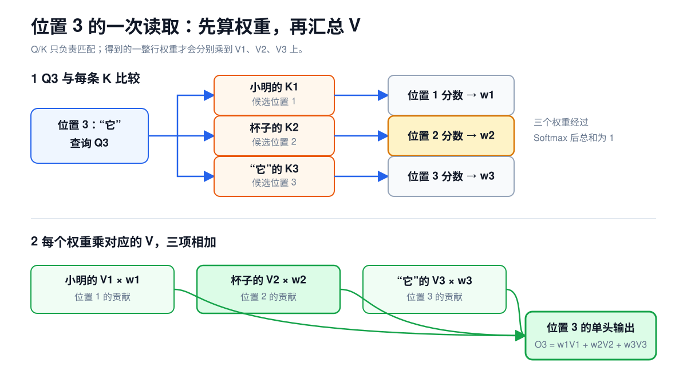

# 第 3 课：图解 Attention 的完整计算过程

上一课只看了 Decoder Layer 的外壳，Token Mixer 还是一个黑盒：

```text
输入 x
→ RMSNorm
→ Token Mixer
→ 与 x 残差相加
```

Qwen3.5 的 Token Mixer 有两种。Gated DeltaNet 把读过的信息持续整理进固定大小的状态；Full Attention 则让当前 token 直接与所有可见 token 比较。本课拆开的是后者。

```text
Gated DeltaNet：把读过的信息持续整理到固定大小的状态中
Full Attention：让每个 token 直接和所有允许读取的 token 比较
```

`Full` 说的是比较范围。序列有 `T` 个 token 时，一个 Attention 头在概念上会得到一张 `T×T` 的分数表：每一行代表一个正在更新的 token，每一列代表一个可供它读取的 token。由于 Decoder 不能偷看未来，真正可用的是当前位置及其左侧部分。Gated DeltaNet 放到第 5 课。

先看一句话：

```text
小明把杯子放在桌上，然后拿起它。
```

为了讲清位置关系，暂时把它简化成下面几个 token：

```text
位置 1   位置 2  位置 3  位置 4  位置 5  位置 6  位置 7
小明     把      杯子    放下    又      拿起    它
```

真实 Tokenizer 不一定正好按词切分。这里的“位置 7”只表示序列中的第 7 个 token，不是向量的第 7 个元素，也不是模型的第 7 层。

轮到“它”这个位置时，模型手里已经有一条属于“它”的 Hidden State。Attention 要做的是：给前面的 token 分配权重，再按权重取回信息。“杯子”可能得到较高权重，于是它携带的信息会更多地进入“它”的新表示。

这里的“杯子”只是便于理解的例子。模型没有一张人工编写的指代规则表，也不能保证某一层、某一个头独自完成判断。真正的关系由多层计算共同形成。

## 1. Attention 先分配权重，再取回信息


站在某一个 token 的位置上看，Attention 只有两步：

```text
判断相关性：前面哪些 token 与我相关，各占多大权重
取回信息：按这些权重，把它们提供的信息加到一起
```

它有点像检索，但不会只返回一条记录。所有可见 token 都可以贡献信息，只是权重不同。权重大，贡献就多；权重接近 0，影响也接近 0。

完整过程是：

```text
一组隐藏状态 X
├→ 线性投影得到 Q
├→ 线性投影得到 K
└→ 线性投影得到 V

Q 与 K 点积
→ 得到位置之间的相关性分数
→ 遮住未来位置
→ Softmax 把分数变成权重
→ 用权重对 V 加权求和
→ 得到每个位置取回的上下文信息
```

这里的 `X` 是经过 RMSNorm 的隐藏状态，shape 仍是 `[B,T,H]`。Q、K、V 都由这同一组 `X` 计算出来，因此称为自注意力（Self-Attention）。

## 2. Q 和 K 用来匹配，V 用来传递信息

仍然只跟踪位置 7 的“它”。这一层会给“它”算出一条 Q，也会给序列中每个位置算出自己的 K 和 V：



三者不是三份重复数据，而是同一条 Hidden State 的三种用法：

```text
Q：我正在找什么样的信息？
K：我这里有什么信息可供匹配？
V：如果我被选中，我具体提供什么信息？
```

“它”的 Q 会依次和“小明”“把”“杯子”等位置的 K 比较。Q 与“杯子”的 K 越匹配，“杯子”得到的权重就可能越大。权重确定后，真正拿回来的是“杯子”的 V。K 完成匹配以后，不直接进入最终汇总。

“找什么”“有什么”“提供什么”只是分工上的直觉。Q 不是一句中文问题，K 也不是人工标签。三者都是数字向量。

对一个 token 位置、一个 Attention 头来说，Q、K、V 各是一条向量。一次处理整批序列时，所有位置的这些向量会组成 Q、K、V 张量。

它们的中文名分别是：

| 符号 | 名称 | 在计算中的作用 |
| --- | --- | --- |
| `Q` | 查询向量（Query） | 当前 token 用什么特征去寻找相关位置 |
| `K` | 键向量（Key） | 每个 token 用什么特征回应查询 |
| `V` | 值向量（Value） | 这个 token 被关注后，向结果提供什么信息 |

它们来自三次不同的 Linear：

$$
Q=XW_Q^T,\qquad K=XW_K^T,\qquad V=XW_V^T
$$

`W_Q`、`W_K`、`W_V` 是训练得到的三组权重。同一条 Hidden State 经过三组权重重新组合，才有了用于匹配的 Q/K 和用于传递信息的 V。

### 为什么不能只用一条向量

判断两个位置是否相关时需要的特征，和相关位置最终应该贡献的信息，不一定相同。

仍用代词举例：判断“它”和“杯子”是否相关时，模型可能更关心词性、位置和上下文关系；从“杯子”位置取回的信息则可能包含对象类别、属性和前后动作。Q/K 负责前一种比较，V 负责后一种信息传递。

三组权重会在训练中学出合适的表示。每个 token 都有自己的 Q、K、V；这里只盯住“它”的 Q，是为了把一次查询看清楚。

## 3. 把整段计算压缩成一条公式

单个 Attention 头可以写成：

$$
O=\mathrm{softmax}\left(\frac{QK^T}{\sqrt{D}}+M\right)V
$$

每一部分都能对应回前面的两个动作：先算权重，再汇总信息。

| 公式部分 | 做什么 |
| --- | --- |
| `QK^T` | 每条 Q 与每条 K 做点积，得到 token 两两之间的分数 |
| 除以 `√D` | 把分数控制在较合适的范围 |
| `+M` | 用因果遮罩挡住未来 token |
| `Softmax` | 把每一行分数变成总和为 1 的权重 |
| `×V` | 按权重汇总各 token 的 V |
| `O` | 这个 Attention 头的输出 |

下面把这条公式拆开。等每一步都能手算，再回来看整条公式。

## 4. $QK^T$ 生成一张位置匹配表

先只看一个查询位置和一个候选位置。假设：

```text
当前位置的 Q = [1, 0]
候选位置的 K = [0.5, 0]
```

两者做点积：

$$
[1,0]\cdot[0.5,0]=1\times0.5+0\times0=0.5
$$

结果是一个标量。这个数就是当前位置对候选位置的原始相关性分数。

如果序列有 3 个 token，可以把它们记为：

```text
位置 1：token 1
位置 2：token 2
位置 3：token 3
```

每个位置都有一条 Q 和一条 K。每条 Q 都要和 3 条 K 比较：

```text
             被读取的位置
             K1    K2    K3
当前位置 Q1   s11   s12   s13
当前位置 Q2   s21   s22   s23
当前位置 Q3   s31   s32   s33
```

矩阵写法是：

$$
S=QK^T
$$

`S` 是 Attention 分数矩阵，shape 是 `[T,T]`。行对应发起查询的 token 位置，列对应被查询的 token 位置。`S[i,j]` 表示位置 `i` 的 Q 与位置 `j` 的 K 的点积分数。

所以 `S[2,1]` 的意思是：位置 2 正在更新自己的表示，它给位置 1 打了多少分。这里的 2 和 1 都是 token 在序列中的位置编号。

这里用的是矩阵乘法，不是逐元素相乘。每个矩阵元素的内部计算才是一对 Q/K 向量的点积。

## 5. 用 $\sqrt{D}$ 控制分数尺度

`D` 表示一条 Q 或 K 向量包含多少个数，称为头维度（Head Dimension）。

点积会把 D 项乘积加起来。D 越大，点积的绝对值通常越容易变大。如果很大的正数和负数直接进入 Softmax，权重可能过早集中到极少数位置，数值变化也会变得过于敏感。

因此 Attention 使用缩放点积：

$$
S=\frac{QK^T}{\sqrt{D}}
$$

这一步不会改变分数的相对顺序，只会压缩它们之间的距离。原始 Transformer 论文采用这个缩放，是为了抵消头维度增大带来的点积尺度增长。

Qwen3.5-9B 的 Full Attention 中，`D=256`，所以分数会乘以：

$$
\frac{1}{\sqrt{256}}=\frac{1}{16}
$$

## 6. 因果遮罩禁止读取未来 token

“计算位置 2”指的是：用位置 2 的 Q 计算这一层在位置 2 的输出。在自回归顺序中，位置 1 已经在前面，位置 2 是自己，位置 3 属于后续 token。因此位置 2 可以读取位置 1 和位置 2，不能读取位置 3。放到分数矩阵里看，就是第 2 行第 3 列必须被遮住。即使训练或 Prefill 时整段文字已经放进同一个张量，这条限制仍然存在。

训练时，位置 2 的最终输出用来预测位置 3 的 token。如果第 2 行能够读取第 3 列，就相当于先看到答案再预测，模型学到的计算也无法用于真实生成。


因果遮罩（Causal Mask）不是把未来 token 从输入中删掉，而是在 Softmax 前修改分数：

```text
可以读取的位置：分数保持不变
未来位置：      分数加上负无穷
```

Softmax 中，负无穷对应的指数是 0，所以未来位置最后得到 0 权重。

三个 token 位置的因果遮罩矩阵记作 `M`：

$$
M=
\begin{bmatrix}
0 & -\infty & -\infty\\
0 & 0 & -\infty\\
0 & 0 & 0
\end{bmatrix}
$$

`M` 不是 Q、K、V，也不是 Attention 分数矩阵。它是一张额外的 `[T,T]` 规则表，shape 与分数矩阵相同，然后逐元素加到分数矩阵上：

$$
S_{masked}=\frac{QK^T}{\sqrt{D}}+M
$$

这里容易混淆两件事：一个位置能否使用未来 token，以及多个已知 token 能否同时计算。因果遮罩只管前一件事。

Prompt 中的 token 都已经由用户给出，GPU 可以同时计算它们的 Q/K/V 和 Attention。只是位置 2 的输出不能使用位置 3 的内容。下一课再讲 Prompt 为什么能成批计算，而新 token 为什么仍要一个接一个生成。

## 7. Softmax 把分数变成可用于汇总的权重

分数可能是正数、负数，也不要求总和为 1。Softmax 把同一行分数变成一组非负权重，并让它们的总和等于 1。

假设某个位置遮罩后的分数是：

```text
[0.707, 0, -∞]
```

Softmax 结果约为：

```text
[0.670, 0.330, 0]
```

这表示当前位置从第 1 个位置取回约 67% 的信息，从第 2 个位置取回约 33%，完全不读取未来的第 3 个位置。

分数和权重不能混为一谈：

```text
点积结果：Attention Score，尚未归一化
Softmax 结果：Attention Weight，总和为 1
```

## 8. 用权重汇总 V，得到取回的信息

假设三个位置的 V 是：

```text
V1 = [2, 0]
V2 = [0, 2]
V3 = [1, 1]
```

某个位置的权重是：

```text
[0.670, 0.330, 0]
```


输出就是：

$$
0.670\times[2,0]+0.330\times[0,2]+0\times[1,1]
=[1.340,0.660]
$$

这是逐元素的加权求和。权重是标量，每个标量会乘到对应 V 的所有元素上。

Q/K 和 V 的分工到这里已经完整：

```text
Q 与 K 决定权重
权重与 V 决定输出内容
```

## 9. 三个 token 的完整手算

为了能手算，只看一个头，设 `T=3`、`D=2`：

$$
Q=
\begin{bmatrix}
1&0\\
0&1\\
1&0
\end{bmatrix},\quad
K=
\begin{bmatrix}
1&0\\
0&1\\
0.5&0
\end{bmatrix},\quad
V=
\begin{bmatrix}
2&0\\
0&2\\
1&1
\end{bmatrix}
$$

### 第一步：Q 与 K 点积，再除以 $\sqrt{2}$

$$
\frac{QK^T}{\sqrt{2}}=\begin{bmatrix}
0.707&0&0.354\\
0&0.707&0\\
0.707&0&0.354
\end{bmatrix}
$$

以第 3 行第 1 列为例：

$$
Q_3\cdot K_1=[1,0]\cdot[1,0]=1
$$

再除以 $\sqrt{2}$，得到约 `0.707`。

### 第二步：遮住未来位置

$$
S_{masked}=
\begin{bmatrix}
0.707&-\infty&-\infty\\
0&0.707&-\infty\\
0.707&0&0.354
\end{bmatrix}
$$

### 第三步：每一行分别做 Softmax

$$
A\approx
\begin{bmatrix}
1&0&0\\
0.330&0.670&0\\
0.456&0.225&0.320
\end{bmatrix}
$$

`A` 是 Attention 权重矩阵。每一行的和都等于 1。

### 第四步：权重矩阵乘 V

$$
O=AV
$$

结果约为：

$$
O\approx
\begin{bmatrix}
2.000&0\\
0.660&1.340\\
1.231&0.769
\end{bmatrix}
$$

以第 3 行为例：

$$
0.456V_1+0.225V_2+0.320V_3
\approx[1.231,0.769]
$$

到这里，一次单头 Attention 已经算完。它的核心公式是：

$$
A=\mathrm{softmax}\left(\frac{QK^T}{\sqrt{D}}+M\right),\qquad O=AV
$$

公式看起来紧凑，展开后只有四个动作：

```text
Q/K 点积打分
→ 缩放
→ 遮住未来并做 Softmax
→ 加权汇总 V
```

## 10. RoPE 怎样把相对位置带进 Q/K 点积

只比较内容还不够。下面两句话用了完全相同的词，交换位置以后，谁批评谁也跟着变了：

```text
小明批评小李
小李批评小明
```

距离也会影响关系。“杯子”出现在“它”的前 2 个 token，和出现在前 2000 个 token，不能被当作完全相同的情况。Attention 需要有机会知道两个 token 谁在前、谁在后，以及相差多少位置。

RoPE 的目标正是让 Q/K 的匹配分数带上这种相对位置。它使用旋转，但旋转只是手段。

### 10.1 先看一个二维特征对

暂时从 Q 中取两个数，把它们看成平面上的一根箭头。假设 token 每向后移动一个位置，箭头就多转一个固定角度 `θ`：

```text
位置 0：转 0θ
位置 1：转 1θ
位置 2：转 2θ
...
位置 m：转 mθ
```

K 中对应的两个数也按自己的位置旋转。如果 Q 位于位置 2，K 位于位置 4，它们分别转过 `2θ` 和 `4θ`，两根箭头之间相差 `2θ`。

把两个 token 一起移到位置 12 和位置 14，各自都额外转了 `10θ`，但夹角仍是 `2θ`。绝对角度变了，相对角度没有变。


点积本来就和两根箭头之间的夹角有关。RoPE 利用这一点，让点积中的位置影响只取决于两个 token 相差多少位置。

### 10.2 为什么共同旋转会抵消

把位置 `m` 对应的旋转写成 `R_m`，位置 `n` 对应的旋转写成 `R_n`。旋转后的 Q、K 点积为：

$$
(R_m q)^T(R_n k)=q^T R_m^T R_n k=q^T R_{n-m}k
$$

最重要的是最后的下标 `n-m`。原来的两个绝对位置 `m` 和 `n`，在点积中合成了相对位置 `n-m`。

这条公式不能读成“Attention 分数只由距离决定”。`q` 和 `k` 仍然来自两个 token 的内容；只是位置对分数的影响通过 `n-m` 进入。内容和相对位置会一起影响最终匹配分数。

### 10.3 为什么要用很多种旋转速度

真实的 Q/K 不止二维。RoPE 会把参与旋转的维度分成许多二维特征组，每组采用不同的旋转速度。可以把它们想成一排快慢不同的钟表：

- 转得快的表，位置稍有变化，角度就明显不同；
- 转得慢的表，经过较长距离后仍会缓慢变化；
- 单独一只表会周期性转回相同角度，多种速度一起使用，可以形成更丰富的位置差特征。


这不表示某一组维度被人工指定为“只管近距离”，另一组“只管远距离”。模型会结合所有特征学习怎样使用这些位置信号。RoPE 也不保证越近的 token 权重越高；最终权重仍由 Q/K 内容、相对位置和训练共同决定。

### 10.4 为什么旋转 Q 和 K，不旋转 V

RoPE 要改变的是位置之间的匹配分数，而分数来自 Q 与 K 的点积，所以旋转放在 Q/K 上。V 负责携带匹配成功后要汇总的信息，不参与这次匹配，因此不需要做同样的旋转。

旋转不会增加 token 数，也不会改变 Q/K 的 shape，只会改变其中的数值。

### 10.5 Qwen3.5-9B 实际旋转多少维

Qwen3.5-9B 的每个 Full Attention 头有 `256` 维。配置中的 `partial_rotary_factor=0.25` 表示只有前 `64` 维参与 RoPE，后 `192` 维原样通过：

```text
Q：前 64 维旋转，后 192 维不旋转
K：前 64 维旋转，后 192 维不旋转
V：256 维都不旋转
```

K 经过 RoPE 后才写入 KV Cache，所以缓存复用必须保持位置编号和 RoPE 规则一致。Qwen3.5 正式实现使用 MRoPE；纯文本时可以先按上面的一维位置理解，图片和视频的时间、高度、宽度位置放到第 7 课。

## 11. 多个头各自做一遍 Attention

到目前为止，我们只算了一个头。真实模型会把每个 token 的表示拆成多组，分别执行 Attention，这就是多头注意力（Multi-Head Attention）。

新增三个 shape 符号：

| 符号 | 含义 |
| --- | --- |
| `Nq` | 查询头数量 |
| `Nkv` | 键和值的头数量 |
| `D` | 每个头的特征宽度 |

如果是普通多头注意力，通常有：

$$
H=Nq\times D
$$

例如 `H=8`、`Nq=2`，则每个头的 `D=4`：

```text
一个 token 的 8 维表示
→ 头 1 使用 4 维 Q/K/V
→ 头 2 使用 4 维 Q/K/V
→ 两个头各自做 Attention
→ 拼回 8 维
→ 输出投影重新混合各头结果
```

多个头可以在不同的表示空间中学习不同关系。有的头可能更容易响应临近位置，有的头可能更容易响应句法或指代关系。但这些职责由训练形成，不是人为固定，也不意味着每个头都能被清楚命名。

头数增加也不一定会让总宽度增加。H 固定时，增加头数通常意味着每个头的 D 变小。

## 12. GQA 用较少的 K/V 服务多个查询头

普通多头注意力中，Q、K、V 的头数相同。分组查询注意力（Grouped-Query Attention，GQA）让多个查询头共享一组 K 和 V。

Qwen3.5-9B 使用：

```text
Nq  = 16 个查询头
Nkv =  4 个键值头
D   = 256
```

因此每 4 个查询头共用一组 K/V：


各组可以写成：

```text
Q1  ～ Q4   共用 K1、V1
Q5  ～ Q8   共用 K2、V2
Q9  ～ Q12  共用 K3、V3
Q13 ～ Q16  共用 K4、V4
```

共享的不是 Q。16 个查询头仍然保留各自的查询表示，只是匹配和取值时复用 4 组 K/V。

这样做的直接影响是：

```text
Q 总宽度：16 × 256 = 4096
K 总宽度： 4 × 256 = 1024
V 总宽度： 4 × 256 = 1024
```

与同样使用 16 组 K/V 的普通多头注意力相比，GQA 的 K/V 宽度和 KV Cache 元素数都变成 1/4。这不等于整个 Attention 的计算量或整模型显存都减少到 1/4，因为 Q、输出投影、FFN 和其他层仍然存在。

实际执行 Attention 时，每组 K/V 要服务对应的 4 个查询头。某些朴素实现会在逻辑上把 K/V 展开到 16 头，优化实现则可以避免真的复制数据。两者表达的是同一套计算语义。

## 13. 各头结果怎样回到 Decoder Layer

每个查询头算完后，会得到 `[B,Nq,T,D]` 的结果。接下来把头轴和头内维度拼回去：

```text
[B,Nq,T,D]
→ 调整轴顺序
→ [B,T,Nq×D]
→ 输出投影 o_proj
→ [B,T,H]
```

输出投影（Output Projection，`o_proj`）也是 Linear。它负责重新混合各个头产生的特征，并把结果整理回 Decoder Layer 约定的 H 维。回到 `[B,T,H]` 后，才能和进入 Attention 前保存的残差分支相加。

一个 Full Attention 子层的数据流如下：


残差连接位于整个 Attention 计算之后，不是在 Q/K/V 和 Softmax 中间。

## 14. 代入 Qwen3.5-9B 的真实 shape

Qwen3.5-9B 的 Full Attention 输入是：

```text
X: [B,T,4096]
```

核心 Attention 的 shape 如下：

| 阶段 | shape | 说明 |
| --- | --- | --- |
| 查询 Q | `[B,16,T,256]` | 16 个查询头 |
| 键 K | `[B,4,T,256]` | 4 个键头 |
| 值 V | `[B,4,T,256]` | 4 个值头 |
| 分数矩阵 | 逻辑上为 `[B,16,T,T]` | 每个查询位置对可见位置打分 |
| 每头输出 | `[B,16,T,256]` | 权重乘 V 后的结果 |
| 拼接各头 | `[B,T,4096]` | `16×256=4096` |
| `o_proj` 输出 | `[B,T,4096]` | 回到残差分支所需的 H 维 |

“逻辑上为 `[B,16,T,T]`”很重要。FlashAttention 一类实现不会把完整分数矩阵长期写入显存，而是分块计算 Softmax 和加权结果。但从模型含义看，每个查询位置仍然是在与可见的键位置计算分数。

### 标准 Attention 之外的三处处理

标准公式讲清核心后，再看 Qwen3.5 的具体实现：

1. **Q/K 归一化**：Q 和 K 按每个头的 256 维做 RMSNorm，再进入 RoPE 和点积。
2. **部分 RoPE**：每头 256 维中有 64 维参与位置旋转。
3. **Attention 输出门控**：模型另外生成一组 `[B,T,4096]` 的门控值，经 Sigmoid 后逐元素调节各头拼接结果，再进入 `o_proj`。

因此 Transformers 实现中的 `q_proj` 一次产生 `[B,T,8192]`，然后拆成两半：

```text
前 4096 个数 → 16 个查询头的 Q
后 4096 个数 → Attention 输出门控
```

这组门控和 SwiGLU 中的门控作用位置不同：

```text
SwiGLU 门控：调节 FFN 的中间特征
Attention 输出门控：调节各头汇总后的结果
```

不要因为它们都叫门控，就把两套参数或数据流混在一起。

把 Qwen3.5 的实现顺序写完整：

```text
RMSNorm 后的 X [B,T,4096]
→ q_proj，拆出 Q 和输出门控
→ k_proj 得到 K，v_proj 得到 V
→ Q/K 分别做按头 RMSNorm
→ Q/K 应用 RoPE
→ Q/K 点积并按 1/sqrt(256) 缩放
→ 因果遮罩
→ Softmax
→ 权重汇总 V
→ 拼接 16 个查询头的结果 [B,T,4096]
→ 乘以 Sigmoid 后的输出门控
→ o_proj [B,T,4096]
→ 与残差分支相加
```

## 15. 哪些是模型参数，哪些是请求数据

| 对象 | 类型 | 生命周期 |
| --- | --- | --- |
| `W_Q`、`W_K`、`W_V`、`W_O` | 模型参数 | 加载模型时进入设备，被不同请求重复使用 |
| Q/K/V | 当前请求产生的数据 | 由这一层输入和投影权重计算得到 |
| Attention 分数和权重 | 当前请求的中间数据 | 用于完成本次加权汇总 |
| 历史 K/V | 当前请求的缓存状态 | Decode 时保留，供后续 token 复用 |

K/V 既是本轮计算的中间结果，又会在自回归生成中成为缓存。缓存怎样建立、为什么能避免重复计算、容量怎样估算，放在第 4 课展开。

## 16. 这套结构怎样影响推理

现在先建立判断方向，不展开实现细节。

### 序列越长，Full Attention 的位置组合越多

Prefill 中有 T 个查询位置，每个位置最多与 T 个键位置比较。分数矩阵在概念上是 `T×T`，所以序列长度增加会迅速增加这部分计算。

因果遮罩挡住了上三角，但普通实现仍要处理大量位置组合。不同内核是否能跳过或分块处理这些计算，要看具体实现，不能只看公式直接断言性能。

### GQA 主要减少 K/V 宽度和缓存

Qwen3.5 用 4 个 K/V 头服务 16 个查询头。判断 KV Cache 容量时，应使用 `Nkv=4`，不能误用 `Nq=16`。

### FlashAttention 改变执行方式，不改变模型含义

它通过分块和在线 Softmax 减少中间矩阵的显存读写。Q/K 打分、因果约束、Softmax、加权 V 这些语义没有消失。

### RoPE 影响缓存中的 K

位置旋转发生在 K 写入缓存前。处理缓存复用、前缀拼接或位置重映射时，必须保证位置编号和 RoPE 规则一致，不能只复制一段 K/V 就认为语义一定正确。

## 17. 进入下一课前需要分清的边界

### Attention 不直接输出下一个 token

不会。Attention 只更新当前层的隐藏状态。隐藏状态还要经过这一层后续计算、更多 Decoder Layer、最终 RMSNorm 和 LM Head，才会得到词表 Logits。

### 自注意力的 Q、K、V 来自同一组 Hidden States

自注意力中，三者来自同一组隐藏状态 X，但使用三组不同权重计算。交叉注意力可以有不同来源，本课不展开。

### V 不参与 Q/K 的相关性打分

不参与。Q 与 K 先产生分数和权重，V 再按这些权重被汇总。

### 因果遮罩必须放在 Softmax 前

不应该。遮罩先把未来位置的分数变成负无穷，Softmax 后这些位置自然得到 0 权重。

### GQA 共享的是 K/V，不是 Q

不是。它保留多个 Q 头，让一组 Q 头共享 K/V。

### RoPE 不增加 token 数或隐藏维度

都不会。它只旋转 Q/K 的部分数值，shape 不变。

### Attention 权重不能独自解释模型回答

不能。权重只展示某一层、某一头在一次加权计算中的分布。模型行为还受到 V、输出投影、FFN、残差和其他层共同影响。

## 18. 练习

1. Q、K、V 分别在 Attention 中做什么？
2. `QK^T` 的一个元素是怎样算出来的？它表示什么？
3. 为什么要除以 $\sqrt{D}$？
4. 因果遮罩为什么必须放在 Softmax 前？
5. Attention Score 和 Attention Weight 有什么区别？
6. 权重 `[0.7,0.3]`，`V1=[2,0]`，`V2=[0,4]`，加权结果是多少？
7. 多头 Attention 中，多个头的职责是人工指定的吗？
8. Qwen3.5-9B 的 `Nq=16`、`Nkv=4` 表示什么？
9. Qwen3.5-9B 的 K/V 总宽度为什么是 1024？
10. RoPE 改变 Q/K 的 shape 吗？为什么 V 不需要同样旋转？
11. Full Attention 的输出为什么还要回到 `[B,T,H]`？
12. FlashAttention 没有长期保存完整 `T×T` 分数矩阵，是否表示它不再计算 Attention？

## 19. 参考答案

1. Q 和 K 用于计算位置间的相关性分数，V 携带被加权汇总的信息。
2. 一条 Q 与一条 K 做点积，对应元素相乘后求和。它表示一个查询位置对一个候选位置的原始相关性分数。
3. 头维度增大时，点积绝对值通常会变大。除以 $\sqrt{D}$ 可以控制分数尺度，避免 Softmax 过早变得过于集中。
4. 先把未来分数设为负无穷，Softmax 后对应权重才会成为 0。如果先做 Softmax，未来位置已经参与了归一化。
5. Score 是 Q/K 点积缩放后的原始分数；Weight 是经过遮罩和 Softmax 后的非负权重，同一行总和为 1。
6. `0.7×[2,0]+0.3×[0,4]=[1.4,1.2]`。
7. 不是。不同头的分工由训练形成，而且不一定能给每个头一个稳定、单一的名称。
8. 有 16 个查询头和 4 个键值头。每 4 个查询头共享一组 K/V。
9. `Nkv×D=4×256=1024`。
10. 不改变。RoPE 只改变 Q/K 数值，让匹配分数感知位置；V 负责携带汇总内容，不参与位置匹配。
11. Decoder Layer 的残差分支是 `[B,T,H]`，逐元素相加要求两侧 shape 相同，同时下一子层也约定接收 H 维表示。
12. 不是。它仍完成同样的打分、Softmax 和加权求和，只是用分块方式避免把完整中间矩阵长期写入显存。

## 20. 进入第 4 课前

合上正文，试着写出下面两条链路：

```text
X → Q/K/V → QK^T/sqrt(D) → Causal Mask → Softmax → 权重×V → 多头拼接 → o_proj
```

```text
Qwen3.5-9B：16 个 Q 头；4 个 K/V 头；每 4 个 Q 头共享一组 K/V；每头 256 维
```

还要能解释每一步为什么存在，而不只是背出名称。下一课会把这张静态结构图放到真实生成过程中，看 Prefill、Decode 和 KV Cache 怎样配合。

## 资料来源

以下 Qwen3.5 配置和实现于 2026-08-06 复核：

- [Qwen3.5-9B-Base 官方模型说明](https://huggingface.co/Qwen/Qwen3.5-9B-Base)
- [Qwen3.5-9B-Base `config.json`，revision 68c46c4](https://huggingface.co/Qwen/Qwen3.5-9B-Base/blob/68c46c4b3498877f3ef123c856ecfde50c39f404/config.json)
- [Transformers：Qwen3.5 模型实现，revision 9436284](https://github.com/huggingface/transformers/blob/943628458a1691f8af09c47ea9fc6e314734722f/src/transformers/models/qwen3_5/modeling_qwen3_5.py)
- [Attention Is All You Need](https://arxiv.org/abs/1706.03762)
- [RoFormer：Rotary Position Embedding](https://arxiv.org/abs/2104.09864)
- [GQA：Grouped-Query Attention](https://arxiv.org/abs/2305.13245)

本课的讲解顺序和图示还参考了以下资料：

- [Transformer 模型详解（图解最完整版）](https://zhuanlan.zhihu.com/p/338817680)
- [3Blue1Brown：Attention in transformers, step-by-step](https://www.3blue1brown.com/lessons/attention/)
- [The Illustrated Transformer](https://jalammar.github.io/illustrated-transformer/)
- [Dive into Deep Learning：Queries, Keys, and Values](https://d2l.ai/chapter_attention-mechanisms-and-transformers/queries-keys-values.html)

这里解释的是 Full Attention 的模型语义。FlashAttention 的内核与显存访问、KV Cache 的建立和复用，以及 Gated DeltaNet 的 recurrent state 会在后续课程继续展开。
