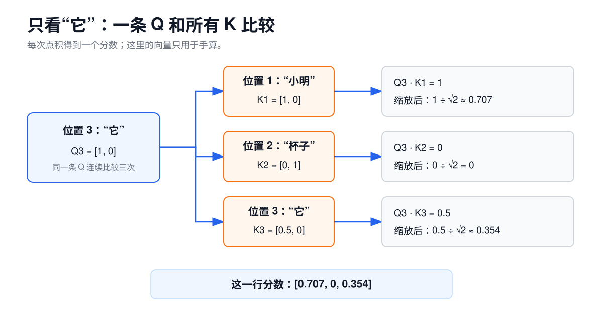
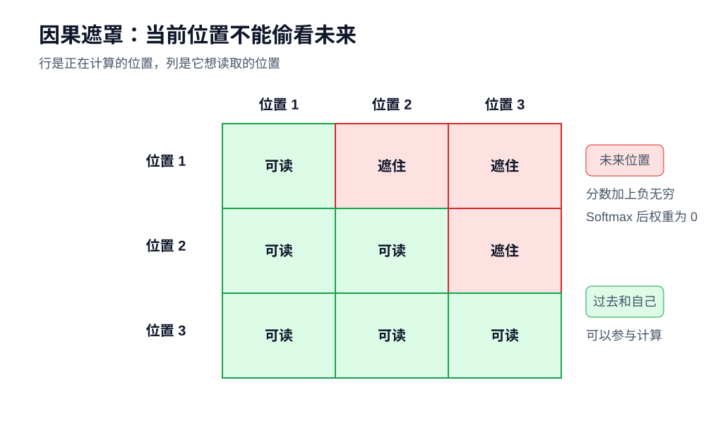
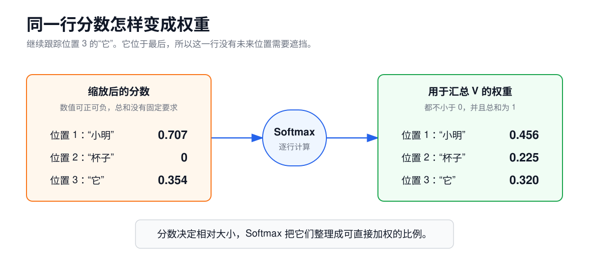
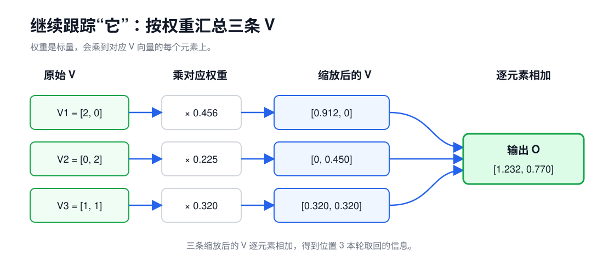
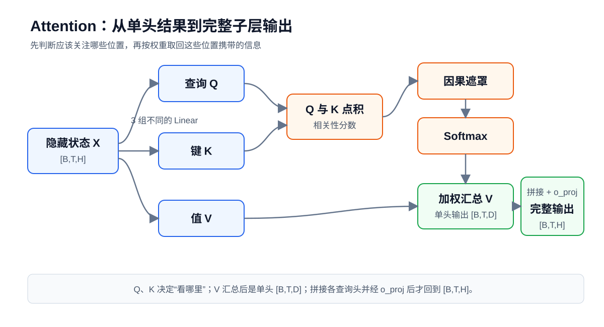
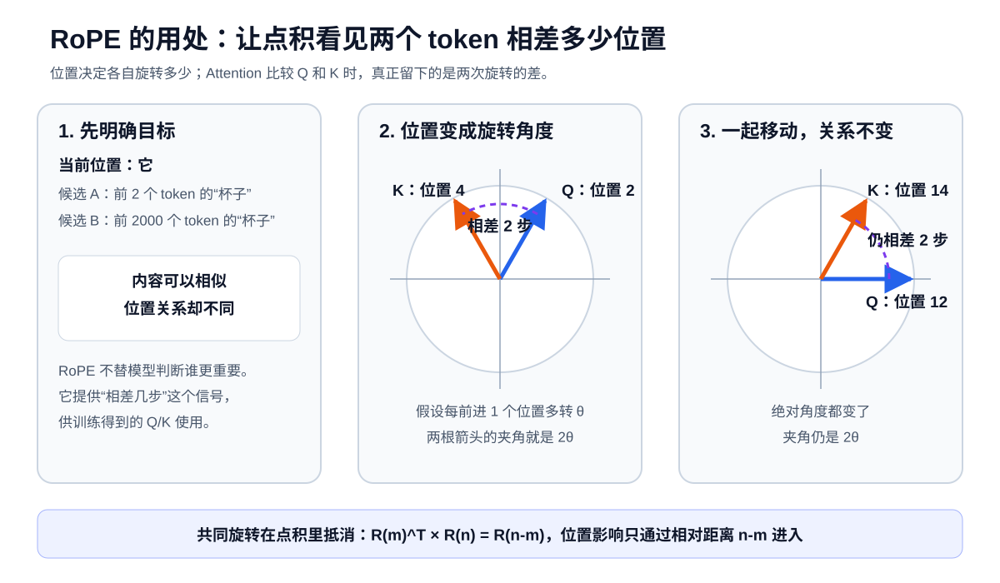
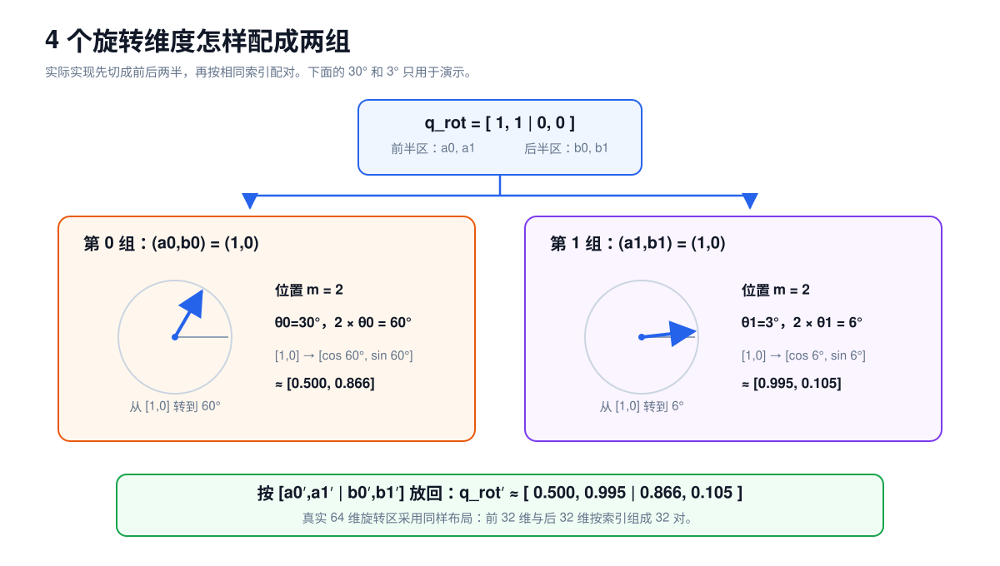
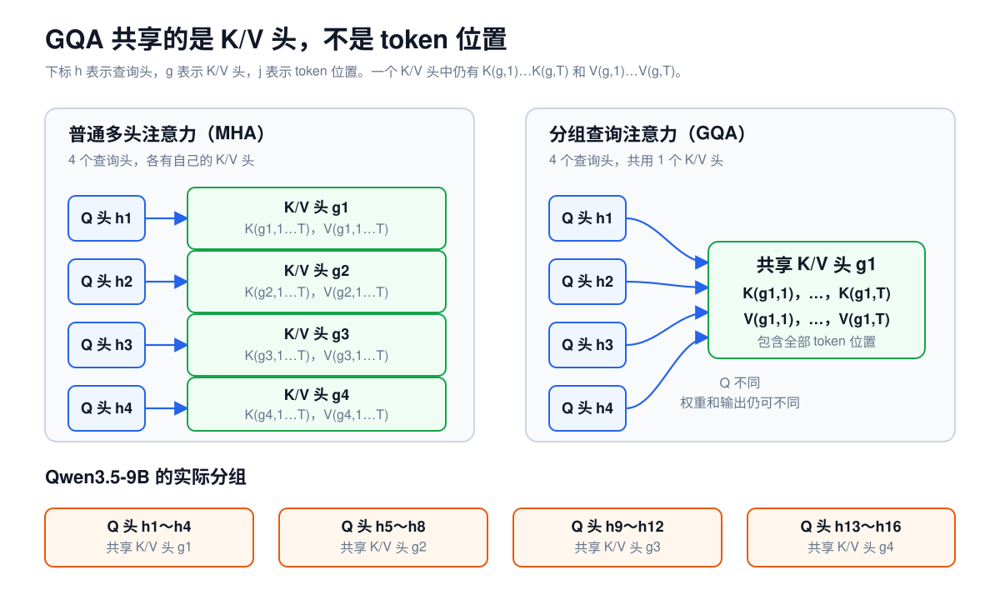
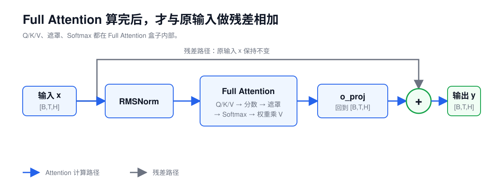

# 第 3 课：Attention 的计算原理

Decoder Layer 需要让当前位置读取前文。Full Attention 的做法很直接：当前位置依次和允许读取的位置打分，再按分数取回信息。

Qwen3.5 还会使用 Gated DeltaNet，把历史整理进固定大小的状态。那条路径放到第 5 课；本课只讲 Full Attention。

```text
Gated DeltaNet：把读过的信息持续整理到固定大小的状态中
Full Attention：让每个 token 直接查看所有允许读取的位置
```

`Full` 说的是查看范围。序列有 `T` 个 token 时，一个 Attention 头在概念上会得到一张 `T×T` 的分数表。每一行对应一个正在更新的 token，每一列对应一个可供它读取的 token。Decoder 不能偷看未来，所以每一行只能使用当前位置及其左侧部分。

用一句话作例子：

```text
小明把杯子放在桌上，然后拿起它。
```

后面的手算只保留三个与指代关系有关的位置：

```text
位置 1   位置 2   位置 3
小明     杯子     它
```

这是一组为了手算而设的三个位置标签，不是实际 Tokenizer 的切分结果。后文的 Q、K、V、遮罩矩阵和 Attention 输出都沿用这三个编号。

轮到“它”这个位置时，模型手里已经有一条属于“它”的 Hidden State。Attention 会给可见位置分配权重，再按权重取回信息。“杯子”可能得到较高权重，于是“杯子”位置携带的信息会更多地进入“它”的新表示。

这里的“杯子”只是便于理解的例子。模型没有一张人工编写的指代规则表，也不能保证某一层、某一个头独自完成判断。这类关系通常由多层计算共同形成。

## 1. 单个查询位置的 Attention

先站在“它”这个位置，只看它怎样读前文。整张矩阵只是把同样的计算同时应用到其他位置。

这一次读取分成三个动作：

```text
拿“它”的查询向量和各位置的键向量比较
→ 把比较分数变成权重
→ 按权重汇总各位置的值向量
```

第一个动作决定“读哪里”，后两个动作决定“从这些位置取回多少信息”。Attention 不会只返回一个位置。所有可见位置都可以贡献自己的信息，只是权重不同。

## 2. Q、K、V 的计算分工

仍然只跟踪位置 3 的“它”。这一层会给“它”算出一条 Q，也会给序列中每个位置算出自己的 K 和 V：


三者不是同一份数据换了名字，而是同一条 Hidden State 经过不同权重变换后得到的三种表示：

```text
Q：当前位置拿什么特征去寻找相关位置？
K：每个位置拿什么特征来接受比较？
V：这个位置被关注后，向结果提供什么信息？
```

“它”的 Q 会依次和“小明”“杯子”“它”三个位置的 K 比较。Q 与“杯子”的 K 越匹配，“杯子”得到的权重就可能越大。权重确定后，参与汇总的是“杯子”的 V。K 完成匹配以后，不直接进入最终汇总。

这些中文只是帮助记住分工。Q 不是一句中文问题，K 也不是人工标签。三者都是数字向量。

对一个 token 位置、一个 Attention 头来说，Q、K、V 各是一条向量。一次处理整批序列时，所有位置的这些向量会组成 Q、K、V 张量。

常见的中英文名称如下：

| 符号 | 名称 | 在计算中的作用 |
| --- | --- | --- |
| `Q` | 查询向量（Query） | 当前 token 用什么特征寻找相关位置 |
| `K` | 键向量（Key） | 每个 token 用什么特征接受比较 |
| `V` | 值向量（Value） | 这个 token 被关注后，向结果提供什么信息 |

## 3. Q、K、V 的线性投影

设经过 RMSNorm 的隐藏状态为 `X`，shape 是 `[B,T,H]`。三组不同的 Linear 分别计算 Q、K、V：

$$
Q=XW_Q^T,\qquad K=XW_K^T,\qquad V=XW_V^T
$$

`W_Q`、`W_K`、`W_V` 是训练得到的三组权重。对同一个 token 来说，三次 Linear 都读取它的 Hidden State，但会重新组合其中的特征，所以结果不同。

整段序列中的 Q、K、V 都由同一组 `X` 产生，因此这叫自注意力（Self-Attention）。交叉注意力会让 Q 和 K/V 来自不同输入，本课不展开。

### 3.1 匹配特征与输出信息的分离

判断两个位置是否相关时需要的特征，和相关位置最终应该贡献的信息，不一定相同。

仍用代词举例：判断“它”和“杯子”是否相关时，模型可能更关心词性、位置和上下文关系；从“杯子”位置取回的信息则可能包含对象类别、属性和前后动作。Q/K 负责前一种比较，V 负责后一种信息传递。

三组权重会在训练中学出合适的表示。每个 token 都有自己的 Q、K、V。下面只盯住“它”的 Q，把一次读取走完。

## 4. QK 点积与相关性分数

三个位置仍然是：

```text
位置 1：小明
位置 2：杯子
位置 3：它
```

这些玩具向量只用来演示计算，不表示模型已经学会了指代关系。

只看一个 Attention 头，设每条 Q/K 有两个数。取：

```text
Q3 = [1, 0]
K1 = [1, 0]
K2 = [0, 1]
K3 = [0.5, 0]
```

“它”的 `Q3` 先与“小明”的 `K1` 做点积：

$$
[1,0]\cdot[1,0]=1\times1+0\times0=1
$$

点积把两条向量变成一个分数。`Q3` 再与 `K2`、`K3` 做同样的计算，原始分数是：



图中三次点积得到 `[1,0,0.5]`。这些数只用来演示算法；模型里的 Q/K 由训练得到，不是人工填写的语义规则。

## 5. 缩放因子 $\sqrt{D}$

`D` 是一条 Q 或 K 包含的数字个数，称为头维度（Head Dimension）。

点积会把 `D` 项乘积加起来。`D` 越大，点积的绝对值通常越容易变大。很大的正数和负数直接进入 Softmax 时，权重容易过早集中到少数位置，数值变化也会过于敏感。

Attention 因此使用缩放点积：

$$
S=\frac{QK^T}{\sqrt{D}}
$$

在这个小例子里，`D=2`。三个分数都除以 `√2`：

```text
[1, 0, 0.5] ÷ √2 ≈ [0.707, 0, 0.354]
```

缩放不会改变三个分数的大小顺序，只会把它们拉回较合适的范围。Qwen3.5-9B 的 Full Attention 中 `D=256`，所以实际分数乘以 `1/16`。

## 6. 因果遮罩（Causal Mask）

在上面的小例子中，“它”位于最后，没有未来位置可挡。要说明因果遮罩，需要同时列出三个查询位置。

“计算位置 2”指用位置 2 的 Q 计算这一层在位置 2 的输出。位置 1 已经在前面，位置 2 是自己，位置 3 属于未来。因此，第 2 行第 3 列必须被遮住。即使训练或 Prefill 时整段文字已经放进同一个张量，这条限制仍然存在。

训练时，位置 2 的最终输出用来预测位置 3 的 token。如果第 2 行能够读取第 3 列，就相当于先看到答案再预测，模型学到的计算也无法用于真实生成。



因果遮罩（Causal Mask）不是从输入中删掉未来 token，而是在 Softmax 前修改分数：

```text
可以读取的位置：分数保持不变
未来位置：      分数加上负无穷
```

三个 token 的因果遮罩矩阵记作 `M`：

$$
M=
\begin{bmatrix}
0 & -\infty & -\infty\\
0 & 0 & -\infty\\
0 & 0 & 0
\end{bmatrix}
$$

`M` 是额外的 `[T,T]` 规则表，不是 Q、K、V，也不是 Attention 分数矩阵。它与分数矩阵逐元素相加：

$$
S_{masked}=\frac{QK^T}{\sqrt{D}}+M
$$

Softmax 中，负无穷对应的指数是 0，所以未来位置最后得到 0 权重。

这里要分清两件事：一个位置能否读取未来 token，以及多个已知 token 能否同时计算。因果遮罩只限制前一件事。Prompt 已经全部给出时，GPU 可以成批计算多个位置，只是每个位置能使用的列不同。下一课再讲 Prefill 和 Decode 的执行过程。

## 7. Softmax 与 Attention 权重

回到位置 3 的“它”。它没有未来位置，所以遮罩不会改动这一行：



图中的数都显示到小数点后三位。Softmax 使用未截断的缩放分数计算，再把结果四舍五入，所以三个显示值相加是 `1.001`。未截断权重的和仍然是 1。

Softmax 做了两件事：权重都不小于 0，并且一行权重的总和等于 1。分数与权重不能混为一谈：

```text
Attention Score：Q/K 点积并缩放后的分数
Attention Weight：经过遮罩和 Softmax 后的权重
```

## 8. V 的加权求和

同一个小例子中，三个位置的 V 是：

```text
V1 = [2, 0]
V2 = [0, 2]
V3 = [1, 1]
```

位置 3 的权重是 `[0.456, 0.225, 0.320]`：



逐项相乘再相加：

$$
0.456[2,0]+0.225[0,2]+0.320[1,1]
\approx[1.232,0.770]
$$

权重是标量，会乘到对应 V 的每个元素。Q/K 决定从哪里取，V 决定取回什么。到这里，位置 3 的一次单头 Attention 已经算完：这个玩具例子只输出一个查询位置的向量，shape 是 `[D]=[2]`；真实单头处理整段序列时，输出保留查询位置轴，为 `[B,T,D]`。

## 9. Attention 的矩阵形式

前面一直跟踪 `Q3`。如果把 `Q1` 和 `Q2` 也算上，就得到：

$$
Q=
\begin{bmatrix}
1&0\\
0&1\\
1&0
\end{bmatrix},\quad
K=
\begin{bmatrix}
1&0\\
0&1\\
0.5&0
\end{bmatrix},\quad
V=
\begin{bmatrix}
2&0\\
0&2\\
1&1
\end{bmatrix}
$$

三条 Q 同时与三条 K 比较，可以写成一次矩阵乘法：

$$
\frac{QK^T}{\sqrt{2}}=\begin{bmatrix}
0.707&0&0.354\\
0&0.707&0\\
0.707&0&0.354
\end{bmatrix}
$$

行表示正在更新的位置，列表示被读取的位置。例如，第 3 行就是前面手算的 `Q3` 与三条 K 的分数。

加上因果遮罩：

$$
S_{masked}=
\begin{bmatrix}
0.707&-\infty&-\infty\\
0&0.707&-\infty\\
0.707&0&0.354
\end{bmatrix}
$$

每一行分别做 Softmax：

$$
A\approx
\begin{bmatrix}
1&0&0\\
0.330&0.670&0\\
0.456&0.225&0.320
\end{bmatrix}
$$

`A` 是 Attention 权重矩阵。每一行的和都等于 1。

矩阵中的非整数项同样只显示到三位小数；最后一行显示为 `0.456+0.225+0.320=1.001` 是舍入误差，计算使用的未截断权重之和仍为 1。

最后用权重矩阵乘 V：

$$
O\approx
\begin{bmatrix}
2.000&0\\
0.660&1.340\\
1.232&0.770
\end{bmatrix}
$$

这里沿用上一节显示到小数点后三位的权重，所以矩阵第 3 行与手算结果相同。它就是“它”取回的信息。现在再看完整流程图：



单头 Attention 可以压缩成两条公式：

$$
A=\mathrm{softmax}\left(\frac{QK^T}{\sqrt{D}}+M\right),\qquad O=AV
$$

| 公式部分 | 对应动作 |
| --- | --- |
| `QK^T` | 每条 Q 与每条 K 点积，得到分数矩阵 |
| 除以 `√D` | 控制分数尺度 |
| `+M` | 把未来位置的分数改成负无穷 |
| `Softmax` | 每一行分数变成权重 |
| `AV` | 按权重汇总各位置的 V |

公式只是前面步骤的短写。展开后仍是四个动作：

```text
Q/K 点积打分
→ 缩放
→ 遮住未来并做 Softmax
→ 加权汇总 V
```

仓库里的 [Attention 手算程序](../../examples/attention_walkthrough.py) 使用同一组 Q、K、V，不依赖第三方库。运行它可以逐步核对缩放分数、因果遮罩、Softmax 权重和最终输出。脚本保留完整精度，末位可能与正文使用三位小数的手算结果相差 `0.001`。

## 10. RoPE 相对位置编码

只比较内容还不够。下面两句话用了完全相同的词，交换位置以后，谁批评谁也跟着变了：

```text
小明批评小李
小李批评小明
```

距离也会影响关系。同一个相关词出现在当前位置前 2 个 token，和出现在前 2000 个 token，不能被当作完全相同的情况。Attention 需要有机会知道两个 token 谁在前、谁在后，以及相差多少位置。

RoPE 的目标正是让 Q/K 的匹配分数带上这种相对位置。它使用旋转，但旋转只是手段。

### 10.1 二维特征对的旋转

暂时从 Q 中取两个数，把它们看成平面上的一根箭头。假设 token 每向后移动一个位置，箭头就多转一个固定角度 `θ`：

```text
位置 0：转 0θ
位置 1：转 1θ
位置 2：转 2θ
...
位置 m：转 mθ
```

K 中对应的两个数也按自己的位置旋转。如果当前 token 的 Q 位于较后的位置 4，前文 token 的 K 位于较前的位置 2，它们分别转过 `4θ` 和 `2θ`，两根箭头之间相差 `2θ`。

把两个 token 一起移到 Q 的位置 14 和 K 的位置 12，各自都额外转了 `10θ`，但夹角仍是 `2θ`。绝对角度变了，相对角度没有变。



点积本来就和两根箭头之间的夹角有关。RoPE 利用这一点，让点积中的位置影响只取决于两个 token 相差多少位置。

### 10.2 相对位置的点积推导

把位置 `m` 对应的旋转写成 `R_m`，位置 `n` 对应的旋转写成 `R_n`。旋转后的 Q、K 点积为：

$$
(R_m q)^T(R_n k)=q^T R_m^T R_n k=q^T R_{n-m}k
$$

公式最后只剩下 `n-m`。原来的两个绝对位置 `m` 和 `n`，在点积中合成了两者的相对位置。

这条公式不能读成“Attention 分数只由距离决定”。`q` 和 `k` 仍然来自两个 token 的内容；只是位置对分数的影响通过 `n-m` 进入。内容和相对位置会一起影响最终匹配分数。

### 10.3 多频率旋转

真实的 Q/K 不止二维。RoPE 会把参与旋转的维度分成许多二维特征组，每组采用不同的旋转速度。可以把它们想成一排快慢不同的钟表：

- 转得快的表，位置稍有变化，角度就明显不同；
- 转得慢的表，经过较长距离后仍会缓慢变化；
- 单独一只表会周期性转回相同角度，多种速度一起使用，可以形成更丰富的位置差特征。



这不表示某一组维度被人工指定为“只管近距离”，另一组“只管远距离”。模型会结合所有特征学习怎样使用这些位置信号。RoPE 也不保证越近的 token 权重越高；最终权重仍由 Q/K 内容、相对位置和训练共同决定。

### 10.4 RoPE 作用于 Q 和 K

RoPE 要改变的是位置之间的匹配分数，而分数来自 Q 与 K 的点积，所以旋转放在 Q/K 上。V 负责携带匹配成功后要汇总的信息，不参与这次匹配，因此不需要做同样的旋转。

旋转不会增加 token 数，也不会改变 Q/K 的 shape，只会改变其中的数值。

### 10.5 Qwen3.5-9B 的部分旋转维度

Qwen3.5-9B 的每个 Full Attention 头有 `256` 维。配置中的 `partial_rotary_factor=0.25` 表示只有前 `64` 维参与 RoPE，后 `192` 维原样通过：

```text
Q：前 64 维旋转，后 192 维不旋转
K：前 64 维旋转，后 192 维不旋转
V：256 维都不旋转
```

K 经过 RoPE 后才写入 KV Cache，所以缓存复用必须保持位置编号和 RoPE 规则一致。Qwen3.5 正式实现使用 MRoPE；纯文本时可以先按上面的一维位置理解，图片和视频的时间、高度、宽度位置放到第 7 课。

## 11. 多头注意力（Multi-Head Attention）

到目前为止，我们只算了一个头。真实模型会把每个 token 的表示拆成多组，分别执行 Attention，这就是多头注意力（Multi-Head Attention）。

新增三个 shape 符号：

| 符号 | 含义 |
| --- | --- |
| `Nq` | 查询头数量 |
| `Nkv` | 键和值的头数量 |
| `D` | 每个头的特征宽度 |

如果是普通多头注意力，通常有：

$$
H=Nq\times D
$$

例如 `H=8`、`Nq=2`，则每个头的 `D=4`：

```text
一个 token 的 8 维表示
→ 头 1 使用 4 维 Q/K/V
→ 头 2 使用 4 维 Q/K/V
→ 两个头各自做 Attention
→ 拼回 8 维
→ 输出投影重新混合各头结果
```

多个头可以在不同的表示空间中学习不同关系。有的头可能更容易响应临近位置，有的头可能更容易响应句法或指代关系。但这些职责由训练形成，不是人为固定，也不意味着每个头都能被清楚命名。

头数增加也不一定会让总宽度增加。H 固定时，增加头数通常意味着每个头的 D 变小。

## 12. 分组查询注意力（GQA）

普通多头注意力中，Q、K、V 的头数相同。分组查询注意力（Grouped-Query Attention，GQA）让多个查询头共享一组 K 和 V。

Qwen3.5-9B 使用：

```text
Nq  = 16 个查询头
Nkv =  4 个键值头
D   = 256
```

因此每 4 个查询头共用一组 K/V：



各组可以写成：

```text
Q1  ～ Q4   共用 K1、V1
Q5  ～ Q8   共用 K2、V2
Q9  ～ Q12  共用 K3、V3
Q13 ～ Q16  共用 K4、V4
```

共享的不是 Q。16 个查询头仍然保留各自的查询表示，只是匹配和取值时复用 4 组 K/V。

这样做的直接影响是：

```text
Q 总宽度：16 × 256 = 4096
K 总宽度： 4 × 256 = 1024
V 总宽度： 4 × 256 = 1024
```

与同样使用 16 组 K/V 的普通多头注意力相比，GQA 的 K/V 宽度和 KV Cache 元素数都变成 1/4。这不等于整个 Attention 的计算量或整模型显存都减少到 1/4，因为 Q、输出投影、FFN 和其他层仍然存在。

实际执行 Attention 时，每组 K/V 要服务对应的 4 个查询头。某些朴素实现会在逻辑上把 K/V 展开到 16 头，优化实现则可以避免真的复制数据。两者表达的是同一套计算语义。

## 13. 多头拼接与输出投影

单个查询头的整段输出是 `[B,T,D]`；把全部 `Nq` 个单头输出堆在一起，得到中间张量 `[B,Nq,T,D]`。最后把头轴和头内维度拼回去：

```text
[B,Nq,T,D]
→ 调整轴顺序
→ [B,T,Nq×D]
→ 输出投影 o_proj
→ [B,T,H]
```

输出投影（Output Projection，`o_proj`）也是 Linear。它负责重新混合各个头产生的特征，并把结果整理回 Decoder Layer 约定的 H 维。只有经过拼接和 `o_proj` 后，才是完整 Attention 子层的 `[B,T,H]` 输出；随后才能和进入 Attention 前保存的残差分支相加。

一个 Full Attention 子层的数据流如下：



残差连接位于整个 Attention 计算之后，不是在 Q/K/V 和 Softmax 中间。

## 14. Qwen3.5-9B Full Attention 的实际 shape

Qwen3.5-9B 的 Full Attention 输入是：

```text
X: [B,T,4096]
```

核心 Attention 的 shape 如下：

| 阶段 | shape | 说明 |
| --- | --- | --- |
| 查询 Q | `[B,16,T,256]` | 16 个查询头 |
| 键 K | `[B,4,T,256]` | 4 个键头 |
| 值 V | `[B,4,T,256]` | 4 个值头 |
| 分数矩阵 | 逻辑上为 `[B,16,T,T]` | 每个查询位置对可见位置打分 |
| 每头输出 | `[B,16,T,256]` | 权重乘 V 后的结果 |
| 拼接各头 | `[B,T,4096]` | `16×256=4096` |
| `o_proj` 输出 | `[B,T,4096]` | 回到残差分支所需的 H 维 |

“逻辑上为 `[B,16,T,T]`”很重要。FlashAttention 一类实现不会把完整分数矩阵长期写入显存，而是分块计算 Softmax 和加权结果。但从模型含义看，每个查询位置仍然是在与可见的键位置计算分数。

### 14.1 Qwen3.5 Full Attention 的附加处理

标准公式讲清核心后，再看 Qwen3.5 的具体实现：

1. **Q/K 归一化**：Q 和 K 按每个头的 256 维做 RMSNorm，再进入 RoPE 和点积。
2. **部分 RoPE**：每头 256 维中有 64 维参与位置旋转。
3. **Attention 输出门控**：模型另外生成一组 `[B,T,4096]` 的门控值，经 Sigmoid 后逐元素调节各头拼接结果，再进入 `o_proj`。

因此 Transformers 实现中的 `q_proj` 一次产生 `[B,T,8192]`，然后拆成两半：

```text
前 4096 个数 → 16 个查询头的 Q
后 4096 个数 → Attention 输出门控
```

这组门控和 SwiGLU 中的门控作用位置不同：

```text
SwiGLU 门控：调节 FFN 的中间特征
Attention 输出门控：调节各头汇总后的结果
```

不要因为它们都叫门控，就把两套参数或数据流混在一起。

把 Qwen3.5 的实现顺序写完整：

```text
RMSNorm 后的 X [B,T,4096]
→ q_proj，拆出 Q 和输出门控
→ k_proj 得到 K，v_proj 得到 V
→ Q/K 分别做按头 RMSNorm
→ Q/K 应用 RoPE
→ Q/K 点积并按 1/sqrt(256) 缩放
→ 因果遮罩
→ Softmax
→ 权重汇总 V
→ 拼接 16 个查询头的结果 [B,T,4096]
→ 乘以 Sigmoid 后的输出门控
→ o_proj [B,T,4096]
→ 与残差分支相加
```

## 15. Attention 的参数与运行时数据

| 对象 | 类型 | 生命周期 |
| --- | --- | --- |
| `W_Q`、`W_K`、`W_V`、`W_O` | 模型参数 | 加载模型时进入设备，被不同请求重复使用 |
| Q/K/V | 当前请求产生的数据 | 由这一层输入和投影权重计算得到 |
| Attention 分数和权重 | 当前请求的中间数据 | 用于完成本次加权汇总 |
| 历史 K/V | 当前请求的缓存状态 | Decode 时保留，供后续 token 复用 |

K/V 既是本轮计算的中间结果，又会在自回归生成中成为缓存。缓存怎样建立、为什么能避免重复计算、容量怎样估算，放在第 4 课展开。

## 16. Full Attention 的推理成本

### 16.1 序列长度与 Attention 计算量

Prefill 中有 T 个查询位置，每个位置最多与 T 个键位置比较。分数矩阵在概念上是 `T×T`，所以序列长度增加会迅速增加这部分计算。

因果遮罩挡住了上三角，但普通实现仍要处理大量位置组合。不同内核是否能跳过或分块处理这些计算，要看具体实现，不能只看公式直接断言性能。

### 16.2 GQA 与 K/V 宽度

Qwen3.5 用 4 个 K/V 头服务 16 个查询头。判断 KV Cache 容量时，应使用 `Nkv=4`，不能误用 `Nq=16`。

### 16.3 FlashAttention 的作用范围

它通过分块和在线 Softmax 减少中间矩阵的显存读写。Q/K 打分、因果约束、Softmax、加权 V 这些语义没有消失。

### 16.4 RoPE 与 K Cache

位置旋转发生在 K 写入缓存前。处理缓存复用、前缀拼接或位置重映射时，必须保证位置编号和 RoPE 规则一致，不能只复制一段 K/V 就认为语义一定正确。

## 17. 容易混淆的概念

| 容易产生的误解 | 实际情况 |
| --- | --- |
| Attention 直接输出下一个 token | Attention 只更新当前层的隐藏状态。还要经过后续计算、更多 Decoder Layer、最终 RMSNorm 和 LM Head，才会得到词表 Logits。 |
| Q、K、V 是三份相同数据 | 自注意力中的三者来自同一组 `X`，但由三组不同权重计算。 |
| V 也参与相关性打分 | 分数来自 Q/K。V 在权重确定后才被汇总。 |
| 因果遮罩可以放在 Softmax 后 | 遮罩必须先把未来位置的分数改为负无穷，Softmax 后这些位置的权重才会是 0。 |
| GQA 共享 Q | GQA 保留多个 Q 头，共享的是 K/V。 |
| RoPE 会增加 token 数或隐藏维度 | RoPE 只旋转 Q/K 的部分数值，shape 不变。 |
| Attention 权重足以解释模型回答 | 权重只表示某一层、某一头的一次加权分布。V、输出投影、FFN、残差和其他层都会影响最终结果。 |

## 18. 练习

1. Q、K、V 分别在 Attention 中做什么？
2. `QK^T` 的一个元素是怎样算出来的？它表示什么？
3. 为什么要除以 $\sqrt{D}$？
4. 因果遮罩为什么必须放在 Softmax 前？
5. Attention Score 和 Attention Weight 有什么区别？
6. 权重 `[0.7,0.3]`，`V1=[2,0]`，`V2=[0,4]`，加权结果是多少？
7. 多头 Attention 中，多个头的职责是人工指定的吗？
8. Qwen3.5-9B 的 `Nq=16`、`Nkv=4` 表示什么？
9. Qwen3.5-9B 的 K/V 总宽度为什么是 1024？
10. RoPE 改变 Q/K 的 shape 吗？为什么 V 不需要同样旋转？
11. Full Attention 的输出为什么还要回到 `[B,T,H]`？
12. FlashAttention 没有长期保存完整 `T×T` 分数矩阵，是否表示它不再计算 Attention？

<details>
<summary>查看参考答案</summary>


1. Q 和 K 用于计算位置间的相关性分数，V 携带被加权汇总的信息。
2. 一条 Q 与一条 K 做点积，对应元素相乘后求和。它表示一个查询位置对一个候选位置的原始相关性分数。
3. 头维度增大时，点积绝对值通常会变大。除以 $\sqrt{D}$ 可以控制分数尺度，避免 Softmax 过早变得过于集中。
4. 先把未来分数设为负无穷，Softmax 后对应权重才会成为 0。如果先做 Softmax，未来位置已经参与了归一化。
5. Score 是 Q/K 点积缩放后的原始分数；Weight 是经过遮罩和 Softmax 后的非负权重，同一行总和为 1。
6. `0.7×[2,0]+0.3×[0,4]=[1.4,1.2]`。
7. 不是。不同头的分工由训练形成，而且不一定能给每个头一个稳定、单一的名称。
8. 有 16 个查询头和 4 个键值头。每 4 个查询头共享一组 K/V。
9. `Nkv×D=4×256=1024`。
10. 不改变。RoPE 只改变 Q/K 数值，让匹配分数感知位置；V 负责携带汇总内容，不参与位置匹配。
11. Decoder Layer 的残差分支是 `[B,T,H]`，逐元素相加要求两侧 shape 相同，同时下一子层也约定接收 H 维表示。
12. 不是。它仍完成同样的打分、Softmax 和加权求和，只是用分块方式避免把完整中间矩阵长期写入显存。

</details>

## 19. 实践：用一组新数据完成 Attention

只看一个头。当前位置是序列中的第 2 个 token，因此两个位置都可以读取：

```text
q  = [1,1]
k1 = [1,0]     v1 = [2,1]
k2 = [0,2]     v2 = [0,3]
D  = 2
```

1. 计算两个 QK 点积，再除以 `sqrt(2)`。
2. Softmax 后的权重约是多少？保留两位小数即可。
3. 用权重对 `v1`、`v2` 加权求和。
4. 如果同一组数字用于第 1 个 token 的查询，哪个位置必须被因果遮罩？

<details>
<summary>查看计算结果</summary>


点积是 `[1,2]`，缩放后约为 `[0.707,1.414]`。Softmax 权重约为 `[0.33,0.67]`，输出约为：

$$
0.33[2,1]+0.67[0,3]=[0.66,2.34]
$$

如果查询来自第 1 个 token，第 2 个位置属于未来，必须在 Softmax 前遮住。

</details>

[第 4 课](04-prefill-decode-kv-cache.md)会把这次静态计算放进真实生成过程，继续分析 Prefill、Decode 和 KV Cache。

## 参考资料

以下 Qwen3.5 配置和实现于 2026-08-08 按固定 revision 复核：

- [Qwen3.5-9B-Base 模型卡，revision 68c46c4](https://huggingface.co/Qwen/Qwen3.5-9B-Base/blob/68c46c4b3498877f3ef123c856ecfde50c39f404/README.md)
- [Qwen3.5-9B-Base `config.json`，revision 68c46c4](https://huggingface.co/Qwen/Qwen3.5-9B-Base/blob/68c46c4b3498877f3ef123c856ecfde50c39f404/config.json)
- [Transformers：Qwen3.5 模型实现，revision 9436284](https://github.com/huggingface/transformers/blob/943628458a1691f8af09c47ea9fc6e314734722f/src/transformers/models/qwen3_5/modeling_qwen3_5.py)
- [Attention Is All You Need](https://arxiv.org/abs/1706.03762)
- [RoFormer：Rotary Position Embedding](https://arxiv.org/abs/2104.09864)
- [GQA：Grouped-Query Attention](https://arxiv.org/abs/2305.13245)

本课的讲解顺序和图示还参考了以下资料：

- [Transformer 模型详解（图解最完整版）](https://zhuanlan.zhihu.com/p/338817680)
- [3Blue1Brown：Attention in transformers, step-by-step](https://www.3blue1brown.com/lessons/attention/)
- [The Illustrated Transformer](https://jalammar.github.io/illustrated-transformer/)
- [Dive into Deep Learning：Queries, Keys, and Values](https://d2l.ai/chapter_attention-mechanisms-and-transformers/queries-keys-values.html)

这里解释的是 Full Attention 的模型语义。FlashAttention 的内核与显存访问、KV Cache 的建立和复用，以及 Gated DeltaNet 的 recurrent state 会在后续课程继续展开。

---

[上一课：Decoder Layer 的结构与计算](02-inside-a-decoder-layer.md) · [返回课程路线](../roadmap.md) · [下一课：Prefill、Decode 与 KV Cache](04-prefill-decode-kv-cache.md)
