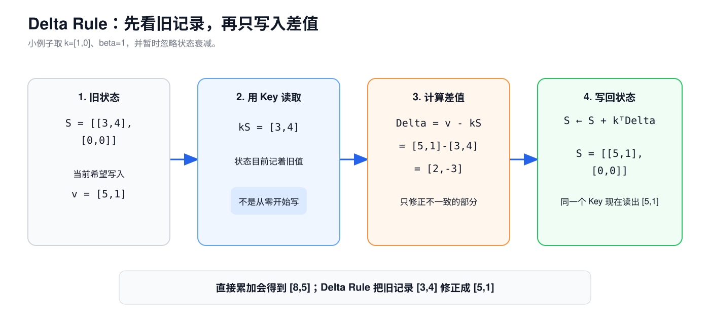
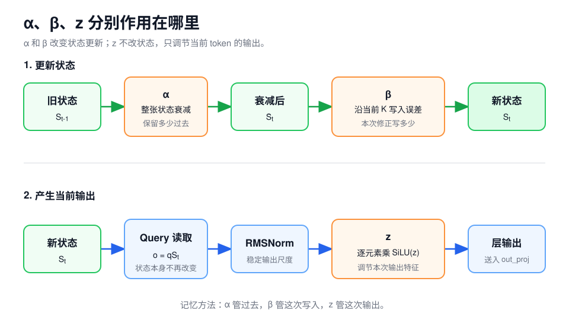
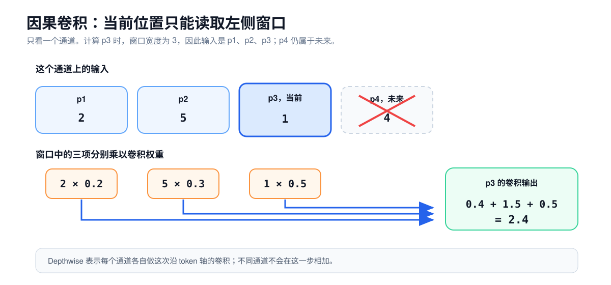
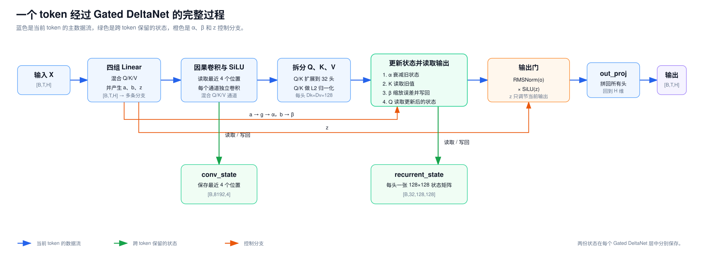
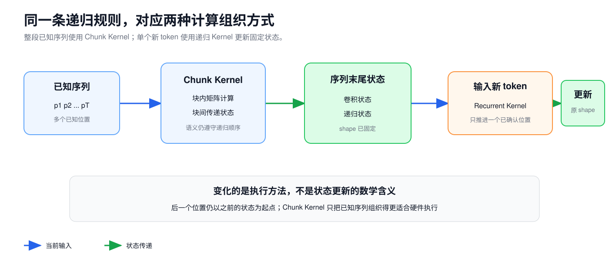

# 第 4 课：Gated DeltaNet 的状态更新机制

第 2 课把 Decoder Layer 中负责联系不同 token 的部分称为 Token Mixer。第 3 课讲了其中一种实现：Full Attention。它保留各个历史位置的 K/V，当前 Query 再与这些 Key 逐一比较。

Qwen3.5-9B 还使用另一种 Token Mixer：Gated DeltaNet。它不保留一排可以逐位置读取的 K/V，而是为每个头维护一张固定大小的状态矩阵。新 token 到来时，模型先修改这张矩阵，再从中读出当前输出。

```text
Full Attention：历史保留为 k1/v1、k2/v2、...、kt/vt
Gated DeltaNet：历史不断写入同一张状态矩阵 S
```

Qwen3.5-9B 一共有 32 个 Decoder Layer，其中 24 层使用 Gated DeltaNet，8 层使用 Full Attention。层的排列方式是 3 个 Gated DeltaNet 层接 1 个 Full Attention 层，这组结构重复 8 次。


## 1. Gated DeltaNet 位于 Token Mixer 子层

两类 Decoder Layer 的公共结构相同：

```text
Full Attention Layer：
x → RMSNorm → Full Attention → 残差相加 → RMSNorm → FFN → 残差相加

Gated DeltaNet Layer：
x → RMSNorm → Gated DeltaNet → 残差相加 → RMSNorm → FFN → 残差相加
```

Gated DeltaNet 替换的是 Attention 所在的 Token Mixer 子层。RMSNorm、残差连接和 FFN 仍然保留，它也没有替换整个 Decoder Layer。

两类 Token Mixer 都让当前位置利用此前的信息，但保存历史和读取历史的方法不同：

| | Full Attention | Gated DeltaNet |
| --- | --- | --- |
| 历史怎样保存 | 每个位置保留一份 K/V | 每个头维护一张状态矩阵 |
| 当前 token 怎样读取 | Q 与历史 K 打分，再按权重汇总 V | Q 直接乘状态矩阵 |
| 是否生成 Softmax 权重 | 是 | 否 |
| 状态 shape 是否随序列变长 | 是 | 否 |

要理解右边这条路径，先要回答一个问题：一张矩阵怎样汇总多个 token 的信息？

## 2. 从逐个保存 K/V 到状态矩阵

先看最简单的线性状态，不加入遗忘和修正。每个 token 产生 Key `k_t` 和 Value `v_t`，模型把二者的外积加入状态：

$$
S_t=S_{t-1}+k_t^Tv_t
$$

本课把 `k_t` 和 `v_t` 写成行向量。设 Key 宽度为 `Dk`，Value 宽度为 `Dv`：

```text
k_t       [1,Dk]
k_t^T     [Dk,1]
v_t       [1,Dv]
k_t^T v_t [Dk,Dv]
S_t       [Dk,Dv]
```

外积会得到一张与状态同 shape 的矩阵。把多个 token 的外积不断相加，状态可以写成：

$$
S_t=\sum_{i=1}^{t}k_i^Tv_i
$$

当前 Query `q_t:[1,Dk]` 读取状态时：

$$
q_tS_t=\sum_{i=1}^{t}(q_tk_i^T)v_i
$$

这一步可以从两种计算顺序理解。先暂时忽略 Full Attention 中的 Softmax：

```text
逐个读取历史：q 先与每个 k_i 点积，再用这些分数汇总 v_i
固定状态读取：先把每个 k_i^T v_i 累加成 S，再计算 qS
```

矩阵乘法的结合律使两种顺序得到相同结果：

$$
\sum_{i=1}^{t}(q_tk_i^T)v_i
=q_t\left(\sum_{i=1}^{t}k_i^Tv_i\right)
=q_tS_t
$$

因此，`S` 可以看作历史 K/V 共同写成的一张状态矩阵。读取时不再逐个访问 `k_1...k_t` 和 `v_1...v_t`，而是让当前 Query 直接乘 `S`。

这个推导只适用于没有 Softmax 的线性 Attention。第 3 课的 Full Attention 要先得到一整行分数，再对这一行执行 Softmax；Softmax 无法按上面的方式提前累积进固定矩阵。两类 Token Mixer 的 Q/K/V 分工相似，计算并不等价。

### 2.1 用两个二维向量看一次写入

设初始状态为：

$$
S_0=
\begin{bmatrix}
0&0\\
0&0
\end{bmatrix}
$$

第一个 token 产生：

$$
k_1=[1,0],\qquad v_1=[3,4]
$$

外积为：

$$
\begin{aligned}
k_1^Tv_1
&=\begin{bmatrix}
1\\
0
\end{bmatrix}
\begin{bmatrix}3&4\end{bmatrix} \\
&=\begin{bmatrix}
1\times3&1\times4\\
0\times3&0\times4
\end{bmatrix} \\
&=\begin{bmatrix}
3&4\\
0&0
\end{bmatrix}
\end{aligned}
$$

这里算的是外积，不是点积。列向量中的每个数字都会乘完整的 `v_1`：`k_1` 的第一个分量是 1，所以状态第一行写入 `[3,4]`；第二个分量是 0，所以第二行写入 `[0,0]`。

因此：

$$
S_1=
\begin{bmatrix}
3&4\\
0&0
\end{bmatrix}
$$

如果 Query 是 `q=[1,0]`，读取结果为：

$$
qS_1=[1,0]
\begin{bmatrix}
3&4\\
0&0
\end{bmatrix}
=[3,4]
$$

在这个特意简化的例子中，`[1,0]` 只读取矩阵第一行。真实的 Q 和 K 是连续向量，一次读写通常会同时涉及多行。

### 2.2 简单累加会混合新旧 Value

假设第二个 token 仍产生 `k_2=[1,0]`，但新的 Value 是 `v_2=[5,1]`。如果继续直接累加外积：

$$
\begin{aligned}
S_2
&=S_1+k_2^Tv_2 \\
&=\begin{bmatrix}
3&4\\
0&0
\end{bmatrix}
+\begin{bmatrix}
5&1\\
0&0
\end{bmatrix} \\
&=\begin{bmatrix}
8&5\\
0&0
\end{bmatrix}
\end{aligned}
$$

用相同 Key 读取时得到 `[8,5]`，新旧 Value 叠在了一起。模型当前希望这个方向返回 `[5,1]`，直接累加却无法修正旧内容。

Delta Rule 改为写入新旧 Value 的差值。

## 3. Delta Rule：先读取旧值，再写入差值

Delta Rule 不把新的 Value 整体加进状态。它先用当前 Key 读取旧状态：

$$
\hat v_t=k_tS_{t-1}
$$

然后比较目标 Value 与旧状态返回值：

$$
\Delta_t=v_t-\hat v_t
$$

最后沿当前 Key 的方向写入这段差值：

$$
S_t=S_{t-1}+k_t^T\Delta_t
$$

本节仍令 `α=1`、`β=1`，并假设 Key 已经过 L2 归一化，也就是向量长度为 1。`k=[1,0]` 满足这些条件，Qwen3.5 在真实计算中也会归一化 K。在这些条件下，沿 K 写回全部差值后，相同的 K 会读到新 Value。

继续使用上一节的数字。旧状态为：

$$
S_1=
\begin{bmatrix}
3&4\\
0&0
\end{bmatrix}
$$

第二个 token 的 `k_2=[1,0]`、`v_2=[5,1]`。先读取旧值：

$$
\hat v_2=k_2S_1=[3,4]
$$

再计算需要修正的差值：

$$
\Delta_2=[5,1]-[3,4]=[2,-3]
$$

写回状态：

$$
\begin{aligned}
S_2
&=S_1+k_2^T\Delta_2\\
&=
\begin{bmatrix}
3&4\\
0&0
\end{bmatrix}
+
\begin{bmatrix}
1\\
0
\end{bmatrix}
\begin{bmatrix}2&-3\end{bmatrix}\\
&=
\begin{bmatrix}
5&1\\
0&0
\end{bmatrix}
\end{aligned}
$$

现在，相同 Key 从状态中读到 `[5,1]`。Delta 指的是目标值与旧返回值之间的误差。模型写入误差，用来修正已有关系，而不是把新内容再累加一次。



这个例子使用了方向清楚的 `k=[1,0]`。真实 Key 不会精确选择某一行。不同 Key 的方向可能重叠，因此一条关系的更新也可能影响其他关系。状态矩阵是连续数值形成的有限状态，不是一张精确的 Key-Value 字典。

## 4. α 和 β 控制状态更新

上一节每次都写入完整误差，也完整保留旧状态。Gated DeltaNet 为这两步分别加入控制量。

### 4.1 β 控制本次修正幅度

`β_t` 位于 0 和 1 之间。它只缩放本次误差：

$$
e_t=\beta_t(v_t-\hat v_t)
$$

如果上一节的 `β=0.5`，误差 `[2,-3]` 只写入一半：

$$
e_2=0.5[2,-3]=[1,-1.5]
$$

$$
\begin{aligned}
S_2
&=\begin{bmatrix}
3&4\\
0&0
\end{bmatrix}
+\begin{bmatrix}
1&-1.5\\
0&0
\end{bmatrix} \\
&=\begin{bmatrix}
4&2.5\\
0&0
\end{bmatrix}
\end{aligned}
$$

`β` 接近 0 时，当前 token 几乎不修改这个 Key 方向；接近 1 时，状态会更积极地向当前 Value 修正。Qwen3.5 先用 Linear 产生 `b`，再通过 Sigmoid 得到 `β`：

$$
\beta=\frac{1}{1+e^{-b}}
$$

### 4.2 α 控制旧状态保留多少

`α_t` 也位于 0 和 1 之间。它在读取和修正之前缩放整张旧状态：

$$
\bar S_t=\alpha_tS_{t-1}
$$

`α` 接近 1 时，大部分旧状态得到保留；接近 0 时，整张状态快速减弱。它和 `β` 的作用范围不同：

```text
α：先缩放整张旧状态
β：再缩放当前 Key 方向的修正量
```

举一个连续的例子。设旧状态是：

$$
S_2=
\begin{bmatrix}
5&1\\
0&0
\end{bmatrix}
$$

第三个 token 产生：

$$
\alpha_3=0.5,\quad \beta_3=0.5,\quad
k_3=[1,0],\quad v_3=[3,3]
$$

第一步，旧状态先乘 `α`：

$$
\bar S_3=0.5S_2=
\begin{bmatrix}
2.5&0.5\\
0&0
\end{bmatrix}
$$

第二步，Key 读取衰减后的状态：

$$
\hat v_3=k_3\bar S_3=[2.5,0.5]
$$

第三步，计算误差并乘 `β`：

$$
e_3=0.5([3,3]-[2.5,0.5])=[0.25,1.25]
$$

第四步，写回状态：

$$
\begin{aligned}
S_3
&=\begin{bmatrix}
2.5&0.5\\
0&0
\end{bmatrix}
+\begin{bmatrix}
0.25&1.25\\
0&0
\end{bmatrix} \\
&=\begin{bmatrix}
2.75&1.75\\
0&0
\end{bmatrix}
\end{aligned}
$$

### 4.3 完整的状态更新公式

完整的单步更新可以写成五行：

$$
\bar S_t=\alpha_tS_{t-1}
$$

$$
\hat v_t=k_t\bar S_t
$$

$$
e_t=\beta_t(v_t-\hat v_t)
$$

$$
S_t=\bar S_t+k_t^Te_t
$$

$$
o_t=\frac{q_tS_t}{\sqrt{D_k}}
$$

前四行修改状态，第五行用当前 Query 读取更新后的状态。输出在当前 token 写入以后读取，所以当前位置的信息可以进入当前位置的输出。这和因果 Attention 允许一个位置读取自己相符。

本课采用行向量记法，状态 shape 是 `[Dk,Dv]`，与 Qwen3.5 参考实现的状态布局一致。Gated DeltaNet 论文采用列向量，并把状态写成 `[Dv,Dk]`，所以论文中的乘法方向与本课互为转置，计算含义相同。

Qwen3.5 的代码先计算负数 `g`，递归计算实际使用 `α=exp(g)`。代码中的原始投影 `a` 不是 `α`。`β` 由 `sigmoid(b)` 得到。

## 5. Q、K、V 在 Gated DeltaNet 中的分工

Gated DeltaNet 沿用了 Q、K、V 这三个名称，但没有执行 Full Attention 的 `QK^T → 遮罩 → Softmax → 权重乘 V`。

| 向量 | 在 Gated DeltaNet 中的作用 |
| --- | --- |
| K | 从旧状态读取当前方向的已有内容，并确定误差写回的方向 |
| V | 给出当前方向希望记录的新内容 |
| Q | 从更新后的状态读取当前输出 |

计算顺序是：K 先检查并修改状态，Q 再从新状态读取结果。

Qwen3.5 在进入状态更新前会对 Q/K 做 L2 归一化，也就是把每条向量缩放到长度约为 1。这样处理符合前面手算的单位 Key 条件，也让读写方向主要取决于各维度的相对比例。整条 Q 或 K 同时放大几倍，不会改变归一化后的向量。Query 读取结果时还乘以 `1/√Dk`，用于控制数值尺度。

## 6. 输出门 z 的作用

状态读出的 `o_t` 不会直接进入输出投影。Qwen3.5 还为当前 token 计算一条 `z_t` 分支：

```text
状态读出 o_t
→ RMSNorm
→ 与 SiLU(z_t) 逐元素相乘
→ 拼回所有头
→ out_proj
→ H 维输出
```

`z` 只作用于当前层送出的结果，不会修改状态矩阵。三个控制量的分工是：

| 控制量 | 作用位置 | 作用 |
| --- | --- | --- |
| `α` | 读取旧状态之前 | 缩放整张旧状态 |
| `β` | 误差写回时 | 缩放当前修正量 |
| `z` | 状态读出之后 | 逐元素调节当前输出 |

`SiLU(z)` 的输出不限于 0 到 1，因此 `z` 不是二值开关。它可以压低某些输出特征，也可以改变特征的尺度和符号。



## 7. 因果卷积先混入短距离上下文

前面的公式从 Q、K、V 开始。Qwen3.5 在此之前还有一步：先让生成 Q、K、V 的通道读取最近几个位置。

```text
隐藏状态 X
→ Linear 得到混合 Q/K/V 通道
→ 沿 token 轴做因果卷积
→ SiLU
→ 拆成 Q、K、V
→ 更新状态矩阵
```

假设某个通道在四个位置上的数值是：

```text
位置：p1  p2  p3  p4
数值： 2   5   1   4
```

为了手算，设卷积窗口长度为 3，权重是 `[0.2,0.3,0.5]`。位置 `p3` 的结果为：

$$
0.2\times2+0.3\times5+0.5\times1=2.4
$$

计算 `p3` 时只能使用 `p1`、`p2` 和 `p3`，不能读取仍在右侧的 `p4`，因此称为因果卷积。



Qwen3.5 的真实卷积窗口宽度是 4，权重由训练得到。它使用深度卷积，每个通道分别沿 token 轴处理；这一步不混合不同通道，也不改变 token 数量。通道之间的组合已经由前面的 Linear 完成。

当模型逐 token 生成时，计算新位置的卷积仍需要最近几个混合 Q/K/V 投影值。因此，每个 Gated DeltaNet 层会保存一份 `conv_state`。状态矩阵则保存在另一份 `recurrent_state` 中：

```text
conv_state       保存最近几个位置，供短窗口卷积使用
recurrent_state  保存 Delta Rule 持续更新的状态矩阵
```

Gated DeltaNet 层不使用 Full Attention 中的 RoPE。短窗口因果卷积只能读取当前位置和左侧位置，状态矩阵也按 token 顺序更新，这两部分共同保留了顺序信息。

## 8. 一个 token 经过 Gated DeltaNet 的完整计算

把前面的部件接起来，一个 token 在 Gated DeltaNet 子层中会经过以下步骤：

1. 输入 `X` 经过四组 Linear，分别产生混合 Q/K/V、`a`、`b` 和 `z`。
2. 混合 Q/K/V 经过因果卷积和 SiLU，再拆成 Q、K、V。
3. Q/K 从 16 个头扩展到与 Value 相同的 32 个头，再沿头维做 L2 归一化。
4. `a` 经过变换得到负数 `g`，状态更新使用 `α=exp(g)`；`b` 经过 Sigmoid 得到 `β`。
5. 旧状态先乘 `α`，K 读取旧内容，`β` 缩放误差，然后沿 K 的方向写回误差。
6. Q 从更新后的状态读取输出。
7. 读出结果经过 RMSNorm，再与 `SiLU(z)` 逐元素相乘。
8. 所有头拼回后通过 `out_proj`，输出回到 `[B,T,H]`。



这条路径位于 Decoder Layer 的残差分支中。`out_proj` 后的结果与进入 Token Mixer 前保存的 `x` 逐元素相加，然后再进入 FFN 子层。

## 9. 序列级计算与单步递推

状态更新有明确的先后关系：位置 `t` 的 `S_t` 依赖位置 `t-1` 的 `S_{t-1}`。处理一段已经给定的 token 时，数学上仍然要按这个顺序传递状态。

工程实现不会因此为每个位置分别启动一次很小的 GPU Kernel。Chunk Gated Delta Rule 会把一段连续更新改写成较大的矩阵计算，并把一个 Chunk 的最终状态交给下一个 Chunk。它改变的是计算组织方式，得到的状态仍与逐 token 递推一致。

当模型已经有历史状态，并且只处理一个新 token 时，实现可以直接执行一次递归更新：

```text
处理一段已知序列：              Chunk Gated Delta Rule
已有历史状态，只处理一个新 token：Recurrent Gated Delta Rule
```

一次处理整段已知输入通常称为 Prefill；基于已有状态生成一个新 token 通常称为 Decode。这里先说明 Gated DeltaNet 的两条实现路径，第 6 课再把 Prefill 和 Decode 放回完整生成过程。



## 10. Qwen3.5-9B 的张量 shape

Qwen3.5-9B 的 Gated DeltaNet 配置是：

```text
Hidden Size H            = 4096
Q/K 头数量               = 16
V 头数量                 = 32
Q/K 头维 Dk              = 128
V 头维 Dv                = 128
因果卷积宽度             = 4
```

输入 `X:[B,T,4096]` 后，各分支的 shape 如下：

| 数据 | shape | 怎样得到 |
| --- | --- | --- |
| 混合 Q/K/V | `[B,T,8192]` | `2048 + 2048 + 4096` |
| Q，扩头前 | `[B,T,16,128]` | 16 个 Q 头 |
| K，扩头前 | `[B,T,16,128]` | 16 个 K 头 |
| V | `[B,T,32,128]` | 32 个 V 头 |
| Q/K，扩头后 | `[B,T,32,128]` | 每个 Q/K 头供 2 个 V 头使用 |
| `β` | `[B,T,32]` | 每个 V 头一个修正幅度 |
| `g` | `[B,T,32]` | 每个 V 头一个对数衰减值 |
| `z` | `[B,T,32,128]` | 每个输出元素一项调节值 |
| `recurrent_state` | `[B,32,128,128]` | 对序列长度 `T` 固定 |
| `conv_state` | `[B,8192,4]` | 对序列长度 `T` 固定，保存长度为 4 的窗口 |
| `out_proj` 后 | `[B,T,4096]` | 回到残差接口宽度 |

混合 Q/K/V 的 8192 维来自：

$$
16\times128+16\times128+32\times128=8192
$$

Q/K 从 16 个头扩展到 32 个头，是为了与 32 个 Value 头一一对应。实现会把每个 Q/K 头重复两次，这不表示模型训练了两套相同权重。

`recurrent_state:[B,32,128,128]` 可以这样读：一个请求在一个 Gated DeltaNet 层中有 32 个头，每个头各自维护一张 `128×128` 状态矩阵。不同层也各有自己的状态，它们不会共用一张矩阵。

### 10.1 状态容量

一个层、一个请求的递归状态包含：

$$
32\times128\times128=524288
$$

个元素。按当前参考实现使用 FP32 计算，约为 2 MiB/层；24 个 Gated DeltaNet 层约为 48 MiB。

卷积状态每层包含 `8192×4=32768` 个元素。若按 BF16 计算，24 层约为 1.5 MiB。两类状态合计约 49.5 MiB/请求。这个数字不含分配和对齐开销、Kernel 临时张量，也不含 8 个 Full Attention 层保存的 KV Cache。不同推理框架也可能采用不同 dtype 或布局。

## 11. 与 Full Attention 的结构差异

| 对比项 | Full Attention | Gated DeltaNet |
| --- | --- | --- |
| 历史表示 | 每个位置一份 K/V | 每头一张固定状态矩阵 |
| 当前读取方式 | Q 与历史 K 打分，再汇总 V | Q 直接乘状态矩阵 |
| 历史长度轴 | 明确保留 | 汇总进状态，不再逐位置保留 |
| 状态容量 | 随序列长度增长 | 不随序列长度增长 |
| 读取历史的工作量 | 随历史长度增长 | 对历史长度固定 |
| 旧信息怎样变化 | 已保存的 K/V 保持原值 | 状态会衰减、修正和相互干扰 |
| Softmax | 使用 | 不使用 |
| 顺序信息 | RoPE 与因果遮罩 | 因果卷积与递归更新顺序 |

状态容量固定，历史信息却不是无损保存的。许多 token 共用同一张状态矩阵，旧信息可能衰减或被新信息改写，相近的 Key 方向也会相互影响。Full Attention 的历史读取成本更高，但当前 Query 可以直接对不同历史位置分别打分。

固定 shape 也不能直接推出实际延迟。Gated DeltaNet 每个新 token 仍要完成 Linear、卷积、状态矩阵读写、门控和输出投影，实际速度还取决于 Kernel 实现、Batch 和硬件。

Qwen3.5 同时保留两类 Token Mixer。24 个 Gated DeltaNet 层维护固定状态，8 个 Full Attention 层仍保存随序列长度增长的 K/V。因此，整个模型跨 token 保留的状态仍会随序列变长。第 6 课会讨论这些状态在完整生成过程中的建立和复用。

## 12. 练习

只看一个头，给定：

$$
S_{t-1}=
\begin{bmatrix}
2&1\\
0&3
\end{bmatrix},\quad
\alpha=0.5,\quad \beta=0.5
$$

$$
k=[1,0],\quad v=[4,2],\quad q=[1,0],\quad D_k=2
$$

依次完成下面 7 项：

1. 衰减后的状态 `\bar S_t`。
2. Key 读到的旧值 `\hat v_t`。
3. 乘过 `β` 的修正量 `e_t`。
4. 更新后的状态 `S_t`。
5. Query 读出的 `o_t`。

6. 序列从 4096 个 token 增长到 8192 个 token 时，`recurrent_state` 的 shape 会不会翻倍？
7. Qwen3.5 跨 token 保留的状态是否只有 8 个 Full Attention 层的 K/V？

<details>
<summary>查看答案</summary>

1. 旧状态先衰减：

```text
S_bar = 0.5 × S_prev = [[1, 0.5], [0, 1.5]]
```

2. Key 读取旧值：

```text
v_old = k × S_bar = [1, 0.5]
```

3. 乘过 `β` 的修正量是：

```text
e = 0.5 × ([4, 2] - [1, 0.5]) = [1.5, 0.75]
```

4. 更新状态：

```text
S = S_bar + kᵀ × e = [[2.5, 1.25], [0, 1.5]]
```

5. Query 读取并按 `√Dk` 缩放：

```text
o = q × S / √2 = [2.5, 1.25] / √2 ≈ [1.768, 0.884]
```

6. 序列变长时，`recurrent_state` 中的数值继续更新，shape 不变。Qwen3.5 还有 8 个 Full Attention 层，它们保存的 K/V 会随序列长度增长。

7. 不是。24 个 Gated DeltaNet 层还各自保留 `conv_state` 和 `recurrent_state`。

</details>

## 本课小结

Gated DeltaNet 用固定大小的矩阵保存持续更新的历史状态。它先用 `α` 衰减旧状态，再用 K 检查已有内容，用 `β` 控制误差写回，最后用 Q 从新状态中读取输出。`z` 只调节当前输出，因果卷积则为 Q/K/V 混入最近几个位置。

理解这条状态更新链以后，可以明确区分两类 Token Mixer：Full Attention 保留逐位置 K/V，Gated DeltaNet 将历史写入有限状态。第 5 课将继续补全 Decoder Layer 中的另一半计算，说明 Dense FFN 和 MoE 怎样处理每个 token 的特征。

## 参考资料

以下 Qwen3.5、Transformers 和 FLA 实现于 2026-08-08 按固定 revision 复核：

- [Qwen3.5-9B-Base 模型卡，revision 68c46c4](https://huggingface.co/Qwen/Qwen3.5-9B-Base/blob/68c46c4b3498877f3ef123c856ecfde50c39f404/README.md)
- [Qwen3.5-9B-Base `config.json`，revision 68c46c4](https://huggingface.co/Qwen/Qwen3.5-9B-Base/blob/68c46c4b3498877f3ef123c856ecfde50c39f404/config.json)
- [Transformers：Qwen3.5 模型实现，revision 9436284](https://github.com/huggingface/transformers/blob/943628458a1691f8af09c47ea9fc6e314734722f/src/transformers/models/qwen3_5/modeling_qwen3_5.py)
- [Transformers：Linear Attention Cache，revision 9436284](https://github.com/huggingface/transformers/blob/943628458a1691f8af09c47ea9fc6e314734722f/src/transformers/cache_utils.py)
- [Flash Linear Attention：Gated Delta Rule，revision 3c4c54a](https://github.com/fla-org/flash-linear-attention/tree/3c4c54ae7397d37130d7101edd0f4eb596af896d/fla/ops/gated_delta_rule)
- [NVIDIA：GatedDeltaNet 官方实现，revision b53d6d3](https://github.com/NVlabs/GatedDeltaNet/tree/b53d6d3a161267432a79c1c04af69fa52bddc921)

算法原理参考：

- [Gated Delta Networks: Improving Mamba2 with Delta Rule](https://arxiv.org/abs/2412.06464)
- [Parallelizing Linear Transformers with the Delta Rule over Sequence Length](https://arxiv.org/abs/2406.06484)

---

[上一课：Attention 的计算原理](03-attention.md) · [返回课程路线](../roadmap.md) · [下一课：Dense FFN 与 MoE 的结构差异](05-dense-and-moe.md)
