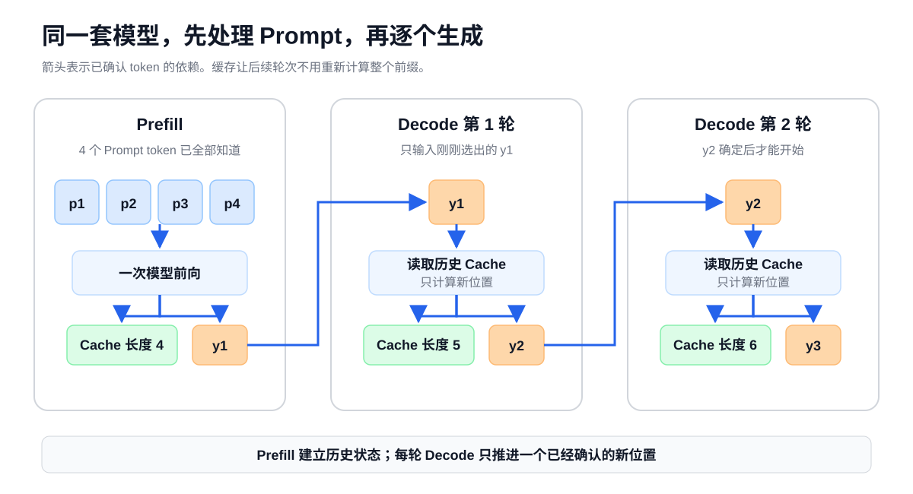
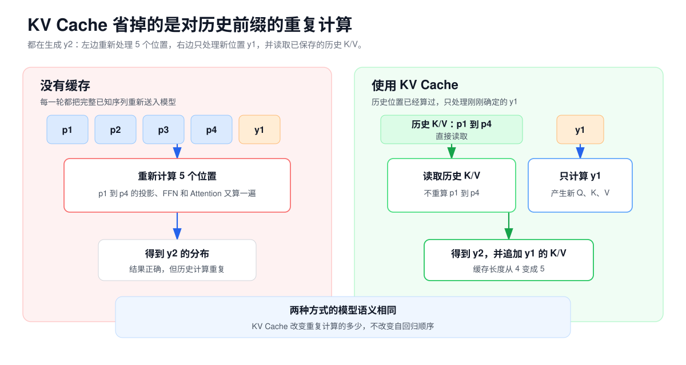
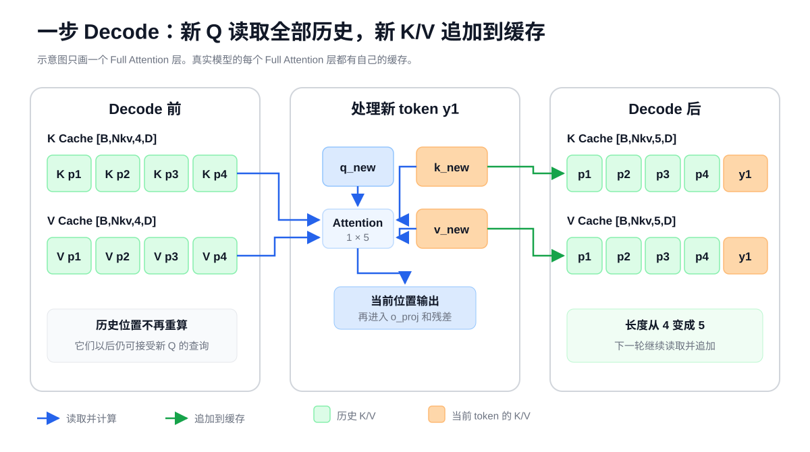
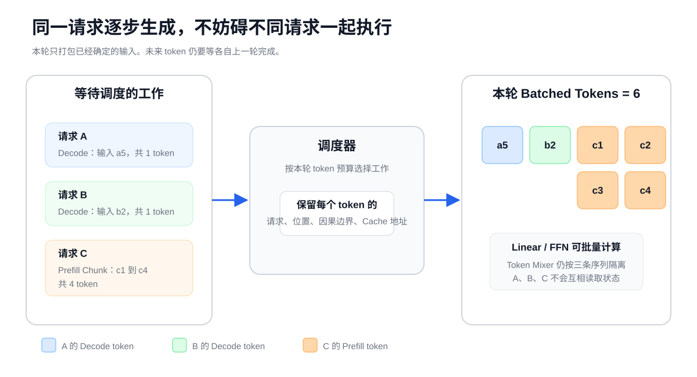
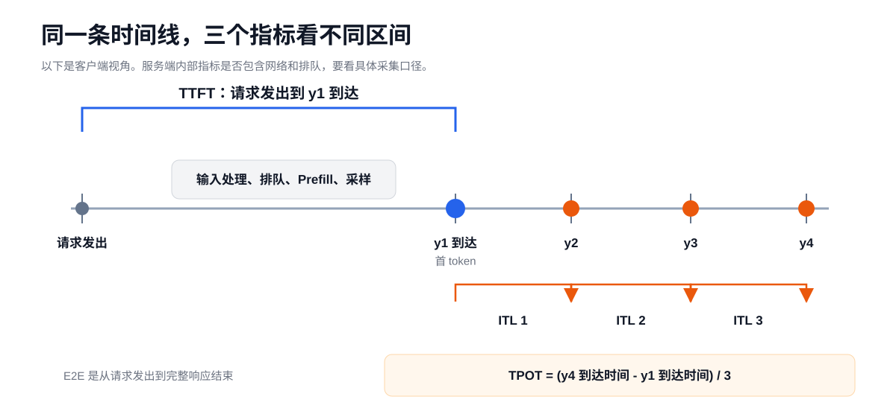

# 第 4 课：Prefill、Decode 与 KV Cache

生成回答时，模型会反复执行同一套 Decoder。第一轮要处理完整 Prompt，后面的每一轮通常只处理刚生成的一个 token。两类计算使用同一套权重，输入规模和可复用状态却不同。

假设 Chat Template 和 Tokenizer 最终产生 4 个 Prompt token：

```text
p1  p2  p3  p4
```

模型接下来要生成：

```text
y1  y2  y3
```

模型不能把这 7 个 token 一次算完，因为开始时只有 `p1` 到 `p4` 已知。它先用 Prompt 选出 `y1`，下一轮再用 `y1` 选出 `y2`。历史计算已经保存在请求状态里，所以后续每轮只需送入刚刚确定的新 token。对 Full Attention 层来说，这份状态主要是 KV Cache。



这条时间线里有四个问题：Prefill 做了什么，Decode 为什么只能逐 token 推进，KV Cache 省掉了哪些重复计算，以及多个请求怎样进入同一轮执行。

## 1. Prefill 与 Decode 的阶段划分

一次普通自回归生成通常分成 Prefill 和 Decode 两个阶段。

| 阶段 | 本轮已经知道什么 | 一次模型前向处理什么 | 得到什么 |
| --- | --- | --- | --- |
| Prefill | 完整 Prompt | Prompt 中多个已知位置 | 第一个输出 token 的 Logits，并建立历史状态 |
| Decode | Prompt 和此前已经生成的 token | 每个请求当前最新的一个位置 | 下一个 token 的 Logits，并更新历史状态 |

中文资料有时把 Prefill 叫作提示词处理或上下文阶段，把 Decode 叫作逐 token 生成阶段。本课程保留工程中更常见的英文名。

Prefill 的模型前向不会直接吐出文字。它产生最后一个 Prompt 位置的 Logits，贪心或采样再从中选出 `y1`。服务系统通常把从收到请求到返回 `y1` 的整段过程看作首 token 阶段。

随后进入重复的 Decode 循环：

```text
把 y1 送入模型 → 得到预测 y2 的 Logits → 选出 y2
把 y2 送入模型 → 得到预测 y3 的 Logits → 选出 y3
...
```

因此，图中的“Decode 第 1 轮”以 `y1` 为输入，预测的是 `y2`。有些框架会把产生 `y1` 也称为第一步 Decode。阅读指标或代码时，要先确认它对阶段边界的定义，不要只根据名字判断。

## 2. Prefill 的已知输入与并行计算

Prompt 中的 token 都由用户输入、系统提示词和 Chat Template 提前确定。模型开始执行前，`p1` 到 `p4` 的具体 Token ID 已经全部知道。

这与第 1 课讲训练时能同时计算多个位置有同一个前提：输入位置已经给出。区别在于，训练还会把每个位置的预测与右移一位的真实目标比较；Prefill 只执行前向并建立本次请求的状态。

以一个 Full Attention 层为例，4 个位置的 Q、K、V 可以一起计算：

```text
Q：[B,Nq,4,D]
K：[B,Nkv,4,D]
V：[B,Nkv,4,D]
```

因果遮罩仍然限制每一行能够读取的范围：

```text
p1 只能读取 p1
p2 可以读取 p1、p2
p3 可以读取 p1、p2、p3
p4 可以读取 p1、p2、p3、p4
```

这个限制并不要求 GPU 先算完 `p1`，再开始算 `p2`。在 Full Attention 层里，4 个位置的输入都已经来自上一层，Q/K/V 和分数矩阵可以放进同一组张量运算。因果遮罩只决定矩阵中的哪些位置能参与结果。

可以把它理解成一张已经写完的试卷。4 道题可以一起送进阅卷系统，但第 2 道题的评分规则只允许使用前两段材料。规则限制了每道题能读什么，不要求阅卷系统一次只能处理一道题。

这个类比只解释“输入已知”和“读取范围”是两回事。模型实际执行的是张量计算，不是真的在逐题阅卷。

“Prompt 可以并行”是一种简写，不表示模型里的所有运算都彼此独立。Decoder Layer 仍要逐层执行，Qwen3.5 的 Gated DeltaNet 层内部也有递归状态依赖。更准确的说法是：Prompt 的 token 在前向开始前已经全部确定，runtime 可以把多个已知位置组织成一次或若干次较大的前向计算。至于每个算子内部怎样并行，由模型结构和 Kernel 决定。

## 3. Decode 的自回归依赖

`y1` 到 `y3` 与 Prompt 不同。开始生成时，它们的值还没有确定。

三个输出 token 的联合概率可以拆成：

$$
P(y_1,y_2,y_3\mid p)
=P(y_1\mid p)\,
P(y_2\mid p,y_1)\,
P(y_3\mid p,y_1,y_2)
$$

这里的 `p` 表示完整 Prompt。公式只表达一件事：

```text
y1 的选择会进入 y2 的条件
y1 和 y2 的选择会进入 y3 的条件
```

如果 `y1` 尚未选出，模型就不知道预测 `y2` 时应该使用哪条序列。比如 `y1` 可能是“是”，也可能是“不是”，两条分支会得到不同的后续分布。

所以，普通自回归模型不能把未来 100 个未知 token 直接当成 `T=100` 的已知输入。一个请求内部的未来 token 存在真实的数据依赖，不是 GPU 并行度不足，也不是框架漏做了优化。

推测解码和多 token 预测会同时提出多个候选，但仍需要主模型验证，错误候选还会被丢弃。它们改变了获得已确认 token 的方法，没有取消自回归条件。

## 4. Prefill 的输出与请求状态

设单个请求的 Prompt 长度为 `T=4`，Qwen3.5-9B 的隐藏维度为 `H=4096`。Prefill 的文本主线是：

```text
Token IDs                    [1,4]
→ Embedding                  [1,4,4096]
→ 32 个 Decoder Layer        [1,4,4096]
→ 最终 RMSNorm               [1,4,4096]
→ 取最后位置 p4 的表示       [1,4096]
→ LM Head                    [1,V]
→ 贪心或采样
→ y1
```

每个 Full Attention 层还会把 Prompt 的 K/V 写入本层缓存。Qwen3.5-9B 使用 GQA，单个 Full Attention 层的缓存 shape 为：

```text
K Cache：[B,Nkv,T,D] = [1,4,4,256]
V Cache：[B,Nkv,T,D] = [1,4,4,256]
```

这里的第一个 `4` 是 `Nkv=4`，第二个 `4` 是 Prompt 长度 `T=4`。两个数字碰巧相同，含义完全不同。

Prefill 还会产生所有 Prompt 位置的中间 Hidden States 和 Attention 临时结果。这些数据大多只服务于当前前向计算，完成后可以释放。需要跨 Decode 轮次保留的是缓存状态，而不是每层所有中间张量。

LM Head 也不一定要计算 4 个位置的完整词表 Logits。生成 `y1` 只需要最后一个 Prompt 位置。Qwen3.5 的 Transformers 实现支持通过 `logits_to_keep` 限制计算位置；不同 runtime 可能采用不同实现，但模型语义相同。

## 5. KV Cache 的复用机制

第 3 课已经看到，Decoder 使用因果遮罩。位置 `p2` 在任何一层都不能读取未来的 `p3`、`p4` 或后来生成的 token。因此，未来 token 到来后，`p2` 在这一层产生的 K/V 不需要回头修改。

对过去位置来说：

```text
输入前缀没有变化
该位置能读取的左侧内容没有变化
对应层计算出的 K/V 也没有变化
```

这使得 K/V 可以在后续轮次直接复用。

### 无缓存的重复计算

为了生成 `y2`，模型重新输入：

```text
p1 p2 p3 p4 y1
```

为了生成 `y3`，又重新输入：

```text
p1 p2 p3 p4 y1 y2
```

每一轮都会重复计算整个前缀的 Embedding、各层投影、FFN 和 Attention。

### 使用 KV Cache 的增量计算

Prefill 已经保存 `p1` 到 `p4` 的历史状态。选出 `y1` 后，下一轮只把 `y1` 送进模型。每个 Full Attention 层为 `y1` 计算新的 Q/K/V，让新 Q 读取历史 K/V，再把新 K/V 追加到缓存。

生成结果在模型语义上没有变化，减少的是对相同历史前缀的重复计算。



## 6. 单步 Decode 的数据流

假设 Prefill 后已有 4 个历史位置，缓存为：

```text
K_past：[B,Nkv,4,D]
V_past：[B,Nkv,4,D]
```

现在输入刚刚选出的 `y1`。这一层只为新位置计算：

```text
q_new：[B,Nq,1,D]
k_new：[B,Nkv,1,D]
v_new：[B,Nkv,1,D]
```

新 K/V 追加到历史缓存：

```text
K_all = concat(K_past, k_new)  → [B,Nkv,5,D]
V_all = concat(V_past, v_new)  → [B,Nkv,5,D]
```

然后只为新位置计算 Attention：

```text
q_new 与 K_all 打分          → [B,Nq,1,5]
Softmax 后汇总 V_all         → [B,Nq,1,D]
```



这一步完成后，缓存长度从 4 变成 5。下一轮输入 `y2` 时，过程相同，长度再变成 6。

### Q、K、V 的缓存需求

Q 表示当前位置发起的查询。`y1` 的 Q 只用于更新 `y1` 这个位置，后续生成 `y2`、`y3` 时不会再次读取它。

K 和 V 则不同。它们代表一个历史位置以后怎样接受查询、怎样提供信息。每个未来 token 的新 Q 都可能读取过去的 K/V，所以需要保留。

### RoPE 位置与 K Cache

Qwen3.5 的 Full Attention 先对 Q/K 应用 RoPE，再把 K 写入缓存。缓存中的 K 已经带有它原来的位置信息。追加新 K 时，必须使用连续且正确的位置编号。

因此，前缀复用、缓存拼接或位置重映射不能只检查 shape。位置编号和 RoPE 规则不一致时，缓存中的数值虽然仍能参与矩阵乘法，语义却已经错了。

## 7. KV Cache 容量估算

先只考虑标准 Full Attention 层，不计算内存分配器的块、对齐、元数据，也不考虑量化和并行切分。

每层要保存一份 K 和一份 V，因此元素数为：

$$
N_{elements}
=2\times L_{full}\times B\times T\times N_{kv}\times D
$$

换成字节：

$$
KV\ Cache\ Bytes
=2\times L_{full}\times B\times T\times N_{kv}\times D\times s
$$

| 符号 | 含义 |
| --- | --- |
| `2` | K 和 V 两份缓存 |
| `L_full` | 使用 Full Attention 的层数 |
| `B` | 同时保存状态的序列数 |
| `T` | 当前已缓存的 token 位置数 |
| `Nkv` | 每层 K/V 头数 |
| `D` | 每个头的维度 |
| `s` | 每个缓存元素占用的字节数 |

### 小模型计算示例

设：

```text
L_full = 2
B      = 1
T      = 3
Nkv    = 2
D      = 4
dtype  = BF16，每个元素 2 Bytes
```

那么：

$$
2\times2\times1\times3\times2\times4\times2
=192\ Bytes
$$

这 192 Bytes 可以逐层拆开检查：每层 K 有 `1×2×3×4=24` 个元素，V 也有 24 个；两层共 96 个元素，每个元素 2 Bytes。

### Qwen3.5-9B 的 KV Cache

Qwen3.5-9B 共 32 层，每 4 层中只有 1 层 Full Attention，因此：

```text
L_full = 8
Nkv    = 4
D      = 256
s      = 2 Bytes（按 BF16 KV Cache 计算）
```

单个请求每增加一个缓存 token，8 个 Full Attention 层合计增加：

$$
2\times8\times4\times256\times2
=32768\ Bytes
=32\ KiB
$$

于是：

| 已缓存长度 `T` | Full Attention KV Cache |
| ---: | ---: |
| 1 token | 32 KiB |
| 4096 token | 128 MiB |
| 32768 token | 1 GiB |

这里的 `T` 包括 Prompt 和已经追加进缓存的输出 token。若同时保存多个请求或 Beam，容量还要乘以对应序列数。

这只是 Full Attention 的 K/V 数值容量，不等于 runtime 实际申请的显存，也不等于 Qwen3.5 一个请求的全部状态。分块分配会产生预留和碎片；TP 可能把头分到不同设备；KV 量化会改变 `s`。更重要的是，Qwen3.5 的 24 个 Gated DeltaNet 层还保存 recurrent state 和卷积状态，第 5 课会单独解释。

`partial_rotary_factor=0.25` 也不会把 KV Cache 缩小到四分之一。RoPE 只旋转 K 的部分维度，缓存仍然保存完整的 `D=256` 维 K 和 V。

### PagedAttention 的缓存块管理

上面的公式回答了模型需要保存多少 K/V，却没有说明 runtime 怎样在显存中摆放这些数据。

如果每条请求都申请一段连续显存，系统很难提前知道它最后会生成多长。申请太少需要搬迁，申请太多又会留下大片空余。PagedAttention 的做法是把 KV Cache 分成固定大小的块：

```text
一条序列在逻辑上：token 1 → token 2 → token 3 → ...
显存中的物理块：  block 7 → block 21 → block 9 → ...
块表负责记录两者的对应关系
```

序列的 KV 在逻辑上仍然连续，物理块却不必挨在一起。请求增长时可以继续分配新块，不需要预留它可能达到的最大长度。相同前缀需要跨请求复用时，Prefix Cache 还可以让多个请求引用已有的缓存块。

分块并不会让显存利用率达到 100%。最后一个块可能没有填满，块表和分配器本身也占空间。所以公式算出的 KV 字节数是逻辑有效载荷，实际能容纳多少请求还要看：

```text
块大小
最后一个块的空余
Prefix Cache 共享了多少块
TP 下每张卡实际保存几个 KV 头
runtime 为缓存预留了多少显存
```

三个名称不要混在一起：

| 名称 | 回答的问题 |
| --- | --- |
| KV Cache | 模型为历史 token 保存什么？ |
| PagedAttention | runtime 怎样分配和定位这些 K/V？ |
| Prefix Cache | 不同请求何时能共用已经算好的前缀状态？ |

## 8. Prefill 与 Decode 的计算特征

模型权重没有在两个阶段之间切换，变化的是本轮输入的位置数和需要读取的历史状态。

| 对比项 | Prefill | Decode |
| --- | --- | --- |
| 每个请求本轮输入位置 | 多个 Prompt token | 通常 1 个最新 token |
| Linear/FFN | 同一套权重作用于多个位置 | 同一套权重作用于少量新位置 |
| Full Attention 查询数 | 多个 Q 位置 | 每个请求一个新 Q 位置 |
| 历史 K/V | 在本轮建立 | 每轮读取并追加 |
| 单请求并行空间 | 较大 | 较小 |

Prefill 的 Linear 和 FFN 可以把许多 token 行组成较大的矩阵乘法。Full Attention 在概念上还要处理 Prompt 内大量位置组合，长 Prompt 的 Attention 成本会快速增长。

Decode 每轮虽然只处理一个新位置，却仍要让这个位置通过所有模型层。每个 Full Attention 层还要读取不断增长的历史 K/V。小 Batch 时，矩阵较窄，权重读取、KV 读取、Kernel Launch 和 CPU 调度更容易进入关键路径；Batch 增大后，同一套权重可以服务更多新位置，计算形态又会变化。

Prefill 常偏计算，Decode 常偏访存，但这不是定律。模型结构、Batch、上下文长度和硬件都会改变瓶颈。判断实际情况，仍要看矩阵尺寸、缓存长度和执行时间线。

## 9. 多请求批量执行

假设服务端同时有三个请求：

```text
请求 A：已经生成到 a5，现在要处理新 token a5
请求 B：已经生成到 b2，现在要处理新 token b2
请求 C：Prompt 有 8 个 token，尚未完成 Prefill
```

A 和 B 各自只能向前推进一个已确认的 token，但这两个请求彼此没有依赖。runtime 可以把它们当前的新位置放进同一轮模型执行。

C 的 Prompt 也已经知道。如果调度器取出其中 4 个 token 作为一个 Prefill Chunk，这一轮就有 A、B 各 1 个 Decode token，再加上 C 的 4 个 Prefill token，共 6 个已知位置。



这些 token 可以在 Linear 和 FFN 中形成更大的矩阵。Token Mixer 不能把它们当成同一条序列，runtime 还必须为每个位置带上正确的请求归属、位置编号、因果边界和缓存地址。

这里应区分两种并行：

```text
请求内未来 token：存在依赖，不能普通并行确定
不同请求的已知 token：互不依赖，可以批量执行
```

## 10. Continuous Batching

传统静态 Batch 往往先凑齐一组请求，再让整组一起运行到结束。不同请求的输出长度不同时，短请求完成后可能仍要等待长请求，空出的计算位置也不能及时给新请求使用。

Continuous Batching 在生成迭代之间重新组织 Batch：

```text
本轮结束
→ 移除已经完成的请求
→ 加入可以执行的新请求或新 Prompt
→ 为仍在运行的请求安排下一步
→ 开始下一轮
```

短请求完成后可以及时离开，新请求也能接上空出的计算位置，因此服务端能更充分地利用每轮计算。请求 A 仍然不能提前知道自己的下一个 token，每条序列都要遵守原来的自回归顺序。

Continuous Batching 只保证 Batch 可以在两轮模型执行之间改变。它本身不保证 Prefill 和 Decode 一定能放进同一次模型执行。要做到混批，runtime 还要支持不同长度、不同阶段的序列元数据，并有能够处理这些输入的 Attention Kernel。

“一轮”也不等于一个固定的二维 `[B,T]` 矩形。推理 runtime 常把不同请求当前需要处理的 token 打包起来，再用元数据描述序列边界和缓存位置。看到日志中的 Batch Size 或 Batched Tokens 时，要确认它统计的是请求数、序列数还是本轮 token 数。

## 11. Chunked Prefill 与混合批处理

长 Prompt 全部一次处理会占用一轮较大的 token 预算，也可能让已经在 Decode 的请求等待更久。Chunked Prefill 把已知 Prompt 切成若干段：

```text
8-token Prompt
→ Chunk 1：p1 p2 p3 p4
→ Chunk 2：p5 p6 p7 p8
```

Chunk 2 不是独立的新 Prompt。它必须接着 Chunk 1 已建立的历史状态继续计算：Full Attention 读取前一段 K/V，Gated DeltaNet 读取前一段留下的 recurrent state 和卷积状态。

调度器可以先安排 Decode token，再用剩余的 batched-token 预算放入 Prefill Chunk。把两类 token 放进同一轮有两个直接作用：

- Decode 请求不用总被长 Prefill 阻塞；
- 剩余计算容量可以由 Prefill token 填充。

但 Chunk 越小并不保证所有指标都更好。一个 Prompt 可能需要经过更多调度轮次才能完成，TTFT 会受到队列、优先级、token 预算和当前负载影响。较大的 Chunk 有利于尽快完成 Prefill，却可能拉长同批 Decode 的间隔。

Chunked Prefill 改变的是执行和调度方式。Prompt 的 token 顺序、因果关系和模型输出语义没有改变。

还要看清实现边界。Transformers 的 `prefill_chunk_size` 是把一个输入的 Prompt 依次切开，并在相邻 Chunk 之间传递 Cache；它不等于在线服务框架把某个请求的 Prefill Chunk 与其他请求的 Decode token 混在同一轮。两种能力都可能叫 Chunked Prefill，但调度范围并不相同。

## 12. TTFT、TPOT 与 ITL

服务端性能指标把一次请求的等待和生成过程分成几段。



### TTFT

首 token 延迟（Time to First Token，TTFT）是从发出请求到收到第一个输出 token 的时间。站在客户端测量时，它可能包含：

```text
网络与请求解析
→ 排队和调度
→ Chat Template / Tokenize 等输入处理
→ Prefill 模型计算
→ LM Head、采样和首 token 返回
```

因此，TTFT 不能直接等同于纯 Prefill Kernel 时间。它的主要模型计算来源是 Prompt 的 Prefill，但端到端指标还受系统开销影响。

### ITL

相邻两个输出 token 到达时间之差叫作 Token 间延迟（Inter-token Latency，ITL）。一次回答会有多段 ITL，它们可能受调度、Batch 变化、上下文增长和系统抖动影响。

### TPOT

每输出 token 时间（Time per Output Token，TPOT）通常排除第一个 token，衡量后续生成的平均速度。vLLM 的 serving benchmark 使用：

$$
TPOT=\frac{E2E- TTFT}{N_{out}-1}
$$

其中 `N_out>1`。TPOT 是后续 token 间隔的平均值，而 ITL 保留每个间隔。平均 TPOT 相同的两个请求，仍可能有完全不同的卡顿分布。

不同系统对阶段起止点、网络时间和流式缓冲的处理可能不同。即使在同一个框架中，不同指标接口也可能采用不同起点。例如当前 vLLM 的 Prometheus TTFT 从请求到达开始计时，包含排队；每请求指标文档则把排队时间单列，TTFT 从首次被调度开始。比较数据前要查看采集点和计算公式，不能只比较同名字段。

## 13. Qwen3.5 的混合请求状态

Qwen3.5-9B 的 32 个 Decoder Layer 按下面的顺序重复：

```text
3 × Gated DeltaNet
1 × Full Attention
```

所以一次请求会同时拥有两类状态：

| 层类型 | Decode 时保留什么 | 是否随上下文长度线性增长 |
| --- | --- | --- |
| 8 个 Full Attention 层 | 历史 K/V | 是 |
| 24 个 Gated DeltaNet 层 | recurrent state 和卷积状态 | 工作状态 shape 固定 |

本课的 KV Cache 公式只适用于 8 个 Full Attention 层。不能把 `L_full` 错写成 32，也不能因为 DeltaNet 没有逐 token K/V，就认为它在 Decode 时不保存状态。

Transformers 的 Qwen3.5 实现使用同一个 Cache 容器管理不同层：Full Attention 层更新 K/V，Gated DeltaNet 层更新卷积状态和 recurrent state。第 5 课会打开 Gated DeltaNet，解释固定 shape 的状态怎样逐步吸收历史。

## 14. 容易混淆的概念

| 容易混淆的对象 | 应怎样理解 |
| --- | --- |
| KV Cache 与 Token ID | 生成循环仍会保存 Token IDs，用于输出、停止判断或后续处理。KV Cache 是各 Full Attention 层根据 Hidden States 投影得到的浮点 K/V。 |
| KV Cache 与其他中间值 | Cache 保存后续 Attention 需要读取的 K/V。Attention Score、FFN 激活等中间值通常不会跨生成轮次保留。 |
| KV Cache 与 Prefix Cache | 每个运行中请求都需要历史状态。Prefix Cache 让相同前缀的请求进一步共享已经计算好的状态，还要负责匹配、生命周期和淘汰。 |
| KV Cache 与自回归依赖 | Cache 只复用已经确定的历史。下一个 Token ID 仍要由本轮 Logits 和选择策略决定。 |
| 首次 Prefill 与增量 Prefill | 首次请求常处理完整 Prompt。命中 Prefix Cache、使用 Chunked Prefill 或收到合法外部缓存时，本轮计算的位置可以少于逻辑上下文长度。 |
| 单请求 Decode 与 Decode Batch | 单个请求通常贡献一个新位置。许多请求可以在同一轮各贡献一个位置，形成较大的 Batch。 |

## 15. 练习

1. Prefill 输入 4 个 Prompt token 后，哪一个位置的 Hidden State 用来预测 `y1`？
2. 为什么 Prompt 的 4 个位置可以同层并行计算，而未来的 `y1` 到 `y4` 不能直接一起确定？
3. Prefill 后缓存长度为 100。输入一个新 token 完成一步 Decode 后，缓存长度是多少？
4. 为什么未来 token 会反复读取过去的 K/V，却不需要过去的 Q？
5. Full Attention 的 `q_new:[B,Nq,1,D]` 与历史 `K:[B,Nkv,T,D]` 计算后，逻辑分数 shape 中的两个位置轴分别多长？
6. 给定 `L_full=2`、`B=1`、`T=3`、`Nkv=2`、`D=4`、BF16，KV Cache 是多少字节？
7. Qwen3.5-9B 为什么用 `L_full=8` 计算 KV Cache，而不是 32？
8. Qwen3.5-9B 的 BF16 Full Attention KV Cache 每增加一个 token，为什么增加 32 KiB？
9. 4096 个缓存 token 对应多少 Full Attention KV Cache？这个数字是否等于请求全部运行时状态？
10. Continuous Batching 是否让一个请求同时确定多个未来 token？
11. Chunked Prefill 的第二个 Chunk 需要读取第一个 Chunk 留下的状态吗？
12. TTFT 是否等于 GPU 上 Prefill Kernel 的执行时间？
13. TPOT 和 ITL 有什么区别？
14. 用自己的话复述：Prompt 为 4 个 token、输出为 3 个 token 时，模型前向和缓存怎样变化。

<details>
<summary>查看参考答案</summary>


1. 最后一个 Prompt 位置 `p4` 的最终 Hidden State。它经过 LM Head 后得到预测 `y1` 的 Logits。
2. Prompt token 的值在执行前已经全部知道，同层可以用因果遮罩限制各位置的读取范围并进行张量并行计算。未来 token 的值取决于前一步实际选择结果，输入尚不存在。
3. 101。新位置的 K/V 会追加到各 Full Attention 层缓存。
4. Q 只服务于当前位置发起的一次查询；历史 K/V 会被每个未来位置的新 Q 读取。
5. 查询位置轴是 1，键位置轴是 `T+1`。GQA 会让多个 Q 头映射到较少的 K/V 头，逻辑分数可写为 `[B,Nq,1,T+1]`。
6. `2×2×1×3×2×4×2=192 Bytes`。
7. 32 层中每 4 层只有 1 个 Full Attention 层，共 8 层。其余 24 层使用 Gated DeltaNet 状态，不保存同样的逐 token K/V。
8. `2×8×4×256×2=32768 Bytes=32 KiB`。各因子依次代表 K/V、Full Attention 层数、K/V 头数、头维度和 BF16 字节数。
9. `4096×32 KiB=128 MiB`。不是。它没有包含 DeltaNet 状态、分配器预留、元数据和其他运行时数据。
10. 不会。它只是在每轮之间加入和移除请求，让不同请求的已知位置共享一次模型执行。
11. 需要。第二段要接着第一段的逻辑前缀计算，必须使用已经建立的 KV Cache 或 recurrent state。
12. 不是。端到端 TTFT 还可能包含网络、输入处理、排队、调度、采样和返回时间。
13. ITL 是每一对相邻输出 token 的实际时间间隔；TPOT 通常是排除首 token 后的平均输出 token 时间。
14. Prefill 一次处理 `p1` 到 `p4`，建立历史状态，并从 `p4` 的 Logits 选出 `y1`。第一轮 Decode 只输入 `y1`，读取历史状态、追加 `y1` 的状态并选出 `y2`；下一轮只输入 `y2`，追加状态并选出 `y3`。

</details>

## 16. 综合练习：还原一次生成的时间线

不看正文，画出下面这条时间线：

```text
Prompt → Prefill → y1 → Decode(y1) → y2 → Decode(y2) → y3
                  │                   │
                  └─ 建立 Cache       └─ Cache 持续增长
```

还要能够从下面的 shape 推出一次 Decode 的读写关系：

```text
q_new  [B,Nq,1,D]
K_past [B,Nkv,T,D]
V_past [B,Nkv,T,D]
```

[第 5 课](05-gated-deltanet.md)会打开 Qwen3.5 中占多数的 Gated DeltaNet 层。它不会保留随 `T` 增长的 K/V，而是把历史更新进固定 shape 的 recurrent state。理解那套更新前，先把本课的“逐 token K/V 历史”与“固定 shape 状态”分开。

## 参考资料

以下 Qwen3.5 配置、Transformers 和 vLLM 实现于 2026-08-08 按固定 revision 复核：

- [Qwen3.5-9B-Base `config.json`，revision 68c46c4](https://huggingface.co/Qwen/Qwen3.5-9B-Base/blob/68c46c4b3498877f3ef123c856ecfde50c39f404/config.json)
- [Transformers：Qwen3.5 模型实现，revision 9436284](https://github.com/huggingface/transformers/blob/943628458a1691f8af09c47ea9fc6e314734722f/src/transformers/models/qwen3_5/modeling_qwen3_5.py)
- [Transformers：Cache 实现，revision 9436284](https://github.com/huggingface/transformers/blob/943628458a1691f8af09c47ea9fc6e314734722f/src/transformers/cache_utils.py)
- [Transformers：生成循环与 Prompt 分块，revision 9436284](https://github.com/huggingface/transformers/blob/943628458a1691f8af09c47ea9fc6e314734722f/src/transformers/generation/utils.py)
- [Transformers：KV Cache 说明，revision 9436284](https://github.com/huggingface/transformers/blob/943628458a1691f8af09c47ea9fc6e314734722f/docs/source/en/cache_explanation.md)
- [vLLM：V1 Scheduler，revision 643c125](https://github.com/vllm-project/vllm/blob/643c125fab66d5ed5ec3143b7e764a77e7ae8ac7/vllm/v1/core/sched/scheduler.py)
- [vLLM：时间指标实现，revision 643c125](https://github.com/vllm-project/vllm/blob/643c125fab66d5ed5ec3143b7e764a77e7ae8ac7/vllm/v1/metrics/stats.py)
- [vLLM：每请求指标说明，revision 643c125](https://github.com/vllm-project/vllm/blob/643c125fab66d5ed5ec3143b7e764a77e7ae8ac7/docs/features/per_request_metrics.md)
- [vLLM：Serving Benchmark 的 TTFT、TPOT 与 ITL 计算，revision 643c125](https://github.com/vllm-project/vllm/blob/643c125fab66d5ed5ec3143b7e764a77e7ae8ac7/vllm/benchmarks/serve.py#L582-L613)

服务调度和缓存管理参考以下原始论文：

- [Orca：Iteration-level Scheduling](https://www.usenix.org/conference/osdi22/presentation/yu)
- [PagedAttention](https://arxiv.org/abs/2309.06180)
- [SARATHI：Chunked Prefill 与 Decode 混批](https://arxiv.org/abs/2308.16369)
- [Sarathi-Serve](https://arxiv.org/abs/2403.02310)

---

[上一课：Attention 的计算原理](03-attention.md) · [返回课程路线](../roadmap.md) · [下一课：Gated DeltaNet 的状态更新机制](05-gated-deltanet.md)
