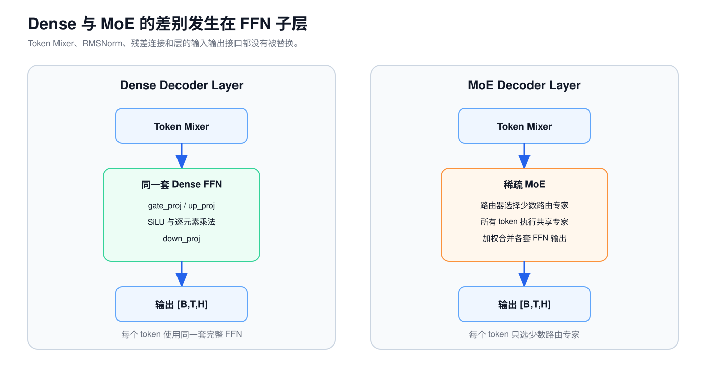
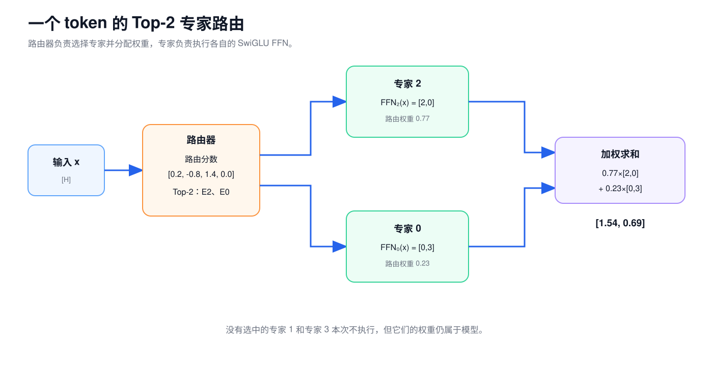

# 第 5 课：Dense FFN 与 MoE 的结构差异

第 2 课已经介绍过 Dense SwiGLU FFN。每个 token 的向量依次经过 `gate_proj`、`up_proj`、SiLU、逐元素乘法和 `down_proj`，最后回到 `H` 维。

Qwen3.5-9B 的 32 个 Decoder Layer 都使用这套 Dense FFN。Qwen3.5-35B-A3B 则在语言模型的 40 个 Decoder Layer 中使用混合专家（Mixture of Experts，MoE）结构。它没有替换整个 Decoder Layer，只把原来的 Dense FFN 换成了路由器（Router）、多套路由专家和一套共享专家。



本课只讨论语言 Decoder 中的 FFN。Qwen3.5-35B-A3B 的视觉编码器仍使用 Dense Vision MLP，不能套用语言层的 MoE 结构。

## 1. Dense FFN：所有 token 使用同一套参数

设 `x:[H]` 是一个 token 经过 RMSNorm 后的向量。Dense SwiGLU FFN 的计算过程为：

$$
g=SiLU(gate\_proj(x))
$$

$$
u=up\_proj(x)
$$

$$
y=down\_proj(g\odot u)
$$

三张投影权重完成不同的工作：

| 投影 | 方向 | 作用 |
| --- | --- | --- |
| `gate_proj` | `H→I` | 产生门控分支，经过 SiLU 后调节另一条分支 |
| `up_proj` | `H→I` | 产生待加工的中间特征 |
| `down_proj` | `I→H` | 重新组合中间特征，并回到残差连接所需的 `H` 维 |

Shape 变化如下：

```text
x                         [H]
gate_proj(x)              [I]
up_proj(x)                [I]
SiLU(gate) ⊙ up           [I]
down_proj(...)            [H]
```

如果一次输入包含一批 token，前面的 `B`、`T` 两个轴原样保留：

```text
[B,T,H] → [B,T,I] → [B,T,H]
```

FFN 分别处理每个 token。不同 token 之间的信息交换已经由 Token Mixer 完成，FFN 只变换当前 token 内部的特征。

这里的 Dense 表示：每个 token 都使用同一套完整的 FFN 权重。它不表示一个 token 会与序列中的其他 token 做全连接。

以 Qwen3.5-9B 为例：

```text
H = 4096
I = 12288
```

三个 Linear 都没有 bias，因此一层 Dense FFN 的参数量为：

$$
3HI=3\times4096\times12288=150,994,944
$$

Dense FFN 没有路由过程。处理每个 token 时，三张矩阵中的约 1.51 亿个权重都会参与计算。

## 2. MoE 只替换 FFN 子层

Dense Decoder Layer 的第二个子层是：

```text
y
├─ 保留 y 作为残差
└─ RMSNorm → Dense SwiGLU FFN ─┐
                              ├─ 逐元素相加 → z
y ────────────────────────────┘
```

MoE 模型把其中的一套 Dense FFN 换成多套参数不同的 FFN：

```text
y
├─ 保留 y 作为残差
└─ RMSNorm → Router + 专家 FFN ─┐
                               ├─ 逐元素相加 → z
y ─────────────────────────────┘
```

RMSNorm、残差连接和 Token Mixer 都保留。在 Qwen3.5-35B-A3B 中，无论 Token Mixer 是 Full Attention 还是 Gated DeltaNet，后面都接同一种 MoE 子层。改变的是 FFN 的参数组织和调用方式。

MoE 中每套独立的 FFN 参数称为一个专家（Expert）。Qwen3.5-35B-A3B 的每个语言层包含：

```text
256 个路由专家（Routed Experts）
每个 token 选择其中 8 个
1 个共享专家（Shared Expert）处理所有 token
```

专家仍然是 SwiGLU FFN，不是一个独立的小语言模型，也没有人工规定的“代码专家”或“数学专家”标签。

## 3. Router 为每个 token 选择专家

Router 是一个 Linear。它读取当前 token 的隐藏状态，为所有路由专家分别计算一个分数。

为了便于手算，先把路由专家数缩小为 4，并让每个 token 选择 Top-2：

```text
x                       [H]
Router 权重             [4,H]
router_logits           [4]
```

`Router` 权重的每一行对应一个专家。`x` 分别与四行权重点积，得到四个路由分数：

```text
router_logits = [0.2, -0.8, 1.4, 0.0]
```

接下来依次进行三步计算：

1. 对四个分数做 Softmax，得到四个路由概率。
2. 取概率最大的两个专家编号，也就是 Top-2。
3. 只保留这两个概率，再归一化为和为 1 的路由权重。

这组数的结果约为：

```text
router_probs       = [0.18, 0.07, 0.60, 0.15]
selected_experts   = [2, 0]
routing_weights    = [0.77, 0.23]
```



下列四个对象不能混用：

| 对象 | 缩小例子的 shape | 内容 |
| --- | --- | --- |
| 路由分数（Router Logits） | `[4]` | 对全部 4 个专家计算出的原始分数 |
| 路由概率（Router Probabilities） | `[4]` | 四个分数经过 Softmax 后的结果 |
| 选中的专家编号（Selected Expert IDs） | `[2]` | Top-2 选出的整数编号 |
| 路由权重（Routing Weights） | `[2]` | 两个选中分支重新归一化后的权重 |

路由概率也不是下一个 token 的生成概率。词表 Softmax 在整个词表中选择下一个 Token ID，Router Softmax 则在本层的专家中选择要执行的 FFN。

Router 会在每一层重新计算。同一个 token 在不同层可以选择不同专家，后续 token 也可能得到另一组选择。

## 4. 路由专家仍执行 SwiGLU FFN

每个路由专家都有自己的 `gate_proj`、`up_proj` 和 `down_proj` 权重。专家编号不同，计算公式相同，权重数值不同。Transformers 参考实现把所有专家的 `gate_proj` 和 `up_proj` 融合存放在一张三维权重张量中；从计算含义上看，每个专家仍使用各自独立的权重切片。

对专家 `e`：

$$
E_e(x)=down_e\left(SiLU(gate_e(x))\odot up_e(x)\right)
$$

假设 Router 选中专家 2 和专家 0，两个专家分别算出：

```text
专家 2：E_2(x) = [2,0]
专家 0：E_0(x) = [0,3]
路由权重       = [0.77,0.23]
```

路由分支把两个输出按权重相加：

$$
y_{routed}=0.77\times[2,0]+0.23\times[0,3]=[1.54,0.69]
$$

Router 负责选择专家并计算合并权重，特征变换由选中的 SwiGLU FFN 完成。

Qwen3.5-35B-A3B 中，每个路由专家的维度是：

```text
输入宽度 H       = 2048
中间宽度 I       = 512
输出宽度         = 2048
```

单个专家仍走 `H→I→H`。这里的 `I=512` 是一套专家 FFN 的中间宽度；256 个专家各自保存一套权重，MoE 的参数容量来自这些不同的专家参数。

## 5. 共享专家独立于 Top-K

Qwen3.5-35B-A3B 还有一个共享专家。每个 token 都会执行它，因此它不参加 256 选 8 的 Top-K。

共享分支包含一套 SwiGLU FFN 和一个标量门控：

```text
shared_output = shared_expert(x)       [H]
shared_gate   = sigmoid(x w_s^T)        [1]
shared_result = shared_gate × shared_output
```

其中 `w_s:[1,H]`。`x` 与这一行权重点积得到一个数，再经过 Sigmoid 得到 0 到 1 之间的门控系数。

最终 MoE 输出为：

$$
y=y_{routed}+y_{shared}
$$

延续前面的缩小例子，若共享专家输出 `[0.5,0.5]`，门控系数为 `0.4`：

```text
y_shared = 0.4 × [0.5,0.5]
         = [0.2,0.2]

y = [1.54,0.69] + [0.2,0.2]
  = [1.74,0.89]
```

共享专家没有使用路由分支的 `[0.77,0.23]`，也不计入 Top-2。它提供一条所有 token 都会经过的 FFN 路径。至于这套参数最终学到哪些具体内容，取决于训练结果，不能仅凭名称断言它保存了“通用知识”。

仓库中的 [MoE 路由复算程序](../../examples/moe_routing_walkthrough.py) 使用相同的缩小例子，并保留完整精度计算。

## 6. Qwen3.5-35B-A3B 的完整 MoE 计算

Qwen3.5-35B-A3B 的语言 Decoder 配置为：

```text
Hidden Size H                  = 2048
路由专家数 E                   = 256
每个 token 选择的专家数 K      = 8
每个专家的 Intermediate Size I = 512
共享专家数                      = 1
Decoder Layer 数               = 40
```

为了描述按专家重新分组的过程，暂时把一批输入中的 `B×T` 个 token 位置记作 `M`。`M` 只是 token 总数，不是新的模型维度。


| 阶段 | shape | 说明 |
| --- | --- | --- |
| MoE 输入 | `[B,T,2048]` | Decoder Layer 的隐藏状态 |
| 展平输入 | `[M,2048]` | `M=B×T` |
| 路由分数 | `[M,256]` | 每个 token 对全部路由专家的原始分数 |
| 选中的专家编号 | `[M,8]` | 每个 token 的 Top-8 整数编号 |
| 路由权重 | `[M,8]` | 每个 token 的 8 个权重，和为 1 |
| 专家 `e` 的输入 | `[n_e,2048]` | 本批被分到专家 `e` 的 token |
| 专家中间结果 | `[n_e,512]` | 该专家的 SwiGLU 中间特征 |
| 专家输出 | `[n_e,2048]` | 回到 `H` 维 |
| 路由专家合并结果 | `[M,2048]` | 每个 token 的 8 个专家输出加权求和 |
| 共享专家输出 | `[M,2048]` | 所有 token 都执行 |
| 共享专家门控 | `[M,1]` | 每个 token 一个 Sigmoid 系数 |
| MoE 输出 | `[B,T,2048]` | 恢复 token 顺序和原 shape |

入口和出口仍是 `[B,T,H]`，所以 MoE 外侧的残差连接不需要改变。

## 7. 按专家重新排列 token

假设一批只有 3 个 token，每个 token 选择 2 个专家：

```text
token 0 → 专家 1、专家 3
token 1 → 专家 2、专家 3
token 2 → 专家 1、专家 4
```

同一专家要用同一组权重处理分配给它的 token。运行时通常先按照专家编号把输入重新分组：

```text
专家 1 收到：token 0、token 2
专家 2 收到：token 1
专家 3 收到：token 0、token 1
专家 4 收到：token 2
```

同一个 token 会进入多个专家组。专家计算完成后，每份输出要乘对应的路由权重，再写回这个 token 原来的位置。

参考实现可以逐个专家取出输入，再用 `index_add` 归并结果。生产 Kernel 通常先按专家编号排序，并用 Grouped GEMM 处理多组大小不同的矩阵。实现方式可以不同，下面四步的语义不变：

```text
Router 选择专家
→ 按专家分组
→ 执行专家 FFN
→ 按路由权重合并并恢复 token 顺序
```

每个专家收到的 token 数 `n_e` 由当前输入决定。Router 不保证各专家平均分配，因此有些专家可能收到很多 token，有些专家可能没有输入。

## 8. 总参数量与每 token 激活参数量

总参数量和激活参数量回答不同的问题：

| 口径 | 回答的问题 |
| --- | --- |
| 总参数量（Total Parameters） | 整个模型一共需要保存多少权重 |
| 每 token 激活参数量（Active Parameters） | 处理一个 token 时，哪些权重参与了这次前向计算 |

没有被当前 token 选中的专家仍属于模型。其他 token 或下一层可能选中它们，因此 `A3B` 不表示只需加载 3B 权重。

下面只计算 Qwen3.5-35B-A3B 一层中的 MoE 参数。配置为：

```text
H = 2048
I = 512
E = 256 个路由专家
K = 每个 token 选择 8 个
```

一个 SwiGLU 专家包含三个无偏置矩阵，参数量为：

$$
3HI=3\times2048\times512=3,145,728
$$

一层需要保存的 MoE 参数为：

| 部分 | 参数量 |
| --- | ---: |
| 256 个路由专家 | `805,306,368` |
| 1 个共享专家 | `3,145,728` |
| 共享专家门控 | `2,048` |
| Router | `524,288` |
| 一层 MoE 合计 | `808,978,432` |

一个 token 在这一层实际使用：

| 部分 | 参数量 |
| --- | ---: |
| 8 个路由专家 | `25,165,824` |
| 共享专家与门控 | `3,147,776` |
| Router | `524,288` |
| 一层激活合计 | `28,837,888` |

40 层 MoE 子层合计约 32.36B 总参数。一个 token 在这些 MoE 子层中使用约 1.15B 参数。再计入 Embedding、Attention、Gated DeltaNet、Norm 和输出层等共享模块，官方给出的整模型口径约为 35B total / 3B active。

每 token 激活参数较少，说明 MoE 用条件选择控制单个 token 的计算规模。它不能直接换算成吞吐提升倍数。一批 token 合起来可能命中很多专家，实际执行还要读取专家权重、重新排列 token，并处理大小不同的专家计算任务。

## 9. Dense FFN 与 MoE 的结构对照

| 对比项 | Dense FFN | Qwen3.5-35B-A3B 的 MoE |
| --- | --- | --- |
| FFN 参数组织 | 每层一套 SwiGLU FFN | 每层 256 套路由专家，加 1 套共享专家 |
| 每个 token 使用的 FFN | 同一套完整 FFN | 8 个路由专家和 1 个共享专家 |
| 是否需要 Router | 不需要 | 需要对 256 个专家打分并选择 Top-8 |
| 专家内部计算 | `H→I→H` 的 SwiGLU | 仍是 `H→I→H` 的 SwiGLU |
| 输入和输出 shape | `[B,T,H]` | `[B,T,H]` |
| token 是否要重新分组 | 不需要 | 需要按专家分组，计算后恢复原顺序 |
| 权重存储 | 保存这一套 FFN | 保存全部专家，不能只保存当前选中的专家 |
| 单 token 使用的参数 | 使用本层全部 FFN 参数 | 只使用本层部分路由专家，并固定使用共享专家 |

## 10. 练习

1. MoE 替换了整个 Decoder Layer 吗？
2. `selected_experts:[M,8]` 和 `routing_weights:[M,8]` 的内容有什么区别？
3. 共享专家是否包含在 Top-8 中？
4. 为什么 MoE 的输出仍然可以与残差输入相加？
5. 为什么 `35B total / 3B active` 不表示模型只需占用 3B 参数的显存？

<details>
<summary>查看答案</summary>


### 10.1 参考答案

1. 没有。MoE 替换的是语言 Decoder 中的 Dense FFN 子层。Token Mixer、RMSNorm 和残差连接仍然保留。
2. 前者保存 8 个整数专家编号，后者保存这 8 个专家输出的浮点合并权重。
3. 不包含。每个 token 固定执行共享专家，单独计算共享门控，再把结果加到路由专家的合并结果上。
4. 路由专家和共享专家最终都输出 `H` 维向量。MoE 恢复 token 顺序后回到 `[B,T,H]`，与残差输入 shape 相同。
5. 3B 描述一个 token 在一次前向中使用的参数口径。模型仍要保存所有专家权重，总参数约为 35B。

</details>

## 11. 从模型结构转向执行阶段

第 6 课将以 Full Attention、Gated DeltaNet、Dense FFN 和 MoE 为基础，比较模型处理已有输入和逐步生成新 token 时分别执行哪些计算、保存哪些状态。

## 参考资料

以下 Qwen3.5 配置和实现于 2026-08-08 按固定 revision 复核：

- [Qwen3.5-9B-Base `config.json`，revision 68c46c4](https://huggingface.co/Qwen/Qwen3.5-9B-Base/blob/68c46c4b3498877f3ef123c856ecfde50c39f404/config.json)
- [Qwen3.5-35B-A3B 模型卡，revision 59d61f3](https://huggingface.co/Qwen/Qwen3.5-35B-A3B/blob/59d61f3ce65a6d9863b86d2e96597125219dc754/README.md)
- [Qwen3.5-35B-A3B `config.json`，revision 59d61f3](https://huggingface.co/Qwen/Qwen3.5-35B-A3B/blob/59d61f3ce65a6d9863b86d2e96597125219dc754/config.json)
- [Transformers：Qwen3.5 Dense 模型实现，revision 9436284](https://github.com/huggingface/transformers/blob/943628458a1691f8af09c47ea9fc6e314734722f/src/transformers/models/qwen3_5/modeling_qwen3_5.py)
- [Transformers：Qwen3.5 MoE 模型实现，revision 9436284](https://github.com/huggingface/transformers/blob/943628458a1691f8af09c47ea9fc6e314734722f/src/transformers/models/qwen3_5_moe/modeling_qwen3_5_moe.py)
- [Mixtral of Experts](https://arxiv.org/abs/2401.04088)
- [DeepSeekMoE](https://arxiv.org/abs/2401.06066)

---

[上一课：Gated DeltaNet 的状态更新机制](04-gated-deltanet.md) · [返回课程路线](../roadmap.md) · [下一课：自回归推理的执行阶段与状态复用](06-inference-phases-and-state-reuse.md)
