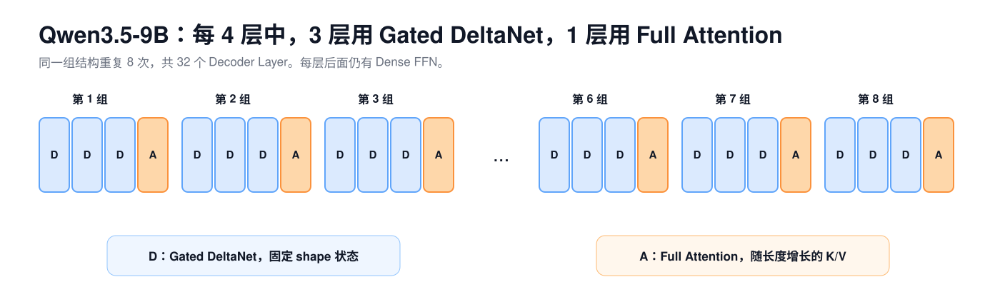
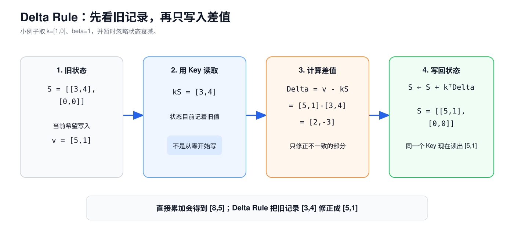
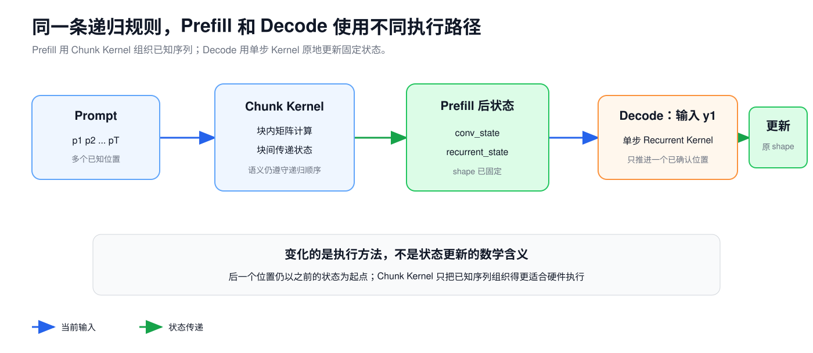

# 第 5 课：Gated DeltaNet 的状态更新机制

第 4 课讲过，Full Attention 会为每个历史 token 保留 K/V。上下文越长，KV Cache 也越长。Qwen3.5-9B 的 32 个 Decoder Layer 中，只有 8 层这样做；另外 24 层使用 Gated DeltaNet，把历史更新进固定 shape 的状态。

模型每经过三层 Gated DeltaNet，就接一层 Full Attention，这组排列重复 8 次。FFN、RMSNorm 和残差连接没有变化，换掉的只是每层中负责联系不同 token 的 Token Mixer。



Full Attention 留下一排可以逐位置读取的 K/V。Gated DeltaNet 不保留这排历史，而是反复修改一张固定大小的状态矩阵。新 token 到来时，它先读出当前 Key 对应的旧记录，再根据 Value 修正记录，最后用 Query 读取更新后的状态。

## 1. 固定状态与 KV Cache

Full Attention 能让当前 Query 与每个历史 Key 分别比较，代价是历史 K/V 随 token 数增长。假设一层已经处理了 `T` 个位置，它要保存：

```text
K Cache：[B,Nkv,T,D]
V Cache：[B,Nkv,T,D]
```

Gated DeltaNet 不保留这条逐 token 列表。每个头只有一张状态矩阵：

```text
S：[B,N_state,Dk,Dv]
```

`N_state` 是并行维护状态的头数；在 Qwen3.5-9B 中，Q/K 复制后与 32 个 Value 头对齐，所以 `N_state=32`。`Dk` 是 Key 和 Query 的宽度，`Dv` 是 Value 的宽度。序列继续变长时，`S` 的 shape 不变，数值会不断更新。

可以先把 `S` 看成一张由模型自己维护的关联表：

```text
Key 表示“用什么特征定位”
Value 表示“定位后希望取出什么”
状态 S 保存已经写入的 Key → Value 关联
Query 用相似的特征从 S 中读取结果
```

这只是帮助理解的说法。状态矩阵里没有可读的字符串字段，也没有给某个 token 单独保留一行。多段历史会被压进同一组数值，因此它和 KV Cache 的能力及代价都不同。

`recurrent state` 也不是 token 的 Hidden State。Hidden State 是某个位置在层与层之间传递的 `H` 维向量；recurrent state 是某个 Gated DeltaNet 层跨 token 保留并更新的矩阵。

## 2. 状态矩阵的写入与读取

下面只看一个头，把 Key、Query 和 Value 都缩成 2 维。例子从全零状态开始，后面一直沿用同一张状态矩阵：

$$
S_0=
\begin{bmatrix}
0 & 0\\
0 & 0
\end{bmatrix}
$$

第一个 token 产生：

$$
k_1=[1,0],\qquad v_1=[3,4]
$$

Key 先检查状态里已有的记录。此时状态为空：

$$
\hat v_1=k_1S_0=[0,0]
$$

希望写入的是 `[3,4]`，旧记录是 `[0,0]`，两者的差为：

$$
\Delta_1=v_1-\hat v_1=[3,4]
$$

`k_1^T` 的 shape 是 `[2,1]`，`Delta_1` 的 shape 是 `[1,2]`。两者做外积，得到一张 `[2,2]` 的更新矩阵：

$$
k_1^T\Delta_1=
\begin{bmatrix}1\\0\end{bmatrix}
\begin{bmatrix}3&4\end{bmatrix}=
\begin{bmatrix}3&4\\0&0\end{bmatrix}
$$

把它加到旧状态上：

$$
S_1=S_0+k_1^T\Delta_1=
\begin{bmatrix}3&4\\0&0\end{bmatrix}
$$

现在令 Query 为 `q_1=[1,0]`，它会从更新后的状态读出：

$$
q_1S_1=[3,4]
$$

Key 和 Query 都用向量乘状态矩阵，但用途不同。`kS` 检查当前 Key 已经记录了什么，`qS` 产生本次要交给后续模块的输出。实际向量通常不是 `[1,0]` 这样的 one-hot，而是连续数值，因此读出的结果通常会混合状态的多行。

Q 和 K 在进入状态计算前会做 L2 归一化。对向量 $k=[k_1,\ldots,k_{D_k}]$，先计算长度：

$$
\lVert k\rVert_2=\sqrt{k_1^2+\cdots+k_{D_k}^2}
$$

再用 $k/\lVert k\rVert_2$ 参加状态计算。忽略实现中防止除零的极小稳定项，归一化后的向量长度为 1。这样读写方向主要由各维度的相对比例决定，不会因为整条 Q 或 K 同时放大几倍而突然变强。

## 3. Delta Rule 的误差修正

第二个 token 仍产生 `k_2=[1,0]`，但这一次希望关联到新的 Value：

$$
v_2=[5,1]
$$

同一个 Key 从 `S_1` 读到旧记录 `[3,4]`，所以真正需要写入的是差值：

$$
\Delta_2=[5,1]-[3,4]=[2,-3]
$$

为了单独看清 Delta Rule，先把两个门近似看作完全打开，令 `alpha=1`、`beta=1`。真实模型中的两者严格位于 `(0,1)`，下一节再把它们放回计算。此时状态更新为：

$$
S_2=S_1+k_2^T\Delta_2=
\begin{bmatrix}5&1\\0&0\end{bmatrix}
$$

如果直接把新的 `k_2^Tv_2` 累加到旧状态，第一行会变成 `[8,5]`。Delta Rule 只补上旧记录与目标 Value 的差，把 `[3,4]` 修正成 `[5,1]`。名称中的 Delta 指的就是这段误差。



## 4. 状态衰减与更新门控

真实更新还加入了衰减和修正幅度。对一个头来说，可以写成四步：

$$
S'_t=\alpha_t S_{t-1}
$$

$$
\hat v_t=k_t S'_t
$$

$$
\Delta_t=v_t-\hat v_t
$$

$$
S_t=S'_t+\beta_t k_t^T\Delta_t
$$

最后由 Query 读取。Qwen3.5 还按 Key 维度做缩放：

$$
o_t=\frac{q_tS_t}{\sqrt{D_k}}
$$

每个符号的作用如下：

| 符号 | 范围 | 作用 |
| --- | --- | --- |
| `S_{t-1}` | `[Dk,Dv]` | 处理当前 token 前的状态 |
| `alpha_t` | `(0,1)` | 统一缩放旧状态，越小遗忘越快 |
| `k_t` | `[Dk]` | 定位要检查和修正的状态方向 |
| `v_t` | `[Dv]` | 当前希望写入的内容 |
| `beta_t` | `(0,1)` | 控制本次误差写入的幅度 |
| `q_t` | `[Dk]` | 从更新后状态中读取输出 |
| `sqrt(Dk)` | 标量 | 控制 Query 读出结果的尺度 |

Qwen3.5 的代码先算出一个负数 `g_t`，再使用 `alpha_t=exp(g_t)`，因此衰减系数严格位于 `(0,1)`。`g_t` 越接近 0，`alpha_t` 越接近 1；`g_t` 越小，`alpha_t` 越接近 0。代码里的原始投影 `a` 不是 `alpha`。

`beta_t` 由 Sigmoid 得到：

$$
\mathrm{sigmoid}(b)=\frac{1}{1+e^{-b}}
$$

Sigmoid 把任意实数平滑地映射到 0 和 1 之间，`b=0` 时结果为 0.5。模型先用 Linear 产生不受范围限制的 `b`，再把它转换成当前误差的修正幅度。

这两个门分工不同。`alpha` 作用于整张旧状态，适合快速减弱过去；`beta` 只控制当前误差写入多少。即使 `beta` 很大，也不等于清空所有旧信息。

继续使用前面的 `S_2`。第三个 token 取：

$$
\alpha_3=0.5,\quad \beta_3=0.5,\quad k_3=[1,0],\quad v_3=[3,3]
$$

旧状态先减半：

$$
S'_3=0.5S_2=
\begin{bmatrix}2.5&0.5\\0&0\end{bmatrix}
$$

此时 Key 读到 `[2.5,0.5]`，与目标 `[3,3]` 的差是 `[0.5,2.5]`。`beta=0.5` 只写入一半误差：

$$
S_3=S'_3+0.5k_3^T[0.5,2.5]
=\begin{bmatrix}2.75&1.75\\0&0\end{bmatrix}
$$

这个结果同时展示了两个门的作用：`alpha` 先衰减整张旧状态，`beta` 再决定当前修正写入多少。

## 5. 输出门控

状态读出 `o_t` 后不会直接成为 Token Mixer 输出。Qwen3.5 还为当前 token 产生 `z_t`：

```text
状态读出 o_t
→ RMSNorm
→ 与 SiLU(z_t) 逐元素相乘
→ 拼回所有头
→ out_proj
→ H 维输出
```

沿用上面的状态，令 `q_3=[1,0]`、`Dk=2`，状态读出为：

$$
o_3=\frac{q_3S_3}{\sqrt{2}}\approx[1.945,1.237]
$$

忽略 epsilon 和 RMSNorm 的学习缩放后，归一化结果约为 `[1.193,0.759]`。假设当前 token 的 `SiLU(z_3)` 为 `[0.5,0.8]`，逐元素门控后的结果约为：

$$
[1.193,0.759]\odot[0.5,0.8]\approx[0.597,0.607]
$$

输出门控只改变本次读出结果，不回头修改已经得到的 `S_3`。它与前面的 `alpha`、`beta` 不是同一个门。

`out_proj` 把所有 Value 头的结果重新混合回 `H` 维。Token Mixer 的输入和输出都是 `[B,T,H]`，因此它仍能接回第 2 课讲过的残差路径。

仓库中的 [Gated DeltaNet 手算程序](../../examples/gated_deltanet_walkthrough.py) 从 `S_0` 开始执行相同的三次更新，并打印旧记录、误差、状态矩阵和门控后的输出。

## 6. 因果卷积补充短距离信息

前面的状态更新只解释了递归主线。Qwen3.5 在进入这条主线前，还会先处理最近几个位置：它用一个 Linear 生成混合 Q/K/V，沿 token 轴做深度因果卷积，然后才拆成 Q、K、V。

“因果”表示当前位置只能使用自己和左边的输入。假设某个通道上的值是：

```text
位置：  p1  p2  p3  p4
数值：   2   5   1   4
```

若卷积窗口宽度为 3，处理 `p3` 时只能组合 `p1、p2、p3`，不能读取右边的 `p4`。使用一组便于手算的卷积权重 `[0.2,0.3,0.5]`，结果是：

$$
0.2\times2+0.3\times5+0.5\times1=2.4
$$


实际权重由训练得到。Qwen3.5 的窗口宽度是 4，并在卷积后使用 SiLU。

深度卷积（Depthwise Convolution）表示每个通道分别沿 token 轴卷积，不在这一步混合不同通道。前面的 Linear 已经负责重组特征；这次卷积让 Q/K/V 的每个通道先带上很近的局部顺序信息。

Decode 时，`conv_state` 保存卷积窗口需要的最近投影值。新 token 到来后，runtime 把新值推入窗口，移出最旧位置，再计算本轮卷积。它和 Delta Rule 使用的 `recurrent_state` 是两份不同的状态。

## 7. Gated DeltaNet 的完整数据流

现在再看完整数据流。输入仍是 Decoder Layer 传来的 Hidden States：

```text
X：[B,T,H]
```

输入 `X` 会分成几条支路：一条产生 Q、K、V，另外三条产生状态衰减、修正幅度和输出门控。Q/K/V 分支先在因果卷积中读写 `conv_state`，随后用 Delta Rule 读写 `recurrent_state`。Q 读出结果后，输出门和 `out_proj` 再把它送回 Decoder Layer 的残差路径。


三组控制量作用在不同位置：

| 名称 | 代码来源 | 控制什么 |
| --- | --- | --- |
| 状态保留系数 `alpha` | `a → g → alpha=exp(g)` | 旧 recurrent state 保留多少 |
| 修正幅度 `beta` | `b → beta=sigmoid(b)` | 当前误差写入多少 |
| 输出门控 `z` | `in_proj_z` | 状态读出结果有多少进入层输出 |

Q、K、V 以及原始控制量 `a`、`b`、`z` 都来自当前 Hidden State 的 Linear 投影。实现随后由 `a` 算出 `g` 和 `alpha`，由 `b` 算出 `beta`；这些数都不是 runtime 手工设置的参数。

## 8. Prefill 与 Decode 的执行方式

对单个 token 来说，状态更新天然是递归的：`S_t` 依赖 `S_{t-1}`。这不等于 Prefill 只能由 Python 循环逐 token 运行。

Qwen3.5 的实现使用两条计算路径：

| 场景 | 输入位置数 | 实现方式 | 跨轮保留什么 |
| --- | ---: | --- | --- |
| 没有可复用状态，或输入含多个位置 | 通常 `T>1`，也可能为 1 | Chunk Gated Delta Rule | 最后一个 Chunk 的 recurrent state |
| 已有状态的单 token Decode | `T=1` | Recurrent Gated Delta Rule | 更新后的 recurrent state |

Chunk 算法把已知序列分块，在块内组织并行矩阵计算，在块间传递状态。它改变执行顺序和并行方式，不改变前面的逐 token 数学关系。

因果卷积也有两条路径。Prefill 对多个位置做卷积并留下最后窗口；Decode 每次把一个新位置写入 `conv_state`。所以 Gated DeltaNet 层在请求中保存：

```text
conv_state       最近局部窗口
recurrent_state  压缩后的长期状态
```



## 9. Qwen3.5-9B 的实际 shape

Qwen3.5-9B 的 Gated DeltaNet 配置是：

```text
H                       = 4096
linear_num_key_heads    = 16
linear_num_value_heads  = 32
linear_key_head_dim     = 128
linear_value_head_dim   = 128
linear_conv_kernel_dim  = 4
```

输入 `X:[B,T,4096]` 后，各分支 shape 如下：

| 数据 | shape | 说明 |
| --- | --- | --- |
| 混合 Q/K/V | `[B,T,8192]` | `2048 + 2048 + 4096` |
| Q，复制前 | `[B,T,16,128]` | 16 个 Key 头宽度 |
| K，复制前 | `[B,T,16,128]` | 16 个 Key 头宽度 |
| V | `[B,T,32,128]` | 32 个 Value 头 |
| Q/K，复制后 | `[B,T,32,128]` | 每个 Key 头供 2 个 Value 头使用 |
| `beta` | `[B,T,32]` | 每个 Value 头一个修正幅度 |
| `g` | `[B,T,32]` | 每个 Value 头一个衰减值 |
| `z` | `[B,T,32,128]` | 对每个输出特征做门控 |
| recurrent state | `[B,32,128,128]` | 每层固定 shape |
| conv state | `[B,8192,4]` | 每层固定窗口 |
| `out_proj` 后 | `[B,T,4096]` | 回到残差接口宽度 |

为什么混合 Q/K/V 是 8192 维：

$$
16\times128+16\times128+32\times128=2048+2048+4096=8192
$$

为什么 recurrent state 有 32 个头：Q/K 在状态更新前各复制一次，让 16 个 Key 头扩展到 32 个，与 Value 头一一对应。这里的复制发生在计算视图中，不表示模型额外训练了两套相同参数。

## 10. Gated DeltaNet 与 Full Attention 的状态对比

| 对比项 | Full Attention | Gated DeltaNet |
| --- | --- | --- |
| 历史形式 | 每个位置一份 K/V | 不断更新的状态矩阵 |
| 状态 shape | 随 `T` 增长 | 与 `T` 无关 |
| 当前 token 怎样读取 | Q 与所有历史 K 分别打分，再汇总 V | Q 直接读取状态矩阵 |
| 旧信息怎样变化 | 历史 K/V 保持原值 | 会被衰减、覆盖和混合 |
| 单层 Decode 的历史读取量 | 随上下文增长 | recurrent state 大小固定 |
| 位置信息 | Q/K 使用 RoPE | 依靠因果卷积和递归顺序，不使用 Full Attention 的 RoPE |

固定 shape 并不表示能够无损保存无限历史。许多 token 的信息共享同一张状态矩阵，状态会遗忘、覆盖，也会发生关联之间的干扰。Full Attention 保留逐位置 K/V，读取成本更高，但当前 Query 可以直接对不同历史位置分别打分。

Qwen3.5 把两者混在同一模型中。不能把 24 个 Gated DeltaNet 层当成“更小的 KV Cache”，也不能把 8 个 Full Attention 层当成可有可无的实现细节。

## 11. Gated DeltaNet 对推理系统的影响

### 11.1 上下文长度与状态容量

Gated DeltaNet 的 `conv_state` 和 `recurrent_state` shape 不随 token 数增长。Full Attention 层的 KV Cache 仍会增长，所以整个 Qwen3.5 请求状态不是常数大小。

### 11.2 Prefix Cache 的状态完整性

复用相同前缀时，只复用 8 层 K/V 不足以恢复完整模型状态。24 个 Gated DeltaNet 层的卷积状态和 recurrent state 也必须与该前缀对应。

### 11.3 Decode Kernel 的计算与状态读写

固定状态省掉了逐 token KV 列表，却没有让这一层免费。每个新 token 仍要做投影、因果卷积更新、状态衰减、误差修正、状态读取、门控和输出投影。状态矩阵的 dtype、融合方式和访存仍会影响延迟。

### 11.4 Batch 内的独立请求状态

不同请求不能共用同一份 recurrent state。请求加入、退出、重排或做 Beam Search 时，runtime 要让状态与正确序列保持对应。

### 11.5 Chunk Kernel 与 Chunked Prefill

Gated Delta Rule 的 Chunk Kernel 是算子内部的并行算法。服务端 Chunked Prefill 是调度器把长 Prompt 分成多个执行轮次。两者都使用 Chunk 这个词，但切分层级不同。

## 12. 状态更新与容量变化

### 12.1 完成一次带门控的 Delta Rule

只看一个头，给定：

$$
S_{t-1}=
\begin{bmatrix}
2&1\\
0&3
\end{bmatrix},\quad
\alpha=0.5,\quad \beta=0.5
$$

$$
k=[1,0],\quad v=[4,2],\quad q=[1,0],\quad D_k=2
$$

按 `衰减旧状态 → 读取旧记录 → 计算误差 → 写回状态 → Query 读取` 的顺序，算出 $S'_t$、$\hat v_t$、$\Delta_t$、$S_t$ 和缩放后的输出 $o_t$。

### 12.2 上下文翻倍后，哪些状态会增长

Qwen3.5-9B 的 BF16 Full Attention KV 每缓存位置占 32 KiB。按本课核对的 Transformers 参考实现，`conv_state` 沿用 BF16，`recurrent_state` 使用 FP32；24 个 Gated DeltaNet 层的两类状态合计约 49.5 MiB/请求。

分别计算 4096 和 8192 个缓存位置时的 Full Attention KV、Gated DeltaNet 固定状态与总量，并说明为什么“固定状态”不等于“模型请求状态与上下文长度无关”。

<details>
<summary>查看推导与计算结果</summary>


旧状态先衰减：

$$
S'_t=0.5S_{t-1}=
\begin{bmatrix}
1&0.5\\
0&1.5
\end{bmatrix}
$$

Key 读出的旧记录与误差为：

$$
\hat v_t=kS'_t=[1,0.5]
$$

$$
\Delta_t=v-\hat v_t=[3,1.5]
$$

写入一半误差后：

$$
S_t=S'_t+0.5k^T\Delta_t=
\begin{bmatrix}
2.5&1.25\\
0&1.5
\end{bmatrix}
$$

Query 读取并按 $\sqrt{D_k}$ 缩放：

$$
o_t=\frac{qS_t}{\sqrt{2}}
=\frac{[2.5,1.25]}{\sqrt{2}}
\approx[1.768,0.884]
$$


| 缓存位置数 | Full Attention KV | Gated DeltaNet 固定状态 | 合计 |
| ---: | ---: | ---: | ---: |
| 4096 | 128 MiB | 49.5 MiB | 177.5 MiB |
| 8192 | 256 MiB | 49.5 MiB | 305.5 MiB |

Gated DeltaNet 状态的 shape 不随长度增长，但模型仍有 8 个 Full Attention 层保存逐位置 K/V。整个请求状态因此仍会随上下文增长。

</details>

[第 6 课](06-dense-and-moe.md)会转到 Decoder Layer 的另一个子层。Dense 与 MoE 的差异发生在 FFN，不在这里讲的 Token Mixer。

## 参考资料

以下 Qwen3.5、Transformers 和 FLA 实现于 2026-08-08 按固定 revision 复核：

- [Qwen3.5-9B-Base 模型卡，revision 68c46c4](https://huggingface.co/Qwen/Qwen3.5-9B-Base/blob/68c46c4b3498877f3ef123c856ecfde50c39f404/README.md)
- [Qwen3.5-9B-Base `config.json`，revision 68c46c4](https://huggingface.co/Qwen/Qwen3.5-9B-Base/blob/68c46c4b3498877f3ef123c856ecfde50c39f404/config.json)
- [Transformers：Qwen3.5 模型实现，revision 9436284](https://github.com/huggingface/transformers/blob/943628458a1691f8af09c47ea9fc6e314734722f/src/transformers/models/qwen3_5/modeling_qwen3_5.py)
- [Transformers：Linear Attention Cache，revision 9436284](https://github.com/huggingface/transformers/blob/943628458a1691f8af09c47ea9fc6e314734722f/src/transformers/cache_utils.py)
- [Flash Linear Attention：Gated Delta Rule，revision 3c4c54a](https://github.com/fla-org/flash-linear-attention/tree/3c4c54ae7397d37130d7101edd0f4eb596af896d/fla/ops/gated_delta_rule)
- [NVIDIA：GatedDeltaNet 官方实现，revision b53d6d3](https://github.com/NVlabs/GatedDeltaNet/tree/b53d6d3a161267432a79c1c04af69fa52bddc921)

算法原理参考：

- [Gated Delta Networks: Improving Mamba2 with Delta Rule](https://arxiv.org/abs/2412.06464)
- [Parallelizing Linear Transformers with the Delta Rule over Sequence Length](https://arxiv.org/abs/2406.06484)

---

[上一课：Prefill、Decode 与 KV Cache](04-prefill-decode-kv-cache.md) · [返回课程路线](../roadmap.md) · [下一课：Dense FFN 与 MoE 的结构差异](06-dense-and-moe.md)
