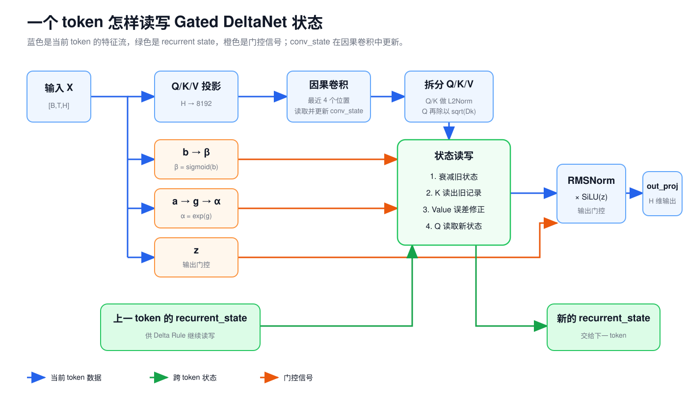

# 第 5 课：Gated DeltaNet 怎样记住前文

第 4 课讲过，Full Attention 会为每个历史 token 保留 K/V。上下文越长，KV Cache 也越长。Qwen3.5-9B 的 32 个 Decoder Layer 中，只有 8 层这样做；另外 24 层使用 Gated DeltaNet，把历史更新进固定 shape 的状态。

两类 Token Mixer 交替出现：

```text
Gated DeltaNet → Gated DeltaNet → Gated DeltaNet → Full Attention
```

这组排列重复 8 次。FFN、RMSNorm 和残差连接仍然存在，变化的是每层中负责联系不同 token 的 Token Mixer。


理解 Gated DeltaNet，要先看它怎样保存历史。Full Attention 留下一排可以逐位置读取的 K/V；Gated DeltaNet 反复修改一张固定大小的状态矩阵。新 token 到来时，它先读出状态对当前 Key 的旧记录，再根据当前 Value 修正这条记录，最后用 Query 从更新后的状态中取回结果。

## 1. 为什么要用固定大小的状态

Full Attention 能让当前 Query 与每个历史 Key 分别比较，代价是历史 K/V 随 token 数增长。假设一层已经处理了 `T` 个位置，它要保存：

```text
K Cache：[B,Nkv,T,D]
V Cache：[B,Nkv,T,D]
```

Gated DeltaNet 不保留这条逐 token 列表。每个头只有一张状态矩阵：

```text
S：[B,N,Dk,Dv]
```

`Dk` 是 Key 和 Query 的宽度，`Dv` 是 Value 的宽度。序列继续变长时，`S` 的 shape 不变，数值会不断更新。

可以先把 `S` 看成一张由模型自己维护的关联表：

```text
Key 表示“用什么特征定位”
Value 表示“定位后希望取出什么”
状态 S 保存已经写入的 Key → Value 关联
Query 用相似的特征从 S 中读取结果
```

这只是帮助理解的说法。状态矩阵里没有可读的字符串字段，也没有给某个 token 单独保留一行。多段历史会被压进同一组数值，因此它和 KV Cache 的能力及代价都不同。

## 2. 先看完整数据流

输入仍是 Decoder Layer 传来的 Hidden States：

```text
X：[B,T,H]
```

Qwen3.5-9B 的一层 Gated DeltaNet 可以先压缩成下面这条主线：

```text
X
├─ Linear → 混合 Q/K/V → 因果卷积 → Q、K、V
├─ Linear → beta          修正幅度
├─ Linear → g             旧状态衰减
└─ Linear → z             输出门控

旧 recurrent state
→ 衰减
→ 用 K 检查旧记录
→ 用 V 与旧记录的误差修正状态
→ 用 Q 读取更新后的状态
→ RMSNorm 和 SiLU(z)
→ out_proj
→ [B,T,H]
```



这里有三组容易混淆的控制量：

| 名称 | 代码来源 | 控制什么 |
| --- | --- | --- |
| 状态衰减 `alpha` | `a → g → exp(g)` | 旧状态保留多少 |
| 修正幅度 `beta` | `b → sigmoid(b)` | 当前误差写入多少 |
| 输出门控 `z` | `in_proj_z` | 状态读出结果有多少进入层输出 |

Q、K、V、`beta`、`g` 和 `z` 都由当前 Hidden State 经过训练得到的 Linear 产生。它们不是 runtime 手工设置的参数。

## 3. 因果卷积先补入很近的局部顺序

Qwen3.5 先用一个 Linear 生成混合 Q/K/V，再沿 token 轴做深度因果卷积，最后才拆成 Q、K、V。

“因果”表示当前位置只能使用自己和左边的输入。假设某个通道上的值是：

```text
位置：  p1  p2  p3  p4
数值：   2   5   1   4
```

若卷积窗口宽度为 3，处理 `p3` 时只能组合：

```text
p1、p2、p3
```

不能读取右边的 `p4`。使用一组便于手算的卷积权重 `[0.2,0.3,0.5]`，`p3` 的结果是：

$$
0.2\times2+0.3\times5+0.5\times1=2.4
$$

实际权重由训练得到。Qwen3.5 的窗口宽度是 4，并在卷积后使用 SiLU。

深度卷积（Depthwise Convolution）表示每个通道分别沿 token 轴卷积，不在这一步混合不同通道。前面的 Linear 已经负责重组特征；这次卷积让 Q/K/V 的每个通道先看到很近的局部顺序。

Decode 时不必重新读取完整序列。`conv_state` 只保留卷积所需的最近窗口。新 token 到来后，runtime 把它推入窗口，移出最旧的位置。

## 4. 状态矩阵怎样读出一条记录

先只看一个头，并把 Key、Query 和 Value 都缩成 2 维。状态是一个 `2×2` 矩阵：

$$
S=
\begin{bmatrix}
3 & 4\\
1 & 2
\end{bmatrix}
$$

如果 Query 是：

$$
q=[1,0]
$$

这里先忽略实现中的 Query 缩放，只看状态怎样按方向读取。操作是：

$$
o=qS
=[1,0]
\begin{bmatrix}
3 & 4\\
1 & 2
\end{bmatrix}
=[3,4]
$$

`q=[1,0]` 只选择了状态的第一行。若 `q=[0,1]`，得到第二行 `[1,2]`。实际 Query 通常不是 one-hot 向量，而是一组连续数值，所以输出是多行信息的加权组合。

Key 也用同样的方式读取状态，但目的不同：

```text
kS：检查状态目前为这个 Key 记录了什么
qS：产生当前 token 要交给后续模块的输出
```

Q 和 K 在进入状态计算前会做 L2 归一化，使每条向量的长度接近 1。这样点积和状态更新不容易仅被向量整体大小支配。

## 5. Delta Rule 为什么要先算误差

如果每次都把新的 `Key × Value` 直接加进状态，相同 Key 再次出现时，旧值和新值会不断叠加。Delta Rule 不盲目累加，它先问：“状态对这个 Key 的当前记录，与我现在希望写入的 Value 差多少？”

先忽略衰减，并令修正幅度 `beta=1`。初始状态全为 0：

$$
S_0=
\begin{bmatrix}
0 & 0\\
0 & 0
\end{bmatrix}
$$

当前 Key 和 Value 是：

$$
k=[1,0],\qquad v=[3,4]
$$

第一步，用 Key 读取旧记录：

$$
\hat v=kS_0=[0,0]
$$

第二步，计算希望写入的值与旧记录之间的误差：

$$
\Delta=v-\hat v=[3,4]
$$

第三步，把修正写回与 `k` 对应的方向：

$$
S_1=S_0+k^T\Delta
=
\begin{bmatrix}
3 & 4\\
0 & 0
\end{bmatrix}
$$

现在同一个 Key 再次读取，会得到 `[3,4]`。

假设后来同一个 Key 希望关联到新 Value `[5,1]`。状态先读出旧值 `[3,4]`，误差是：

$$
[5,1]-[3,4]=[2,-3]
$$

把误差写回后：

$$
S_2=
\begin{bmatrix}
5 & 1\\
0 & 0
\end{bmatrix}
$$

状态从 `[3,4]` 修正成 `[5,1]`，没有变成两次 Value 的和 `[8,5]`。“Delta”指的就是这段误差。


## 6. 两个状态门怎样控制记忆

真实更新还加入了衰减和修正幅度。对一个头来说，可以写成四步：

$$
S'_t=\alpha_t S_{t-1}
$$

$$
\hat v_t=k_t S'_t
$$

$$
\Delta_t=v_t-\hat v_t
$$

$$
S_t=S'_t+\beta_t k_t^T\Delta_t
$$

最后由 Query 读取。Qwen3.5 还按 Key 维度做缩放：

$$
o_t=\frac{q_tS_t}{\sqrt{D_k}}
$$

每个符号的作用如下：

| 符号 | 范围 | 作用 |
| --- | --- | --- |
| `S_{t-1}` | `[Dk,Dv]` | 处理当前 token 前的状态 |
| `alpha_t` | 0 到 1 之间 | 统一缩放旧状态，越小遗忘越快 |
| `k_t` | `[Dk]` | 定位要检查和修正的状态方向 |
| `v_t` | `[Dv]` | 当前希望写入的内容 |
| `beta_t` | 0 到 1 之间 | 控制本次误差写入的幅度 |
| `q_t` | `[Dk]` | 从更新后状态中读取输出 |
| `sqrt(Dk)` | 标量 | 控制 Query 读出结果的尺度 |

Qwen3.5 的代码先算出一个非正数 `g_t`，再使用 `alpha_t=exp(g_t)`，所以衰减系数落在 0 到 1 之间。代码里的原始投影 `a` 不是 `alpha`。`beta_t` 由 Sigmoid 得到，也落在 0 到 1 之间。

这两个门分工不同。`alpha` 作用于整张旧状态，适合快速减弱过去；`beta` 只控制当前误差写入多少。即使 `beta` 很大，也不等于清空所有旧信息。

## 7. 输出门控还会再筛一次结果

状态读出 `o_t` 后不会直接成为 Token Mixer 输出。Qwen3.5 还为当前 token 产生 `z_t`：

```text
状态读出 o_t
→ RMSNorm
→ 与 SiLU(z_t) 逐元素相乘
→ 拼回所有头
→ out_proj
→ H 维输出
```

这一层门控只改变本次读出结果，不回头修改 recurrent state。它与前面的 `alpha`、`beta` 不是同一个门。

`out_proj` 把所有 Value 头的结果重新混合回 `H` 维。Token Mixer 的输入和输出都是 `[B,T,H]`，因此它仍能接回第 2 课讲过的残差路径。

## 8. Prefill 和 Decode 使用同一条规则

对单个 token 来说，状态更新天然是递归的：`S_t` 依赖 `S_{t-1}`。这不等于 Prefill 只能由 Python 循环逐 token 运行。

Qwen3.5 的实现使用两条计算路径：

| 场景 | 输入位置数 | 实现方式 | 跨轮保留什么 |
| --- | ---: | --- | --- |
| 没有可复用状态，或输入含多个位置 | 通常 `T>1`，也可能为 1 | Chunk Gated Delta Rule | 最后一个 Chunk 的 recurrent state |
| 已有状态的单 token Decode | `T=1` | Recurrent Gated Delta Rule | 更新后的 recurrent state |

Chunk 算法把已知序列分块，在块内组织并行矩阵计算，在块间传递状态。它改变执行顺序和并行方式，不改变前面的逐 token 数学关系。

因果卷积也有两条路径。Prefill 对多个位置做卷积并留下最后窗口；Decode 每次把一个新位置写入 `conv_state`。所以 Gated DeltaNet 层在请求中保存：

```text
conv_state       最近局部窗口
recurrent_state  压缩后的长期状态
```


## 9. 代入 Qwen3.5-9B 的真实 shape

Qwen3.5-9B 的 Gated DeltaNet 配置是：

```text
H                       = 4096
linear_num_key_heads    = 16
linear_num_value_heads  = 32
linear_key_head_dim     = 128
linear_value_head_dim   = 128
linear_conv_kernel_dim  = 4
```

输入 `X:[B,T,4096]` 后，各分支 shape 如下：

| 数据 | shape | 说明 |
| --- | --- | --- |
| 混合 Q/K/V | `[B,T,8192]` | `2048 + 2048 + 4096` |
| Q，复制前 | `[B,T,16,128]` | 16 个 Key 头宽度 |
| K，复制前 | `[B,T,16,128]` | 16 个 Key 头宽度 |
| V | `[B,T,32,128]` | 32 个 Value 头 |
| Q/K，复制后 | `[B,T,32,128]` | 每个 Key 头供 2 个 Value 头使用 |
| `beta` | `[B,T,32]` | 每个 Value 头一个修正幅度 |
| `g` | `[B,T,32]` | 每个 Value 头一个衰减值 |
| `z` | `[B,T,32,128]` | 对每个输出特征做门控 |
| recurrent state | `[B,32,128,128]` | 每层固定 shape |
| conv state | `[B,8192,4]` | 每层固定窗口 |
| `out_proj` 后 | `[B,T,4096]` | 回到残差接口宽度 |

为什么混合 Q/K/V 是 8192 维：

$$
16\times128+16\times128+32\times128
=2048+2048+4096
=8192
$$

为什么 recurrent state 有 32 个头：Q/K 在状态更新前各复制一次，让 16 个 Key 头扩展到 32 个，与 Value 头一一对应。这里的复制发生在计算视图中，不表示模型额外训练了两套相同参数。

## 10. Gated DeltaNet 与 Full Attention 怎样保存历史

| 对比项 | Full Attention | Gated DeltaNet |
| --- | --- | --- |
| 历史形式 | 每个位置一份 K/V | 不断更新的状态矩阵 |
| 状态 shape | 随 `T` 增长 | 与 `T` 无关 |
| 当前 token 怎样读取 | Q 与所有历史 K 分别打分，再汇总 V | Q 直接读取状态矩阵 |
| 旧信息怎样变化 | 历史 K/V 保持原值 | 会被衰减、覆盖和混合 |
| 单层 Decode 的历史读取量 | 随上下文增长 | recurrent state 大小固定 |
| 位置信息 | Q/K 使用 RoPE | 依靠因果卷积和递归顺序，不使用 Full Attention 的 RoPE |

固定 shape 并不表示能够无损保存无限历史。许多 token 的信息共享同一张状态矩阵，状态会遗忘、覆盖，也会发生关联之间的干扰。Full Attention 保留逐位置 K/V，读取成本更高，但当前 Query 可以直接对不同历史位置分别打分。

Qwen3.5 把两者混在同一模型中。不能把 24 个 Gated DeltaNet 层当成“更小的 KV Cache”，也不能把 8 个 Full Attention 层当成可有可无的实现细节。

## 11. 对推理系统有什么影响

### 上下文增长时，两类状态的增长方式不同

Gated DeltaNet 的 `conv_state` 和 `recurrent_state` shape 不随 token 数增长。Full Attention 层的 KV Cache 仍会增长，所以整个 Qwen3.5 请求状态不是常数大小。

### Prefix Cache 要同时处理两类状态

复用相同前缀时，只复用 8 层 K/V 不足以恢复完整模型状态。24 个 Gated DeltaNet 层的卷积状态和 recurrent state 也必须与该前缀对应。

### Decode Kernel 仍有不少工作

固定状态省掉了逐 token KV 列表，却没有让这一层免费。每个新 token 仍要做投影、因果卷积更新、状态衰减、误差修正、状态读取、门控和输出投影。状态矩阵的 dtype、融合方式和访存仍会影响延迟。

### Batch 中每条序列都有自己的状态

不同请求不能共用同一份 recurrent state。请求加入、退出、重排或做 Beam Search 时，runtime 要让状态与正确序列保持对应。

### Prefill 的 Chunk 与服务端 Chunked Prefill 不是一回事

Gated Delta Rule 的 Chunk Kernel 是算子内部的并行算法。服务端 Chunked Prefill 是调度器把长 Prompt 分成多个执行轮次。两者都使用 Chunk 这个词，但切分层级不同。

## 12. 几个常见误解

### Gated DeltaNet 不是没有 Cache

它不保存逐 token K/V，但 Decode 需要 `conv_state` 和 `recurrent_state`。

### recurrent state 不是一个 token 的 Hidden State

Hidden State 是某个 token 在层间传递的 H 维表示。recurrent state 是一个 Gated DeltaNet 层跨 token 保留的矩阵状态。

### 因果卷积不是图像卷积

这里沿 token 序列的一维时间轴滑动。深度卷积在每个通道内部处理最近窗口，不是在图片上移动二维卷积核。

### 状态固定不等于计算量为 0

每步仍要读写整张状态矩阵，并执行本层的 Linear 和门控。固定的是随序列长度增长的那一维。

### Chunk Prefill 没有取消递归关系

Chunk Kernel 用代数变换并行组织已知 token 的计算，最终结果仍遵守前一状态到后一状态的因果顺序。

## 13. 练习

1. Qwen3.5-9B 的 32 层中，多少层使用 Gated DeltaNet，多少层使用 Full Attention？
2. recurrent state 与 KV Cache 在序列长度轴上有什么区别？
3. 因果卷积处理位置 `p3` 时，能否读取 `p4`？
4. 深度因果卷积是否在这一步混合不同通道？
5. 状态 `S:[Dk,Dv]` 被 `q:[Dk]` 读取后，输出 shape 是什么？
6. Delta Rule 为什么先计算 `v-kS`，而不是直接把 `k^T v` 加进状态？
7. `alpha` 与 `beta` 分别控制什么？
8. 输出门控 `z` 是否会修改 recurrent state？
9. 当 `B=2,T=8` 时，Qwen3.5-9B 的混合 Q/K/V 输出 shape 是什么？
10. Q/K 复制后的 shape 是什么？
11. 单层 recurrent state 和 conv state 的 shape 分别是什么？
12. 为什么 Gated DeltaNet 的固定状态不能被理解为无损保存无限上下文？
13. Prefill 使用 Chunk Kernel，是否说明不同 token 的状态更新没有依赖？
14. 复用 Qwen3.5 前缀时，为什么不能只复用 Full Attention 的 KV Cache？

## 14. 参考答案

1. 24 层 Gated DeltaNet，8 层 Full Attention，按 3 比 1 重复。
2. KV Cache 的 `T` 随历史 token 数增长；recurrent state 的 shape 不包含随 `T` 增长的轴，后续 token 原地更新其数值。
3. 不能。因果卷积只能读取当前位置和左侧位置。
4. 不混合。Depthwise 表示各通道分别卷积；Linear 负责通道间特征重组。
5. `[Dv]`。
6. 误差更新会修正状态当前对这个 Key 的记录，避免相同关联被反复盲目相加。
7. `alpha` 衰减整张旧状态，`beta` 控制当前误差写入多少。
8. 不会。`z` 只门控本次读出的输出。
9. `[2,8,8192]`。
10. `[2,8,32,128]`。
11. recurrent state 是 `[B,32,128,128]`，conv state 是 `[B,8192,4]`。
12. 所有历史共享同一张有限状态矩阵，信息会衰减、覆盖和互相干扰。
13. 不是。Chunk Kernel 并行组织计算，数学结果仍包含前后状态依赖。
14. 完整前缀状态还包括 24 个 Gated DeltaNet 层的 conv state 和 recurrent state。

## 15. 试着说清两类请求状态

合上正文，试着复述一个新 token 进入 Gated DeltaNet 后发生的动作：

```text
Hidden State
→ 生成 Q/K/V 和三个门控分支
→ 因果卷积补入局部顺序
→ 衰减旧状态
→ 用 K 检查旧记录
→ 用 Value 误差修正状态
→ 用 Q 读取结果
→ 输出门控与 out_proj
→ 回到 H 维
```

还要能解释 Qwen3.5 为什么同时存在两种请求状态：8 个 Full Attention 层保存随长度增长的 K/V；24 个 Gated DeltaNet 层保存固定 shape 的卷积状态和 recurrent state。

[第 6 课](06-dense-and-moe.md)会转到 Decoder Layer 的另一个子层。Dense 与 MoE 的差异主要发生在 FFN，而不是刚刚讲完的 Token Mixer。

## 资料来源

以下 Qwen3.5、Transformers 和 FLA 实现于 2026-08-08 按固定 revision 复核：

- [Qwen3.5-9B-Base 模型卡，revision 68c46c4](https://huggingface.co/Qwen/Qwen3.5-9B-Base/blob/68c46c4b3498877f3ef123c856ecfde50c39f404/README.md)
- [Qwen3.5-9B-Base `config.json`，revision 68c46c4](https://huggingface.co/Qwen/Qwen3.5-9B-Base/blob/68c46c4b3498877f3ef123c856ecfde50c39f404/config.json)
- [Transformers：Qwen3.5 模型实现，revision 9436284](https://github.com/huggingface/transformers/blob/943628458a1691f8af09c47ea9fc6e314734722f/src/transformers/models/qwen3_5/modeling_qwen3_5.py)
- [Transformers：Linear Attention Cache，revision 9436284](https://github.com/huggingface/transformers/blob/943628458a1691f8af09c47ea9fc6e314734722f/src/transformers/cache_utils.py)
- [Flash Linear Attention：Gated Delta Rule，revision 3c4c54a](https://github.com/fla-org/flash-linear-attention/tree/3c4c54ae7397d37130d7101edd0f4eb596af896d/fla/ops/gated_delta_rule)
- [NVIDIA：GatedDeltaNet 官方实现，revision b53d6d3](https://github.com/NVlabs/GatedDeltaNet/tree/b53d6d3a161267432a79c1c04af69fa52bddc921)

算法原理参考：

- [Gated Delta Networks: Improving Mamba2 with Delta Rule](https://arxiv.org/abs/2412.06464)
- [Parallelizing Linear Transformers with the Delta Rule over Sequence Length](https://arxiv.org/abs/2406.06484)
