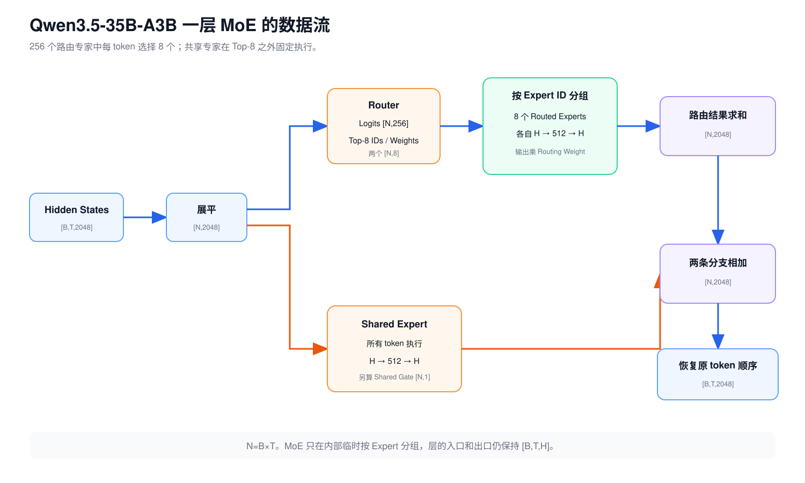

# 第 6 课：Dense FFN 与 MoE 的结构差异

第 2 课已经拆开过 Dense SwiGLU FFN：每个 token 都经过 `gate_proj`、`up_proj`、SiLU、逐元素乘法和 `down_proj`。Qwen3.5-9B 的 32 个 Decoder Layer 都使用这套 Dense FFN。

Qwen3.5-35B-A3B 则在语言模型的 40 个 Decoder Layer 中使用 MoE。RMSNorm、残差连接以及 Gated DeltaNet 和 Full Attention 的排列没有因此消失，模型只是把每层的一套 Dense FFN 换成了 Router 和多套 Expert FFN。


MoE 中有很多套参数不同的 FFN，通常称为 Expert。Router 根据当前 token 的 Hidden State 选出少数 Routed Experts。Qwen3.5 还为所有 token 固定执行一套 Shared Expert，最后把这些输出合并回 H 维。

## 1. Dense FFN 的计算路径

对一个 token 的 `H` 维输入 `x`，Dense SwiGLU 的计算是：

$$
g=SiLU(gate\_proj(x))
$$

$$
u=up\_proj(x)
$$

$$
y=down\_proj(g\odot u)
$$

Shape 为：

```text
x                 [H]
gate_proj(x)      [I]
up_proj(x)        [I]
逐元素相乘         [I]
down_proj         [H]
```

批量处理时：

```text
[B,T,H] → [B,T,I] → [B,T,H]
```

`B` 和 `T` 都没变。FFN 分别加工每个 token 的内部特征，不负责让不同 token 互相读取。Dense 表示每个 token 都使用同一套完整 FFN 参数，而不是序列中的所有 token 彼此全连接。

Qwen3.5-9B 的 `H=4096`、`I=12288`。一层 Dense FFN 有三张无偏置权重矩阵，参数数为：

$$
3HI=3\times4096\times12288=150,994,944
$$

每个 token 都会使用这些参数。

## 2. 最小 MoE 示例

假设一层有 4 个 Routed Experts，每个 Expert 都是一套独立的 SwiGLU FFN：

```text
Expert 0：FFN_0
Expert 1：FFN_1
Expert 2：FFN_2
Expert 3：FFN_3
```

当前 token 的输入向量为 `x:[H]`。Router 是一个 Linear，它根据 `x` 产生 4 个分数：

```text
router_logits = [0.2, -0.8, 1.4, 0.0]
```

这些分数经过 Softmax 后约为：

```text
router_probs = [0.18, 0.07, 0.60, 0.15]
```

若使用 Top-2，选择概率最大的 Expert 2 和 Expert 0。只保留这两个概率并重新归一化：

```text
selected_experts = [2, 0]
routing_weights  = [0.77, 0.23]
```

假设两个 Expert 的输出是：

```text
Expert 2(x) = [2,0]
Expert 0(x) = [0,3]
```

Routed Experts 的合并结果为：

$$
0.77\times[2,0]+0.23\times[0,3]
=[1.54,0.69]
$$


Router 没有把 token 永久归类。下一层会使用另一组 Router 权重，同一个 token 也可能选中完全不同的 Expert。

## 3. Router Logits、Expert ID 与 Routing Weight

这三个对象经常在日志和代码中同时出现：

| 对象 | 玩具例子的 shape | 内容 |
| --- | --- | --- |
| Router Logits | `[4]` | 对全部 4 个 Routed Experts 的原始分数 |
| Router Probabilities | `[4]` | Logits 经过 Softmax 后的概率 |
| Selected Expert IDs | `[2]` | Top-2 选中的整数 Expert 编号 |
| Routing Weights | `[2]` | 选中分支重新归一化后的浮点权重 |

Router Probability 不是语言模型的下一个 token 概率。两者虽然都可能使用 Softmax，但归一化的候选集合不同：

```text
词表 Softmax：在 V 个候选 Token ID 中选择下一个 token
Router Softmax：在 E 个 Routed Experts 中选择本层要执行的 FFN
```

Expert ID 只是参数集合的编号。训练没有要求 Expert 17 必须是“代码专家”，也没有保证某个 Expert 始终对应一个可命名主题。

## 4. Routed Expert 的内部计算

MoE 没有发明一种全新的 FFN 算法。每个 Routed Expert 都包含自己的三张权重：

```text
gate_proj_e  [I,H]
up_proj_e    [I,H]
down_proj_e  [H,I]
```

如果一批中有 `n_e` 个 token 被送到 Expert `e`：

```text
输入                       [n_e,H]
gate_proj / up_proj        两个 [n_e,I]
SiLU(gate) × up            [n_e,I]
down_proj                  [n_e,H]
乘各 token 的 routing weight [n_e,H]
```

不同 Expert 的计算过程相同，权重数值不同。`n_e` 由本批 token 的路由结果决定，每个 Expert 收到的数量可能不同。

Qwen3.5 为执行方便，把全部 Routed Experts 的 gate 和 up 权重存成一个融合张量，但逻辑上仍可理解为每个 Expert 各有一套 `H → I → H` 的 SwiGLU。

## 5. Shared Expert 与 Top-K 路由

Qwen3.5-35B-A3B 还有一套 Shared Expert。所有 token 都会经过它：

```text
shared_output = shared_expert(x)   [H]
shared_gate   = sigmoid(w_s x)     [1]
gated_shared  = shared_gate × shared_output
```

最终结果是：

$$
y=y_{routed}+y_{shared}
$$

延续前面的玩具例子，假设 Shared Expert 输出 `[0.5,0.5]`，门控系数为 `0.4`：

$$
y_{shared}=0.4\times[0.5,0.5]=[0.2,0.2]
$$

最终输出为：

$$
[1.54,0.69]+[0.2,0.2]=[1.74,0.89]
$$

仓库中的 [MoE 路由复算程序](../../examples/moe_routing_walkthrough.py) 使用同一组 Router Logits、Expert 输出和 Shared Expert 门控值，并保留完整精度计算。

Shared Expert 不属于 Top-2，也不与 Routed Experts 共用那组和为 1 的 Routing Weights。可以说它为每个 token 提供一条固定执行的 FFN 路径，但不能未经分析就断言它一定保存“通用知识”。

## 6. Qwen3.5-35B-A3B 的 MoE 数据流

官方配置给出：

```text
H = 2048
E = 256 个 Routed Experts
K = 每 token 选择 8 个
I = 每个 Expert 的中间维度 512
Shared Expert = 1 个，中间维度也是 512
Decoder Layer = 40
```

令 `N=B×T`，也就是当前这批 token 的总数。MoE 会临时把 `[B,T,H]` 展平为 `[N,H]`：



| 阶段 | shape | 说明 |
| --- | --- | --- |
| 输入 | `[B,T,2048]` | Decoder Layer 的 Hidden States |
| 展平输入 | `[N,2048]` | `N=B×T` |
| Router Logits | `[N,256]` | 每个 token 对所有 Routed Experts 的分数 |
| Selected Expert IDs | `[N,8]` | 每个 token 的 Top-8 整数编号 |
| Routing Weights | `[N,8]` | Top-8 重新归一化后的权重 |
| Expert `e` 输入 | `[n_e,2048]` | 本批被送到 Expert `e` 的 token |
| Expert 中间结果 | `[n_e,512]` | SwiGLU 中间宽度 |
| Expert 输出 | `[n_e,2048]` | 乘路由权重后写回 |
| Routed 合并结果 | `[N,2048]` | 每 token 的 8 个 Expert 输出求和 |
| Shared Expert 输出 | `[N,2048]` | 所有 token 都执行 |
| Shared Gate | `[N,1]` | 每 token 一个 Sigmoid 系数 |
| MoE 输出 | `[B,T,2048]` | 恢复原 token 顺序和 shape |

MoE 的入口和出口仍是 `[B,T,H]`，所以外侧残差连接不需要改变。

## 7. Token Dispatch 与 Combine

假设一批只有 3 个 token，每个选择 2 个 Expert：

```text
token 0 → Expert 1、Expert 3
token 1 → Expert 2、Expert 3
token 2 → Expert 1、Expert 4
```

原始输入按 token 排列。执行 Expert 前，要根据 Expert ID 重新分组：

```text
Expert 1 收到：token 0、token 2
Expert 2 收到：token 1
Expert 3 收到：token 0、token 1
Expert 4 收到：token 2
```

同一个 token 会出现在多个 Expert 分组中。Expert 算完后，每份结果还要乘对应的 Routing Weight，再加回这个 token 原来的位置。

参考实现可以逐 Expert gather 和 `index_add`。生产 Kernel 常先按 Expert ID 排序，再用 Grouped GEMM 一次处理多组不同大小的矩阵。两种实现的 Router、Top-K、Expert FFN 和加权合并语义相同。

## 8. Expert 负载均衡

Router 按每个 token 的内容选择 Expert，不保证一批内 256 个 Expert 平均收到 token。对某层来说：

```text
n_0, n_1, ..., n_255
```

可能相差很大。负载不均会带来几种直接后果：

- 热门 Expert 的计算更多，持有它的设备可能成为慢点；
- 很多 Expert 只收到少量 token，GEMM 太小，GPU 利用率低；
- 跨设备发送量不同，最慢的 Rank 决定这一层何时结束。

Decode 小 Batch 尤其容易出现碎片。若一轮只有 8 个 token，Top-8 共产生 64 个 Routed Assignments，要分给 256 个 Expert。许多 Expert 没有输入，命中的 Expert 也常只有很小的 `n_e`。

训练时的负载均衡损失会惩罚长期过度集中的路由，但它不是推理调度器，也不能保证每个推理 Batch 完全平均。判断 MoE 性能要看每层实际 `n_e` 分布，不能只用 `N×K/E` 的平均值。

## 9. Total Parameters 与 Active Parameters

总参数回答模型需要保存多少权重。Active Parameters 描述一个 token 本轮实际使用了哪些权重。没被当前 token 选中的 Expert 仍属于模型，其他 token 或下一轮可能会用到。

对 Qwen3.5-35B-A3B 的一层 MoE：

```text
H = 2048
I = 512
E = 256
K = 8
```

一个 SwiGLU Expert 有：

$$
3HI=3\times2048\times512=3,145,728
$$

个参数。

一层需要保存的 MoE 参数约为：

| 部分 | 参数数 |
| --- | ---: |
| 256 个 Routed Experts | `805,306,368` |
| 1 个 Shared Expert | `3,145,728` |
| Shared Gate | `2,048` |
| Router | `524,288` |
| 合计 | `808,978,432` |

一个 token 在这一层实际使用：

| 部分 | 参数数 |
| --- | ---: |
| 8 个 Routed Experts | `25,165,824` |
| Shared Expert 与 Gate | `3,147,776` |
| Router | `524,288` |
| 合计 | `28,837,888` |

40 层 MoE 子层合计约 32.36B Total Parameters；一个 token 在这些 MoE 子层使用约 1.15B Active Parameters。加上 Embedding、Token Mixer、Norm、LM Head 等其他模块后，官方整模型口径约为 35B Total / 3B Active。

所以 A3B 不表示只需要加载 3B 权重，也不表示推理速度必然是同等 Dense 模型的若干倍。一批 token 合起来可能访问很多甚至全部 Expert，实际成本还受权重读取、Dispatch、Grouped GEMM 大小和通信影响。

## 10. Expert Parallel 与 Tensor Parallel


| 并行方式 | 切分什么 | token 怎样参与 | 主要通信位置 |
| --- | --- | --- | --- |
| Expert Parallel，EP | 不同 Expert ID | 根据 Top-K 去持有对应 Expert 的设备 | Router 后 Dispatch，Expert 后 Combine |
| Tensor Parallel，TP | 一个 Linear 或 Expert 内部的矩阵 | 同一 token 在多个矩阵分片上算部分结果 | Linear 内部或输出合并处 |

EP 把 Expert 权重分布在不同设备，并把 token 送到持有相应 Expert 的设备。具体通信不只有一种：有的引擎使用两次 All-to-All，有的实现通过本地 Expert 计算后 All-Reduce 合并，还有 All-Gather 或专用 Dispatcher。

因此，看到“EP=8”只能知道 Expert 被分到 8 个并行 Rank，不能直接推出网络中一定出现哪一种 Collective。还要结合 runtime 的 Token Dispatcher、Expert 映射和并行组合方式。

TP 可以继续切分单个 Expert 的 gate/up/down 矩阵。一个部署也可能同时使用 EP 和 TP，此时要同时考虑 token Dispatch/Combine 与 Expert 内部的 TP Collective。

## 11. MoE 推理的性能因素

### 11.1 Routed Assignment 数量

一轮 `N` 个 token、Top-K 为 `K`，逻辑上产生 `N×K` 份 Routed Expert 工作。这个数比请求数更接近 Expert 侧的计算规模。

### 11.2 Expert 的 token 分布

Grouped GEMM 的效率取决于各 Expert 的 `n_e`，不只取决于所有 assignment 的总数。平均值相同，分布倾斜程度也可能完全不同。

### 11.3 Expert 权重的加载与驻留

Total Parameters 决定所有 Expert 权重必须存在哪里。即使单 token 只激活 8 个 Expert，小 Batch 下不同轮次命中的 Expert 变化仍会影响缓存和显存带宽行为。

### 11.4 Dispatch、Combine 与网络拓扑

跨 NVLink、PCIe 或跨机网络的代价差异很大。EP 映射要结合热点 Expert 分布和实际互联，不能只看卡数。

### 11.5 Shared Expert 的设备布局

Shared Expert 可能复制、做 TP，或与 Routed Expert 计算重叠。模型公式只规定它对所有 token 执行，具体优化方式属于 runtime。

## 12. 容易混淆的概念

| 容易混淆的对象 | 应怎样理解 |
| --- | --- |
| MoE 替换了什么 | Qwen3.5-MoE 仍按 3 层 Gated DeltaNet 加 1 层 Full Attention 排列。MoE 替换的是各语言 Decoder Layer 的 FFN 支路。 |
| 视觉编码器是否也使用语言 MoE | Qwen3.5-35B-A3B 的语言 Decoder 使用 MoE，视觉编码器仍有自己的 Dense Vision MLP。 |
| Shared Expert 是否属于 Top-8 | 每个 token 执行 8 个 Routed Experts，再固定执行 1 个 Shared Expert。Shared Expert 的门控不与 Top-8 Routing Weights 一起归一化。 |
| Active Parameters 是否等于权重显存 | 35B 权重仍需加载或分布在设备上。3B 是官方每 token 激活参数口径，不是模型文件大小。 |
| Expert ID 是否代表固定知识领域 | Router 和 Expert 权重都由训练形成。可以分析路由模式，不能只凭 Expert ID 给它命名。 |
| Expert Parallel 是否固定使用 All-to-All | 框架可以选择 All-to-All、All-Reduce 或其他实现，但都要把 token 送到相应 Expert，再把输出送回原 token。 |

## 13. 练习

1. MoE 替换 Decoder Layer 的哪个子层？哪些公共结构仍然存在？
2. Dense FFN 中的 Dense 是否表示不同 token 彼此全连接？
3. Router Logits `[N,256]` 和 Selected Expert IDs `[N,8]` 各是什么数据？
4. Routing Weights 为什么每个 token 有 8 个？它们的和是多少？
5. 一个 Routed Expert 内部怎样完成 `H → I → H`？
6. 一个 token 的 Top-8 是否包含 Shared Expert？
7. Qwen3.5-35B-A3B 的 MoE 输入是 `[B,T,2048]`，Router Logits 的 shape 是什么？
8. 若 `B=2,T=4`，Selected Expert IDs 的 shape 是什么？
9. Expert `e` 收到的 token 数 `n_e` 是否在每批固定？
10. 为什么 Expert 执行完成后还要恢复原 token 顺序？
11. 35B Total / 3B Active 分别说明什么？
12. 为什么 Decode 小 Batch 可能让 MoE 的 GEMM 很碎？
13. EP 与 TP 分别切分什么？
14. 为什么不能只根据 `EP=8` 断言系统一定使用 All-to-All？

<details>
<summary>查看参考答案</summary>


1. 替换语言 Decoder Layer 的 FFN 子层。Token Mixer、RMSNorm、残差连接和层间接口仍然存在。
2. 不是。Dense 表示每个 token 都使用同一套完整 FFN 参数；FFN 仍逐 token 处理。
3. Logits 是每个 token 对全部 256 个 Routed Experts 的原始分数；IDs 是 Top-8 选出的整数 Expert 编号。
4. 因为每 token 选择 8 个 Routed Experts。选中分支重新归一化后，每行和为 1。
5. 它执行自己的 gate/up Linear、SiLU、逐元素乘法和 down Linear，shape 为 `[n_e,H] → [n_e,I] → [n_e,H]`。
6. 不包含。Shared Expert 在 Top-8 之外固定执行。
7. `[B×T,256]`。
8. `N=8`，所以是 `[8,8]`。
9. 不固定。它由本批每个 token 的路由结果决定。
10. 后续残差和 Decoder Layer 按原序列位置工作，每个 Expert 的结果必须加回对应 token。
11. 35B 是需要保存的整模型总参数；3B 是官方每 token 实际参与前向的参数口径。
12. 一轮 assignment 很少且分散在许多 Expert 上，每个 Expert 的 `n_e` 很小，难以形成高效的大矩阵计算。
13. EP 按 Expert ID 分布权重和工作；TP 切一个 Linear 或 Expert 内部的矩阵维度。
14. 不同 runtime 的 Dispatch/Combine 可以采用不同 Collective。EP 的语义不能唯一确定通信实现。

</details>

## 14. 综合练习：还原一层 MoE 数据流

不看正文，画出一层 MoE 的数据流：

```text
Hidden States [B,T,H]
→ 展平 [N,H]
→ Router [N,E]
→ Top-K IDs 与 Weights [N,K]
→ 按 Expert 分组
→ K 个 Routed Expert 输出加权求和
→ 加上门控后的 Shared Expert 输出
→ 恢复 [B,T,H]
```

还要能解释为什么 Sparse Activation 主要减少每个 token 使用的 Expert 参数，却没有让未激活的权重从模型存储中消失。

[第 7 课](07-multimodal-input.md)会把图片和视频接入目前只处理文字的链路，解释视觉输入怎样变成语言 Decoder 可以接收的向量。

## 参考资料

以下模型配置和实现于 2026-08-08 按固定 revision 复核：

- [Qwen3.5-35B-A3B 模型卡，revision 59d61f3](https://huggingface.co/Qwen/Qwen3.5-35B-A3B/blob/59d61f3ce65a6d9863b86d2e96597125219dc754/README.md)
- [Qwen3.5-35B-A3B `config.json`，revision 59d61f3](https://huggingface.co/Qwen/Qwen3.5-35B-A3B/blob/59d61f3ce65a6d9863b86d2e96597125219dc754/config.json)
- [Transformers：Qwen3.5 MoE 模型实现，revision 9436284](https://github.com/huggingface/transformers/blob/943628458a1691f8af09c47ea9fc6e314734722f/src/transformers/models/qwen3_5_moe/modeling_qwen3_5_moe.py)
- [Transformers：Qwen3.5 MoE 配置实现，revision 9436284](https://github.com/huggingface/transformers/blob/943628458a1691f8af09c47ea9fc6e314734722f/src/transformers/models/qwen3_5_moe/configuration_qwen3_5_moe.py)
- [Megatron Core：MoE Token Dispatcher API](https://docs.nvidia.com/megatron-core/developer-guide/nightly/apidocs/core/core.transformer.moe.token_dispatcher.html)

算法和结构对照参考：

- [Mixtral of Experts](https://arxiv.org/abs/2401.04088)
- [Qwen3 Technical Report](https://arxiv.org/abs/2505.09388)
- [Switch Transformers](https://arxiv.org/abs/2101.03961)
- [DeepSeekMoE](https://arxiv.org/abs/2401.06066)
- [Qwen Team：Global-batch load balance](https://qwenlm.github.io/blog/global-load-balance/)

---

[上一课：Gated DeltaNet 的状态更新机制](05-gated-deltanet.md) · [返回课程路线](../roadmap.md) · [下一课：多模态输入与视觉编码](07-multimodal-input.md)
