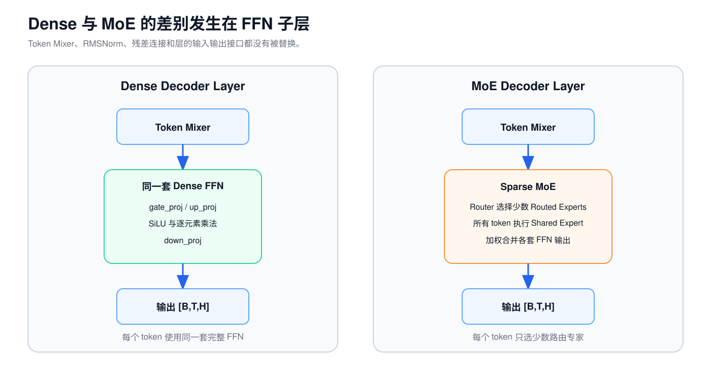
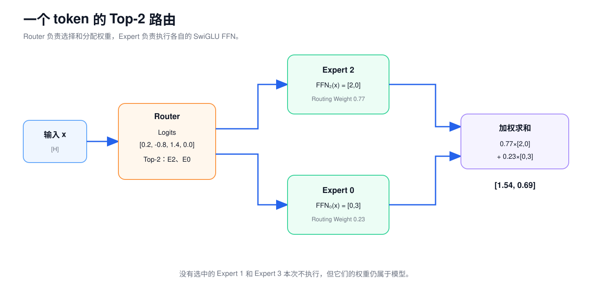
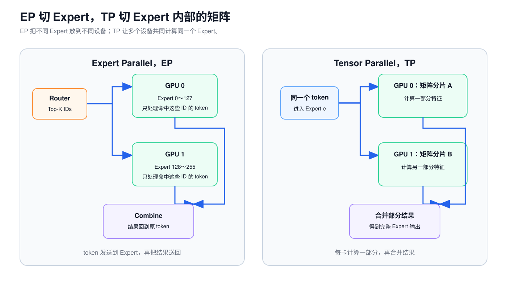

# 第 6 课：Dense FFN 与 MoE 的结构差异

第 2 课已经拆开过 Dense SwiGLU FFN：每个 token 都经过 `gate_proj`、`up_proj`、SiLU、逐元素乘法和 `down_proj`。Qwen3.5-9B 的 32 个 Decoder Layer 都使用这套 Dense FFN。

Qwen3.5-35B-A3B 在语言模型的 40 个 Decoder Layer 中保留 RMSNorm、残差连接以及 Gated DeltaNet 和 Full Attention，只把每层的一套 Dense FFN 换成路由器和多套专家 FFN。

这里的 MoE 指语言 Decoder 的 FFN。Qwen3.5-35B-A3B 的视觉编码器仍使用自己的 Dense Vision MLP，不能把语言层的专家数量套到视觉路径上。



MoE 中有多套参数不同的 FFN，每一套称为专家（Expert）。路由器（Router）根据当前 token 的隐藏状态选出少数路由专家（Routed Expert）。Qwen3.5 还让所有 token 固定经过一个共享专家（Shared Expert），最后把两条路径的输出合并回 `H` 维。

## 1. Dense FFN 的计算路径

对一个 token 的 `H` 维输入 `x`，Dense SwiGLU 的计算是：

$$
g=SiLU(gate\_proj(x))
$$

$$
u=up\_proj(x)
$$

$$
y=down\_proj(g\odot u)
$$

Shape 为：

```text
x                 [H]
gate_proj(x)      [I]
up_proj(x)        [I]
逐元素相乘         [I]
down_proj         [H]
```

批量处理时：

```text
[B,T,H] → [B,T,I] → [B,T,H]
```

`B` 和 `T` 都没变。FFN 分别加工每个 token 的内部特征，不负责让不同 token 互相读取。Dense 表示每个 token 都使用同一套完整 FFN 参数，而不是序列中的所有 token 彼此全连接。

Qwen3.5-9B 的 `H=4096`、`I=12288`。一层 Dense FFN 有三张无偏置权重矩阵，参数数为：

$$
3HI=3\times4096\times12288=150,994,944
$$

每个 token 都会使用这些参数。

## 2. 路由选择与专家输出合并

假设一层有 4 个路由专家，每个专家都是一套独立的 SwiGLU FFN：

```text
专家 0：FFN_0
专家 1：FFN_1
专家 2：FFN_2
专家 3：FFN_3
```

当前 token 进入 FFN 子层前，会先经过 RMSNorm。这里用 `x:[H]` 表示归一化后的向量。路由器是一个 Linear，它根据 `x` 产生 4 个分数：

```text
路由器权重 W_router：[4,H]
x：[H]
x W_router^T：[4]
```

`W_router` 的每一行对应一个路由专家。`x` 分别与四行权重点积，得到四个路由分数（Router Logits）；这一步只负责打分，还没有执行任何专家 FFN。真实 Qwen3.5-35B-A3B 的路由器权重是 `[256,2048]`。

```text
router_logits = [0.2, -0.8, 1.4, 0.0]
```

这些分数经过 Softmax 后约为：

```text
router_probs = [0.18, 0.07, 0.60, 0.15]
```

若使用 Top-2，选择概率最大的专家 2 和专家 0。只保留这两个概率并重新归一化：

```text
selected_experts = [2, 0]
routing_weights  = [0.77, 0.23]
```

假设两个专家的输出是：

```text
专家 2：FFN_2(x) = [2,0]
专家 0：FFN_0(x) = [0,3]
```

路由专家的合并结果为：

$$
0.77\times[2,0]+0.23\times[0,3]
=[1.54,0.69]
$$



路由器没有把 token 永久归类。下一层会使用另一组路由器权重，同一个 token 也可能选中完全不同的专家。

## 3. 路由分数、专家编号与路由权重

这三个对象经常在日志和代码中同时出现：

| 对象 | 缩小例子的 shape | 内容 |
| --- | --- | --- |
| 路由分数（Router Logits） | `[4]` | 对全部 4 个路由专家的原始分数 |
| 路由概率（Router Probabilities） | `[4]` | 路由分数经过 Softmax 后的概率 |
| 选中的专家编号（Selected Expert IDs） | `[2]` | Top-2 选中的整数编号 |
| 路由权重（Routing Weights） | `[2]` | 选中分支重新归一化后的浮点权重 |

路由概率不是语言模型的下一个 token 概率。两者虽然都可能使用 Softmax，但归一化的候选集合不同：

```text
词表 Softmax：在 V 个候选 Token ID 中选择下一个 token
路由 Softmax：在 E 个路由专家中选择本层要执行的 FFN
```

专家编号只是参数集合的索引。训练没有要求专家 17 必须是“代码专家”，也没有保证某个专家始终对应一个可命名主题。

## 4. 路由专家的内部计算

MoE 没有改变 FFN 的基本计算。每个路由专家都包含自己的三张权重：

```text
gate_proj_e  [I,H]
up_proj_e    [I,H]
down_proj_e  [H,I]
```

如果一批中有 `n_e` 个 token 被送到专家 `e`：

```text
输入                       [n_e,H]
gate_proj / up_proj        两个 [n_e,I]
SiLU(gate) × up            [n_e,I]
down_proj                  [n_e,H]
乘各 token 的 routing weight [n_e,H]
```

不同专家的计算过程相同，权重数值不同。`n_e` 由本批 token 的路由结果决定，每个专家收到的数量可能不同。

Qwen3.5 为执行方便，把全部路由专家的 gate 和 up 权重存成一个融合张量，但逻辑上仍可理解为每个专家各有一套 `H → I → H` 的 SwiGLU。

## 5. 共享专家与 Top-K 路由

Qwen3.5-35B-A3B 还有一个共享专家。所有 token 都会经过它：

```text
shared_output = shared_expert(x)   [H]
shared_gate   = sigmoid(x w_s^T)   [1]，其中 w_s:[1,H]
gated_shared  = shared_gate × shared_output
```

`x` 与 `w_s` 的唯一一行做点积，先得到一个标量，再经过 Sigmoid 变成门控系数。这沿用了第 0 课统一使用的行向量写法 `y=xW^T`。

最终结果是：

$$
y=y_{routed}+y_{shared}
$$

延续前面的缩小例子，假设共享专家输出 `[0.5,0.5]`，门控系数为 `0.4`：

$$
y_{shared}=0.4\times[0.5,0.5]=[0.2,0.2]
$$

最终输出为：

$$
[1.54,0.69]+[0.2,0.2]=[1.74,0.89]
$$

仓库中的 [MoE 路由复算程序](../../examples/moe_routing_walkthrough.py) 使用同一组路由分数、专家输出和共享专家门控值，并保留完整精度计算。

共享专家不属于 Top-2，也不与路由专家共用那组和为 1 的路由权重。它为每个 token 提供一条固定执行的 FFN 路径，但这一结构本身不能证明共享专家一定保存“通用知识”。

## 6. Qwen3.5-35B-A3B 的 MoE 数据流

官方配置给出：

```text
H = 2048
E = 256 个路由专家
K = 每 token 选择 8 个
I = 每个专家的中间维度 512
共享专家 = 1 个，中间维度也是 512
Decoder Layer = 40
```

令 `M=B×T`，也就是当前这批 token 的总数。MoE 会临时把 `[B,T,H]` 展平为 `[M,H]`：


| 阶段 | shape | 说明 |
| --- | --- | --- |
| 输入 | `[B,T,2048]` | Decoder Layer 的隐藏状态 |
| 展平输入 | `[M,2048]` | `M=B×T` |
| 路由分数 | `[M,256]` | 每个 token 对所有路由专家的分数 |
| 选中的专家编号 | `[M,8]` | 每个 token 的 Top-8 整数编号 |
| 路由权重 | `[M,8]` | Top-8 重新归一化后的权重 |
| 专家 `e` 输入 | `[n_e,2048]` | 本批被送到专家 `e` 的 token |
| 专家中间结果 | `[n_e,512]` | SwiGLU 中间宽度 |
| 专家输出 | `[n_e,2048]` | 乘路由权重后写回 |
| 路由专家合并结果 | `[M,2048]` | 每 token 的 8 个专家输出求和 |
| 共享专家输出 | `[M,2048]` | 所有 token 都执行 |
| 共享专家门控 | `[M,1]` | 每 token 一个 Sigmoid 系数 |
| MoE 输出 | `[B,T,2048]` | 恢复原 token 顺序和 shape |

MoE 的入口和出口仍是 `[B,T,H]`，所以外侧残差连接不需要改变。

## 7. Token 分发与输出归并

假设一批只有 3 个 token，每个选择 2 个专家：

```text
token 0 → 专家 1、专家 3
token 1 → 专家 2、专家 3
token 2 → 专家 1、专家 4
```

原始输入按 token 排列。执行专家 FFN 前，要根据专家编号重新分组：

```text
专家 1 收到：token 0、token 2
专家 2 收到：token 1
专家 3 收到：token 0、token 1
专家 4 收到：token 2
```

同一个 token 会出现在多个专家分组中。专家计算结束后，每份结果还要乘对应的路由权重，再加回这个 token 原来的位置。

参考实现可以逐专家 gather，再用 `index_add` 归并。生产 Kernel 常先按专家编号排序，再用 Grouped GEMM 一次处理多组不同大小的矩阵。两种实现的路由、Top-K、专家 FFN 和加权归并语义相同。

## 8. 专家负载均衡

路由器按每个 token 的当前表示选择专家，不保证一批内 256 个专家平均收到 token。对某层来说：

```text
n_0, n_1, ..., n_255
```

可能相差很大。负载不均会带来几种直接后果：

- 热门专家的计算更多，持有它的设备可能成为慢点；
- 很多专家只收到少量 token，GEMM 太小，GPU 利用率低；
- 跨设备发送量不同，最慢的 Rank 决定这一层何时结束。

Decode 小 Batch 尤其容易出现碎片。若一轮只有 8 个 token，Top-8 共产生 64 份路由任务，要分给 256 个专家。许多专家没有输入，命中的专家也常只有很小的 `n_e`。

训练时的负载均衡损失会惩罚长期过度集中的路由，但它不是推理调度器，也不能保证每个推理 Batch 完全平均。判断 MoE 性能要看每层实际的 `n_e` 分布，不能只用 `M×K/E` 的平均值。

## 9. 总参数量与激活参数量

总参数回答模型需要保存多少权重。激活参数（Active Parameters）描述一个 token 本轮实际使用了哪些权重。没被当前 token 选中的专家仍属于模型，其他 token 或下一轮可能会用到。

对 Qwen3.5-35B-A3B 的一层 MoE：

```text
H = 2048
I = 512
E = 256
K = 8
```

一个 SwiGLU 专家有：

$$
3HI=3\times2048\times512=3,145,728
$$

个参数。

一层需要保存的 MoE 参数约为：

| 部分 | 参数数 |
| --- | ---: |
| 256 个路由专家 | `805,306,368` |
| 1 个共享专家 | `3,145,728` |
| 共享专家门控 | `2,048` |
| 路由器 | `524,288` |
| 合计 | `808,978,432` |

一个 token 在这一层实际使用：

| 部分 | 参数数 |
| --- | ---: |
| 8 个路由专家 | `25,165,824` |
| 共享专家与门控 | `3,147,776` |
| 路由器 | `524,288` |
| 合计 | `28,837,888` |

40 层 MoE 子层合计约 32.36B 总参数；一个 token 在这些 MoE 子层使用约 1.15B 激活参数。加上 Embedding、Token Mixer、Norm、LM Head 等其他模块后，官方整模型口径约为 35B 总参数 / 3B 激活参数。

所以 A3B 不表示只需要加载 3B 权重，也不表示推理速度必然是同等 Dense 模型的若干倍。一批 token 合起来可能访问很多甚至全部专家，实际成本还受权重读取、Token 分发、Grouped GEMM 大小和通信影响。

## 10. 专家并行（EP）与张量并行（TP）



| 并行方式 | 切分什么 | token 怎样参与 | 主要通信位置 |
| --- | --- | --- | --- |
| 专家并行，EP | 不同专家编号 | 根据 Top-K 去持有对应专家的设备 | 路由后分发，专家计算后归并 |
| 张量并行，TP | 一个 Linear 或专家内部的矩阵 | 同一 token 在多个矩阵分片上算部分结果 | Linear 内部或输出合并处 |

EP 把专家权重分布在不同设备，并把 token 送到持有相应专家的设备。具体通信不只有一种：有的引擎使用两次 All-to-All，有的实现通过本地专家计算后用 All-Reduce 合并，还有 All-Gather 或专用 Dispatcher。

因此，看到“EP=8”只能知道专家被分到 8 个并行 Rank，不能直接推出网络中一定出现哪一种 Collective。还要结合 runtime 的 Token Dispatcher、专家映射和并行组合方式。

TP 可以继续切分单个专家的 gate/up/down 矩阵。一个部署也可能同时使用 EP 和 TP，此时要同时考虑 Token 分发与归并，以及专家内部的 TP Collective。

## 11. MoE 推理中的计算与通信瓶颈

只看总参数或激活参数都不足以判断实际速度。还要同时观察下面五项：

| 因素 | 为什么影响性能 | 需要观察什么 |
| --- | --- | --- |
| 路由任务数量 | 一轮 `M` 个 token、Top-K 为 `K`，会产生 `M×K` 份专家计算任务 | 每层任务总数 |
| 专家的 token 分布 | Grouped GEMM 的效率取决于各专家的 `n_e`；总量相同，分布倾斜程度仍可能不同 | `n_e` 分布、空专家和热点专家 |
| 专家权重的加载与驻留 | 单 token 只激活少数专家，但不同轮次可能访问不同权重 | 权重驻留位置、显存带宽和缓存命中 |
| Token 分发、归并与拓扑 | 跨 NVLink、PCIe 和跨机网络的代价差异很大 | 每个 Rank 的发送量、Collective 时间和慢 Rank |
| 共享专家的布局 | 共享专家对所有 token 执行，可能复制、做 TP 或与路由专家重叠执行 | 共享专家计算与通信是否进入关键路径 |

因此，MoE 性能分析不能只用 `M×K/E` 的平均值代替真实分布，也不能只看卡数推断通信代价。

## 12. 练习：从专家分组到输出合并

一个教学用 MoE 有 4 个路由专家，每个 token 选择 2 个。路由结果如下：

| token | 专家编号 | 路由权重 |
| --- | --- | --- |
| `t0` | `[1,3]` | `[0.7,0.3]` |
| `t1` | `[0,3]` | `[0.6,0.4]` |
| `t2` | `[1,2]` | `[0.8,0.2]` |

1. 分别列出专家 0～3 收到哪些 token。
2. 写出路由分数、选中的专家编号和路由权重的 shape，并计算路由任务总数。
3. 哪些专家收到的 token 最多？Grouped GEMM 的各组大小是否相同？
4. 对 `t0`，假设专家 1 输出 `[2,0]`，专家 3 输出 `[0,4]`，计算路由专家的合并结果。
5. 若模型还有一个共享专家，它要处理多少个 token？它是否包含在上面的路由任务中？

<details>
<summary>查看答案</summary>


```text
专家 0：t1
专家 1：t0, t2
专家 2：t2
专家 3：t0, t1
```

这批有 `M=3` 个 token、4 个路由专家，每个 token 选择 2 个，因此：

```text
路由分数:          [3,4]
选中的专家编号:  [3,2]
路由权重:          [3,2]
路由任务数:        3×2=6
```

专家 1 和 3 各收到两个 token，专家 0 和 2 各收到一个，Grouped GEMM 的组大小不同。`t0` 的路由专家输出为：

$$
0.7[2,0]+0.3[0,4]=[1.4,1.2]
$$

共享专家固定处理三个 token，不属于 Top-2 的六份路由任务。它的输出还要按共享专家门控加入最终结果。

</details>

## 参考资料

以下模型配置和实现于 2026-08-08 按固定 revision 复核：

- [Qwen3.5-35B-A3B 模型卡，revision 59d61f3](https://huggingface.co/Qwen/Qwen3.5-35B-A3B/blob/59d61f3ce65a6d9863b86d2e96597125219dc754/README.md)
- [Qwen3.5-35B-A3B `config.json`，revision 59d61f3](https://huggingface.co/Qwen/Qwen3.5-35B-A3B/blob/59d61f3ce65a6d9863b86d2e96597125219dc754/config.json)
- [Transformers：Qwen3.5 MoE 模型实现，revision 9436284](https://github.com/huggingface/transformers/blob/943628458a1691f8af09c47ea9fc6e314734722f/src/transformers/models/qwen3_5_moe/modeling_qwen3_5_moe.py)
- [Transformers：Qwen3.5 MoE 配置实现，revision 9436284](https://github.com/huggingface/transformers/blob/943628458a1691f8af09c47ea9fc6e314734722f/src/transformers/models/qwen3_5_moe/configuration_qwen3_5_moe.py)
- [Megatron Core：MoE Token Dispatcher API](https://docs.nvidia.com/megatron-core/developer-guide/nightly/apidocs/core/core.transformer.moe.token_dispatcher.html)

算法和结构对照参考：

- [Mixtral of Experts](https://arxiv.org/abs/2401.04088)
- [Qwen3 Technical Report](https://arxiv.org/abs/2505.09388)
- [Switch Transformers](https://arxiv.org/abs/2101.03961)
- [DeepSeekMoE](https://arxiv.org/abs/2401.06066)
- [Qwen Team：Global-batch load balance](https://qwenlm.github.io/blog/global-load-balance/)

---

[上一课：Gated DeltaNet 的状态读写](05-gated-deltanet.md) · [返回课程路线](../roadmap.md) · [下一课：多模态输入与视觉编码](07-multimodal-input.md)
