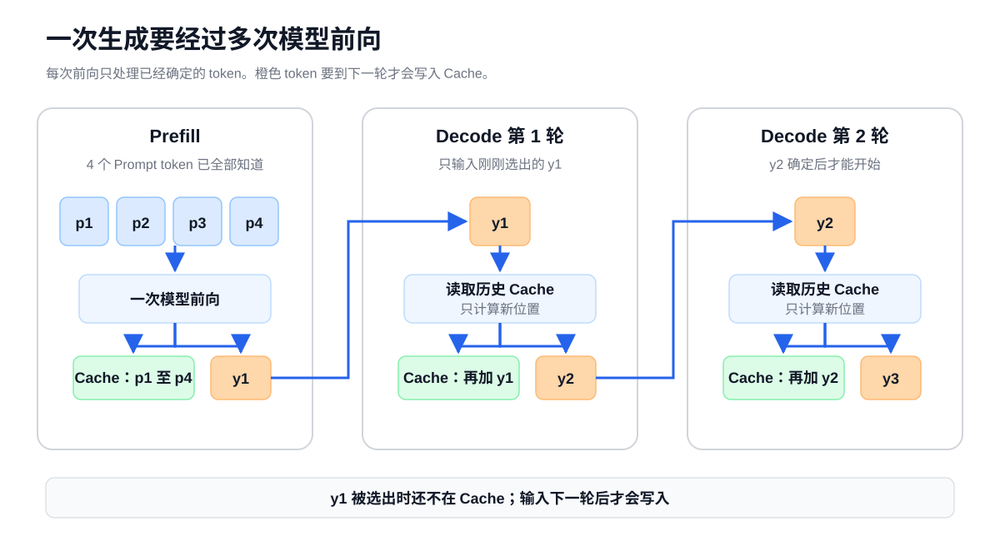

# 第 6 课：自回归推理的执行阶段与状态复用

前面几课已经拆开了 Decoder Layer 中的主要计算：Full Attention、Gated DeltaNet、Dense FFN 和 MoE。现在把它们放回一次完整生成，观察同一套模型怎样先处理 Prompt，再逐个生成新 token。

这一阶段最容易混淆的是 token 和请求状态的时间关系。本轮前向根据 Logits 选出的 token，要到下一轮才会进入模型并写入状态。下面先跟踪一次生成，再分别展开两类层的状态。

## 1. Prefill 建立状态，Decode 逐步更新

假设 Prompt 已经分成四个 token：

```text
p1  p2  p3  p4
```

模型接下来生成 `y1 y2 y3`。各轮前向的关系如下：

| 模型前向 | 本轮送入模型的 token | 前向结束后保存的状态 | 根据本轮 Logits 选出 |
| --- | --- | --- | --- |
| Prefill | `p1 p2 p3 p4` | Prompt 对应的请求状态 | `y1` |
| Decode 第 1 轮 | `y1` | Prompt 加 `y1` 的状态 | `y2` |
| Decode 第 2 轮 | `y2` | Prompt 加 `y1 y2` 的状态 | `y3` |



表中有一处容易混淆。Prefill 选出了 `y1`，但 Prefill 的输入不含 `y1`，所以 Prefill 结束时的请求状态也不含 `y1`。下一轮把 `y1` 送入模型后，各层才会把它写入自己的状态。

### 1.1 Prefill 处理已经给出的 Prompt

模型开始运行前，Prompt 中所有 Token ID 都已经确定。以 `B=1`、`T=4` 为例：

```text
Token IDs                    [1,4]
→ Embedding                  [1,4,H]
→ 32 个 Decoder Layer        [1,4,H]
→ 最终 RMSNorm               [1,4,H]
→ 取最后一个位置 p4          [1,H]
→ LM Head                    [1,V]
→ 贪心或采样
→ y1
```

模型会计算 Prompt 中各位置的隐藏状态。普通自回归生成只用最后一个位置的 Logits 选择首个输出 token。

### 1.2 Decode 每轮处理一个已经选出的 token

Prefill 选出 `y1` 后，下一轮前向以 `y1` 为输入：

```text
y1
→ Embedding
→ 读取并更新各层的请求状态
→ 最终隐藏状态
→ LM Head
→ 预测 y2 的 Logits
→ 贪心或采样得到 y2
```

随后用 `y2` 预测 `y3`。普通自回归生成必须先确定 `y1`，才能构造预测 `y2` 的输入；因此不能把未来 100 个输出 token 当成已知的 `T=100` 一次算完。

它们的联合概率可以写成：

$$
P(y_1,y_2,y_3\mid p)
=P(y_1\mid p)P(y_2\mid p,y_1)P(y_3\mid p,y_1,y_2)
$$

每一项都依赖前面已经选出的结果。KV Cache 或递归状态可以避免重复计算历史，但不能消除这条依赖。

## 2. Prefill 与 Decode 的模块级差异

Prefill 和 Decode 不使用两套模型。权重相同，Decoder Layer 的结构也相同。区别在于本轮有多少个新位置，以及各层要读取多少历史状态。

| Decoder Layer 中的模块 | Prefill | Decode |
| --- | --- | --- |
| Full Attention | 处理 Prompt 中多个已知位置，建立各层 KV Cache | 为当前 token 计算 Q/K/V，用新 Q 读取历史 K/V，再追加新 K/V |
| Gated DeltaNet | 沿 Prompt 更新卷积状态和递归状态 | 用当前 token 继续更新这两类状态 |
| Dense FFN | 对本轮每个 token 位置执行同一组 FFN 权重 | 对当前 token 执行同一组 FFN 权重 |
| MoE | 每个 token 经过 Router，再进入选中的专家 | 当前 token 同样经过 Router 和选中专家 |
| Residual 与 RMSNorm | 正常执行 | 正常执行 |

Cache 不会跳过整个 Decoder Layer。每个新 token 仍要经过所有层、所有残差路径和本层的 FFN；Cache 复用的是历史位置已经产生的状态。

### 2.1 Prompt 已知位置的批量计算

Prompt 的 Token ID 已全部给出。Full Attention 可以把多个位置的 Q、K、V 组织成同一组张量：

```text
Q：[B,Nq,T,D]
K：[B,Nkv,T,D]
V：[B,Nkv,T,D]
```

因果遮罩仍然限制每个位置可以读取的范围：

```text
p1 读取 p1
p2 读取 p1、p2
p3 读取 p1、p2、p3
p4 读取 p1、p2、p3、p4
```

遮罩规定数据关系，张量运算决定机器怎样组织计算。两者并不冲突。

“Prompt 可以并行”只是工程上的简写。Decoder Layer 仍要逐层执行；Qwen3.5 的 Gated DeltaNet 在数学上也保留递归状态，只是实现可以用 Chunk Kernel 组织一段已知序列。准确的说法是：Prompt 已全部给出，运行时可以把多个已知位置组织成较大的前向计算。

## 3. KV Cache 复用历史 K/V 的依据

先只看一个 Full Attention 层。过去位置的 K/V 由当时的隐藏状态计算得到：

```text
k_i = Linear_K(x_i)
v_i = Linear_V(x_i)
```

因果遮罩保证位置 `i` 只能读取位置 `1...i`。未来的 `y1` 到来后，过去位置当时看到的内容不会改变，因此已经算出的 `k_i` 和 `v_i` 也不需要重算。

这就是 KV Cache 正确性的依据：它复用的是因果模型中已经完成、以后不会被未来 token 改写的中间结果。

KV Cache 按 Full Attention 层保存，而不是整个模型只有一份。第 3 层的 K/V 来自第 3 层输入，第 7 层的 K/V 来自第 7 层输入，两者不能混用。

### 3.1 K/V 需要保留，Q 只在当前步使用

Q 表示当前读取需求。某个位置的 Q 只在处理该位置时使用一次；后续 token 会生成自己的 Q。

K/V 代表一个历史位置以后怎样被查询，以及它能提供什么内容。每个后续 Query 都可能读取它们，所以需要保留。

Qwen3.5 的 Full Attention 先对 Q/K 应用 RoPE，再把 K 写入 Cache。缓存中的 K 已经包含对应的位置信息。V 不参与 RoPE，也会写入 Cache。

## 4. 一步 Decode 的数据流

假设 Prefill 后，某个 Full Attention 层已经缓存四个 Prompt 位置：

```text
K_past：[B,Nkv,4,D]
V_past：[B,Nkv,4,D]
```

现在输入 `y1`。当前层只为这个新位置生成：

```text
q_new：[B,Nq,1,D]
k_new：[B,Nkv,1,D]
v_new：[B,Nkv,1,D]
```

从模型语义看，新 K/V 追加到历史状态：

```text
K_all：[B,Nkv,5,D]
V_all：[B,Nkv,5,D]
```

新 Query 对五个位置打分并汇总它们的 V：

```text
q_new 与 K_all 打分      [B,Nq,1,5]
Softmax                  [B,Nq,1,5]
权重汇总 V_all           [B,Nq,1,D]
```


这次前向结束后，Cache 才从四个位置增长到五个位置。刚刚从 Logits 选出的 `y2` 尚未进入模型，所以 Cache 中还没有 `y2`。

### 4.1 KV Cache 省掉的计算

没有 Cache 时，生成 `y2` 需要重新处理：

```text
p1 p2 p3 p4 y1
```

生成 `y3` 又要重新处理：

```text
p1 p2 p3 p4 y1 y2
```

使用 Cache 后，当前前向只更新一个新位置。历史 token 不再重复经过各层，也不再重新产生历史 K/V。


### 4.2 KV Cache 没有省掉的计算

当前 token 仍要完成：

- 所有 Decoder Layer 的 RMSNorm、Residual 和 Token Mixer；
- Dense FFN，或 MoE 的 Router 与选中专家；
- 当前 Q/K/V 投影；
- 当前 Query 对历史 K 的 Attention；
- 历史 V 的加权汇总；
- 最终 RMSNorm、LM Head 和 token 选择。

因此，使用 KV Cache 不等于每步 Decode 的成本固定不变。Full Attention 中，新 Query 仍要读取随上下文增长的历史 K/V；上下文越长，这部分工作越多。

## 5. Qwen3.5 同时保存两类层状态

Qwen3.5-9B 有 32 个 Decoder Layer，其中 8 层使用 Full Attention，24 层使用 Gated DeltaNet。

| 层类型 | 层数 | 跨前向保存的状态 | 是否随上下文长度增长 |
| --- | ---: | --- | --- |
| Full Attention | 8 | 每层历史 K/V | 是 |
| Gated DeltaNet | 24 | 每层卷积状态和递归状态 | shape 固定 |

所以，一个 Qwen3.5 请求的状态不是一份全局 KV Cache，而是两套状态的组合：

```text
8 个 Full Attention 层：K/V 随已处理位置数增长
24 个 Gated DeltaNet 层：卷积状态和递归状态原地更新
```

第 4 课已经解释 Gated DeltaNet 的状态更新。本课只关心它在两类前向中的生命周期：Prefill 处理 Prompt 时建立状态，Decode 每轮读取旧状态并写回新状态。

## 6. KV Cache 沿 token 轴增长

一个 Full Attention 层的 K Cache 和 V Cache 都可以写成：

```text
[B,Nkv,T,D]
```

| 符号 | 含义 |
| --- | --- |
| `B` | 保存状态的序列数 |
| `Nkv` | K/V 头数 |
| `T` | 已经经过模型的位置数 |
| `D` | 每个 K/V 头的维度 |

设 Full Attention 层数为 `L_full`，每个元素占 `s` 字节，逻辑有效载荷为：

$$
\mathrm{KV\ bytes}
=2\times L_{full}\times B\times T\times N_{kv}\times D\times s
$$

最前面的 `2` 表示 K 和 V 两份缓存。

`T` 包括 Prompt 和已经作为输入经过模型的输出 token。刚被选出、尚未进入下一轮前向的 token 不计入 Cache。

第 8 课会代入 Qwen3.5 的真实配置，计算每个 token 的 KV 字节数，并继续处理 dtype、Tensor Parallel 和运行时实际占用。

## 7. 练习：跟踪请求状态

Prompt 是 `p1 p2 p3 p4`，模型最终生成 `y1 y2 y3`。补全下表：

| 模型前向 | 本轮输入 | 前向结束后的已处理位置 | 本轮选出的 token |
| --- | --- | --- | --- |
| Prefill | `p1 p2 p3 p4` |  |  |
| Decode 第 1 轮 |  |  |  |
| Decode 第 2 轮 |  |  |  |

然后回答：

1. Decode 第 2 轮结束后，Full Attention 的 KV Cache 中有几个位置？`y3` 是否已经写入？
2. KV Cache 为什么不能让同一请求一次确定 `y1 y2 y3`？
3. 使用 KV Cache 后，为什么 Full Attention 的单步 Decode 成本仍可能随上下文增长？

<details>
<summary>查看答案</summary>

| 模型前向 | 本轮输入 | 前向结束后的已处理位置 | 本轮选出的 token |
| --- | --- | --- | --- |
| Prefill | `p1 p2 p3 p4` | `p1 p2 p3 p4` | `y1` |
| Decode 第 1 轮 | `y1` | `p1 p2 p3 p4 y1` | `y2` |
| Decode 第 2 轮 | `y2` | `p1 p2 p3 p4 y1 y2` | `y3` |

1. Decode 第 2 轮结束后，Cache 中有 6 个位置。`y3` 刚从 Logits 中选出，还没有进入下一次模型前向，因此不在 Cache 中。
2. KV Cache 只能复用已经算出的历史状态。`y2` 取决于实际选中的 `y1`，`y3` 又取决于 `y2`，所以三个 token 仍要依次确定。
3. 每个新 Query 仍要读取历史 K/V。上下文越长，需要读取和参与 Attention 计算的位置越多。

</details>

## 参考资料

以下 Qwen3.5 配置和 Transformers 实现于 2026-08-08 按固定 revision 复核：

- [Qwen3.5-9B-Base `config.json`，revision 68c46c4](https://huggingface.co/Qwen/Qwen3.5-9B-Base/blob/68c46c4b3498877f3ef123c856ecfde50c39f404/config.json)
- [Transformers：Qwen3.5 模型实现，revision 9436284](https://github.com/huggingface/transformers/blob/943628458a1691f8af09c47ea9fc6e314734722f/src/transformers/models/qwen3_5/modeling_qwen3_5.py)
- [Transformers：Cache 实现，revision 9436284](https://github.com/huggingface/transformers/blob/943628458a1691f8af09c47ea9fc6e314734722f/src/transformers/cache_utils.py)
- [Transformers：生成循环，revision 9436284](https://github.com/huggingface/transformers/blob/943628458a1691f8af09c47ea9fc6e314734722f/src/transformers/generation/utils.py)
- [Transformers：KV Cache 说明，revision 9436284](https://github.com/huggingface/transformers/blob/943628458a1691f8af09c47ea9fc6e314734722f/docs/source/en/cache_explanation.md)

---

[上一课：Dense FFN 与 MoE 的结构差异](05-dense-and-moe.md) · [返回课程路线](../roadmap.md) · [下一课：多模态输入与视觉编码](07-multimodal-input.md)
