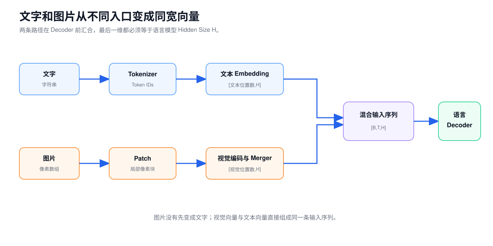
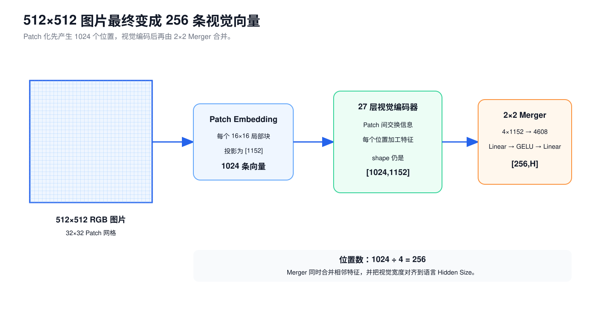
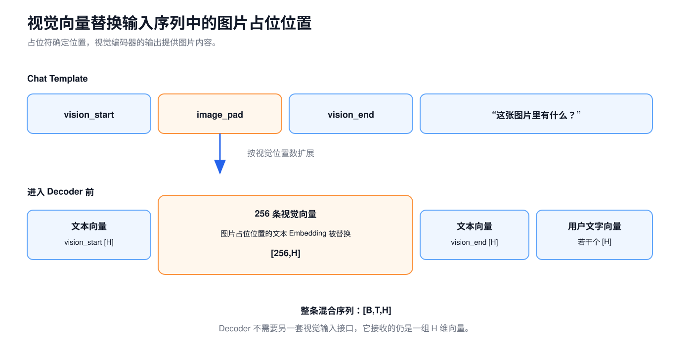
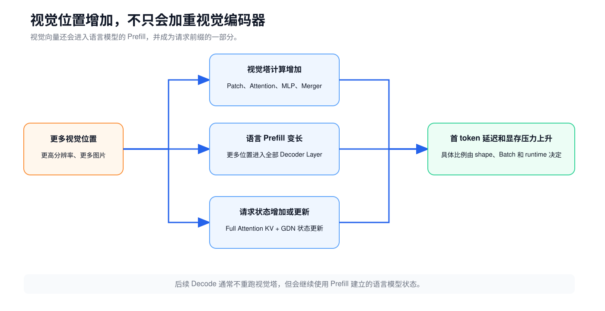

# 第 7 课：图片怎样送进语言模型

前六课只处理文字。文本经过 Tokenizer 得到 Token ID，再查询 Embedding 表，成为一组 `H` 维向量。

图片没有 Token ID，也不能拿像素值直接查询文本 Embedding 表。Qwen3.5 会先用视觉编码器处理图片，再把视觉结果变成与文本向量相同的宽度。两条路径在进入语言模型 Decoder 前汇合：

```text
文字 → Token ID → 文本 Embedding ─────────────┐
                                               ├→ 一条混合输入序列 → Decoder
图片 → 像素 → 视觉编码器 → 视觉特征 → 投影 ───┘
```



图片不会先被识别成一段文字再交给语言模型。视觉编码器输出的是向量，模型会直接把这些向量放进输入序列。

下面沿着一张 `512×512` 的图片走完整条链路：

```text
调整尺寸与归一化
→ 切成 16×16 Patch
→ Patch Embedding
→ 加入按当前网格插值的位置 Embedding
→ 27 层视觉编码器，视觉 Attention 使用 Vision RoPE
→ 每 2×2 个视觉特征合并为一个
→ 投影到语言模型 Hidden Size
→ 替换序列中的图片占位位置
→ 与文本向量一起进入 Decoder
```

## 1. 先分清三个容易混用的“token”

多模态资料经常把下面三种东西都简称为 token：

| 对象 | 从哪里来 | 进入 Decoder 吗 |
| --- | --- | --- |
| 文本 token | Tokenizer 切分文字 | 对应的 Embedding 向量进入 |
| 图片占位 token | Chat Template 放入的特殊 Token ID | 其位置最终由视觉向量替换 |
| 视觉位置 | 视觉编码器和 Merger 的输出 | 作为 `H` 维向量进入 |

严格来说，视觉位置不是 Tokenizer 从词表中切出的词。课程仍会沿用工程中常见的“视觉 token”说法，但它指的是送入 Decoder 的一条视觉向量。

## 2. 图片先调整到适合切块的尺寸

Qwen3.5 不会把所有图片强行压成同一个正方形。处理器会尽量保留宽高比，并把高度和宽度调整为 32 的整数倍：

$$
32=patch\_size\times merge\_size=16\times2
$$

为什么必须是 32 的整数倍？后面要先按 `16×16` 切 Patch，再把相邻 `2×2` 个 Patch 特征合并。宽和高能被 32 整除，两个步骤才不会在边缘剩下半块。

像素还会按通道归一化。Qwen3.5 的预处理配置使用：

```text
image_mean = [0.5, 0.5, 0.5]
image_std  = [0.5, 0.5, 0.5]
```

对一个像素通道值 `p`，计算为：

$$
p'=\frac{p-0.5}{0.5}
$$

若输入像素已经缩放到 `[0,1]`，归一化后大致落在 `[-1,1]`。这只是把数值调整到模型训练时使用的尺度，不是识别图像内容。

## 3. Patch：把大图拆成规则小块

假设调整后的图片是 `512×512`，Patch 边长为 16：

```text
横向 Patch 数：512 / 16 = 32
纵向 Patch 数：512 / 16 = 32
Patch 总数：   32 × 32 = 1024
```

每个空间 Patch 包含：

```text
16 × 16 × 3 = 768 个像素通道值
```

其中 3 是红、绿、蓝三个通道。Patch 化没有把图片内容压缩成一个标签，只是把一张大数组重新分成 1024 个局部小数组。



## 4. Patch Embedding：把一块像素变成一条向量

文本的 Token ID 可以查 Embedding 表，是因为 Token ID 是有限词表中的整数。Patch 由连续像素值组成，需要通过一次可学习的投影变成向量。

Qwen3.5 使用一个三维卷积做 Patch Embedding，卷积核覆盖：

```text
时间方向：2 帧
高度方向：16 像素
宽度方向：16 像素
输入通道：3
输出宽度：1152
```

先忽略视频的时间方向，把静态图片理解成一个 Patch 的像素向量 `p:[1536]`。这里的 1536 来自 `2×16×16×3`，静态图会复制一次像素以满足两帧输入形状。投影可以写成：

$$
x_{patch}=W_{patch}p+b
$$

输出 `x_patch:[1152]`。概念上，可以把全部 Patch 写成 `[1024,1536]`。官方实现会在 Conv3d 前把它重排为 channel-first 的 `[N,C,T,H,W]`：

```text
[1024, 1536]
→ 重排为 [1024, 3, 2, 16, 16]
→ Conv3d Patch Embedding
→ [1024, 1152]
```

三维卷积是高效实现形式。就这一层的作用而言，可以把它理解成“每个 Patch 共用同一张 Linear 权重，把局部像素重新组合成 1152 个特征”。

静态图复制像素只是为了匹配 `temporal_patch_size=2` 的输入形状，不会让最终视觉位置数翻倍。

## 5. 视觉编码器让不同 Patch 交换信息

刚做完 Patch Embedding 时，每条向量主要描述一个局部小块。只看单个 Patch，模型很难判断它属于眼睛、车轮，还是背景纹理。

视觉塔在进入 Transformer Block 前先补上位置信息。Qwen3.5 使用两种互补的处理：

```text
可学习的位置 Embedding：按当前视觉网格插值，再加到 Patch 向量上
Vision RoPE：             由视觉网格位置生成，作用在每个视觉 Attention 的 Q/K 上
```

前者直接改变每条 Patch 向量，后者改变视觉 Attention 比较位置的方式。它们都发生在视觉塔内部，还没有进入语言 Decoder。

Qwen3.5 的视觉塔有 27 个视觉 Transformer Block，内部宽度为 1152。每个 Block 有两类主要工作：

```text
视觉 Attention：让不同 Patch 位置交换信息
视觉 MLP：      加工每个位置内部的特征
```

经过多层后，一个 Patch 位置的向量不再只包含原来的 `16×16` 像素，还混入了整张图中其他相关位置的信息。这里与文本 Decoder 的思想相似，但视觉塔使用独立的参数、位置 Embedding 和 Vision RoPE，不能把它当成语言 Decoder 的前几层。

## 6. Merger：四个相邻特征合成一个

27 层视觉编码器输出的 shape 仍是：

```text
[1024, 1152]
```

接下来，Merger 把每个 `2×2` 区域的四条特征拼起来：

```text
4 条 [1152]
→ 拼接
→ 1 条 [4608]
```

位置数因此从 1024 降到：

$$
1024\div(2\times2)=256
$$

Merger 不是简单求平均，也不是随手删掉四条中的三条。拼接后的 4608 维特征还会经过两层 Linear 和 GELU。以 Qwen3.5-9B 为例：

```text
[4608] → Linear → GELU → Linear → [4096]
```

Qwen3.5-35B-A3B 的语言 Hidden Size 是 2048，所以最后一步输出 `[2048]`。

| 模型 | 视觉塔内部宽度 | Merger 后视觉宽度 | 文本 Hidden Size |
| --- | ---: | ---: | ---: |
| Qwen3.5-9B | 1152 | 4096 | 4096 |
| Qwen3.5-35B-A3B | 1152 | 2048 | 2048 |

最后两列相同，视觉向量才能放进语言模型的输入序列。

## 7. 图片占位位置怎样被视觉向量替换

假设用户消息是“这张图片里有什么？”。Chat Template 会在消息中加入图片结构：

```text
<|vision_start|><|image_pad|><|vision_end|>
这张图片里有什么？
```

处理器算出这张图有 256 个最终视觉位置后，会把中间的图片占位扩展到 256 个。模型随后做两件事：

1. 对整条 `input_ids` 查询文本 Embedding。
2. 找到所有图片占位位置，用视觉编码器输出的 256 条向量逐一替换。



替换后可以把输入理解成：

```text
位置 0              <|vision_start|> 的文本 Embedding
位置 1～256          256 条视觉向量
位置 257             <|vision_end|> 的文本 Embedding
位置 258～...         用户文字的文本 Embedding
```

所有位置最后一维都是 `H`，于是整个输入仍能写成统一的：

```text
[B,T,H]
```

占位 Token ID 负责告诉处理器和模型“视觉向量放在这里”，描述图片内容的是替换进来的视觉向量。

## 8. 语言侧 MRoPE：同一条序列还要保留二维位置

上一节的位置 Embedding 和 Vision RoPE 只在视觉塔内部工作。Merger 输出替换图片占位位置后，视觉向量进入文本与图片组成的统一序列；语言 Decoder 再用 MRoPE 表示这条序列中的时间、高度和宽度位置。两级位置处理发生在不同模块，不能互相替代。

纯文本位置只有一条先后顺序：0、1、2、3。图片中的 Patch 还需要区分上下和左右。若把 256 个视觉位置只看成一条扁平序列，模型很难知道两个位置原本在二维网格中的关系。

Qwen3.5 为每个序列位置准备三组位置编号：

```text
position_ids shape = [3,B,T]

第 1 组：时间位置
第 2 组：高度位置
第 3 组：宽度位置
```

对纯文本位置，三组编号相同。对一张静态图片，时间编号保持不变，高度和宽度编号按合并后的 `16×16` 网格变化：

```text
左上角：time=0, height=0, width=0
向右一格：time=0, height=0, width=1
向下一格：time=0, height=1, width=0
```

这些编号作用到 Attention 的 Q/K RoPE 上。第 3 课已经说明：RoPE 让 Q/K 点积中的位置影响依赖两个位置的相对距离。MRoPE 沿用这个思路，只是把旋转维度分给时间、高度和宽度三个轴。

Qwen3.5 使用 Interleaved MRoPE，把不同频率交错分给三个轴。配置中的 `mrope_section=[11,11,10]` 表示 32 个频率槽怎样分配，而不是把一条视觉向量切成 11、11、10 个 token。

MRoPE 不会把 token 数变成三倍，也不代表相机坐标或现实世界的三维位置。它编码的是输入序列中视觉网格的相对位置。

## 9. 视频多了时间 Patch 和文本时间戳

图片和视频共用同一套视觉编码器。视频前处理会先采样一组帧，再把相邻两帧组成一个时间 Patch：

```text
temporal_patch_size = 2
```

如果采样后有 16 帧，时间 Patch 数就是 8。每个时间 Patch 内仍按空间 `16×16` 切块，再经过 `2×2` Merger。

视频视觉位置数大致由三件事相乘：

```text
时间 Patch 数 × 合并后的高度位置数 × 合并后的宽度位置数
```

Qwen3.5 还会在视频视觉块前插入可读的文本时间戳，例如：

```text
<1.5 seconds>
```

因此，不应把 MRoPE 的时间编号直接说成真实秒数。真实时间主要由文本时间戳表达，而时间戳是否准确又依赖视频 FPS 和采样信息。缺少正确 FPS 时，帧下标无法可靠换算成秒。

## 10. 图片分辨率怎样影响推理成本

对调整后高度为 `H_img`、宽度为 `W_img` 的静态图片，最终视觉位置数为：

$$
T_{vision}=\frac{H_{img}}{16}\times\frac{W_{img}}{16}\div4
$$

若高度和宽度都扩大一倍：

```text
原来：H × W
后来：2H × 2W
像素数和视觉位置数：扩大 4 倍
```

视觉位置增加会同时影响：

1. 视觉编码器的计算和中间激活。
2. 语言模型 Prefill 的序列长度。
3. 8 个 Full Attention 层的 KV Cache。
4. 24 个 Gated DeltaNet 层处理前缀所需的状态更新计算。



Decode 时通常不会每生成一个 token 就重跑视觉塔。首次处理图片后，语言模型已经把视觉信息写入 KV Cache 和 Gated DeltaNet 状态。后续步骤只送入最新生成的 token，并延续这些请求状态。

但这不等于不同请求自动复用同一张图片的视觉编码结果。跨请求复用还需要服务框架提供 Processor Cache 或 Encoder Cache。

## 11. Qwen3.5 没有启用 DeepStack

Qwen3-VL 技术报告介绍过 DeepStack：把视觉塔多个中间层的特征注入语言模型的不同层。Qwen3.5-9B 和 Qwen3.5-35B-A3B 的当前配置中：

```text
deepstack_visual_indexes = []
```

因此，这两个检查点的实际前向不应画成“多个视觉层分别注入语言 Decoder”。课程这里讲的是当前 Qwen3.5 配置启用的路径：视觉塔最终输出经过 Merger 后，替换输入序列中的图片占位位置。

## 12. 视觉输入里最容易混的几件事

### 视觉位置不是词表中的 Token ID

图片占位符有 Token ID，描述图片内容的向量来自视觉编码器。

### Patch 数不等于最终视觉位置数

`512×512` 图片先产生 1024 个 Patch 特征，再经 `2×2` Merger 变成 256 个视觉位置。

### Merger 不只是降采样

它拼接相邻特征，再用 Linear 和 GELU 投影到语言模型 Hidden Size。

### 视觉塔不是语言 Decoder

它有自己的 27 层视觉 Block，先加工图像 Patch；Merger 之后的视觉向量才进入语言 Decoder。

### MRoPE 不会增加序列长度

三组位置编号作用在同一批输入位置上，token 数没有乘三。

### 视频时长不能直接推出视觉位置数

还要知道采样帧数、FPS、每帧分辨率和空间合并后的网格大小。

## 13. 练习

1. 图片是否先被识别成文字，再进入语言模型？
2. 文本 Embedding 与视觉编码结果在进入 Decoder 前必须满足什么 shape 条件？
3. `512×512` 图片按 `16×16` 切块，会产生多少个空间 Patch？
4. 为什么最终视觉位置只有 256 个？
5. Patch Embedding 与文本 Embedding 的输入分别是什么？
6. 视觉 Attention 和视觉 MLP 分别混合什么？位置 Embedding 和 Vision RoPE 在哪里工作？
7. Merger 对四条 1152 维特征做了什么？
8. Qwen3.5-9B 的 Merger 最终输出宽度是多少？为什么？
9. 图片占位 Token ID 和视觉编码器输出的向量有什么区别？
10. 混合序列进入 Decoder 时为什么仍能写成 `[B,T,H]`？
11. MRoPE 的三组位置编号分别表示什么？它会把 token 数变成三倍吗？
12. 为什么不能说视频 MRoPE 的时间编号就是秒数？
13. 图片高和宽都扩大一倍，视觉位置数约变成多少倍？
14. 图片主要增加 TTFT 还是每一步 Decode 都重跑一次视觉塔？

## 14. 参考答案

1. 不是。图片像素经视觉编码器变成向量，直接放入语言模型输入序列。
2. 最后一维都必须等于语言模型的 Hidden Size `H`。
3. `(512/16)×(512/16)=1024`。
4. Merger 每 `2×2` 个相邻特征合成一个，位置数除以 4。
5. 文本 Embedding 输入是 Token ID；Patch Embedding 输入是局部像素值。
6. 视觉 Attention 让不同 Patch 位置交换信息；视觉 MLP 加工每个位置内部的特征。位置 Embedding 和 Vision RoPE 都在视觉塔内部、Merger 之前工作。
7. 先拼成 4608 维，再经 Linear、GELU、Linear 投影。
8. 4096，因为要与 9B 语言模型的 Hidden Size 对齐。
9. 占位 Token ID 标记视觉向量应放的位置；描述图片内容的是视觉编码器输出。
10. 文本和视觉位置最后一维都已经对齐为 `H`。
11. 时间、高度、宽度。不会，三组编号作用在同一批位置上。
12. 真实时间主要通过文本时间戳表达，且依赖 FPS 和采样信息。
13. 约 4 倍。
14. 主要增加视觉编码和语言模型 Prefill，通常不会在每个 Decode step 重跑视觉塔。

## 15. 试着复述一张图片的处理过程

应当能够从一张图片复述出下面的 shape 变化：

```text
512×512 RGB 图片
→ 32×32 = 1024 个空间 Patch
→ 1024 条 1152 维视觉特征
→ 加位置 Embedding，视觉 Attention 使用 Vision RoPE
→ 2×2 Merger
→ 256 条 H 维视觉向量
→ 替换 256 个图片占位位置
→ 与文本向量组成 [B,T,H]
→ 使用语言侧 MRoPE 进入 Decoder
```

[第 8 课](08-config-and-sizing.md)不再介绍新算子，而是练习阅读 `config.json`：从配置字段还原层数、参数量、缓存大小和一轮计算的大致数量级。

## 资料来源

以下配置和实现于 2026-08-08 按固定 revision 复核：

- [Qwen3.5-9B `config.json`，revision c202236](https://huggingface.co/Qwen/Qwen3.5-9B/blob/c202236235762e1c871ad0ccb60c8ee5ba337b9a/config.json)
- [Qwen3.5-9B 预处理配置，revision c202236](https://huggingface.co/Qwen/Qwen3.5-9B/blob/c202236235762e1c871ad0ccb60c8ee5ba337b9a/preprocessor_config.json)
- [Qwen3.5-35B-A3B `config.json`，revision 59d61f3](https://huggingface.co/Qwen/Qwen3.5-35B-A3B/blob/59d61f3ce65a6d9863b86d2e96597125219dc754/config.json)
- [Transformers：Qwen3.5 视觉 Patch、位置 Embedding 与 Vision RoPE 实现，revision 9436284](https://github.com/huggingface/transformers/blob/943628458a1691f8af09c47ea9fc6e314734722f/src/transformers/models/qwen3_5/modeling_qwen3_5.py#L839-L1110)
- [Transformers：Qwen3VL Processor，revision 9436284](https://github.com/huggingface/transformers/blob/943628458a1691f8af09c47ea9fc6e314734722f/src/transformers/models/qwen3_vl/processing_qwen3_vl.py)
- [Transformers：Qwen2VL 图像处理器，revision 9436284](https://github.com/huggingface/transformers/blob/943628458a1691f8af09c47ea9fc6e314734722f/src/transformers/models/qwen2_vl/image_processing_qwen2_vl.py)

原理和结构参考：

- [Qwen3-VL Technical Report v2](https://arxiv.org/abs/2511.21631v2)
- [Qwen2-VL: Enhancing Vision-Language Model's Perception of the World at Any Resolution v2](https://arxiv.org/abs/2409.12191v2)
