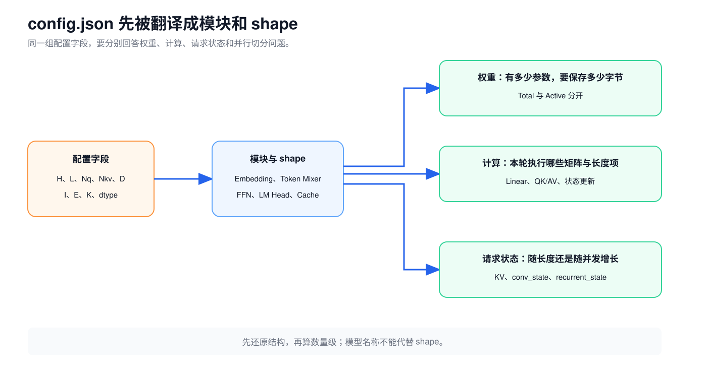
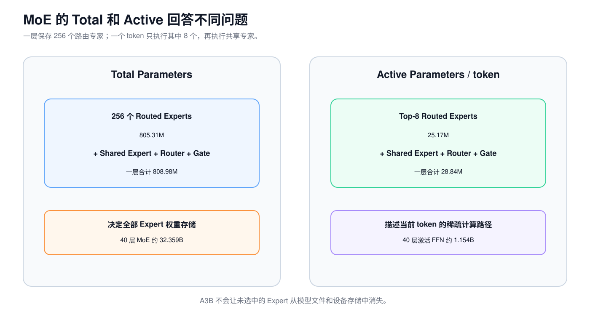
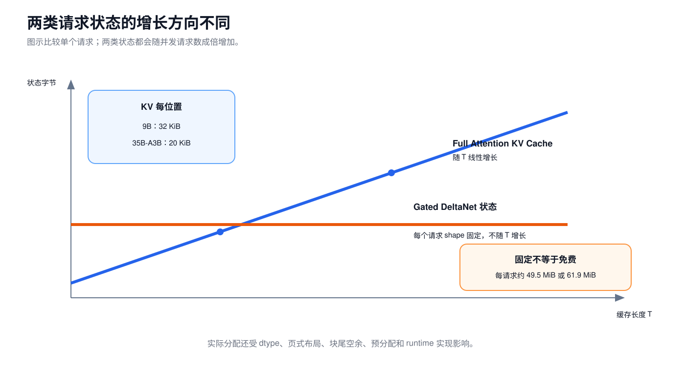

# 第 8 课：从 config.json 看懂模型

前七课已经把推理链路中的主要模块拆开。现在拿到一个模型仓库，应当能够根据配置回答四个问题：

1. 模型由哪些层组成？
2. 权重为什么占这么多空间？
3. 一个 token 实际经过多少计算？
4. 一个请求还要保存多少运行状态？

这四个问题不能只靠模型名称回答。“9B”“35B”“A3B”都是便于交流的取整名，不是完整的显存和计算说明。

这一课用两个真实检查点对账：

```text
Qwen3.5-9B：       Dense FFN，32 个语言 Decoder Layer
Qwen3.5-35B-A3B： MoE FFN，40 个语言 Decoder Layer
```

## 1. 先把配置字段翻译成结构

第一次打开 `config.json`，不用逐行读。先找下面四组字段。

### 模型接口

| 符号 | 配置字段 | 含义 |
| --- | --- | --- |
| `V` | `vocab_size` | 词表有多少行 |
| `H` | `hidden_size` | 每个语言位置用多少个数表示 |
| `L` | `num_hidden_layers` | 语言 Decoder Layer 数 |

### Attention

| 符号 | 配置字段 | 含义 |
| --- | --- | --- |
| `Nq` | `num_attention_heads` | Query 头数 |
| `Nkv` | `num_key_value_heads` | K/V 头数 |
| `D` | `head_dim` | 每个头的宽度 |
| `Lfull` | 从 `layer_types` 计数 | Full Attention 层数 |

### Dense FFN

| 符号 | 配置字段 | 含义 |
| --- | --- | --- |
| `I` | `intermediate_size` | Dense FFN 中间宽度 |

### MoE

| 符号 | 配置字段 | 含义 |
| --- | --- | --- |
| `E` | `num_experts` | Routed Expert 总数 |
| `K` | `num_experts_per_tok` | 每 token 选几个 Routed Experts |
| `Imoe` | `moe_intermediate_size` | 每个 Expert 的中间宽度 |



下面是两个模型的主配置：

| 字段 | Qwen3.5-9B | Qwen3.5-35B-A3B |
| --- | ---: | ---: |
| `V` | 248,320 | 248,320 |
| `H` | 4,096 | 2,048 |
| `L` | 32 | 40 |
| Gated DeltaNet 层 | 24 | 30 |
| Full Attention 层 `Lfull` | 8 | 10 |
| `Nq` | 16 | 16 |
| `Nkv` | 4 | 2 |
| `D` | 256 | 256 |
| Dense `I` | 12,288 | 不适用 |
| `E` | 不适用 | 256 |
| `K` | 不适用 | 8 |
| `Imoe` | 不适用 | 512 |

`full_attention_interval=4` 表示每四层出现一次 Full Attention，不表示一共有四个 Full Attention 层。最可靠的做法是直接查看 `layer_types`：

```text
Gated DeltaNet
Gated DeltaNet
Gated DeltaNet
Full Attention
```

9B 重复 8 组，所以是 24 加 8；35B-A3B 重复 10 组，所以是 30 加 10。

## 2. 六个经常被混为一谈的量

```text
参数数量：模型一共有多少个可学习数字
权重字节：这些数字按某种 dtype 保存后占多少空间
激活参数：当前 token 实际经过了哪些参数
FLOPs：这次前向做了多少次浮点运算
推理状态：请求期间保存的 KV、卷积状态和递归状态
临时激活：算子执行时产生、随后可以释放的中间张量
```

例如：

```text
35B Total Parameters
3B Active Parameters
66.97 GiB BF16 权重
单 token 约 5.9 GFLOPs 的主要 Linear
```

这些数字回答的是不同问题，不能互相替代。

## 3. 先数 Qwen3.5-9B 的主要参数

### 3.1 Embedding 表与 LM Head

输入 Embedding 表的 shape 是 `[V,H]`：

$$
V H=248320\times4096=1,017,118,720
$$

Qwen3.5 配置中：

```text
tie_word_embeddings = false
```

这表示输入 Embedding 与 LM Head 不共享权重。LM Head 还有一张独立的 `[V,H]` 矩阵，两者合计约 2.034B 参数。

但它们的计算方式不同：

```text
输入 Embedding：根据 Token ID 取一行，不会乘完整张表
LM Head：        Hidden State 与完整词表矩阵相乘，得到 V 个 Logits
```

这已经说明“参数数相同”不代表“每 token 计算量相同”。

### 3.2 Dense SwiGLU FFN

每层 FFN 有三张矩阵：

```text
gate_proj [I,H]
up_proj   [I,H]
down_proj [H,I]
```

参数数为：

$$
P_{FFN}=HI+HI+IH=3HI
$$

代入 `H=4096`、`I=12288`：

$$
P_{FFN}=3\times4096\times12288=150,994,944
$$

32 层合计约 4.832B。Dense 模型的大部分 Decoder 参数在 FFN，不在 RMSNorm 或残差连接。

### 3.3 Full Attention 投影

普通 GQA 通常会数 Q、K、V 和输出投影。Qwen3.5 还为 Attention 输出生成一组门控，因此 `q_proj` 的输出宽度是普通 Q 宽度的两倍：

$$
P_{full}=H(2N_qD)+H(N_{kv}D)+H(N_{kv}D)+(N_qD)H
$$

代入 9B 配置，每个 Full Attention 层的主要投影参数约 58.72M，8 层约 469.77M。

如果照搬普通 Transformer 的 `q_proj:[H,H]` 公式，会少算 Qwen3.5 的 Attention 输出门控。

### 3.4 Gated DeltaNet 投影

第 5 课已经拆过一个 Gated DeltaNet 层。9B 中：

```text
Key：   16×128 = 2048 维
Value： 32×128 = 4096 维
Q/K/V 卷积通道：2048+2048+4096 = 8192
```

再加输出门控、状态更新系数、输出投影和深度卷积，按官方实现逐项相加，每层约 67.40M 参数，24 层约 1.618B。

### 3.5 与真实检查点对账

| 部分 | 参数数量 |
| --- | ---: |
| 文本模型、输入 Embedding、LM Head | 8,953,803,264 |
| 视觉编码器与 Merger | 456,010,480 |
| MTP 辅助层 | 243,294,464 |
| **检查点合计** | **9,653,108,208** |

官方 Safetensors 索引记录的权重有效载荷为 19,306,216,416 Byte。BF16 每个参数 2 Byte：

$$
19,306,216,416\div2=9,653,108,208
$$

两种计算得到同一个结果。Qwen3.5-9B 的实际检查点约有 9.653B 参数，不是刚好 9,000,000,000。


## 4. 35B-A3B：保存全部专家，只计算一部分

Qwen3.5-35B-A3B 的 `H=2048`，单个 SwiGLU Expert 中间宽度为 512：

$$
P_{expert}=3\times2048\times512=3,145,728
$$

一层需要保存 256 个 Routed Experts：

$$
256\times3,145,728=805,306,368
$$

再加 Shared Expert、Router 和 Shared Gate，一层 MoE 共约 808.98M 参数。40 层约 32.359B，构成 35B 总参数的主体。

一个 token 只选择 8 个 Routed Experts，并固定执行 1 个 Shared Expert：

$$
P_{active\ FFN}=3H I_{moe}(8+1)+HE+H
$$

代入后约 28.84M 激活 FFN 参数，40 层约 1.154B。再加 Token Mixer、LM Head 等模块，官方用约 3B Active 表示整条单 token 路径。



检查点总数为：

| 部分 | 参数数量 |
| --- | ---: |
| 文本模型、全部专家、Embedding、LM Head | 34,660,610,688 |
| 视觉编码器与 Merger | 446,571,248 |
| MTP 辅助层 | 844,645,568 |
| **检查点合计** | **35,951,827,504** |

所以“A3B”不能解释为：

- 模型只需要加载 3B 权重；
- 每层有一个 3B 大小的 Expert；
- 35B 模型的显存与 3B Dense 模型相同。

它描述的是每 token 激活参数的取整口径。

## 5. 参数数量怎样换算成权重容量

理想权重有效载荷为：

$$
Weight\ Bytes=P\times bytes\_per\_parameter
$$

| 模型 | 参数数 | BF16，2 Byte | INT8 理想下限 | INT4 理想下限 |
| --- | ---: | ---: | ---: | ---: |
| 9B 检查点 | 9.653B | 17.98 GiB | 8.99 GiB | 4.50 GiB |
| 35B-A3B 检查点 | 35.952B | 66.97 GiB | 33.48 GiB | 16.74 GiB |

INT8 和 INT4 两列只是把所有参数按 1 Byte 或 0.5 Byte 编码得到的下限。实际量化模型还可能包含：

```text
Scale
Zero Point
分组元数据
内存对齐
保持高精度的层
Kernel Workspace
```

因此，不能把 BF16 文件大小机械除以 2 或 4，就当成最终进程显存。

还要确认运行时是否加载视觉塔和 MTP 辅助层。检查点总大小、进程加载权重、单 token 激活权重，是三个不同口径。

## 6. KV Cache 只按 Full Attention 层计算

等长 Batch 的逻辑 KV 有效载荷为：

$$
KV\ Bytes=2B L_{full}N_{kv}TDs
$$

其中：

```text
最前面的 2：K 和 V 两份
B：Batch 中请求数
T：每个请求已缓存的长度
s：每个缓存元素的字节数
```

### 9B 的 BF16 KV

每个请求每增加一个位置：

$$
2\times8\times4\times256\times2=32768\ Byte=32\ KiB
$$

### 35B-A3B 的 BF16 KV

$$
2\times10\times2\times256\times2=20480\ Byte=20\ KiB
$$

| 单请求缓存长度 | 9B | 35B-A3B |
| ---: | ---: | ---: |
| 4,096 | 128 MiB | 80 MiB |
| 131,072 | 4 GiB | 2.5 GiB |

35B-A3B 权重更大，但每个位置的 KV 小于 9B，因为它只有 2 个 K/V 头。模型总参数不能替代 KV shape 计算。

这些数字不包括块尾空余、预分配、页表、对齐、跨设备布局和临时 Workspace。

## 7. Gated DeltaNet 状态按请求增长，不按长度增长

每个 Gated DeltaNet 层保存：

```text
conv_state：      [B,8192,4]
recurrent_state： [B,32,128,128]
```

Transformers 参考实现中，递归状态用 FP32，卷积状态沿用模型输入 dtype。若卷积状态按 BF16：

```text
单层 conv_state：      8192×4×2 Byte = 64 KiB
单层 recurrent_state： 32×128×128×4 Byte = 2 MiB
单层合计：             约 2.0625 MiB / 请求
```

于是：

```text
9B，24 个 GDN 层：       约 49.5 MiB / 请求
35B-A3B，30 个 GDN 层： 约 61.9 MiB / 请求
```



KV 随每个请求的长度 `T` 线性增长；Gated DeltaNet 状态 shape 固定，但两者都随并发请求数增长。高性能 runtime 可能使用不同 dtype、布局或内存复用，部署前仍要检查真实分配。

## 8. Linear 的 FLOPs 从矩阵 shape 算

输入 `[M,K]` 乘权重 `[K,N]`：

$$
FLOPs\approx2MKN
$$

一个输出元素需要 K 次乘法和约 K 次加法，所以近似记为 `2K` 次浮点运算。

### Dense FFN

单层、单 token：

$$
FLOPs_{FFN}\approx2\times3HI=6HI
$$

Qwen3.5-9B 每层约 0.302 GFLOPs，32 层 FFN 合计约 9.66 GFLOPs/token。

### MoE FFN

35B-A3B 每 token 计算 8 个 Routed Experts 加 1 个 Shared Expert：

$$
FLOPs_{MoE\ FFN}\approx2\times3H I_{moe}(8+1)
$$

这里跟 9 条实际执行的 Expert 路径相关，不跟 256 个 Expert 总数成正比。权重容量则必须包含全部 256 个 Expert。

### 主要 Linear 的单 token 数量级

把文本 Decode 本步使用的主要 Linear 和卷积权重按每个权重一次乘加估算，并加入 LM Head：

```text
Qwen3.5-9B：       约 15.9 GFLOPs/token
Qwen3.5-35B-A3B： 约 5.9 GFLOPs/token
```

这两个数没有包括 Full Attention 读取历史 K/V 的长度项、Gated DeltaNet 状态计算中的非 Linear 运算、采样、通信和 Kernel 调度。

## 9. Attention 还有一个随上下文增长的计算项

Decode 时，一个 Query 需要读取长度为 `T` 的历史 K/V。单个 Full Attention 层的 QK 和 AV 约为：

$$
FLOPs_{attn}\approx4N_qDT
$$

全部 Full Attention 层：

$$
FLOPs_{all\ full}\approx4L_{full}N_qDT
$$

代入配置：

```text
9B：       131,072 × T FLOPs
35B-A3B： 163,840 × T FLOPs
```

| 历史长度 `T` | 9B Attention 长度项 | 35B-A3B Attention 长度项 |
| ---: | ---: | ---: |
| 4,096 | 0.54 GFLOPs | 0.67 GFLOPs |
| 131,072 | 17.18 GFLOPs | 21.47 GFLOPs |

在短上下文里，主要 Linear 往往占更大部分；上下文足够长后，Attention 读取和计算历史的成本会超过固定的单 token Linear 数量级。

Prefill 中，Linear 和 FFN 主要随 `T` 线性增加；标准 Full Attention 的 QK/AV 总运算随 `T²` 增加。FlashAttention 可以减少中间数据读写，不会把 Full Attention 的数学长度依赖改成常数。

## 10. 为什么不能机械套用“2 倍参数量”

“单 token 前向约等于两倍参数量 FLOPs”只在大多数活跃 Linear 权重恰好使用一次时，适合作为粗略估算。Qwen3.5 有多个例外：

1. 输入 Embedding 是查表，不会使用整张矩阵做乘法。
2. LM Head 使用完整词表矩阵，并且与输入 Embedding 不共享。
3. MoE 保存 256 个专家，每 token 只计算 8 个加 Shared Expert。
4. Attention 的 QK/AV 随上下文长度增加，却没有新增模型参数。
5. Gated DeltaNet 的状态读写不只由参数量决定。
6. 视觉编码器和 MTP 是否运行，取决于输入和服务配置。

可靠的顺序是：

```text
配置字段
→ 模块和 shape
→ 哪些权重本轮执行
→ 权重字节、请求状态、FLOPs 分开估算
→ 再结合 Batch、通信和 Kernel 判断时间
```

## 11. 用配置做工程判断

### 判断能否放入单卡

先算实际加载权重，再留出请求状态、临时激活、通信 Buffer 和 runtime 预留。不能只拿“模型名 × dtype”与显存容量比较。

### 判断长上下文容量

按 `Lfull`、`Nkv`、`D` 和 KV dtype 算每个位置的 KV，再加每请求固定的 Gated DeltaNet 状态。不要把全部 Decoder Layer 都代入 KV 公式。

### 比较 Dense 与 MoE

至少同时列出 Total Parameters、Active Parameters、Expert 分布和通信。Active 少不代表权重显存少，也不保证延迟按比例下降。

### 判断是固定成本还是长度成本

Linear 权重路径主要是每 token 固定成本；Full Attention 的 QK/AV 和 KV 读取随上下文长度增长。两者的优化方向不同。

## 12. 练习

1. `H=4096` 表示什么？它是否等于 Attention 头宽度？
2. 为什么要从 `layer_types` 数 Full Attention 层？
3. `V=248320,H=4096` 时，Embedding 参数数是多少？
4. `tie_word_embeddings=false` 对参数量有什么影响？
5. Dense SwiGLU 为什么是 `3HI` 个主要参数？
6. 为什么输入 Embedding 与同大小 LM Head 的 FLOPs 不同？
7. 35B-A3B 的 3B Active 是否表示只需保存 3B 权重？
8. INT4 理想容量为什么通常小于或等于实际量化模型占用？
9. 9B 为什么每缓存一个位置需要 32 KiB KV？
10. 35B-A3B 权重更大，为什么每位置 KV 反而更小？
11. Gated DeltaNet 状态怎样随序列长度和并发数变化？
12. Linear `[M,K]×[K,N]` 的 FLOPs 近似是多少？
13. 为什么 Attention 长度项不适合用模型参数量估算？
14. FLOPs 更少是否必然表示延迟按同样比例下降？

## 13. 参考答案

1. 每个语言位置的 Hidden State 宽度；不等于，Qwen3.5 的头宽度 `D=256`。
2. 混合模型只有部分层保存 KV；间隔字段不能直接当作层数。
3. `248320×4096=1,017,118,720`。
4. LM Head 另有一份独立的 `[V,H]` 权重。
5. gate、up、down 三张矩阵分别是 `I×H`、`I×H`、`H×I`。
6. 输入 Embedding 只查当前 Token ID 的行；LM Head 要计算完整词表 Logits。
7. 不是。全部专家仍需由设备保存，3B 是每 token 激活参数的取整口径。
8. 实际还有 Scale、元数据、对齐、未量化层和 Workspace。
9. `2×8×4×256×2=32768 Byte`。
10. 它的 `Nkv=2`，而 9B 的 `Nkv=4`。
11. shape 不随长度增长，但随并发请求数增长。
12. 约 `2MKN`。
13. QK/AV 会随历史长度 `T` 增长，但没有新增模型参数。
14. 不必然。还要看权重和状态读写、Batch、Kernel 效率、通信与硬件利用率。

## 14. 拿到新配置时，先列这张表

拿到一个新模型配置，先完成下面这张表：

| 问题 | 要看的字段或 shape |
| --- | --- |
| Dense 还是 MoE | `intermediate_size`、`num_experts`、`num_experts_per_tok` |
| 层如何排列 | `layer_types` |
| 权重数量级 | `V×H`、每层 Linear、层数、全部 Expert |
| 单 token 激活量 | 实际执行的 Dense 或 Top-K 加 Shared Expert |
| KV 每位置大小 | `Lfull`、`Nkv`、`D`、缓存 dtype |
| 固定请求状态 | Gated DeltaNet 层数及 conv/recurrent state shape |
| 长上下文计算 | Full Attention 层的 `4LfullNqDT` |

[第 9 课](09-optimization-judgment.md)会把量化、FlashAttention、Prefix Cache、Batching、TP、EP 和推测解码逐个放回这套成本模型，判断每项优化到底改了什么、在什么条件下有效。

## 资料来源

以下配置、权重索引和实现于 2026-08-08 按固定 revision 复核：

- [Qwen3.5-9B 配置，revision c202236](https://huggingface.co/Qwen/Qwen3.5-9B/blob/c202236235762e1c871ad0ccb60c8ee5ba337b9a/config.json)
- [Qwen3.5-9B 模型卡，revision c202236](https://huggingface.co/Qwen/Qwen3.5-9B/blob/c202236235762e1c871ad0ccb60c8ee5ba337b9a/README.md)
- [Qwen3.5-9B Safetensors 索引，revision c202236](https://huggingface.co/Qwen/Qwen3.5-9B/blob/c202236235762e1c871ad0ccb60c8ee5ba337b9a/model.safetensors.index.json)
- [Qwen3.5-35B-A3B 配置，revision 59d61f3](https://huggingface.co/Qwen/Qwen3.5-35B-A3B/blob/59d61f3ce65a6d9863b86d2e96597125219dc754/config.json)
- [Qwen3.5-35B-A3B 模型卡，revision 59d61f3](https://huggingface.co/Qwen/Qwen3.5-35B-A3B/blob/59d61f3ce65a6d9863b86d2e96597125219dc754/README.md)
- [Qwen3.5-35B-A3B Safetensors 索引，revision 59d61f3](https://huggingface.co/Qwen/Qwen3.5-35B-A3B/blob/59d61f3ce65a6d9863b86d2e96597125219dc754/model.safetensors.index.json)
- [Transformers：Qwen3.5 Dense 实现，revision 9436284](https://github.com/huggingface/transformers/blob/943628458a1691f8af09c47ea9fc6e314734722f/src/transformers/models/qwen3_5/modeling_qwen3_5.py)
- [Transformers：Qwen3.5 MoE 实现，revision 9436284](https://github.com/huggingface/transformers/blob/943628458a1691f8af09c47ea9fc6e314734722f/src/transformers/models/qwen3_5_moe/modeling_qwen3_5_moe.py)
- [Transformers：Cache 实现，revision 9436284](https://github.com/huggingface/transformers/blob/943628458a1691f8af09c47ea9fc6e314734722f/src/transformers/cache_utils.py)
