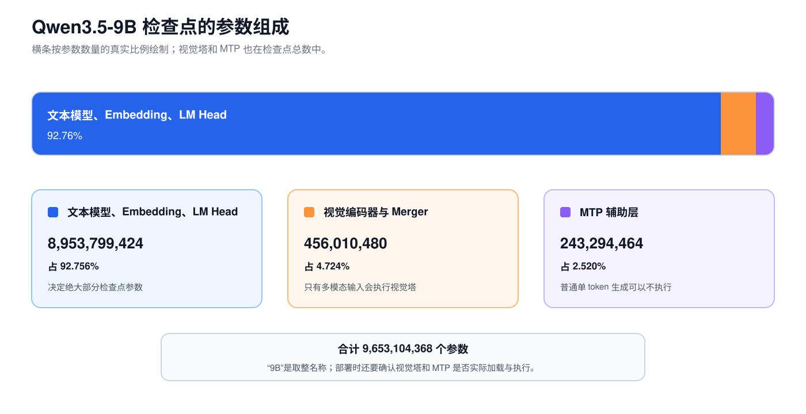

# 第 8 课：模型配置与资源估算

拿到一个新模型，名称只能告诉我们大致规模。要判断它能否放进显存、每个 token 要经过多少计算、长上下文会增加多少状态，还得读 `config.json`。先回答五个问题：

1. 模型由哪些层组成？
2. 权重和状态用什么 dtype 保存？
3. 计算和累加又使用什么 dtype？
4. 一个 token 实际经过多少计算？
5. 一个请求还要保存多少运行状态？

这五个问题都不能只靠模型名称回答。“9B”“35B”“A3B”都是便于交流的取整名，不是完整的显存和计算说明。

后面的计算使用两个真实检查点：

```text
Qwen3.5-9B：       Dense FFN，32 个语言 Decoder Layer
Qwen3.5-35B-A3B： MoE FFN，40 个语言 Decoder Layer
```

## 1. 从 `config.json` 还原模型结构

第一次打开 `config.json`，不用逐行读。先看 Qwen3.5-9B 文本模型中的一组真实字段。下面省略了与本节无关的配置：

```json
{
  "vocab_size": 248320,
  "hidden_size": 4096,
  "num_hidden_layers": 32,
  "num_attention_heads": 16,
  "num_key_value_heads": 4,
  "head_dim": 256,
  "intermediate_size": 12288,
  "full_attention_interval": 4
}
```

这些字段不是一串孤立数字。把它们代回前几课的结构，就能还原出 Embedding、层数、Attention 头和 Dense FFN 的主要 shape：


`hidden_size=4096` 规定了三处公共宽度：Embedding 的输出、层与层之间的接口，以及 LM Head 的输入。

Attention 的头数要和头宽一起读。`num_attention_heads=16`、`head_dim=256` 表示 16 个 Query 头合计宽度为 4096；`num_key_value_heads=4` 表示 K/V 头少于 Query 头，因此这里使用 GQA。

层类型还要结合总层数计算。`full_attention_interval=4` 表示每四层出现一次 Full Attention；32 层中共有 8 层 Full Attention，其余 24 层是 Gated DeltaNet。

按用途查找配置时，可以把常用字段归为一张表：

| 模块 | 符号 | 配置字段 | 含义 |
| --- | --- | --- | --- |
| 模型接口 | `V` | `vocab_size` | 词表有多少行 |
| 模型接口 | `H` | `hidden_size` | 每个语言位置用多少个数表示 |
| 模型深度 | `L` | `num_hidden_layers` | 语言 Decoder Layer 数 |
| Attention | `Nq` | `num_attention_heads` | Query 头数 |
| Attention | `Nkv` | `num_key_value_heads` | K/V 头数 |
| Attention | `D` | `head_dim` | 每个头的宽度 |
| Attention | `L_full` | 从 `layer_types` 计数 | Full Attention 层数 |
| Dense FFN | `I` | `intermediate_size` | Dense FFN 中间宽度 |
| MoE | `E` | `num_experts` | 路由专家总数 |
| MoE | `K` | `num_experts_per_tok` | 每 token 选择几个路由专家 |
| MoE | `I_moe` | `moe_intermediate_size` | 每个专家的中间宽度 |

下面是两个模型的主配置：

| 字段 | Qwen3.5-9B | Qwen3.5-35B-A3B |
| --- | ---: | ---: |
| `V` | 248,320 | 248,320 |
| `H` | 4,096 | 2,048 |
| `L` | 32 | 40 |
| Gated DeltaNet 层 | 24 | 30 |
| Full Attention 层 `L_full` | 8 | 10 |
| `Nq` | 16 | 16 |
| `Nkv` | 4 | 2 |
| `D` | 256 | 256 |
| Dense `I` | 12,288 | 不适用 |
| `E` | 不适用 | 256 |
| `K` | 不适用 | 8 |
| `I_moe` | 不适用 | 512 |

`full_attention_interval=4` 表示每四层出现一次 Full Attention，不表示一共有四个 Full Attention 层。最可靠的做法是直接查看 `layer_types`：

```text
Gated DeltaNet
Gated DeltaNet
Gated DeltaNet
Full Attention
```

9B 重复 8 组，所以是 24 加 8；35B-A3B 重复 10 组，所以是 30 加 10。

## 2. 参数、权重、激活与状态的统计口径

```text
参数数量：模型一共有多少个可学习数字
权重字节：这些数字按某种 dtype 保存后占多少空间
激活参数：当前 token 实际经过了哪些参数
FLOPs：这次前向做了多少次浮点运算
推理状态：请求期间保存的 KV、卷积状态和递归状态
临时激活：算子执行时产生、随后可以释放的中间张量
```

例如：

```text
35B 总参数
3B 激活参数
66.97 GiB 固定 revision 的权重 payload
单 token 约 5.9 GFLOPs 的主要 Linear
```

这些数字回答的是不同问题，不能互相替代。

### 2.1 临时激活与运行时预留

权重和请求状态可以按配置估算，进程峰值显存还取决于这一轮实际执行了多少 token。令 `M` 表示当前执行批次打包后的 token 位置总数，常见临时张量包括：

| 临时数据 | 典型 shape | 什么时候变大 |
| --- | --- | --- |
| 层输入与输出 | `[M,H]` | Batched Tokens 增加 |
| FFN 中间结果 | `[M,I]` | 中间维度或 Batched Tokens 增加 |
| Q/K/V 与 Attention 输出 | 由 `M`、头数和头维度共同决定 | 本轮处理位置增加 |
| LM Head Logits | `[M,V]` 或只保留所需位置 | 计算更多位置的完整词表分数 |

这里的 `M` 不是请求已经缓存的历史 token 总数。一个请求可以有很长的 KV Cache，但单步 Decode 只给当前轮增加一个位置；Chunked Prefill 则会让本轮 `M` 明显增大。

实现方式会改变哪些中间张量真正写入显存。算子融合可以让部分结果留在片上，FlashAttention 避免长期保存完整的 Attention 分数矩阵，LM Head 也可以只处理需要输出 Logits 的位置。

运行时还会申请公式外的显存。集合通信需要收发 Buffer，部分 Kernel 需要临时工作区（Workspace），CUDA Graph 可能为固定执行图保留内存。缓存分配器也会把已经释放的显存块留在内存池中，等待后续复用。

因此，配置公式适合估算权重和逻辑状态，部署容量仍要在目标 runtime、Batch 和序列长度下测量峰值。PyTorch 的 `max_memory_allocated` 统计张量占用峰值；`max_memory_reserved` 还包含缓存分配器管理的显存。

## 3. 保存、计算与累加使用的 dtype

`dtype` 表示一个数采用什么数据格式。工程讨论中说“这个模型是 BF16”仍不够精确，因为保存权重、送入算子和累加部分和可能使用不同格式。

| 口径 | 问的是什么 | 直接影响 |
| --- | --- | --- |
| 保存 dtype | 权重、KV Cache 或状态在显存中怎样编码 | 容量和读取字节数 |
| 计算 dtype | Kernel 乘法两侧实际使用什么格式 | 可用硬件单元、吞吐和精度 |
| 累加 dtype | 点积中的许多乘积用什么格式求和 | 数值范围、误差和部分性能 |
| 输出 dtype | 算子结果最终以什么格式写回 | 后续算子的输入和显存流量 |

常见格式的理想存储大小如下：

| 格式 | 每个元素 | 浮点范围与精度的直观区别 |
| --- | ---: | --- |
| FP32 | 4 Byte | 8 位指数、23 位尾数，范围和精度都较高 |
| BF16 | 2 Byte | 8 位指数、7 位尾数，范围接近 FP32，精细程度较低 |
| FP16 | 2 Byte | 5 位指数、10 位尾数，精细程度高于 BF16，但可表示范围更窄 |
| INT8 | 1 Byte | 整数编码，需要 Scale 把整数映射回实数范围 |
| INT4 | 理想 0.5 Byte | 低比特整数编码，通常还要分组 Scale、打包和对齐 |

BF16 和 FP16 都占 2 Byte，却不能只按容量判断谁更合适。FP16 的最大有限值是 65,504，较大的中间值更容易溢出；BF16 保留了与 FP32 相同的指数位数，范围更大，但尾数更短。

一个常见的 BF16 Linear 可以是：权重和激活以 BF16 输入，乘法使用低精度硬件路径，许多乘积用 FP32 累加，最后再把结果写成 BF16。具体行为取决于 GPU、Kernel 和框架设置，不能从检查点 dtype 直接推出。

Weight-only INT4 也不表示整条链路都在做 INT4 整数运算。权重可以用 INT4 保存，激活仍是 BF16；Kernel 读取打包权重和 Scale，在片上完成反量化或低比特乘法，再按实现选择累加格式。讨论量化时至少要把这四个 dtype 口径写清楚。

## 4. Qwen3.5-9B 参数量计算

### 4.1 Embedding 表与 LM Head

输入 Embedding 表的 shape 是 `[V,H]`：

$$
V H=248320\times4096=1,017,118,720
$$

Qwen3.5 配置中：

```text
tie_word_embeddings = false
```

这表示输入 Embedding 与 LM Head 不共享权重。LM Head 还有一张独立的 `[V,H]` 矩阵，两者合计约 2.034B 参数。

但它们的计算方式不同：

```text
输入 Embedding：根据 Token ID 取一行，不会乘完整张表
LM Head：        隐藏状态与完整词表矩阵相乘，得到 V 个 Logits
```

这已经说明“参数数相同”不代表“每 token 计算量相同”。

### 4.2 Dense SwiGLU FFN

每层 FFN 有三张矩阵：

```text
gate_proj [I,H]
up_proj   [I,H]
down_proj [H,I]
```

参数数为：

$$
P_{FFN}=HI+HI+IH=3HI
$$

代入 `H=4096`、`I=12288`：

$$
P_{FFN}=3\times4096\times12288=150,994,944
$$

32 层合计约 4.832B。Dense 模型的大部分 Decoder 参数在 FFN，不在 RMSNorm 或残差连接。

### 4.3 Full Attention 投影

普通 GQA 通常会数 Q、K、V 和输出投影。Qwen3.5 还为 Attention 输出生成一组门控，因此 `q_proj` 的输出宽度是普通 Q 宽度的两倍：

$$
P_{full}=H(2N_qD)+H(N_{kv}D)+H(N_{kv}D)+(N_qD)H
$$

代入 9B 配置，每个 Full Attention 层的主要投影参数约 58.72M，8 层约 469.77M。

如果照搬普通 Transformer 的 `q_proj:[H,H]` 公式，会少算 Qwen3.5 的 Attention 输出门控。

### 4.4 Gated DeltaNet 投影

第 5 课已经拆过一个 Gated DeltaNet 层。9B 中：

```text
Key：   16×128 = 2048 维
Value： 32×128 = 4096 维
Q/K/V 卷积通道：2048+2048+4096 = 8192
```

再加输出门控、状态更新系数、输出投影和深度卷积，按官方实现逐项相加，每层约 67.40M 参数，24 层约 1.618B。

### 4.5 检查点参数对账

MTP 是多 Token 预测（Multi-Token Prediction）辅助模块。检查点会保存它的权重；普通单 token 自回归生成可以不执行它，runtime 只有在启用相应推测路径时才把它作为 Drafter。这里把 MTP 列入总数，是因为它属于检查点，不表示每个 token 都会经过它。

| 部分 | 参数数量 |
| --- | ---: |
| 文本模型、输入 Embedding、LM Head | 8,953,799,424 |
| 视觉编码器与 Merger | 456,010,480 |
| MTP 辅助层 | 243,294,464 |
| **检查点合计** | **9,653,104,368** |



这个检查点以 BF16 为主，但不是所有参数都占 2 Byte。官方仓库按 dtype 统计为：

| dtype | 参数数量 | 有效载荷 |
| --- | ---: | ---: |
| BF16 | 9,653,100,528 | 19,306,201,056 Byte |
| FP32 | 3,840 | 15,360 Byte |

因此，参数数量与权重字节要分别相加：

$$
9,653,100,528+3,840=9,653,104,368
$$

$$
19,306,201,056+15,360=19,306,216,416\ Byte
$$

Qwen3.5-9B 的实际检查点约有 9.653B 参数，不是刚好 9,000,000,000。直接把总字节数除以 2，会把每个 FP32 参数误算成两个 BF16 参数。

## 5. Qwen3.5-35B-A3B 的总参数与激活参数

Qwen3.5-35B-A3B 的 `H=2048`，单个 SwiGLU 专家的中间宽度为 512：

$$
P_{expert}=3\times2048\times512=3,145,728
$$

一层需要保存 256 个路由专家：

$$
256\times3,145,728=805,306,368
$$

再加共享专家、路由器和共享专家门控，一层 MoE 共约 808.98M 参数。40 层约 32.359B，构成 35B 总参数的主体。

一个 token 只选择 8 个路由专家，并固定执行 1 个共享专家：

$$
P_{active\ FFN}=3H I_{moe}(8+1)+HE+H
$$

代入后约 28.84M 激活 FFN 参数，40 层约 1.154B。再加 Token Mixer、LM Head 等模块，官方用约 3B Active 表示整条单 token 路径。


检查点总数为：

| 部分 | 参数数量 |
| --- | ---: |
| 文本模型、全部专家、Embedding、LM Head | 34,660,605,888 |
| 视觉编码器与 Merger | 446,571,248 |
| MTP 辅助层 | 844,645,568 |
| **检查点合计** | **35,951,822,704** |

官方仓库的 dtype 统计是 35,951,817,904 个 BF16 参数和 4,800 个 FP32 参数。两者合计 35,951,822,704 个参数，对应 71,903,655,008 Byte 权重有效载荷。

所以“A3B”不能解释为：

- 模型只需要加载 3B 权重；
- 每层有一个 3B 大小的专家；
- 35B 模型的显存与 3B Dense 模型相同。

它描述的是每 token 激活参数的取整口径。

## 6. 权重容量估算

若所有参数使用同一种 dtype，理想权重有效载荷为：

$$
Weight\ Bytes=P\times bytes\_per\_parameter
$$

| 模型 | 参数数 | 固定 revision 的 payload，BF16 加少量 FP32 | 全部 INT8 理想下限 | 全部 INT4 理想下限 |
| --- | ---: | ---: | ---: | ---: |
| 9B 检查点 | 9.653B | 17.98 GiB | 8.99 GiB | 4.50 GiB |
| 35B-A3B 检查点 | 35.952B | 66.97 GiB | 33.48 GiB | 16.74 GiB |

INT8 和 INT4 两列只是把所有参数按 1 Byte 或 0.5 Byte 编码得到的下限。实际量化模型还可能包含：

```text
Scale
Zero Point
分组元数据
内存对齐
保持高精度的层
Kernel Workspace
```

因此，不能把当前权重文件大小机械除以 2 或 4，就当成最终进程显存。

还要确认运行时是否加载视觉塔和 MTP 辅助层。检查点总大小、进程加载权重、单 token 激活权重，是三个不同口径。

## 7. KV Cache 容量估算

等长 Batch 的逻辑 KV 有效载荷为：

$$
KV\ Bytes=2B L_{full}N_{kv}TDs
$$

其中：

```text
最前面的 2：K 和 V 两份
B：Batch 中请求数
T：每个请求已缓存的长度
s：每个缓存元素的字节数
```

### 7.1 Qwen3.5-9B 的 BF16 KV Cache

每个请求每增加一个位置：

$$
2\times8\times4\times256\times2=32768\ Byte=32\ KiB
$$

### 7.2 Qwen3.5-35B-A3B 的 BF16 KV Cache

$$
2\times10\times2\times256\times2=20480\ Byte=20\ KiB
$$

| 单请求缓存长度 | 9B | 35B-A3B |
| ---: | ---: | ---: |
| 4,096 | 128 MiB | 80 MiB |
| 131,072 | 4 GiB | 2.5 GiB |

35B-A3B 权重更大，但每个位置的 KV 小于 9B，因为它只有 2 个 K/V 头。模型总参数不能替代 KV shape 计算。

这些数字不包括块尾空余、预分配、页表、对齐、跨设备布局和临时 Workspace。

### 7.3 Tensor Parallel 下的 KV 头复制

上面的 32 KiB 和 20 KiB 是整个模型的逻辑有效载荷。Tensor Parallelism（TP）还要决定每个 Rank 实际保存几个 K/V 头。vLLM 的固定版本使用：

$$
N_{kv,rank}=\max\left(1,\left\lfloor\frac{N_{kv}}{TP}\right\rfloor\right)
$$

当 `Nkv<TP` 时，runtime 会复制 K/V 头，让每个 Rank 至少保存一个头。此时每 Rank、每请求、每新增位置的 BF16 KV 为：

$$
KV_{rank}=2L_{full}N_{kv,rank}Ds
$$

以 TP=8 为例：

| 模型 | 模型逻辑 KV | 每 Rank K/V 头数 | 每 Rank KV | 8 个 Rank 合计 |
| --- | ---: | ---: | ---: | ---: |
| 9B | 32 KiB | 1 | 8 KiB | 64 KiB |
| 35B-A3B | 20 KiB | 1 | 10 KiB | 80 KiB |

35B-A3B 的每 Rank KV 是 `2×10×1×256×2=10 KiB`，不是 `20 KiB÷8=2.5 KiB`。复制后的跨 Rank 合计可以大于模型逻辑有效载荷。部署时还要核对 runtime 的 Cache 布局、TP 兼容条件和 KV dtype，不能只按设备数平均分配。

## 8. Gated DeltaNet 请求状态估算

每个 Gated DeltaNet 层保存：

```text
conv_state：      [B,8192,4]
recurrent_state： [B,32,128,128]
```

Transformers 参考实现中，递归状态用 FP32，卷积状态沿用模型输入 dtype。若卷积状态按 BF16：

```text
单层 conv_state：      8192×4×2 Byte = 64 KiB
单层 recurrent_state： 32×128×128×4 Byte = 2 MiB
单层合计：             约 2.0625 MiB / 请求
```

于是：

```text
9B，24 个 GDN 层：       约 49.5 MiB / 请求
35B-A3B，30 个 GDN 层： 约 61.9 MiB / 请求
```


KV 随每个请求的长度 `T` 线性增长；Gated DeltaNet 状态 shape 固定，但两者都随并发请求数增长。高性能 runtime 可能使用不同 dtype、布局或内存复用，部署前仍要检查真实分配。

## 9. Linear FLOPs 估算

输入 `[M,H_{in}]` 乘权重 `[H_{in},H_{out}]`：

$$
FLOPs\approx2M H_{in}H_{out}
$$

一个输出元素需要 `H_in` 次乘法和约 `H_in` 次加法，所以近似记为 `2H_in` 次浮点运算。

### 9.1 Dense FFN FLOPs

单层、单 token：

$$
FLOPs_{FFN}\approx2\times3HI=6HI
$$

Qwen3.5-9B 每层约 0.302 GFLOPs，32 层 FFN 合计约 9.66 GFLOPs/token。

### 9.2 MoE FFN FLOPs

35B-A3B 每 token 计算 8 个路由专家和 1 个共享专家：

$$
FLOPs_{MoE\ FFN}\approx2\times3H I_{moe}(8+1)
$$

这里跟 9 条实际执行的专家路径相关，不跟 256 个专家总数成正比。权重容量则必须包含全部 256 个专家。

### 9.3 单 token 的主要 Linear 计算量

把文本 Decode 本步使用的主要 Linear 和卷积权重按每个权重一次乘加估算，并加入 LM Head：

```text
Qwen3.5-9B：       约 15.9 GFLOPs/token
Qwen3.5-35B-A3B： 约 5.9 GFLOPs/token
```

这两个数没有包括 Full Attention 读取历史 K/V 的长度项、Gated DeltaNet 状态计算中的非 Linear 运算、采样、通信和 Kernel 调度。

## 10. Attention 的上下文长度项

Decode 时，一个 Query 需要读取长度为 `T` 的历史 K/V。单个 Full Attention 层的 QK 和 AV 约为：

$$
FLOPs_{attn}\approx4N_qDT
$$

全部 Full Attention 层：

$$
FLOPs_{all\ full}\approx4L_{full}N_qDT
$$

代入配置：

```text
9B：       131,072 × T FLOPs
35B-A3B： 163,840 × T FLOPs
```

| 历史长度 `T` | 9B Attention 长度项 | 35B-A3B Attention 长度项 |
| ---: | ---: | ---: |
| 4,096 | 0.54 GFLOPs | 0.67 GFLOPs |
| 131,072 | 17.18 GFLOPs | 21.47 GFLOPs |

在短上下文里，主要 Linear 往往占更大部分；上下文足够长后，Attention 读取和计算历史的成本会超过固定的单 token Linear 数量级。

Prefill 中，Linear 和 FFN 主要随 `T` 线性增加；标准 Full Attention 的 QK/AV 总运算随 `T²` 增加。FlashAttention 可以减少中间数据读写，不会把 Full Attention 的数学长度依赖改成常数。

## 11. 算术强度与 Roofline

FLOPs 只描述计算量，不能单独判断延迟。一个算子至少有两个硬件下界：

$$
t_{compute}\ge\frac{FLOPs}{峰值计算吞吐}
$$

$$
t_{memory}\ge\frac{搬运字节}{峰值内存带宽}
$$

忽略重叠与其他开销时，理论时间至少由两者中更大的一项决定：

$$
t_{theory}\ge\max(t_{compute},t_{memory})
$$

两者的比值叫算术强度（Arithmetic Intensity）：

$$
AI=\frac{FLOPs}{搬运字节}
$$

硬件的峰值计算吞吐除以峰值内存带宽，得到这台设备的 Machine Balance。若一个算子的算术强度明显低于 Machine Balance，它更容易受带宽限制；明显高于时，计算吞吐更可能成为限制。这只是理论边界，Kernel Launch、缓存命中、通信和实现效率仍会增加实际时间。

以一个输入宽度为 `H_in`、输出宽度为 `H_out` 的 BF16 Linear 为例。Batch 为 1 且主要权重只读取一次时：

```text
FLOPs：     约 2×H_in×H_out
权重字节： 约 2×H_in×H_out Byte
算术强度： 约 1 FLOP/Byte
```

若同一份权重在一轮中服务 `M` 个 token，FLOPs 增加到约 `2×M×H_in×H_out`，权重却有机会被复用，算术强度随 `M` 上升。这解释了为什么小 Batch Decode 常暴露权重带宽，而更大的 Batch 更可能提高计算利用率。

长上下文 Decode 还要单独计算 KV 读取。9B 每个历史位置有 32 KiB 逻辑 KV，所有 Full Attention 层的长度项是 `131,072×T FLOPs`。忽略布局和其他读写时：

$$
AI_{KV}\approx\frac{131072T}{32768T}=4\ FLOPs/Byte
$$

这个例子只给出数量级。TP 下应把 FLOPs 和 KV 字节都换成每 Rank 口径；最终判断还要看实际 Kernel 时间、有效带宽和端到端指标。

分子和分母必须使用同一口径。以 `TP=8` 为例，9B 每 Rank 通常计算 2 个 Query 头，并保存 1 个复制后的 K/V 头：

$$
FLOPs_{rank}\approx4\times8\times2\times256\times T=16384T
$$

$$
KV\ Bytes_{rank}=2\times8\times1\times256\times2\times T=8192T
$$

所以这个布局下每 Rank 的近似算术强度是 `2 FLOPs/Byte`。不能拿全模型的 `131072T FLOPs` 除以单 Rank 的 `8192T Byte`；那会把八张卡的计算量和一张卡的数据量混在一起。

## 12. “两倍参数量”估算法的适用范围

“单 token 前向约等于两倍参数量 FLOPs”只在大多数活跃 Linear 权重恰好使用一次时，适合作为粗略估算。Qwen3.5 有多个例外：

1. 输入 Embedding 是查表，不会使用整张矩阵做乘法。
2. LM Head 使用完整词表矩阵，并且与输入 Embedding 不共享。
3. MoE 保存 256 个专家，每 token 只计算 8 个路由专家和 1 个共享专家。
4. Attention 的 QK/AV 随上下文长度增加，却没有新增模型参数。
5. Gated DeltaNet 的状态读写不只由参数量决定。
6. 视觉编码器和 MTP 是否运行，取决于输入和服务配置。

可靠的顺序是：

```text
配置字段
→ 模块和 shape
→ 哪些权重本轮执行
→ 权重字节、请求状态、FLOPs 分开估算
→ 再结合 Batch、通信和 Kernel 判断时间
```

## 13. 配置与部署约束

把前面的公式放回部署场景，可以得到四类直接结论：

| 部署问题 | 需要读取和计算什么 | 不能漏掉什么 |
| --- | --- | --- |
| 单卡能否装下权重 | 实际加载模块的参数数与保存 dtype | 请求状态、临时激活、通信 Buffer 和 runtime 预留 |
| 长上下文能支持多少并发 | `L_full`、`Nkv`、`D`、KV dtype 和最大缓存位置数 | 每请求固定的 Gated DeltaNet 状态、分页与对齐 |
| Dense 与 MoE 哪个更快 | 激活参数、专家的 `n_e` 分布和通信 | 总参数决定的权重驻留成本 |
| 延迟怎样随上下文增长 | 每 token 的 Linear 固定项与 Attention 长度项 | Batch、Kernel、通信和调度开销 |

配置可以给出资源下限和计算规模，不能代替目标 runtime 上的峰值显存与端到端性能测量。

## 14. 练习：从逻辑 KV 推到每 Rank KV

某模型配置给出：

```text
num_hidden_layers       = 32
hidden_size             = 4096
num_attention_heads     = 16
num_key_value_heads     = 4
head_dim                = 256
Full Attention 层数      = 8
KV Cache dtype          = BF16
Tensor Parallel         = 8
```

服务为每条请求预留 4096 个 Prompt 位置和 256 个输出位置，并发上限为 16。

1. 计算每请求每新增位置的逻辑 KV。
2. 固定版本 vLLM 在 `Nkv<TP` 时让每个 Rank 至少保存一个 K/V 头。计算每 Rank、每新增位置的物理 KV。
3. 计算单请求与 16 并发的逻辑 KV；再计算每 Rank 对应的物理 KV。
4. 为什么 8 个 Rank 的物理 KV 合计会大于模型逻辑 KV？
5. 仅凭这些字段，能否算出完整进程显存？还缺哪些主要对象和 dtype 信息？

<details>
<summary>查看计算结果</summary>


每位置 KV 为：

```text
2 × 8 × 4 × 256 × 2 = 32768 Byte = 32 KiB
```

每请求共有 `4096+256=4352` 个位置：

```text
4352 × 32 KiB = 136 MiB
```

TP=8 大于 `Nkv=4`，每 Rank 保存一个 K/V 头，因此每 Rank、每位置为：

```text
2 × 8 × 1 × 256 × 2 = 8192 Byte = 8 KiB
```

容量对比如下：

| 口径 | 单请求 | 16 并发 |
| --- | ---: | ---: |
| 模型逻辑 KV | 136 MiB | 2176 MiB，也就是 2.125 GiB |
| 每 Rank 物理 KV | 34 MiB | 544 MiB |

8 个 Rank 合计保存 8 个物理 K/V 头副本，而模型逻辑上只有 4 个头，所以跨 Rank 的物理 KV 合计是逻辑 KV 的两倍。不能先算逻辑 KV 再机械除以 TP。

这些字段仍不足以得到完整进程显存。还缺权重及其保存 dtype、Gated DeltaNet 固定状态及其 dtype、临时激活、分页与对齐、通信 Buffer、CUDA Graph、Kernel Workspace 和内存池。计算 dtype 与累加 dtype 还会影响 Kernel 行为和部分临时空间。

</details>

仓库中的 [`model_sizing_walkthrough.py`](../../examples/model_sizing_walkthrough.py) 可以复算两个示例模型的逻辑 KV、TP 后每 Rank KV、Gated DeltaNet 固定状态和 Attention 长度项。

## 参考资料

以下配置、权重索引和实现于 2026-08-08 按固定 revision 复核：

- [Qwen3.5-9B 配置，revision c202236](https://huggingface.co/Qwen/Qwen3.5-9B/blob/c202236235762e1c871ad0ccb60c8ee5ba337b9a/config.json)
- [Qwen3.5-9B 模型卡，revision c202236](https://huggingface.co/Qwen/Qwen3.5-9B/blob/c202236235762e1c871ad0ccb60c8ee5ba337b9a/README.md)
- [Qwen3.5-9B Safetensors 索引，revision c202236](https://huggingface.co/Qwen/Qwen3.5-9B/blob/c202236235762e1c871ad0ccb60c8ee5ba337b9a/model.safetensors.index.json)
- [Qwen3.5-9B Safetensors 按 dtype 参数统计，revision c202236](https://huggingface.co/api/models/Qwen/Qwen3.5-9B/revision/c202236235762e1c871ad0ccb60c8ee5ba337b9a?expand%5B%5D=safetensors)
- [Qwen3.5-35B-A3B 配置，revision 59d61f3](https://huggingface.co/Qwen/Qwen3.5-35B-A3B/blob/59d61f3ce65a6d9863b86d2e96597125219dc754/config.json)
- [Qwen3.5-35B-A3B 模型卡，revision 59d61f3](https://huggingface.co/Qwen/Qwen3.5-35B-A3B/blob/59d61f3ce65a6d9863b86d2e96597125219dc754/README.md)
- [Qwen3.5-35B-A3B Safetensors 索引，revision 59d61f3](https://huggingface.co/Qwen/Qwen3.5-35B-A3B/blob/59d61f3ce65a6d9863b86d2e96597125219dc754/model.safetensors.index.json)
- [Qwen3.5-35B-A3B Safetensors 按 dtype 参数统计，revision 59d61f3](https://huggingface.co/api/models/Qwen/Qwen3.5-35B-A3B/revision/59d61f3ce65a6d9863b86d2e96597125219dc754?expand%5B%5D=safetensors)
- [Transformers：Qwen3.5 Dense 实现，revision 9436284](https://github.com/huggingface/transformers/blob/943628458a1691f8af09c47ea9fc6e314734722f/src/transformers/models/qwen3_5/modeling_qwen3_5.py)
- [Transformers：Qwen3.5 MoE 实现，revision 9436284](https://github.com/huggingface/transformers/blob/943628458a1691f8af09c47ea9fc6e314734722f/src/transformers/models/qwen3_5_moe/modeling_qwen3_5_moe.py)
- [Transformers：Cache 实现，revision 9436284](https://github.com/huggingface/transformers/blob/943628458a1691f8af09c47ea9fc6e314734722f/src/transformers/cache_utils.py)
- [vLLM：TP 下每 Rank 的 K/V 头数，revision 653ebb5](https://github.com/vllm-project/vllm/blob/653ebb52dffd8b4653b430302473c771117529f1/vllm/config/model.py#L1501-L1516)
- [NVIDIA TensorRT：FP32、FP16 与 BF16 的数值范围](https://docs.nvidia.com/deeplearning/tensorrt/latest/inference-library/accuracy-considerations.html)
- [PyTorch：FP16/BF16 GEMM 的累加精度](https://docs.pytorch.org/docs/stable/notes/numerical_accuracy.html#reduced-precision-reduction-for-fp16-and-bf16-gemms)
- [PyTorch：CUDA 显存管理与统计](https://docs.pytorch.org/docs/stable/notes/cuda.html#cuda-memory-management)
- [Roofline：算术强度与硬件上界](https://dl.acm.org/doi/10.1145/1498765.1498785)

---

[上一课：多模态输入与视觉编码](07-multimodal-input.md) · [返回课程路线](../roadmap.md) · [下一课：推理优化的分析与评估](09-optimization-judgment.md)
