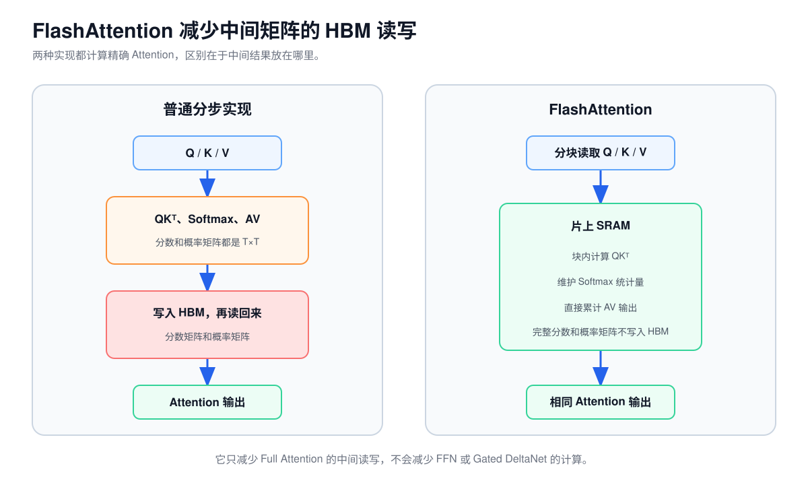
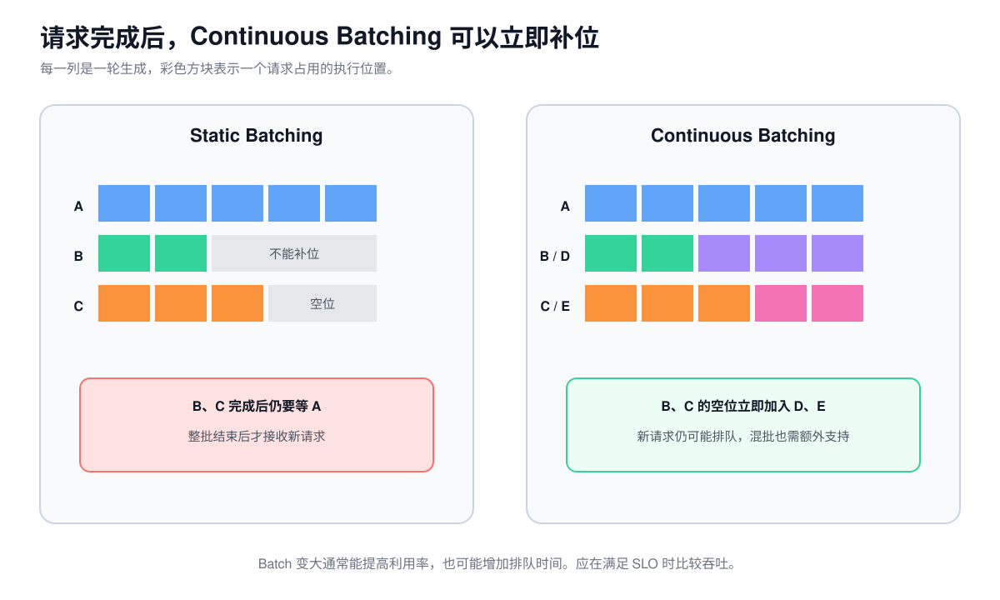
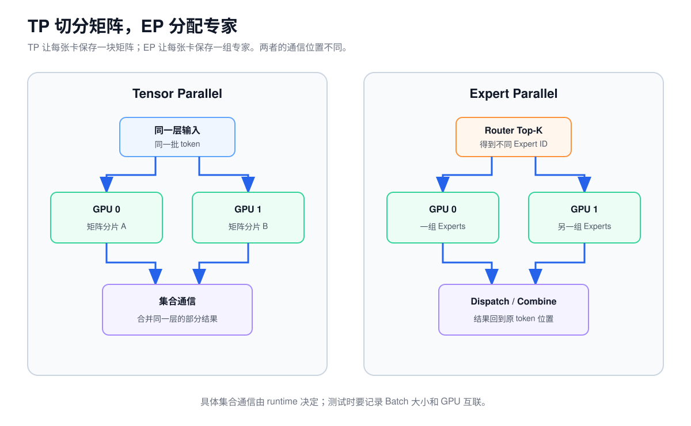
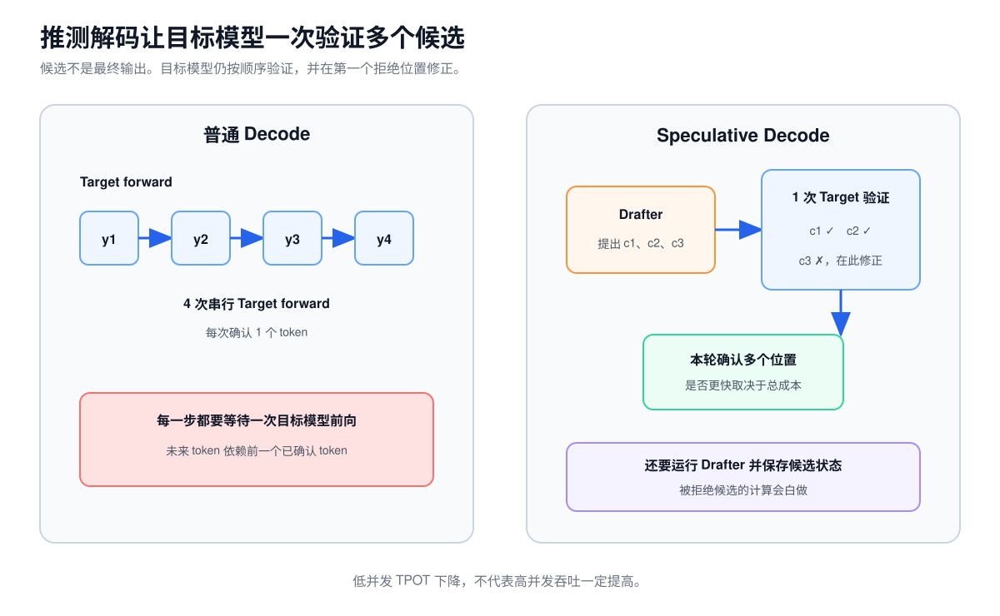

# 第 9 课：推理优化的分析与评估

量化、FlashAttention、Prefix Cache、Batching 和并行策略改的不是同一部分。判断一种方案有没有用，先回答五个问题：

1. 它改了哪段计算、哪份数据或哪条调度规则？
2. 因此少做了多少计算，少占了多少显存，或少传了多少数据？
3. 它又增加了哪些计算、通信、缓存或排队时间？
4. 哪种输入长度、输出长度、并发和硬件配置下可能更快？
5. 最后用哪些端到端指标比较？

如果第一步说不清，后面的“提速百分比”就无法解释，也很难复现。


## 1. 推理优化的分类与作用范围

| 优化 | 直接改动 | 可能先改善什么 | 需要同时计入什么 |
| --- | --- | --- | --- |
| 权重量化 | 用低比特格式保存 Linear 权重，并换用相应 Kernel | 权重显存、Decode 读取权重的字节数 | 质量、Scale、反量化、Kernel 回退 |
| KV 量化 | 用低比特格式保存 Full Attention 的 K/V | 长上下文容量、读取历史 K/V 的字节数 | 质量、Scale、量化与反量化开销 |
| FlashAttention | 分块计算 Attention，不把完整中间矩阵写入 HBM | 长序列 Prefill、临时显存 | 只影响 Full Attention |
| Prefix Cache | 让后续请求复用完全相同的前缀状态 | 重复前缀请求的 TTFT | 命中率、驱逐、状态兼容性 |
| Batching | 改变每轮放入多少 token，以及哪些请求一起执行 | GPU 利用率、吞吐 | 排队、尾延迟、调度开销 |
| DP | 复制完整模型，把独立请求分给不同副本 | 集群吞吐、并发容量 | 每份权重占用、负载均衡、Cache 分散 |
| TP | 把同一层的矩阵切到多张 GPU 上，再合并部分结果 | 单卡容量、单请求计算时间 | 集合通信、同步、小矩阵效率 |
| PP | 把连续 Decoder Layer 分给不同设备阶段 | 单副本模型容量 | 阶段传输、流水线空泡、阶段不均衡 |
| EP | 按 Expert ID 分布权重，并在设备间分发 token | MoE 容量、Expert 计算吞吐 | Dispatch、Combine、负载倾斜 |
| 推测解码 / MTP | 先提出候选，再让目标模型一次验证多个位置 | 低并发 TPOT | Drafter、候选状态、被拒绝候选的计算 |

一项改动通常只影响部分耗时。例如 FlashAttention 减少 Full Attention 的中间读写，但 FFN 和 Gated DeltaNet 仍照常计算。因此，算子时间下降多少，不能直接当成整个请求的加速比例。

### 1.1 `token/s` 的统计口径

同一个 `token/s` 可能统计不同内容。比较前要把分子和时间窗口写清楚。本课使用以下口径：

| 指标 | 分子 | 分母 |
| --- | --- | --- |
| `input token/s` | 窗口内完成请求的 Prompt token 总数 | 测量窗口秒数 |
| `output token/s` | 窗口内完成请求的输出 token 总数 | 测量窗口秒数 |
| `goodput` | 窗口内满足预先指定 SLO 的完成请求数 | 测量窗口秒数 |
| `engine token/s` | runtime 实际安排进入模型执行的 token 位置数 | 测量窗口秒数 |

`input token/s` 和 `output token/s` 是用户可见工作量。报告 `goodput` 时，要同时写出逐请求判定所用的 TTFT、TPOT 等 SLO 阈值，P99 等分位数另行报告。如果工具把 goodput 定义成 token/s 而不是 request/s，也要明确标注。

`engine token/s` 统计引擎内部工作量，不等于用户收到的 token 数。使用推测解码、Padding 或重算时，还要说明 runtime 的计数器是否包含候选位置、填充位置和重复执行的位置。

## 2. 权重量化

### 2.1 权重量化的数据路径

BF16 每个参数占 2 Byte。INT8 的理想下限是 1 Byte，INT4 是 0.5 Byte。第 8 课已经说明，这只是保存 dtype 的有效载荷；计算 dtype、累加 dtype、Scale 和对齐要另算。

Qwen3.5-35B-A3B 的 BF16 权重有效载荷约 66.97 GiB。若所有参数都用纯 INT4 编码，理想下限约 16.74 GiB。

Weight-only 量化通常仍让激活保持 BF16 或 FP16。低比特 Kernel 读取压缩权重，再在寄存器或片上存储中完成反量化和矩阵运算。

### 2.2 理论容量收益

小 Batch Decode 经常需要为很少的 token 读取大量活跃权重。若时间主要花在 HBM 搬权重，读取字节减少，延迟就有下降空间。省下的显存还可以换成更多 KV Cache 或更高并发。

### 2.3 延迟收益的限制条件

低比特格式缺少合适的硬件路径、反量化代价过大或部分层回退到通用 Kernel 时，省下的读取时间会被新增工作抵消。大 Batch GEMM 已经偏计算受限，或者 MoE 单个 Expert 收到的 token 太少时，低比特 Kernel 也未必高效。

权重从 2 Byte 变成 0.5 Byte，只证明编码数据理论上缩小四倍，不证明端到端时间也缩短四倍。

### 2.4 权重量化的验证指标

至少固定同一模型输入、输出长度、采样参数、并发和 SLO，再比较固定回归集质量、进程真实显存、TTFT、TPOT、P99 以及同 SLO 吞吐。Profile 还要确认量化层是否命中预期 Kernel，有没有回退路径。

只看模型文件大小，不能判断量化是否真的降低了服务延迟或提高了同 SLO 吞吐。

## 3. KV Cache 量化

第 8 课的 KV 公式是：

$$
KV\ Bytes=2B L_{full}N_{kv}TDs
$$

若把 KV 从 BF16 的 2 Byte 改为 FP8 的 1 Byte，逻辑有效载荷约减半。它可能带来两类收益：

1. 相同显存能容纳更多长上下文请求。
2. Decode 读取历史 K/V 的字节数减少。

但它不会：

- 缩小模型权重；
- 减少 QK 和 AV 的数学运算次数；
- 自动量化 Gated DeltaNet 的 `conv_state` 和 `recurrent_state`；
- 保证长上下文质量不变。

对 Qwen3.5，只有 8 或 10 个 Full Attention 层使用随长度增长的 KV。若服务容量主要受每请求几十 MiB 的 Gated DeltaNet 固定状态限制，只量化 KV 的收益可能小于纯 Transformer 模型。

验证时还要确认 Scale 的粒度、静态或动态计算方式，以及 Attention Kernel 是否能直接读取量化 Cache。若先把 KV 还原成 BF16 再执行，节省的存储字节不一定能完全转成读取加速。

## 4. FlashAttention

普通实现会先把 `QKᵀ` 的完整分数矩阵写到 HBM，Softmax 读取分数后再写出概率矩阵，最后重新读取概率和 V。长序列下，两张 `T×T` 中间矩阵会带来大量 HBM 读写。

FlashAttention 把 Q/K/V 分块搬到片上 SRAM，在块内维护 Softmax 所需统计量，并直接累计最终输出。它避免把完整 `T×T` 中间矩阵物化到 HBM。



### 4.1 FlashAttention 的 HBM 读写优化

FlashAttention 减少的是 Attention 中间矩阵的 HBM 读写和临时显存。Q/K/V 投影、QK 与 AV 的数学运算、Softmax 和因果关系仍然存在。

FlashAttention 是精确 Attention 算法，不是稀疏 Attention，也不是近似检索。

### 4.2 FlashAttention 只改变 Full Attention

Qwen3.5 只有四分之一语言层是 Full Attention。其余层是 Gated DeltaNet，FlashAttention 不会直接加速它们；Dense 或 MoE FFN 也不在这个子图内。

长 Prompt Prefill 更容易受益，因为标准实现的 Attention 中间数据随长度快速增长。单 token Decode 不会产生当前 Query 的 `T×T` 矩阵，但仍要读取历史 K/V，通常会走 Paged/Decode Attention Kernel。

验证时应同时看 Attention Kernel 时间、按 Prompt 长度分桶的端到端 TTFT、Decode TPOT 和临时显存峰值。

“Attention Kernel 快两倍”不等于完整模型快两倍。

## 5. Prefix Cache

假设许多请求都以同一个系统 Prompt 开头：

```text
请求 A：[共同系统 Prompt][用户问题 A]
请求 B：[共同系统 Prompt][用户问题 B]
```

请求 A 已经算过共同前缀并建立了模型状态。Prefix Cache 命中后，请求 B 可以直接恢复兼容的前缀状态，只计算自己的后缀。

粗略收益可以写成：

$$
收益\propto命中率\times可复用token数\times每token\ Prefill成本
$$

### 5.1 前缀复用的条件

- 不是同一请求 Decode 使用的普通 KV Cache。
- 不是语义缓存。两句话意思接近但 Token ID 不同，不能直接复用内部状态。
- 不会减少未命中后缀的 Prefill。
- 不会加速之后每个新 token 的正常 Decode。

Qwen3.5 是混合模型。可复用前缀不仅包含 Full Attention K/V，还要在正确的 token 位置恢复 Gated DeltaNet 的卷积和递归状态。

vLLM 固定版本的 Qwen3.5 配方仍把相关 `align` 模式标为 experimental。因此，开关已经打开只能证明功能被请求启用，不能证明它已经正确命中并恢复了完整状态。

### 5.2 Prefix Cache 的验证指标

需要记录命中的前缀 token 数、首次与重复请求 TTFT、真实命中率、驱逐率和 Cache 占用。对混合模型还要验证 Gated DeltaNet 状态能否正确恢复。

如果请求在很靠前的位置就不同，或者缓存频繁被驱逐，Prefix Cache 可能几乎没有收益。

## 6. Batching 与调度

单 token Linear 输入是 `[1,H]`。若一次处理 `M` 个 token，输入变成 `[M,H]`。同一张权重矩阵在一轮中服务更多输入，矩阵规模和权重读取复用通常更好。

Batching 不改变模型公式，改变的是每次执行装入多少工作。

### 6.1 Static Batching

一批请求一起开始，通常也要一起等待。短请求先完成后，空出来的位置不能及时补入新请求，直到整批结束。

### 6.2 Continuous Batching

系统在每轮生成结束时重新组织 Batch：完成的请求退出，等待请求进入。不同输出长度造成的空转因此减少。



Continuous Batching 只说明 Batch 成员能动态变化，不自动表示 Prefill chunk 和 Decode token 一定能进入同一次模型执行。混批还需要调度器、执行器和 Kernel 支持。

### 6.3 Batch 大小对吞吐与排队的影响

| 调度选择 | 可能得到什么 | 可能付出什么 |
| --- | --- | --- |
| 更大 Batch | 权重复用和吞吐通常更好 | 凑批与排队更久 |
| 更小 Batch | 请求更快开始 | 矩阵过小，GPU 利用率较低 |
| 优先 Decode | 在途请求的 TPOT 更稳定 | 新请求 TTFT 可能变差 |
| 优先 Prefill | 新请求更快进入模型 | Decode 可能出现抖动 |

因此，服务优化目标不应只写“最大化离线 token/s”，而应写成：

> 先满足给定的 TTFT、TPOT 和 P99 SLO，再比较可持续的 request/s、input token/s 和 output token/s。

## 7. DP、TP、PP 与 EP 的切分方式

四种并行策略都使用多张 GPU，但切分对象不同：

| 策略 | 切分或复制什么 | 一个请求怎样执行 | 主要解决什么 |
| --- | --- | --- | --- |
| 数据并行（DP） | 复制完整模型，分配不同请求 | 通常只进入一个模型副本 | 集群吞吐与并发容量 |
| 张量并行（TP） | 切分同一层中的矩阵或 Attention 头 | 每层都由多个 Rank 共同计算 | 单卡容量与单请求计算分担 |
| 流水线并行（PP） | 按深度切分连续 Decoder Layer | 依次经过多个阶段 | 单副本模型容量 |
| 专家并行（EP） | 把不同 Routed Experts 放到不同设备 | 每个 MoE 层按路由结果跨设备分发 | MoE 专家容量与计算组织 |

### 7.1 数据并行（DP）

DP 的每个副本都能独立完成一次前向。在线服务把不同请求或不同 Batch 分给不同副本，因此它主要提高集群总吞吐和可承载并发，不会直接缩短单个请求经过模型的计算路径。

代价是每个副本都保存一份完整权重和独立请求状态。Prefix Cache 也通常分散在各副本中，负载均衡如果只看请求数而忽略队列与 Cache 命中，可能让部分副本排队、另一部分空闲。MoE runtime 还可能组合 DP 与 EP，此时各 DP Rank 未必完全独立，必须按具体实现判断通信边界。

### 7.2 张量并行（TP）

TP 把一张大权重矩阵分到多张 GPU。以 FFN 为例，`gate_proj` 和 `up_proj` 可以按输出特征切分，`down_proj` 再按输入特征切分。各卡得到部分结果后，通过集合通信恢复下一步需要的层输出。

TP 能降低每卡权重和计算量，但集合通信进入每层关键路径。TP 越大，每卡 GEMM 越小，Kernel 效率也可能下降。小 Batch Decode 的本地计算很少，通信延迟尤其容易占主导。

第 8 课已经说明固定版本 vLLM 在 `Nkv<TP` 时会复制 K/V 头。计算每卡 KV Cache 时，应使用 runtime 实际分配的本地 K/V 头数，不能把全局数量直接除以 TP。

### 7.3 流水线并行（PP）

PP 按模型深度切分层。例如 32 层模型分成 4 个阶段，每个阶段保存连续 8 层。一个 token 的 Hidden State 先经过阶段 0，再传给阶段 1，直到最后一个阶段输出 Logits。

PP 能让单个模型跨越多张卡或多个节点，但不会让同一个 token 跳过任何阶段。只有多个请求或 microbatch 同时处在不同阶段时，设备才能形成流水。Batch 太小、阶段耗时不均或 Decode 每步工作过少时，部分阶段会等待，形成流水线空泡。跨阶段还要传输激活。

### 7.4 专家并行（EP）

EP 把 Routed Experts 分布到不同设备。Router 选完 Top-K 后，token 特征被送到持有相应 Expert 的设备；Expert 算完，再把结果送回原 token 位置。



低并发时，每个 Expert 可能只收到少量 token，小 GEMM 和通信延迟占主导。热点 Expert 若集中在少数 Rank，整层还要等待最慢设备。Top-K 越大，每个 token 的路由分配和通信通常也越多。

Qwen3.5-35B-A3B 的 EP 主要分布 256 个 Routed Experts。Attention、Gated DeltaNet、Router 与 Shared Expert 仍要由其他并行或复制策略处理。具体使用哪种 Collective 取决于 runtime，不能把 EP 固定等同于 All-to-All。

## 8. 推测解码（Speculative Decoding）

正常 Decode 每次目标模型前向只确认一个新 token。推测解码先用更便宜的 Drafter 提出多个候选，再让 Target Model 一次验证多个位置。



验证会从前往后接受候选。遇到第一个拒绝位置后，系统按目标模型结果修正，再开始下一轮。

### 8.1 推测解码的收益条件

设每轮草稿提出 `k` 个候选，平均接受 `a` 个。只有当：

```text
草稿成本 + 一次 k 位置验证成本
小于
目标模型逐个生成 a+1 次的成本
```

才有实际收益。通常需要：

```text
Drafter 足够便宜
候选接受率足够高
一次验证多个位置比多次单 token Decode 更高效
低并发下仍有空余计算能力
```

### 8.2 推测解码的额外成本

- Drafter 权重、计算和请求状态。
- 候选位置占用的 Lookahead Cache。
- 被拒绝候选产生的无效计算。
- Batch 扩张、回滚和调度复杂度。

严格的 Speculative Sampling 可以保持目标模型原有采样分布。简单的“草稿 token 与目标贪心 token 一样就接受”只覆盖贪心生成，不能代表一般采样场景。

低并发 TPOT 变好，也不保证高并发吞吐变好。候选 token 会占用本来可服务其他请求的 Token Budget 和 Cache。

## 9. Multi-Token Prediction（MTP）

Multi-Token Prediction 在训练时增加辅助模块，让当前位置学习预测更远的 token。它在普通生成中可以不启用，也可以作为推测解码的 Drafter。

Qwen3.5 配置中：

```text
mtp_num_hidden_layers = 1
```

这表示检查点保存了一层 MTP 辅助模块，不表示主 Decoder 一次可以不经验证地确定多个未来 token。

启用时，MTP 提出候选，主语言模型仍负责验证。候选接受率、一次提出几个、是否重复使用同一 MTP 层，都由实际模型行为和 runtime 配置决定。

Qwen3.5 的 vLLM 配方建议优先在低并发、延迟敏感场景尝试 MTP-1，并提醒它可能降低高并发文本吞吐。因此要分别测试：

```text
低并发 TPOT
高并发同 SLO 吞吐
平均接受长度
候选拒绝率
Lookahead Cache 占用
MTP 开关前后的质量一致性
```

## 10. 局部加速的端到端上限

一种优化往往只覆盖整条链路的一部分。设这部分原来占总时间的比例为 `f`，优化后快了 `s` 倍，其余部分不变。端到端加速比的理论上限是：

$$
Speedup=\frac{1}{(1-f)+\frac{f}{s}}
$$

例如，Profile 显示 Full Attention 占端到端时间的 20%，新的 Kernel 把这部分加速 2 倍：

$$
Speedup=\frac{1}{0.8+0.2/2}=\frac{1}{0.9}\approx1.11
$$

局部快了 2 倍，整条链路的理论结果只有约 1.11 倍。即使把这 20% 完全消除，整体也最多达到：

$$
\frac{1}{1-0.2}=1.25
$$

这就是 Amdahl 定律在推理优化中的用法。`f` 必须来自目标工作负载的实测分解，不能用另一个 Prompt 长度、Batch 或并发下的比例。公式还假设没有新增开销；量化的反量化、TP 的通信或 Prefix Cache 的查找都要加入新路径后重新计算。

Amdahl 定律估算的是服务时间组成，不直接描述排队系统。一次优化改变 Batch、资源容量或到达率后，排队时间可能发生非线性变化，最终仍要用端到端压测确认。

## 11. 推理优化的实验评估方法

一项优化应当按同一条证据链评估：

| 步骤 | 要回答的问题 | 需要留下的证据 |
| --- | --- | --- |
| 确定范围 | 改的是权重、Attention、请求状态、Batch、模型切分还是目标模型调用次数？ | 修改前后的数据流和配置 |
| 估算上限 | 少了多少计算、字节或重复执行？原路径占总时间多少？ | 容量公式、FLOPs、Profile 和 Amdahl 上限 |
| 计入代价 | 新增了反量化、Hash、通信、Cache、排队还是 Drafter？ | 新增 Kernel、通信量和显存 |
| 固定条件 | 哪些请求和硬件条件保持不变？ | Prompt/Output 分布、到达率、采样、GPU、互联、dtype、runtime 和 SLO |
| 比较结果 | 业务指标、容量和质量是否同时达标？ | TTFT、TPOT、P99、同 SLO 吞吐、显存、质量和 Profile |

吞吐测试还要固定统计窗口，并明确报告 request/s、input token/s、output token/s、engine token/s 还是 goodput。不同分子得到的数字不能直接横向比较。

先用端到端指标决定方案是否有效，再用 Kernel 和通信时间解释原因。Microbenchmark 可以证明局部实现更快，不能替代完整服务结果。

## 12. 案例：P99 TTFT 超标的诊断与方案评估

本案例使用构造数据，不代表 Qwen3.5 的公开 benchmark。场景来自常见的线上评审：局部 Profile、端到端延迟和请求分布都有数据，但支持的优化方案并不相同。

一台 8 卡机器运行 Qwen3.5-35B-A3B，部署为两个 TP=4 副本。模型、runtime、硬件和采样配置已经固定。

```text
Prompt 长度：P50=6144，P95=8192 token
Output 长度：P50=96，P95=256 token
平均到达率：10 request/s，存在短时突发
精确共享前缀：72% 的请求共享 4096 token
SLO：TTFT P99 ≤ 1.5 s，TPOT P99 ≤ 30 ms
当前结果：TTFT P99 = 2.35 s，TPOT P99 = 25.1 ms
```

TPOT 已经达标。问题在首 token，而且慢请求既有 GPU Prefill，也有排队。下面是一条落在 P99 附近的完整 trace。各段来自同一个请求，可以相加；它们不是各阶段 P99 的拼接。

| 阶段 | 时间 |
| --- | ---: |
| 排队 | 1.08 s |
| 输入处理与调度 | 0.12 s |
| GPU Prefill | 1.05 s |
| 首次 Decode 与返回 | 0.10 s |
| 合计 | 2.35 s |

GPU Profile 显示，Full Attention 占 Prefill GPU 时间的 24%，Gated DeltaNet 与 FFN 合计占 68%，其余算子占 8%。评审会上提出三个方案：升级 FlashAttention Kernel、开启 Prefix Cache、把两个 TP=4 副本改成一个 TP=8 副本。

### 12.1 根据现有证据安排第一轮实验

新的 Full Attention Kernel 在相同 shape 的 Microbenchmark 中快 1.8 倍。按 Amdahl 定律，Prefill GPU 时间的加速约为：

$$
\frac{1}{0.76+0.24/1.8}\approx1.12
$$

如果排队和其他阶段完全不变，这条慢请求大约会从 2.35 秒降到：

$$
1.08+0.12+\frac{1.05}{1.12}+0.10\approx2.24\ s
$$

这个估算没有考虑服务时间下降后队列可能缩短，因此不是严格的端到端上限。现有数据仍不足以承诺把 P99 降到 1.5 秒。

72% 的请求共享 4096 个精确 token，Prefix Cache 能直接消除已经确认存在的重复 Prefill，因此适合先做对照实验。它仍可能只改善命中请求。28% 的请求没有这段共享前缀，足以覆盖最慢的 1%。

TP=8 的低并发测试如下：

| 观测项 | 2×TP4 | 1×TP8 |
| --- | ---: | ---: |
| 并发 1 的 TPOT P50 | 21.8 ms | 17.6 ms |
| 单步 Decode 的 Collective 时间 | 3.0 ms | 5.5 ms |
| 可独立接收请求的模型副本数 | 2 | 1 |

这组结果证明 TP=8 缩短了低并发 TPOT，也增加了通信。它没有回答当前到达率下的 TTFT 和排队问题。当前 TPOT 已经达标，此时先把两个副本合成一个，风险大于已有证据支持的收益。

第一轮先做 Prefix Cache 对照，同时保留命中、未命中、驱逐和排队四类数据。三个方案都还缺少全量上线所需的证据。

### 12.2 Prefix Cache 改善 P50，但 P99 未达标

Prefix Cache 对照使用相同的到达记录回放。模型输出一致，Full Attention KV、卷积状态和 recurrent state 的恢复检查均通过。结果如下：

| 请求组 | TTFT P50 | TTFT P99 |
| --- | ---: | ---: |
| Cache 关闭，全量请求 | 1.21 s | 2.35 s |
| Cache 开启，命中请求 | 0.61 s | 1.18 s |
| Cache 开启，未命中请求 | 1.53 s | 2.44 s |
| Cache 开启，全量请求 | 0.74 s | 2.31 s |

72% 的请求具备共享前缀，实际命中率是 65%，命中请求平均复用 3968 个 token。Prefix Cache 明显降低了命中请求的 TTFT，也减少了重复 Prefill；但全量 P99 只从 2.35 秒降到 2.31 秒，仍未达到 1.5 秒。

Prefix Cache 显著改善了命中请求和总体 P50，说明它有效减少了重复 Prefill。总体 P99 仍未达标，尾部由未命中、冷启动或驱逐后的完整 Prefill 和排队组成。是否提高吞吐还要单独测量。

### 12.3 P99 仍由未命中请求和排队主导

下一轮 Profile 应只看未命中和驱逐后的慢请求，并把排队与模型执行分开。如果排队仍占一秒左右，继续优化 Full Attention 只能减少其中约 0.1 秒的 GPU 时间，达不到当前 SLO 缺口。

此时应分别验证两类改动：

1. 调整 Chunked Prefill 的 token 预算和优先级，观察长 Prompt 是否仍长时间占住调度轮次。它可能降低排队和阻塞，也可能让单个 Prompt 经过更多轮才完成，所以必须同时看 TTFT 与 TPOT。
2. 在显存允许时比较更多小 TP 副本与当前 2×TP4。副本增加可能缩短队列，但单请求 Prefill 会使用更少 GPU，服务时间可能上升。要用相同到达记录比较同 SLO `goodput`，不能只测并发 1。

FlashAttention 仍可以作为叠加优化测试，特别是未命中的长 Prompt。它的验收目标应写成减少 Prefill GPU 时间，而不是单独承担全部 P99 目标。TP=8 暂不进入第二轮，因为它减少副本数，而且已有优势落在已经达标的 TPOT 上。

### 12.4 评审结论与下一轮实验

Prefix Cache 有保留价值，但它没有解决当前的 P99 SLO。评审结论应分清已经证明的收益、尚未解决的问题和下一轮实验：

- Prefix Cache 已证明能减少命中请求的重复 Prefill，可以继续评估容量、驱逐和吞吐收益。
- P99 TTFT 仍由未命中路径和排队主导，当前目标尚未完成。
- 下一轮实验应改变调度或服务容量，再把 FlashAttention 当作长 Prompt Prefill 的局部优化验证。

仓库中的[优化决策复算程序](../../examples/optimization_decision_walkthrough.py)使用同一组 Profile 数字复算 Amdahl 结果。它只能核对局部加速上限，不能替代第二轮的排队实验。

## 13. 评审中常见的证据跳跃

下面这些说法不一定错误，但已有证据不足以支持结论：

| 已有观测 | 不能直接推出 | 还需要什么证据 |
| --- | --- | --- |
| 量化文件缩小四倍 | 服务延迟也缩短四倍 | Kernel 覆盖、反量化成本、端到端 TTFT/TPOT 与质量 |
| Attention Microbenchmark 加速两倍 | 完整模型加速两倍 | 目标工作负载中的 Attention 时间占比和 Amdahl 上限 |
| Prefix Cache 已开启 | 重复请求一定命中并改善尾延迟 | 精确前缀命中 token 数、驱逐率和命中/未命中分桶 |
| Batch 增大后离线吞吐更高 | 在线服务一定更好 | 到达率、排队、TTFT/TPOT P99 和同 SLO `goodput` |
| TP 使用的 GPU 数翻倍 | 吞吐线性翻倍 | Collective 时间、本地矩阵大小、副本数和队列变化 |
| MoE 每 token 只选少量 Expert | MoE 延迟只取决于 Active Parameters | 每层 `n_e` 分布、Grouped GEMM、Dispatch 和慢 Rank |
| 推测解码接受长度增加 | 高并发吞吐也会增加 | Drafter 成本、Lookahead Cache、拒绝率和 Token Budget |
| 平均值改善 | 尾延迟和上线目标达标 | P99、显存峰值、回退路径、质量与固定 SLO |

公平对比还要求两组实验使用相同的输入分布、并发、硬件、runtime 和统计口径。只要这些条件发生变化，就应重新说明实验问题，不能把数字直接横向相减。

## 14. 练习

1. 测试一个优化时，为什么要先说明它改了哪段计算或数据？
2. INT4 权重理想容量缩小四倍，为什么延迟不一定缩小四倍？
3. FlashAttention 把占端到端时间 20% 的部分加速 2 倍，按 Amdahl 定律，整体理论加速约是多少？
4. Prefix Cache 为什么不能按“语义相似”命中？对 Qwen3.5 还要恢复哪些状态？
5. Continuous Batching 是否自动表示 Prefill 和 Decode 混批？更大 Batch 为什么可能伤害 TTFT？
6. DP、TP、PP 和 EP 分别切分或复制什么？哪一种通常不缩短单请求模型路径？
7. TP 的本地计算收益需要与什么成本比较？PP 在低并发 Decode 中为什么容易出现空泡？
8. EP 为什么容易受到专家负载倾斜影响？
9. 推测解码为什么仍满足自回归约束？MTP 一层是否表示一次必然多生成一个 token？
10. 一个方案 TPOT 下降，但 P99 TTFT、质量和同 SLO 吞吐都变差，能否直接说整体更优？

<details>
<summary>查看参考答案</summary>


1. 只有确定作用范围，才能计算原路径占比、理论上限和新增成本，并选择正确的验证指标。
2. 还受反量化、Kernel 覆盖、硬件、Batch、通信和原始瓶颈影响。
3. `1/(0.8+0.2/2)≈1.11` 倍。
4. 内部状态由确切 Token IDs、位置和模型计算决定。Qwen3.5 还要恢复 Full Attention KV、卷积状态和 recurrent state。
5. 不是，混批还需要执行器和 Kernel 支持。更大 Batch 可能增加凑批、排队和长 Prefill 阻塞时间。
6. DP 复制完整模型并分请求；TP 切同一层矩阵；PP 按层深度切阶段；EP 按 Expert ID 分专家。DP 通常不缩短单请求模型路径。
7. TP 要计入集合通信、同步和小矩阵效率。PP 需要多个请求或 microbatch 同时占据不同阶段，低并发 Decode 很难填满流水。
8. 热点 Expert 会让少数 Rank 同时承担更多计算和通信，整层等待最慢设备。
9. 候选只是草稿，Target Model 仍按顺序验证并在拒绝点修正。MTP 一层只表示存在辅助模块，不保证候选被接受。
10. 不能。上线判断要同时满足业务 SLO、质量、容量和吞吐目标，不能只凭一个平均指标。

</details>

## 参考资料

- [AWQ: Activation-aware Weight Quantization v6](https://arxiv.org/abs/2306.00978v6)
- [FlashAttention v2](https://arxiv.org/abs/2205.14135v2)
- [Efficient Memory Management for Large Language Model Serving with PagedAttention v1](https://arxiv.org/abs/2309.06180v1)
- [Orca: A Distributed Serving System for Transformer-Based Generative Models](https://www.usenix.org/conference/osdi22/presentation/yu)
- [Sarathi-Serve v3](https://arxiv.org/abs/2403.02310v3)
- [Megatron-LM v4](https://arxiv.org/abs/1909.08053v4)
- [DeepSpeed-MoE v2](https://arxiv.org/abs/2201.05596v2)
- [Fast Inference from Transformers via Speculative Decoding v2](https://arxiv.org/abs/2211.17192v2)
- [DeepSeek-V3 Technical Report v2](https://arxiv.org/abs/2412.19437v2)
- [Amdahl：Validity of the Single Processor Approach to Achieving Large-Scale Computing Capabilities](https://dl.acm.org/doi/10.1145/1465482.1465560)
- [vLLM：Data Parallel Deployment，revision 653ebb5](https://github.com/vllm-project/vllm/blob/653ebb52dffd8b4653b430302473c771117529f1/docs/serving/data_parallel_deployment.md)
- [vLLM：Tensor Parallel 与 Pipeline Parallel 部署，revision 653ebb5](https://github.com/vllm-project/vllm/blob/653ebb52dffd8b4653b430302473c771117529f1/docs/serving/parallelism_scaling.md)
- [NVIDIA Megatron Core：并行策略对比](https://docs.nvidia.com/megatron-core/developer-guide/latest/user-guide/parallelism-guide.html)
- [vLLM 文档与源码，revision 653ebb5](https://github.com/vllm-project/vllm/tree/653ebb52dffd8b4653b430302473c771117529f1)
- [vLLM Qwen3.5 配方，revision 689d6b9](https://github.com/vllm-project/recipes/blob/689d6b98c05ec4e92523a231afe9dce97e5d83dc/Qwen/Qwen3.5.md)
- [Qwen3.5-35B-A3B 模型卡，revision 59d61f3](https://huggingface.co/Qwen/Qwen3.5-35B-A3B/blob/59d61f3ce65a6d9863b86d2e96597125219dc754/README.md)

---

[上一课：模型配置与资源估算](08-config-and-sizing.md) · [返回课程路线](../roadmap.md)

完成本课后，继续做[结业案例：从模型配置到优化判断](../capstone.md)。案例不会再按课程顺序提示公式，需要独立还原一次完整分析。仓库中的[请求容量复算程序](../../examples/request_budget_walkthrough.py)可以核对案例使用的容量数字。
