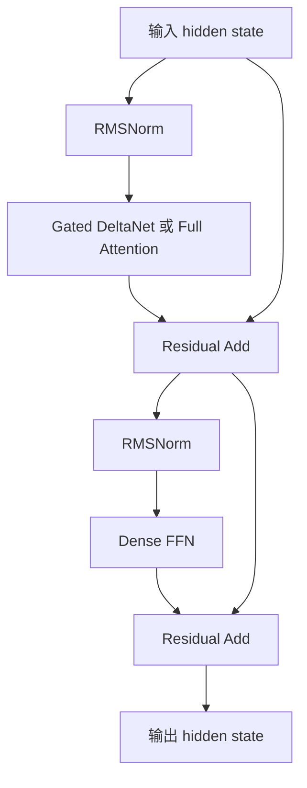
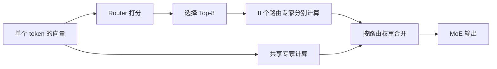
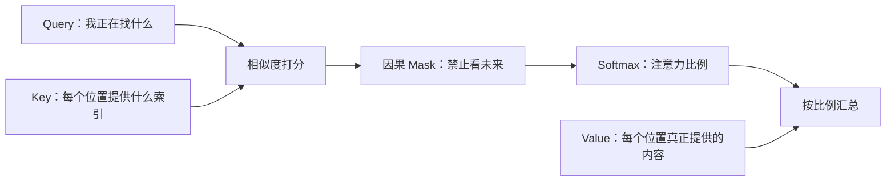
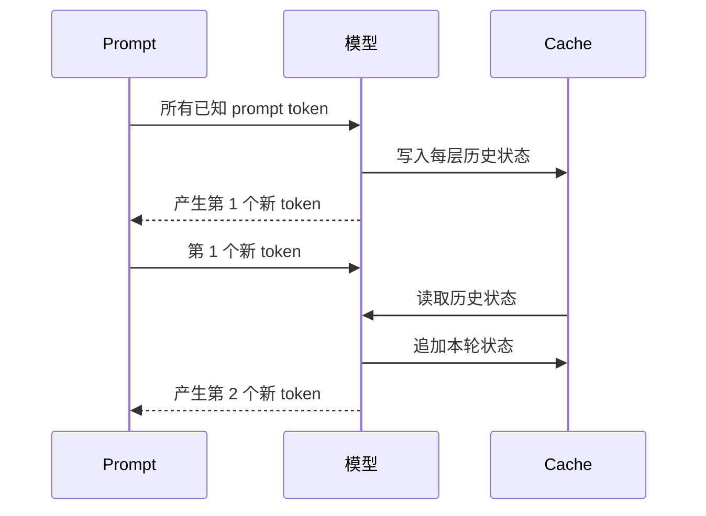

# 新版课程路线：从一个 token 到完整推理判断

## 结论

核心课程调整为 **8 课**。前 7 课解释模型和推理过程，第 8 课才使用这些理论判断优化方法。

旧版 12 课路线的问题在于，它把 GPU、Runtime、测量和服务系统放在了语言模型理论之前。读者还不知道 Attention、FFN、KV Cache 为什么存在，就要开始分析性能，知识顺序倒置。新版路线按模型真实的数据流组织：

```text
先知道模型要完成什么
→ 再知道一层模型怎样完成
→ 再知道多层、状态和生成步骤怎样连接
→ 最后判断一种优化改变了哪部分
```

## 最少但够用的三个问题

面对任何语言模型结构，先问三个问题：

| 问题 | 要看懂的对象 | 对推理判断的意义 |
| --- | --- | --- |
| 当前数据表示什么？ | token ID、向量、logit、概率 | 避免把不同阶段的张量混为一谈 |
| 信息怎样被混合？ | Attention/Gated DeltaNet 跨 token 混合；FFN 在单个 token 内混合特征 | 找到模型能力和主要计算的来源 |
| 哪些历史结果需要保留？ | KV Cache、Gated DeltaNet recurrent state | 理解 Prefill、Decode、显存和并发限制 |

这三个问题就是课程的主干。算子、公式和优化方法都挂在这条主干上。

## 数学不单独设门槛

课程不先安排一整套线性代数预科，也不默认读者已经熟练。标量、向量、矩阵、shape、点积、求和、平均、指数等工具，在第一次需要时现场解释：

```text
先看一个具体数
→ 再看一小组数
→ 再把一批小组写成矩阵
→ 最后给这种计算起名字
```

例如，讲 Attention 之前才解释点积；讲 RMSNorm 之前才解释平方、平均和平方根；讲 Linear 之前才解释“输出中的一个数如何由一行输入和一列权重得到”。读者不需要先背一批暂时不知道用途的公式。

## 贯穿模型：Qwen3.5

第一轮只研究文本生成路径，不展开视觉编码器。

### Dense 案例：Qwen3.5-9B

官方模型说明给出的文本模型结构为 32 层，每四层组成一组：前三层使用 Gated DeltaNet，第四层使用 Full Attention；每个 token mixer 后面都连接 Dense FFN。



### MoE 案例：Qwen3.5-35B-A3B

MoE 模型保留相同的层骨架，把 Dense FFN 换成 Sparse MoE。官方配置给出 256 个路由专家、每个 token 选择 8 个专家，并额外使用共享专家。模型约有 35B 总参数，每个 token 激活约 3B 参数。



Dense 和 MoE 不作为两套互不相关的模型讲解。先看懂 Dense FFN，再在原位置替换成 MoE，这样能准确看出什么没有变、什么发生了变化。

## 八课总览

| 课次 | 核心问题 | 本课必须讲清的结构与算子 | 学完后的能力 |
| ---: | --- | --- | --- |
| 1 | 文字怎样变成下一个 token？ | Tokenizer、Embedding/Gather、Linear、Logits、Softmax、Top-K、Sampling | 能画出完整生成主链路，区分 ID、向量、分数和概率 |
| 2 | Dense 模型的一层为什么这样设计？ | hidden state、RMSNorm、Residual、SwiGLU FFN；Reduction、Rsqrt、Mul、Add、SiLU、Broadcast | 能解释一层中每个模块的作用和 shape |
| 3 | 当前 token 怎样读取上下文？ | Q/K/V、因果 Mask、Softmax Attention、MHA、GQA、RoPE；MatMul、Reshape、Transpose | 能用小例子走完一次 Attention，并解释位置和多头 |
| 4 | 为什么生成必须逐步进行？ | 条件概率、Prefill、Decode、KV Cache；Concat、Slice、索引读写 | 能解释请求内串行、单步并行，以及 KV 为何可复用 |
| 5 | Qwen3.5 为什么混用两种 token mixer？ | Gated DeltaNet、因果卷积、门控、recurrent state、Full Attention 间隔层 | 能区分 KV Cache 与 recurrent state，读懂混合层排列 |
| 6 | MoE 与 Dense 到底差在哪里？ | Router、Softmax、Top-K、路由专家、共享专家、加权合并；Gather/Scatter | 能解释总参数、激活参数、专家选择和 token 分发 |
| 7 | 怎样从配置还原完整模型？ | 层数、hidden size、head 数、expert 数、dtype、参数量、权重/KV/状态容量 | 能阅读 Qwen3.5 配置并完成数量级估算 |
| 8 | 怎样用理论判断优化方向？ | 量化、FlashAttention、Prefix Cache、Batching、TP/EP、推测解码/MTP | 能说明优化改了什么、为什么可能有效、代价是什么 |

## 第 1 课：文字怎样变成下一个 token

### 只解决一件事

建立从字符串到下一个 token 的完整地图：

```text
文字
→ Tokenizer 切分并查表
→ token IDs
→ Embedding 查到向量
→ 多层 Decoder 修改向量
→ LM Head 为词表中每个 token 打分
→ Softmax 变成概率
→ Sampling 选出下一个 token
```

### 基本算子随链路出现

- `Gather/Embedding`：根据 ID 从大表中取一行；
- `Linear`：把一个向量变成另一组分数；
- `Softmax`：把任意分数转换成总和为 1 的概率；
- `Top-K/Argmax/Sampling`：从概率分布中选择 token。

本课不讨论 FLOPs、GPU 和服务吞吐。通过标准是能用自己的话解释“模型没有直接输出文字，而是先输出词表上的分数”。

## 第 2 课：Dense 模型的一层为什么这样设计

### 先建立两种混合

一层模型反复做两件事：

1. token mixer 让当前 token 获得其他位置的信息；
2. channel mixer 在当前 token 自己的特征维度内进行加工。

Dense FFN 属于第二种。它对每个 token 使用同一套权重，但各 token 可以并行计算。

### 本课解释的基本算子

- `Reduction`：把一组数汇总成一个统计量，RMSNorm 用它计算均方；
- `Rsqrt`：计算平方根的倒数，用于缩放；
- `Add`：残差连接保留原输入；
- `Linear`：混合特征维度；
- `SiLU`：提供非线性；
- `Mul`：让一条分支控制另一条分支；
- `Broadcast`：让一个缩放量应用到一整组元素。

公式最后出现。先用 4 维向量逐步计算 RMSNorm 和简化 FFN，再写通用 shape。

## 第 3 课：当前 token 怎样读取上下文

Attention 不从公式开始，而从一个具体问题开始：代词“它”应该关注前文中的哪个词？



先用两个 token、每个向量两维的例子手算，再引入矩阵写法。随后解释：

- 多头不是重复计算同一件事，而是允许不同子空间形成不同关系；
- GQA 让多组 Query 共享较少的 K/V 头；
- RoPE 让 Q/K 的匹配带上位置信息；
- `Reshape` 和 `Transpose` 为什么出现在实现中。

## 第 4 课：为什么生成必须逐步进行

本课把模型结构变成时间过程：



重点是分清：

- Prompt 已经全部已知，可以一起做 Prefill；
- 未来 token 尚未产生，普通自回归 Decode 不能提前计算；
- KV Cache 保存各 Attention 层过去的 K/V，避免重复计算；
- Cache 节省的是重复计算，也会占用显存并产生读取流量。

## 第 5 课：Qwen3.5 的混合结构

标准 Full Attention 能直接比较当前 token 与历史 token，但历史越长，需要处理的 K/V 越多。Gated DeltaNet 使用固定大小的 recurrent state 压缩历史，并通过门控和 delta update 决定写入、修改和遗忘什么。

本课只建立工程上够用的理解：

```text
Full Attention：保留较完整的历史 K/V，再按需读取
Gated DeltaNet：把历史持续压缩进固定形状的状态
```

随后解释“3 层 Gated DeltaNet + 1 层 Full Attention”的排列试图兼顾哪些能力和成本。这里会明确区分官方公开的结构事实与根据结构作出的工程解释，不把推测写成官方设计结论。复杂的并行训练推导和核实现不进入第一轮。

## 第 6 课：MoE 与 Dense 到底差在哪里

先复用第 2 课的 Dense FFN，再加入 Router：

| 比较项 | Dense FFN | Sparse MoE |
| --- | --- | --- |
| 每个 token 使用谁 | 同一个 FFN | Router 选中的少量路由专家，加共享专家 |
| 参数是否全部存储 | 是 | 是，未选中的专家本轮不计算，但权重仍需存放 |
| 单 token 激活参数 | 使用该层整个 FFN | 只使用 Top-K 路由专家及共享部分 |
| 新增动作 | 无 | 打分、选择、token 分发、专家计算、加权合并 |
| 新增风险 | 无专家路由问题 | 负载不均、跨卡 All-to-All、专家热点 |

必须澄清：专家不是人工指定的“数学专家”或“代码专家”；它们是训练形成的参数分工。`35B-A3B` 也不表示模型只需存储 3B 参数。

## 第 7 课：怎样从配置还原完整模型

前 6 课建立语义，本课才开始集中使用公式。所有计算遵循同一顺序：

```text
读字段
→ 翻译成结构
→ 写出 shape
→ 代入小数字检查
→ 再代入真实配置
→ 标明单位和近似条件
```

读者将分别还原 Qwen3.5-9B 和 Qwen3.5-35B-A3B：

- 层排列；
- Dense FFN 或 MoE；
- Q/K/V 头数和维度；
- 权重参数与存储量；
- Full Attention KV Cache；
- Gated DeltaNet recurrent state；
- 为什么总参数不等于单 token 激活参数。

## 第 8 课：怎样用理论判断优化方向

本课不再建立一套独立的“GPU 课程”或“服务系统课程”。每种优化回到前 7 课的模型对象：

| 优化 | 直接改变什么 | 首先检查什么 |
| --- | --- | --- |
| 权重量化 | 每个参数的字节数和数值误差 | 权重是否是主要容量/流量，硬件是否有对应计算路径 |
| KV 量化 | Cache 的容量和读取字节 | Full Attention 层数量、KV shape、精度影响 |
| FlashAttention | Attention 中间值的读写方式 | 没有改变 Attention 数学结果，也没有消除 Decode 的历史依赖 |
| Prefix Cache | 复用相同前缀的已有状态 | 前缀命中率、状态占用和生命周期 |
| Batching | 一次处理更多已知 token | 吞吐收益与排队、单步等待的交换 |
| TP | 分片同一层的权重和计算 | 每层同步与通信是否进入关键路径 |
| EP | 把不同专家放到不同设备 | token 路由、All-to-All 和负载均衡 |
| 推测解码/MTP | 尝试一次提出并验证多个未来 token | 接受率、验证成本和额外模型成本 |

最终使用固定判断模板：

```text
它改变模型链路中的哪个对象？
→ 少算了什么、少存了什么或少搬了什么？
→ 新增了什么计算、状态、通信或误差？
→ 哪种 workload 下收益才会出现？
→ 用什么指标验证？
```

## 第一轮明确不展开的内容

- 训练、反向传播、优化器和 MoE 负载均衡损失的推导；
- Qwen3.5 视觉编码器和多模态训练；
- CUDA、PTX、Kernel 调优和 profiler 使用教程；
- 在线服务框架的完整调度策略和参数列表；
- OCR/CV、语音等其他模型案例；
- 每一种 Attention、量化和并行变体。

这些内容以后作为专题添加。它们不能打断“一个 token 怎样产生”的第一轮主线。

## 通过课程的标准

完成课程不以背公式为标准。读者需要能够完成以下任务：

1. 不看资料画出文本到下一个 token 的链路；
2. 指着一层结构说明 Norm、token mixer、FFN/MoE 和 Residual 的作用；
3. 用两三个 token 的小例子解释 Attention；
4. 解释 Prefill、Decode、KV Cache 与 recurrent state；
5. 对比 Dense 和 MoE，并正确解释总参数与激活参数；
6. 从 Qwen3.5 配置中恢复层数、层类型、头数和专家数；
7. 面对一种优化，先指出它改变的模型对象，再判断可能收益。

## 原始资料

课程结构和术语以原始论文及官方配置为准，正文不会要求初学者直接阅读完这些资料。Qwen3.5 的配置字段于 2026-08-03 按官方仓库复核；以后编写对应正文时还要再次核对当前版本。

- [Qwen3.5-9B 官方模型说明](https://huggingface.co/Qwen/Qwen3.5-9B)
- [Qwen3.5-9B 官方配置](https://huggingface.co/Qwen/Qwen3.5-9B/blob/main/config.json)
- [Qwen3.5-35B-A3B 官方模型说明](https://huggingface.co/Qwen/Qwen3.5-35B-A3B)
- [Qwen3.5-35B-A3B 官方配置](https://huggingface.co/Qwen/Qwen3.5-35B-A3B/blob/main/config.json)
- [Attention Is All You Need](https://arxiv.org/abs/1706.03762)
- [Root Mean Square Layer Normalization](https://arxiv.org/abs/1910.07467)
- [GLU Variants Improve Transformer](https://arxiv.org/abs/2002.05202)
- [RoFormer：Rotary Position Embedding](https://arxiv.org/abs/2104.09864)
- [GQA：Grouped-Query Attention](https://arxiv.org/abs/2305.13245)
- [Switch Transformers](https://arxiv.org/abs/2101.03961)
- [Gated Delta Networks](https://arxiv.org/abs/2412.06464)
