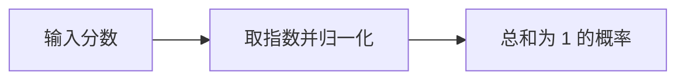

# 课程编写与讲解规范

读者已经在做推理系统。他们不缺术语，缺的是一条能从输入走到输出、从公式落到工程判断的主线。正文要让人看得懂计算，也能据此判断工作中的问题。

第 0 课只补后文会用到的数学，包括 shape、轴、归约、广播、点积、矩阵乘法、Linear 和 Embedding。后面遇到新的数学动作时，会放回具体的模型问题中解释，不假设读者系统学过线性代数。

## 组件的作用与必要性

一个组件为什么会出现在模型里，应该先于它的公式。

例如，“局部窗口中的数字分别相乘并求和”只能说明卷积怎么算，还没有说明卷积为什么有用。一个模型组件至少要回答两件事：它处理哪类信息，它不存在时模型会少掉什么能力。

开头可以直接落到模型遇到的困难：

```text
Attention：代词“它”怎样找到前文所指的对象？
RMSNorm：向量数值忽大忽小时，怎样把尺度拉回稳定范围？
Residual：经过一次变换后，怎样保留原来的信息？
MoE Router：有很多套 FFN 时，当前 token 应该使用哪几套？
```

需要数据流时，图里只保留当前要解释的对象。箭头表示数据流向，框里的文字尽量写成动作。



流程与依赖适合用 Mermaid。矩阵、轴、函数曲线和局部计算更适合直接标出数字与 shape 的 SVG。选哪一种，只看它能否让关系更容易理解。

同一段信息不能先用字符图画一遍，紧接着再用 SVG 画一遍。保留更清楚的那一份，正文补充图里没有表达的原因、限制或计算细节。图的标题也不复述正文标题。

生活类比可以帮助建立第一印象，但不能代替模型本身。例如可以把 Router 比作派单，紧接着就要说明：被分配的是 token 向量，接单的是不同参数的 FFN，派单分数来自一个可学习的 Linear。

## 使用贯穿全节的推理对象

每课先选一个能在真实推理链路中找到的对象，例如一条应用 Chat Template 后的短对话、一次 Decode 正在处理的 token、Hidden States 中的一行、一个请求的 KV Cache，或一个送入 Router 的 token 向量。后面的图、手算、公式和工程分析继续跟踪它，不在每一节换一套句子和数字。

对象来自真实链路，不等于一开始就使用完整模型规模。可以把向量缩到 2～4 维，把候选词或 Expert 缩到 2～4 个，但不能改掉真实计算的操作、先后顺序和数据依赖。凡是写成 Qwen3.5 实际 Token ID、配置值或输出结果的数字，都要来自可核对的模型材料或运行结果；教学用数字则明确说明是缩小后的例子。

一组连续图要像同一段计算的连续镜头。上一张图的输出直接成为下一张图的输入，每张只增加一个动作，其余对象的位置、名称、数值和方向保持不变。例如 Attention 可以依次增加 Q/K 点积、缩放与遮罩、Softmax、V 的加权求和。不能在中途换 token，也不能为了排版把矩阵的行列含义调转。

## 使用可手算的教学规模

概念第一次出现时，尽量只用：

- 2～3 个 token；
- 2～4 维向量；
- 2～4 个候选项；
- 能手算的整数或一位小数。

这些数字足以把每一步写出来。计算看清以后，再代入 `4096 × 12288` 这样的真实规模。

公式出现前，要说明每个符号代表什么，并给出一句可以直接读懂的中文解释。

| 符号 | 含义 | 单位或 shape |
| --- | --- | --- |
| `T` | 本轮同时处理的 token 数 | 个 |
| `H` | 每个 token 向量的宽度 | 维 |
| `X` | 输入 hidden states | `[T, H]` |

公式还要能代回前面的小例子。这样读者看到的是对计算过程的概括，不是一条孤立的记忆材料。

第一次手算必须是模型实际执行的计算，只缩小规模，不另教一套过渡算法。Attention 的第一次手算就使用 Q、K、V；Embedding 就按 Token ID 查参数表；MoE 就沿着 Router Logits、Top-K、权重归一化、Expert 输出和加权合并走完。可以令 `B=1`、只看一个头或一个 token，也可以暂时省略与当前问题无关的轴，但要说清省略了什么。

图中的数值、正文手算、公式代入和表格结果必须能逐项核对。变量名、token 顺序、矩阵行列和单位保持一致；近似值使用 `≈` 并说明舍入位置。推广到大 shape 时，保留小例子已经出现的数值和语义，只增加轴或行列，不重新发明一个例子。

小例子讲清后，再回到 Qwen3.5 和实际推理链路。只挑当前相关的问题展开：

- 它在 Qwen3.5 哪个位置？
- 官方配置中的哪个字段控制它？
- Prefill 和 Decode 时输入 shape 有什么不同？
- 它会产生权重、中间值、KV Cache 还是 recurrent state？
- 哪些优化方法会改变它？

这些不是每节必填的检查表。

## 从单个 Token 推广到完整张量

| 层级 | 表达方式 | 目的 |
| --- | --- | --- |
| A：定位 | 全景图、箭头、自然语言 | 知道当前对象从哪里来、要到哪里去 |
| B：单点计算 | 一个 token、一个位置或一个请求的小向量 | 看清一次真实计算怎样发生 |
| C：张量推广 | 把同一结果放回矩阵，补上轴、shape 和通用公式 | 看清哪些位置并行，哪些轴增长 |
| D：工程判断 | Qwen3.5 配置、真实数量级和推理时间线 | 判断权重、状态、计算、访存和通信怎样变化 |

只跟踪一个 token 时，要明确它对应 `X[b,t,:]`、分数矩阵中的哪一行，或本轮 Decode 的哪个新位置。单点计算完成后，把同一组数放回 `[B,T,H]`、`[T,T]` 或相应状态张量，再说明矩阵写法和批量执行。不要用一套数字讲单点计算，换另一套数字讲 tensor。

如果小数字还算不明白，代入真实规模只会增加负担。讲到 Qwen3.5 时，要把组件放回 Decoder Layer 或请求时间线，指出控制它的配置、真实 shape 和它留下的权重或请求状态。工程判断应从刚才的计算推出，例如多搬了多少数据、状态是否随 `T` 增长、是否出现串行依赖或跨卡通信，以及最后该看哪个端到端指标。深度来自这些因果关系和可推导性，不来自公式数量。

## 算子讲解要求

算子不单独堆成百科词条。它第一次出现在模型链路中时，要交代以下信息：

| 项目 | 需要说明的问题 |
| --- | --- |
| 作用 | 为什么需要这个算子？ |
| 输入 | 输入中的每一维表示什么？ |
| 动作 | 它具体对哪些数做什么？ |
| 输出 | 输出中的每一维表示什么？ |
| 不变量 | 哪些 shape 或语义没有改变？ |
| 相邻关系 | 上一个算子为什么把结果交给它？ |
| 工程影响 | 它产生权重、临时结果还是长期状态？ |

核心算子大致按下面的依赖顺序出现：

```text
Gather / Embedding
→ Linear
→ Softmax / Top-K / Sampling
→ Add / Mul / SiLU
→ Reduction / Rsqrt / RMSNorm
→ Reshape / Transpose / MatMul / Mask
→ Concat / Slice / Cache 读写
→ Causal Conv / Gate / State Update
→ Router / Gather / Scatter / Weighted Sum
```

## 图表使用规范

- 全景图负责定位。它画出当前组件的边界、上游、下游和它在 Decoder Layer 或请求时间线中的位置，不在同一张图里展开局部数值推导；
- 操作图负责计算。它标出本步的输入、动作、输出、数值和 shape，一张只增加一个动作，不负责重复整张模型结构；
- 连续操作、数据流和依赖关系使用流程图，Prefill/Decode 使用时序图，Dense/MoE、MHA/GQA 使用对比表，shape 变化使用逐步表格；
- 从局部计算回到全景图时，只高亮刚刚讲完的路径，其他位置保持原布局。全景图和操作图共用对象名称，不要求塞入同样多的细节；
- 图和问题的数量由内容决定，不预设数量；
- 同一个概念可以依次使用全局定位图、局部数据流图、小数字计算表、shape 表、时序图和对比图；
- 前后问题要能自然衔接，例如“它解决什么问题 → 为什么这样设计 → 怎样计算 → 前后连接什么 → 工程上改变什么”；
- 当一张图要求读者同时记住太多关系时，把它拆成递进的多张图；拆分服务于理解，不追求图少；
- 多张图复用相同名称、方向和视觉符号，避免读者每次重新学习图例；
- 颜色不是理解图的必要条件，保证黑白显示仍能读懂。

图表只是解释工具。不能为了版式删掉必要步骤，也不能用更多图表掩盖没有讲清楚的因果关系。判断一张图是否有用，要看读者能否借助它复述过程。

全课程使用一套简洁的视觉语义：

| 对象 | 必须使用的非颜色标记 | 颜色的辅助作用 |
| --- | --- | --- |
| 运行时 tensor 或向量 | 单线矩形，并写出变量名及数值或 shape | 区分当前输入与输出 |
| 模型参数 | 双线边框或明确的“参数”标签，并保留 `W`、Embedding 等名称 | 与运行时数据分组 |
| 计算动作 | 圆角框，框内使用“点积”“归一化”“查表”等动词 | 标出本镜头新增的动作 |
| KV Cache、recurrent state 等请求状态 | 堆叠外形或明确的“状态”标签 | 区分可复用状态与临时结果 |
| 当前 token 或当前位置 | 加粗轮廓，并标出 token 文本和位置编号 | 高亮当前跟踪对象 |
| 被遮罩或本步不参与的对象 | 斜纹、叉号或“不可读”“本步不参与”文字 | 降低视觉权重 |

实线箭头表示本步的数据流，复用或引用使用虚线箭头并写明“读取缓存”“共享参数”等关系。残差旁路要标出“保留原输入”，不能只靠一条颜色不同的线。颜色含义在全课程保持稳定，同一对象在连续图中不换颜色。任何结论都必须在黑白显示时仍能由文字、边框、线型、位置或纹理读出。

## 按问题组织章节

问题背景、全局图、小数字例子、通用 shape、Qwen3.5 配置、易错点和练习都可以使用，但不必每课照同一顺序出现。正文按问题本身组织，不为凑齐栏目而添加段落。

学习中提出的问题和答案应放回正文最合适的位置。笔误直接改正，不把纠错过程写成知识点。

## 区分主线、实现注记与工程扩展

正文中的信息分成三层，不能混在同一条叙事里：

| 层级 | 放什么 | 读者读完应当得到什么 |
| --- | --- | --- |
| 主线 | 模型为什么需要这个组件、怎样计算、前后连接什么 | 能复述原理并完成最小手算 |
| Qwen3.5 实现注记 | 真实配置、shape、特有门控和固定 revision 的代码行为 | 能把原理对应到当前模型 |
| 工程扩展 | runtime 差异、缓存布局、通信和性能验证 | 能判断结论在哪些条件下成立 |

主线不应被未启用的模型特性、某个 runtime 的特殊分支或枚举式配置淹没。这些内容确有助益时，放入简短的实现注记或折叠区。删去它们也不应破坏本课的因果链。

每课发布前还要检查三件事：贯穿案例是否从头到尾使用同一组对象和数字，关键结论能否由前面的计算推出，练习是否要求计算、推导或判断，而不是照抄正文中的一句话。

## 正文语言与标题

正文使用自然、具体的中文。句子写清主语和动作，能说“Router 给每个 Expert 打分”，就不写抽象的名词串。术语第一次出现时给出中英文和符号，后面固定使用同一个名称，不为避免重复而轮换近义词。

这套课的语气不是论文，也不是直播脚本。作者像是在白板前给同事讲一个难点：知道哪里容易卡住，会在那里多算一步；简单的地方直接说完，不制造悬念，也不反复宣布“接下来要讲什么”。

“这一课将……”“下面逐项说明……”“值得注意的是……”通常可以删除。每一段直接进入对象和动作。连续几课可以都设练习，但不要给每课套上相同的开场、过渡和总结。

“对象、链路、边界、成本模型”可以帮助作者整理思路，但不能代替正文中的具体名称。写完后要检查读者是否还得把一句话翻译一遍。例如：

```text
不要写：先定位优化改变的对象，再判断能否兑现收益。
应当写：先确认它改的是权重、KV Cache、Attention、Batch 还是多卡切分，再看少了多少计算或数据搬运，又增加了什么开销。
```

通俗来自解释顺序、例子、手算和图示，不来自降低标题的专业度。课名和章节标题应符合正式技术课程的写法：简洁、准确，离开上下文也能看出主题。避免“到底是什么”“先看一遍”“怎么做”一类聊天式标题，也不要用抽象名词堆出貌似专业但含义不清的标题。

标题应明确指出本节讨论的技术对象、计算过程或结论，例如“Softmax 与 Attention 权重”“Qwen3.5 未启用 DeepStack”。只有正文确实围绕一个待回答的问题展开时，才使用问句标题。正文同样不用“让我们深入了解”“值得注意的是”“这不仅仅是”等套话代替具体内容。

中文正文不使用破折号，也不用双连字符充当插入语。补充说明改用逗号、括号或另起一句。代码、命令、数学负号和 token 原文中的字符不受这条限制。

## 发布前检查

读者应该能够：

1. 不看公式也能说清概念解决什么问题；
2. 能用小数字手动走完关键计算；
3. 能写出输入输出 shape；
4. 能在 Qwen3.5 结构图中找到它；
5. 能解释至少一个相关优化为什么可能有效；
6. 不依赖背诵术语完成上面的解释。

还要逐项核对：本课的真实对象是否贯穿主线，连续图是否每次只增加一个动作，第一次手算是否忠于模型计算，图、数字和变量是否一致，单个 token 是否顺利推广到整张 tensor，最后是否回到了 Qwen3.5 和一个可验证的工程判断。

发布前还要做一次纯编辑检查：删掉同义图和同义段落，折叠参考答案，朗读所有段落，清理翻译腔、播报语和过密的否定句。Markdown、公式、本地链接和 SVG 必须在 GitHub 的渲染规则下通过检查。

如果读者只能复述定义，却说不清它为什么存在、怎样计算、前后连接什么，以及输入变化后结果会怎样变化，这一节就还没有讲清楚。
